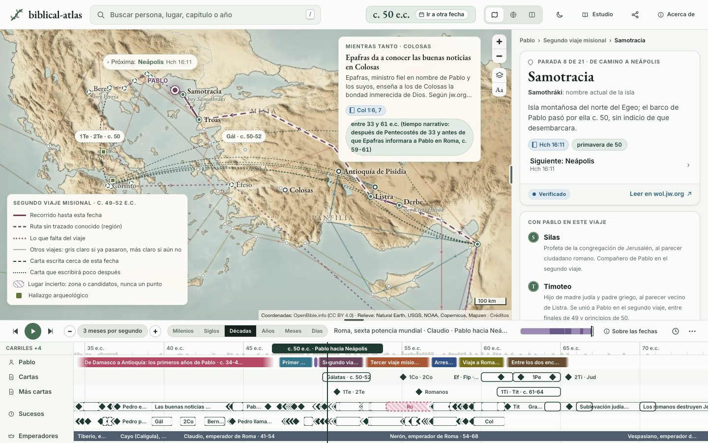

<p align="center">
  
</p>

<h1 align="center">biblical-atlas</h1>

<p align="center"><b>La Biblia en el mapa y en el tiempo</b></p>

<p align="center">
  <a href="https://github.com/GeiserX/biblical-atlas/actions/workflows/validar.yml"></a>
  <a href="https://github.com/GeiserX/biblical-atlas/actions/workflows/pages.yml"></a>
  <a href="https://biblical-earth.geiser.cloud/"></a>
  <a href="LICENSE"></a>
  <a href="https://github.com/GeiserX/biblical-atlas/commits/main"></a>
</p>

<p align="center">
  <a href="docs/investigacion/registro/lugares.md"></a>
  <a href="docs/investigacion/registro/personas.md"></a>
  <a href="docs/investigacion/registro/eventos.md"></a>
  <a href="docs/investigacion/registro/periodos.md"></a>
  <a href="docs/investigacion/registro/cartas.md"></a>
  <a href="docs/investigacion/registro/viajes.md"></a>
  <a href="docs/investigacion/registro/hallazgos.md"></a>
  <a href="docs/investigacion/registro/recorridos.md"></a>
  <a href="docs/investigacion/registro/fuentes.md"></a>
</p>

<p align="center">Un mapa y una línea de tiempo movidos por una sola fecha, para estudiar la Biblia en familia con cada relato en su lugar y en su tiempo, y cada dato enlazado a su fuente en wol.jw.org.</p>

<p align="center"><a href="https://biblical-earth.geiser.cloud/">Sitio</a> · <a href="https://biblical-earth.geiser.cloud/acerca.html">Acerca de</a> · <a href="docs/hoja-de-ruta.md">Hoja de ruta</a> · <a href="docs/decisiones.md">Decisiones</a> · <a href="docs/investigacion/">Investigación</a> · <a href="docs/ideas/">Ideas y maquetas</a> · <a href="CONTRIBUTING.md">Contribuir</a></p>

<p align="center">
  <a href="https://biblical-earth.geiser.cloud/#t=50.3000&v=40&mapa=antiguo"></a>
</p>

## Funcionalidades

- El mapa y la línea de tiempo se mueven con una sola fecha: eliges un año y ves quién vivía, dónde estaba y qué pasaba alrededor.
- Cubre de Adán a Juan en Patmos: los reyes de Judá e Israel, Judá bajo los medos y los persas, Babilonia a lo largo de los siglos, la vida de Jesús en armonía con la tabla A7 de la TNM de estudio, todo Hechos y los viajes y las cartas de Pablo y de Pedro.
- Grafo de personas en el que cada arista lleva su verbo y el pasaje que la sostiene, y una vista que conecta a dos personas cualesquiera.
- Los lugares inciertos se dibujan como zonas o como candidatos, nunca como un punto seguro.
- Cuatro recorridos guiados, modo lectura, modo presentación y una página con el calendario de la Biblia y sus meses.
- Cada hecho lleva su fuente, su razón y su fecha de consulta. De jw.org y wol.jw.org se enlaza, nunca se copia.
- Sitio estático con MapLibre GL, sin servidor ni paso de compilación: abre incluso desde `file://`.
- Los mismos datos salen en SQLite (`dist/biblical-atlas.sqlite`) para consultarlos fuera del sitio.

## Inicio rápido

```bash
pip install -r requirements.txt
python3 scripts/build.py
python3 scripts/validate.py
cd site && python3 -m http.server 8080
```

Abre <http://localhost:8080>. `site/index.html` también abre con doble clic, pero sin cortina ni vídeos: el navegador no deja leer ficheros locales. Los datos son un YAML por entidad en [`data/`](data/); las claves y los valores cerrados van en inglés y los nombres y los textos en español.

## Documentación

- [`site/README.md`](site/README.md): la aplicación, partida en scripts clásicos que comparten `window.BE`, vista a vista.
- [`scripts/README.md`](scripts/README.md): la compilación a `data.json`, `stats.json` y SQLite, la validación de esquema y enlaces, la revisión anual y los índices de vídeos.
- [`docs/investigacion/`](docs/investigacion/): el modelo de datos, el protocolo de investigación y el registro que la compilación escribe, con cada ficha y su fuente.
- [`docs/decisiones.md`](docs/decisiones.md) y [`docs/hoja-de-ruta.md`](docs/hoja-de-ruta.md): lo decidido, lo hecho y lo que queda.
- [`docs/ideas/`](docs/ideas/): las ideas y las maquetas de las que salió el sitio; [`docs/logo/`](docs/logo/) y [`docs/verde/`](docs/verde/): la identidad visual y cómo se eligió.

## Fuentes

La fuente principal es jw.org y la Traducción del Nuevo Mundo; se enlaza, nunca se copia. Las fuentes externas entran solo cuando jw.org las ha usado. Los mapas son propios, hechos con datos abiertos (Natural Earth, OpenBible). Los créditos completos, con la licencia de cada fuente, están en la página [Acerca de](site/acerca.html) ([en el sitio](https://biblical-earth.geiser.cloud/acerca.html#gracias)).

## Licencia

[GPL-3.0-or-later](LICENSE). Los mapas y los datos de terceros conservan cada uno su licencia, listada en [Acerca de](https://biblical-earth.geiser.cloud/acerca.html#gracias).
