# Banner

## Siete: la marca de agua en el mar con la línea del tiempo

De la ronda anterior preferimos la 4.1, la marca de agua en el mar, antes que la 4.6, porque la rama tenue no dice nada. Estas seis variantes parten de la 4.1 tal cual, con dos cambios: la marca del mar es ahora la rama oficial en verde salvia, con sus tres colores y casi transparente, y cada variante añade una línea del tiempo, porque el sitio es las dos cosas, la Biblia en el mapa y en el tiempo. En todas el lema es «La Biblia en el mapa y en el tiempo», el olivo aparece una sola vez y los colores son los de la paleta Salvia. Las fechas siguen la cronología de la TNM y las épocas salen de [`data/periodos`](../../data/periodos).

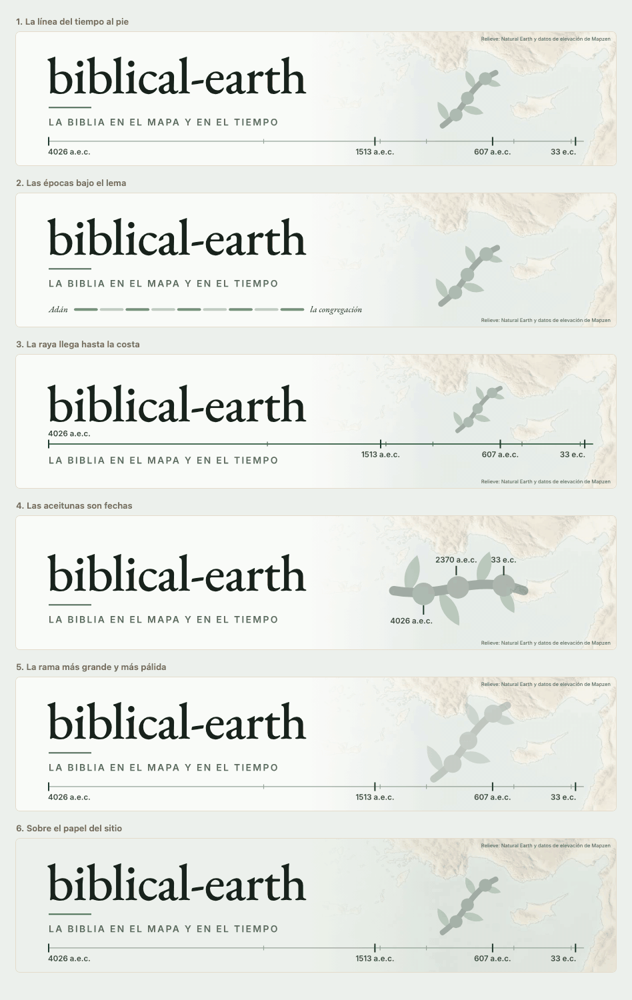

### 7.1. La línea del tiempo al pie

Al pie del banner corre una línea del tiempo a escala, de 4026 a.e.c. al final del primer siglo, con una muesca pequeña al comienzo de cada época y una más marcada en 4026 a.e.c., 1513 a.e.c., 607 a.e.c. y 33 e.c. Solo los dos extremos llevan el año, en letra más grande, para que se lean en el móvil y la línea no parezca el eje de una gráfica. La rama salvia flota en el mar al oeste de Chipre, como en la 4.1.

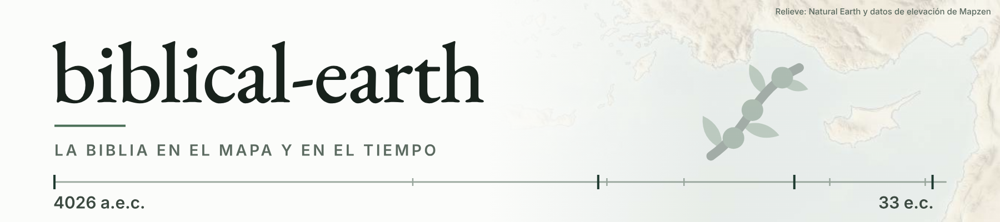

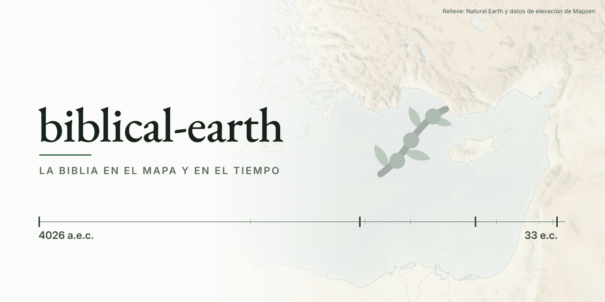

### 7.2. Las épocas bajo el lema

Bajo el lema van las nueve épocas del sitio, de Adán a la congregación, una tras otra y sin fechas, cada una tan larga como sus años. Por eso la de Adán al Diluvio ocupa casi la mitad y las de Jesús y del éxodo son dos rayitas. Es la línea más callada de las seis y la que menos se parece a un eje.

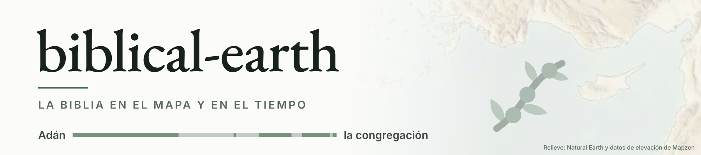

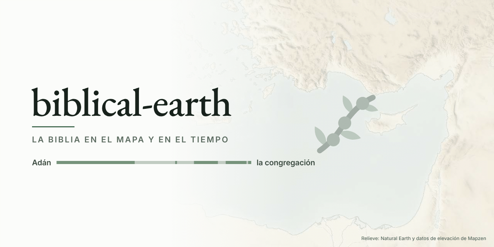

### 7.3. La raya llega hasta la costa

La raya de debajo del nombre se alarga, cruza el mar y se para en la costa de Fenicia, y es la línea del tiempo a escala, con cuatro fechas: 4026 a.e.c., 1513 a.e.c., 607 a.e.c. y 33 e.c. Los cuatro años van encima de la raya, así que el lema queda solo debajo, y la rama se queda sola en el mar.

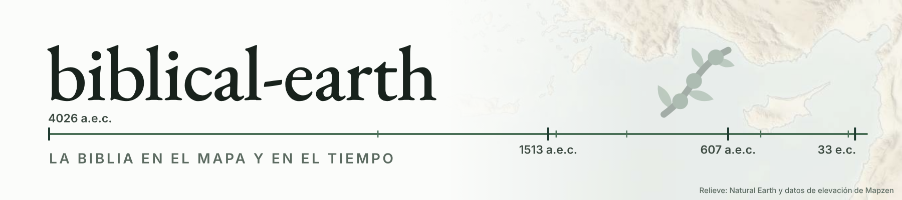

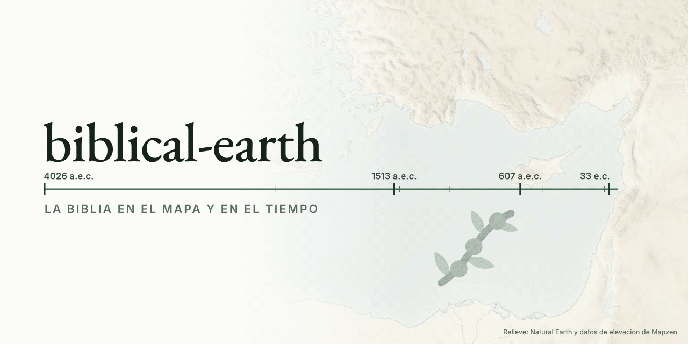

### 7.4. Tres fechas bajo el nombre

Es la 4.1 tal cual, con la rama salvia en el mar como en la 7.1, derecha y del mismo tamaño, y el crédito del relieve abajo a la derecha. Bajo el lema va una línea corta a escala, tan larga como el nombre, con tres fechas: 4026 a.e.c., la creación de Adán, 2370 a.e.c., el Diluvio, y 33 e.c.

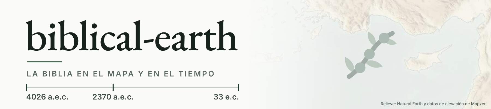

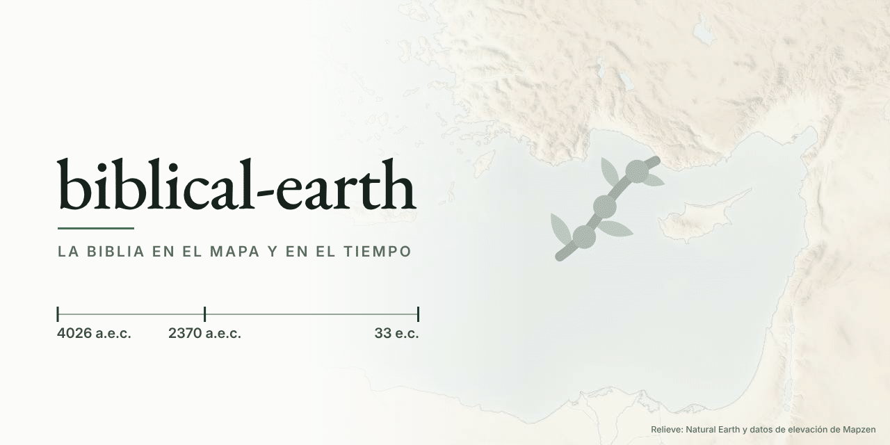

### 7.5. La rama más grande y más pálida

Es la 7.1 con la rama más grande y más transparente, para que se lea como marca de agua y no como un dibujo. En el banner solo crece un poco, porque tiene que quedar en el mar entre la costa de Anatolia y la línea del tiempo; en la vista social es casi un tercio mayor. La línea del tiempo es la misma.

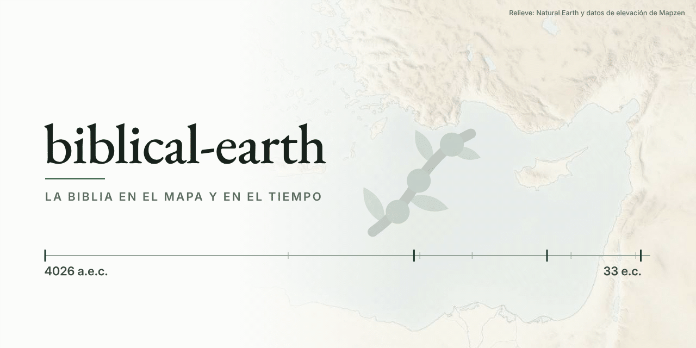

### 7.6. Sobre el papel del sitio

Es la 7.1 sobre el fondo verde claro de la aplicación, `#eef2ec`, en lugar del blanco de los paneles. El relieve se lava con ese mismo color, así que el banner entero queda en un solo tono.

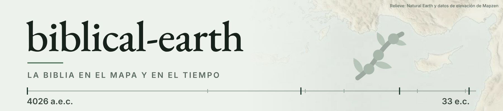

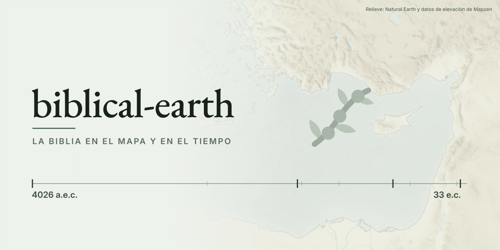

## Seis variantes del banner 4, con el olivo una sola vez

El banner 4 enseñaba el olivo dos veces, en la marca junto al nombre y en la rama tenue del fondo. En estas seis variantes el olivo aparece una sola vez y cada una lo pone en un sitio distinto. De la 1 a la 5 quitamos la rama tenue y movemos la marca, y la 6 quita la marca y deja la rama. Todo lo demás es el banner 4, con el nombre en EB Garamond y el lema «La Biblia en el mapa y en el tiempo» en versalitas.

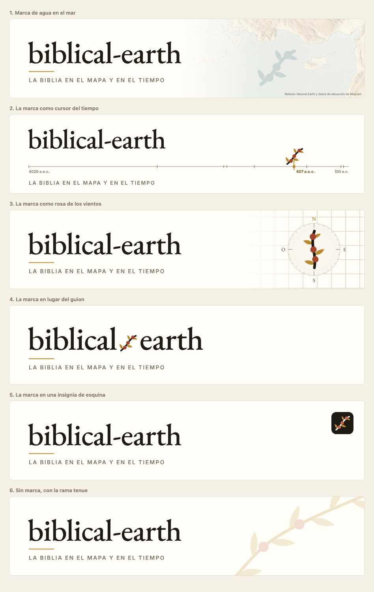

### 4.1. Marca de agua en el mar

A la derecha asoma nuestro [relieve](../../site/maps) del Mediterráneo oriental, muy lavado, y la marca flota en el mar al oeste de Chipre, en un solo color y casi transparente. Es la única de las seis con mapa, así que es la única que lleva la atribución del relieve.

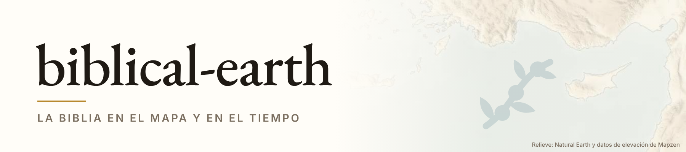

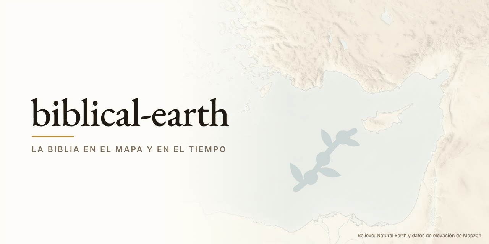

### 4.2. La marca como cursor del tiempo

En lugar de la raya dorada, debajo del nombre va una línea de tiempo a escala de 4026 a.e.c. al año 100, con una muesca al comienzo de cada época. La marca se pone de pie en 607 a.e.c. sobre un tallo dorado, igual que el cursor de la aplicación.

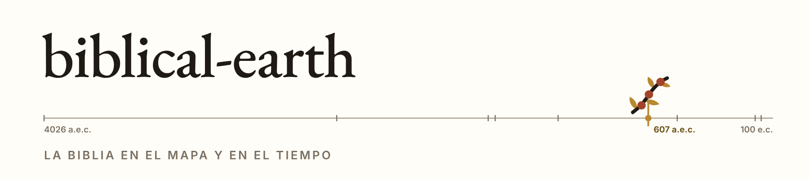

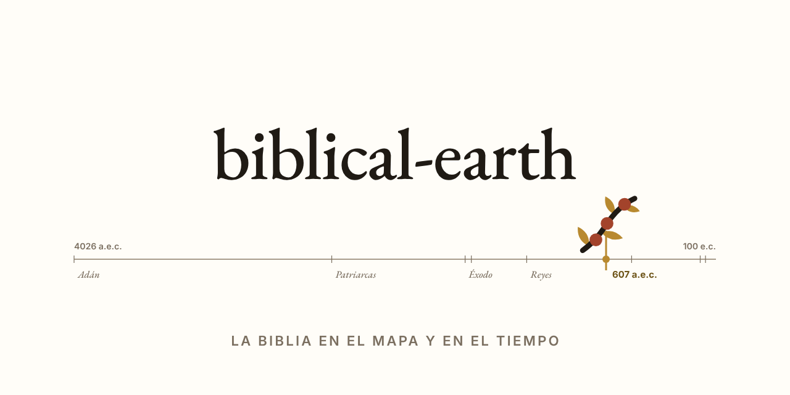

### 4.3. La marca como rosa de los vientos

A la derecha hay una rosa de los vientos sobre una cuadrícula tenue, como el borde de una carta náutica, y la marca, girada hasta quedar vertical, es la aguja que señala el norte. Los puntos cardinales van en español, con O de oeste.

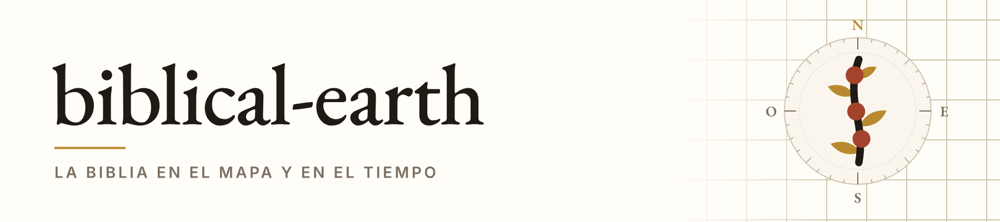

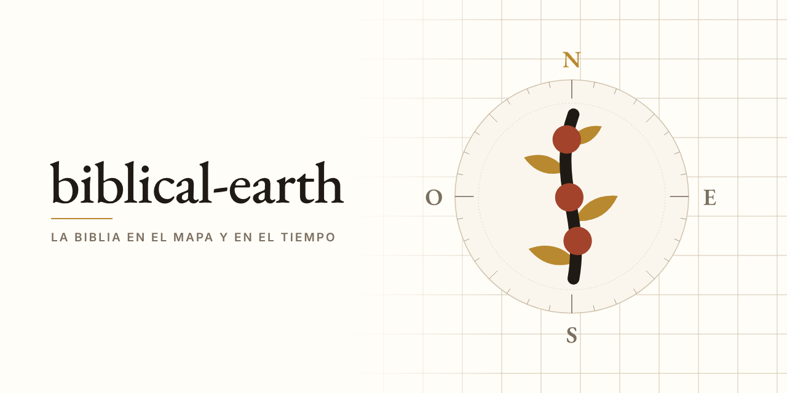

### 4.4. La marca en lugar del guion

El nombre no tiene ninguna O, así que la marca entra en el único hueco que no es una letra, el guion entre «biblical» y «earth». El olivo pasa a ser parte del nombre, y por eso este diseño habría que rehacerlo si el nombre cambia.

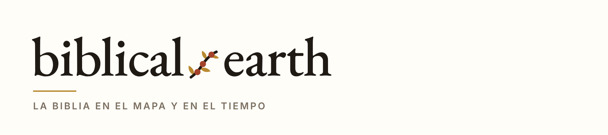

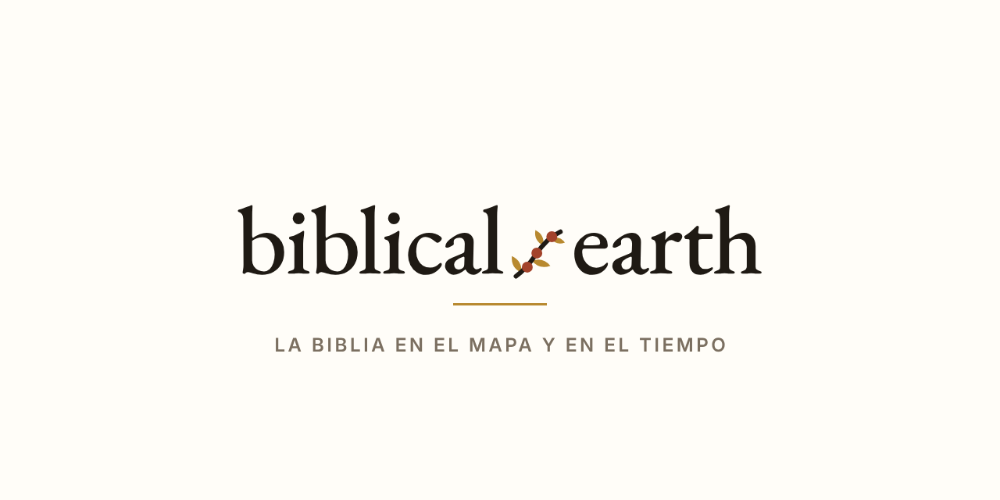

### 4.5. La marca en una insignia de esquina

La marca va arriba a la derecha en una baldosa oscura, como el icono de una aplicación, con el tallo en claro. El nombre y el lema quedan solos, sin nada al lado.

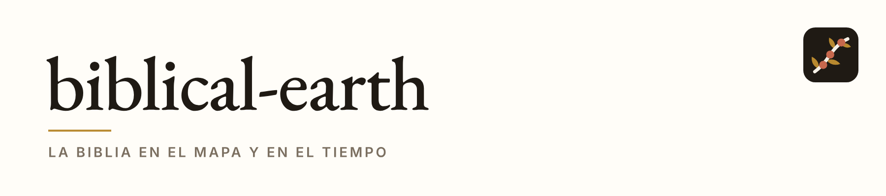

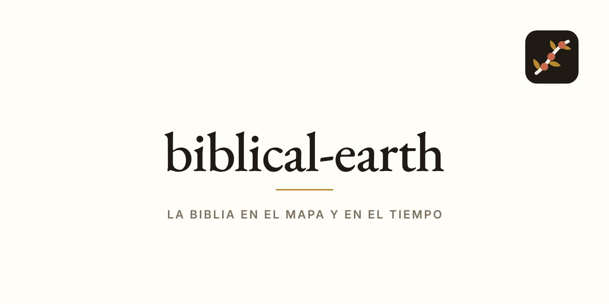

### 4.6. Sin marca, con la rama tenue

Es el banner 4 sin la marca, y el único olivo es la rama tenue que se sale del marco por la derecha. Es la más tranquila de las seis y la que menos depende del logo.

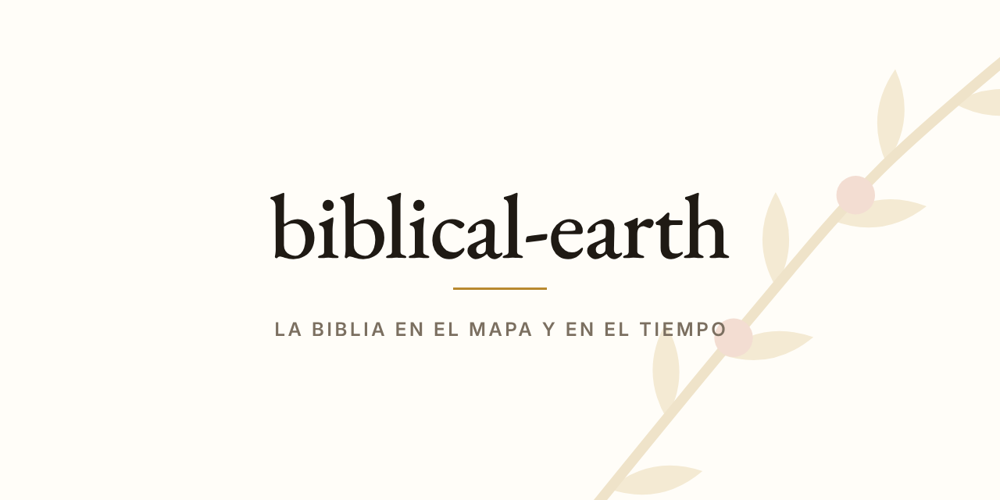

## Seis variantes del banner 2, el camino como rama de olivo

En el banner 2 el tallo del olivo es el camino del primer viaje sobre nuestro relieve y las aceitunas son las paradas. Estas seis variantes mantienen esa idea, cambian de relato y de composición, y todas añaden una línea de tiempo, para que se vea que el sitio es un mapa y también una cronología. Como la rama ya es el olivo, ninguna lleva la marca pequeña junto al nombre. Los caminos y las fechas salen de [`data/viajes`](../../data/viajes), [`data/recorridos`](../../data/recorridos), [`data/eventos`](../../data/eventos) y [`data/periodos`](../../data/periodos), con la cronología de la TNM, y los relieves son los de [`site/maps/`](../../site/maps), con la atribución que piden sus [créditos](../ideas/mockups/kit/maps/CREDITS.md). Las hojas de cada rama apuntan hacia donde va el camino.

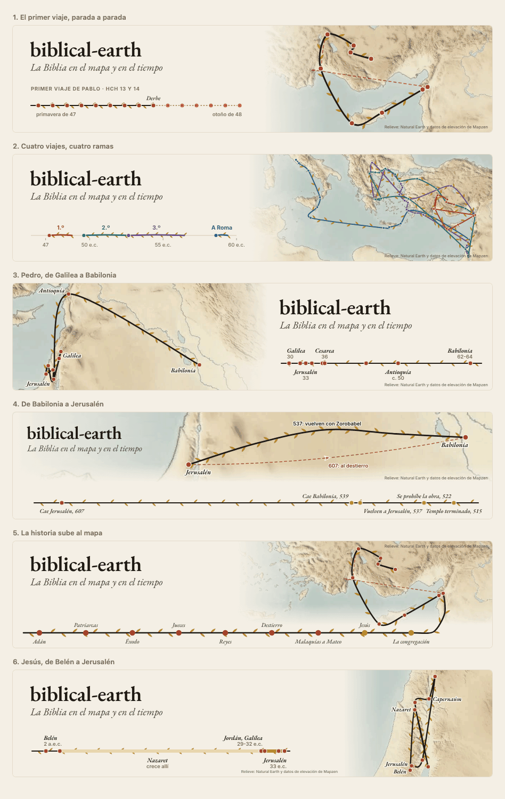

### 2.1. El primer viaje, parada a parada

Es el banner 2 con una rama pequeña debajo del nombre que repite las quince paradas en orden, de la primavera de 47 al otoño de 48, con la ida en línea continua y la vuelta en puntos, igual que en el mapa. El texto solo da el orden de las paradas intermedias, así que van a la misma distancia, y la versión social lo dice.

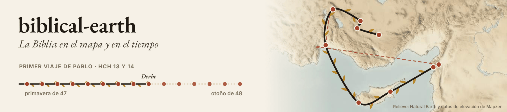

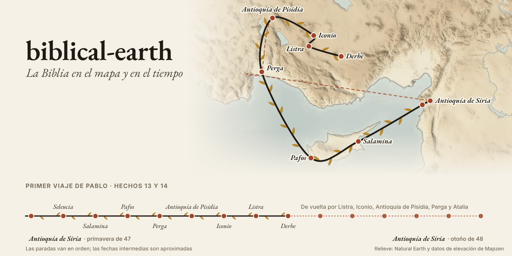

### 2.2. Cuatro viajes, cuatro ramas

El primer viaje, el segundo, el tercero y el viaje a Roma son cuatro ramas con los colores del sitio, de Antioquía de Siria y Jerusalén a Roma. Debajo, cada viaje es una ramita en sus años, de 47 a 60, y se ve que los tres primeros van seguidos y que antes del viaje a Roma pasan los dos años de Cesarea.

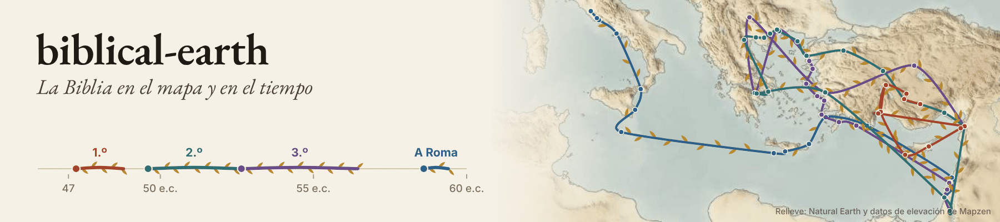

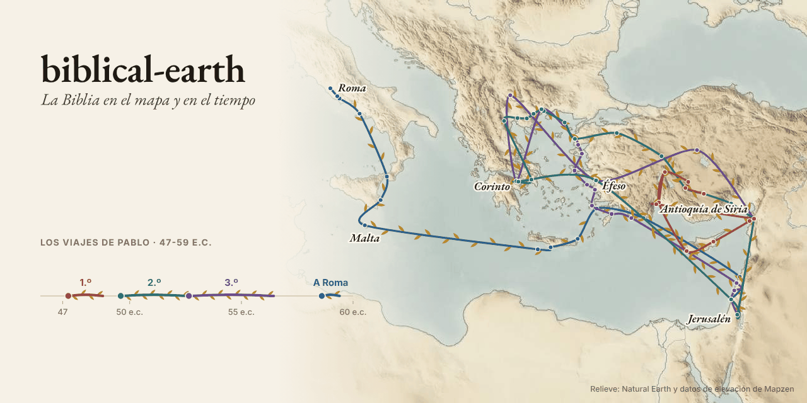

### 2.3. Pedro, de Galilea a Babilonia

La rama une en orden los lugares del recorrido de Pedro que ya tiene el sitio: Capernaúm, Cesarea de Filipo, Jerusalén, Samaria, Jope, Cesarea, otra vez Jerusalén, Antioquía y Babilonia. En la línea de tiempo las mismas aceitunas van del año 30 a 62-64, cuando escribe su primera carta desde Babilonia, y el mapa va a la izquierda y el nombre a la derecha.

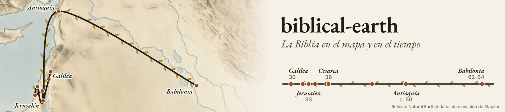

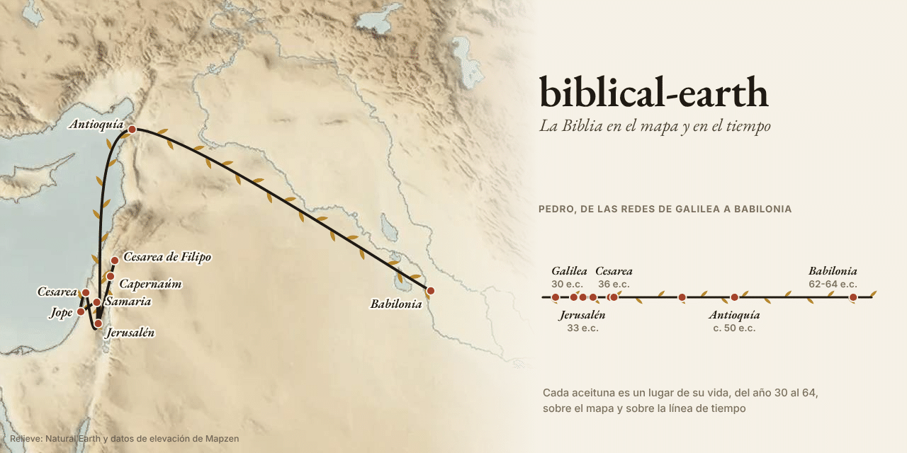

### 2.4. De Babilonia a Jerusalén

El mapa es una franja de Jerusalén a Babilonia con el camino al destierro de 607 a.e.c. en puntos y la vuelta de 537 con Zorobabel como rama de olivo. La Biblia no da la ruta, así que la rama solo une las dos ciudades, y debajo van a escala los sucesos de 607 a 515 a.e.c., de la caída de Jerusalén al templo terminado.

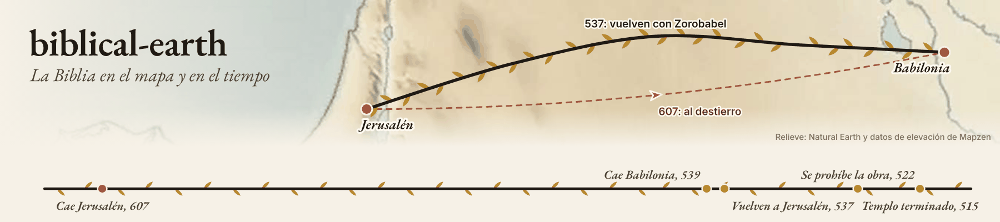

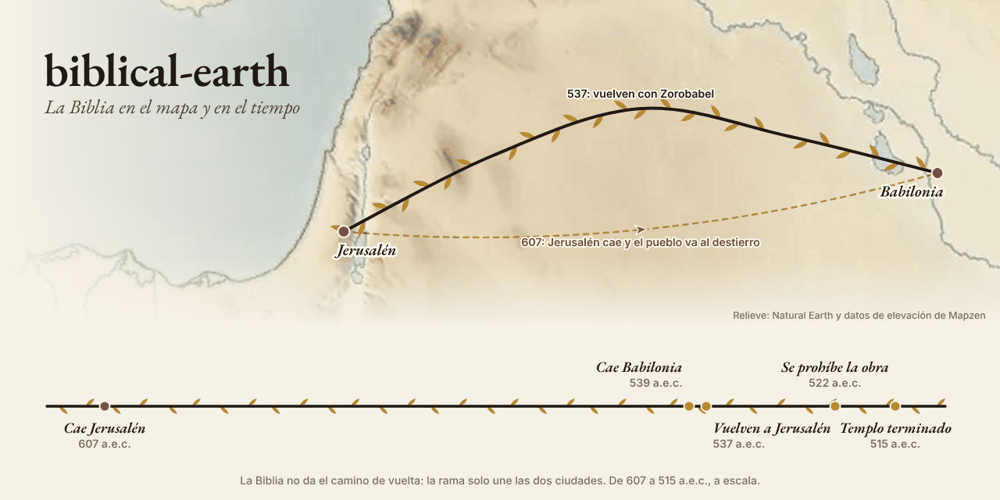

### 2.5. La historia sube al mapa

Una sola rama recorre las nueve épocas, de Adán a la congregación cristiana, y al llegar a la última sube al mapa en Antioquía de Siria y sigue como el primer viaje de Pablo. Así el tiempo y el lugar son la misma rama, y la versión social añade el año de inicio de cada época.

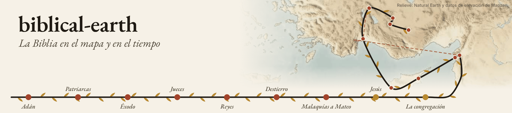

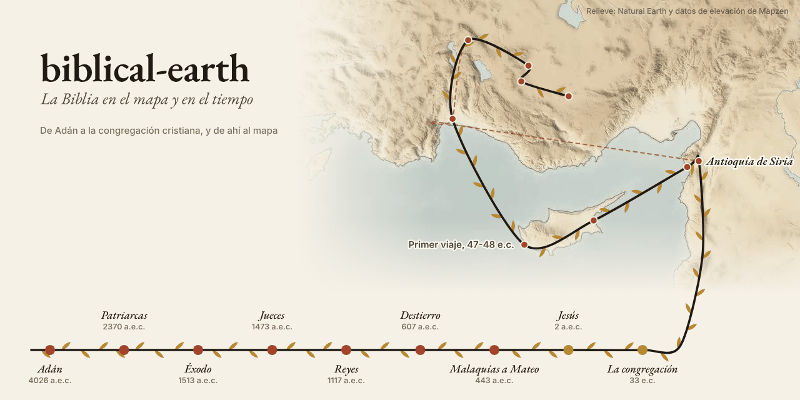

### 2.6. Jesús, de Belén a Jerusalén

Sobre el relieve de Israel, la rama une en orden Belén, Nazaret, el Jordán, Caná, Capernaúm, Cesarea de Filipo, Jericó, Betania y Jerusalén, y la huida a Egipto queda fuera del recorte. La línea de tiempo va a escala de 2 a.e.c. a 33 e.c., así que se ven los casi treinta años en Nazaret y los tres y medio de predicación al final.

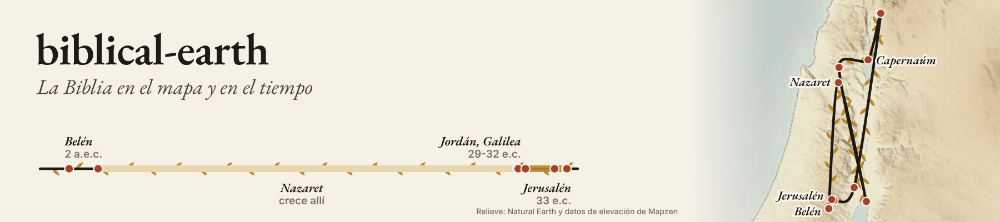

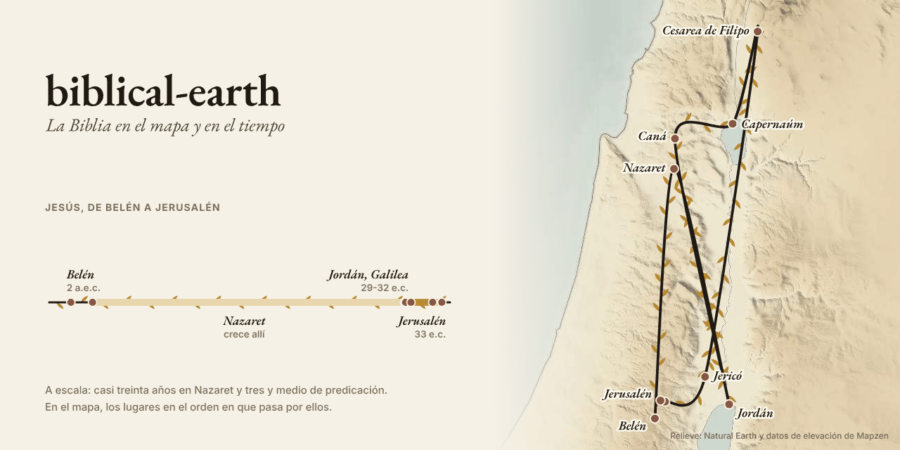

## Seis variantes del banner 1, el olivo del tiempo

La rama de olivo va de Adán a la congregación cristiana y cada aceituna es una de las nueve épocas de [`data/periodos`](../../data/periodos). Las seis variantes cambian lo que cuelga de cada aceituna y cómo crece la rama. Los sucesos y los lugares salen de [`data/eventos`](../../data/eventos) y [`data/lugares`](../../data/lugares), con los años de la cronología de la TNM; el texto de cada suceso está resumido para que quepa. Todas llevan el lema «La Biblia en el mapa y en el tiempo». Las variantes 4 y 5 no llevan la marca pequeña junto al nombre, porque la rama grande ya hace de marca.

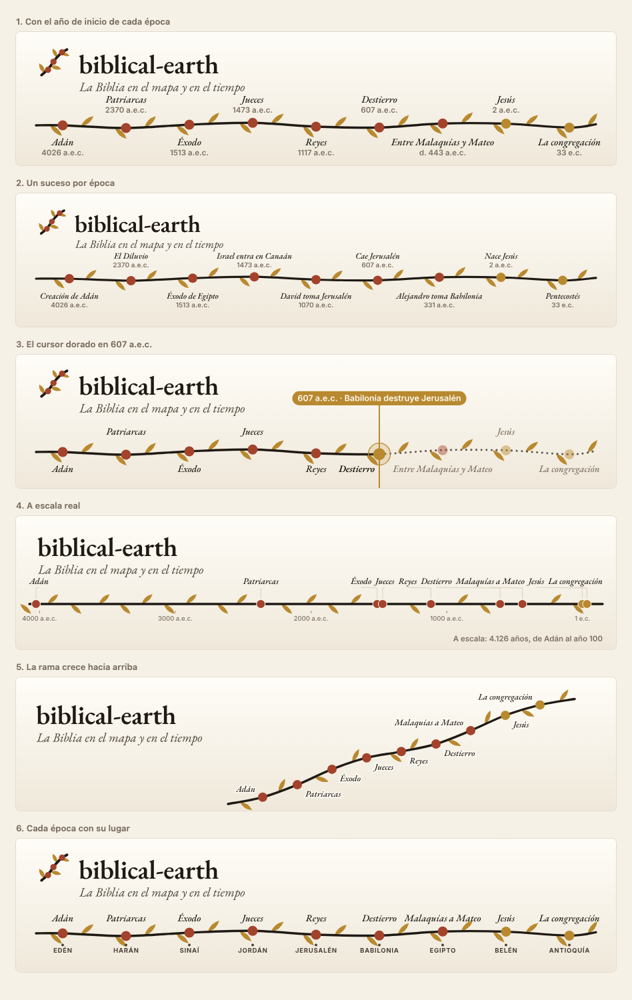

### 1.1. Con el año de inicio de cada época

Cada aceituna lleva su época y el año en que empieza, de 4026 a.e.c. a 33 e.c. Es la versión más directa: se lee como una línea de tiempo sin dejar de ser una rama.

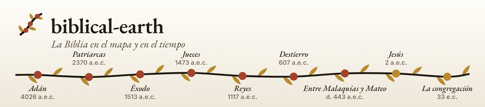

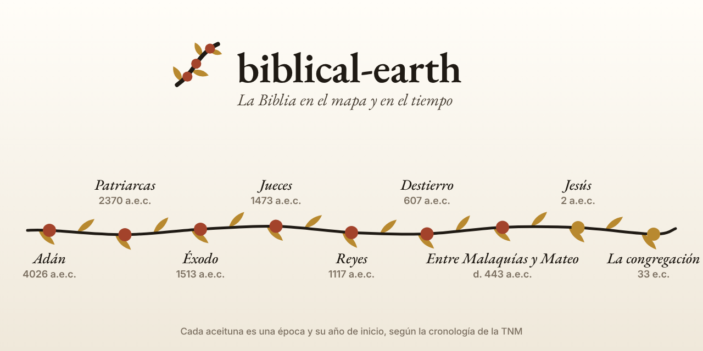

### 1.2. Un suceso por época

Cada aceituna lleva un suceso con su año: la creación de Adán, el Diluvio, el Éxodo, la entrada en Canaán, David en Jerusalén, la caída de Jerusalén, Alejandro en Babilonia, el nacimiento de Jesús y Pentecostés. La versión social pone dos sucesos por época y el nombre de la época encima.

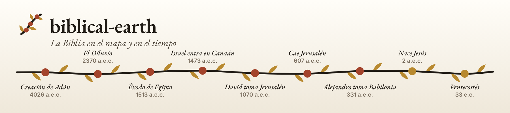

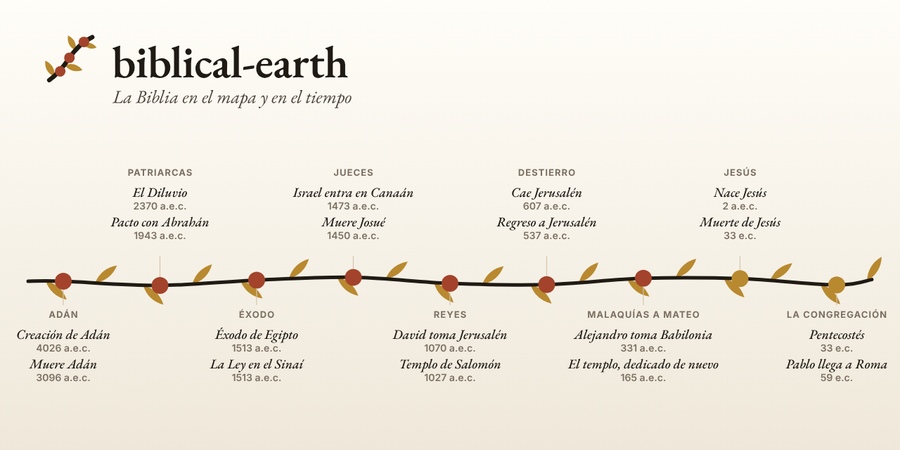

### 1.3. El cursor dorado en 607 a.e.c.

El cursor dorado de la aplicación se para en 607 a.e.c., cuando Babilonia destruye Jerusalén. La rama es continua hasta ahí y sigue en puntos, con las épocas que faltan más claras, igual que un viaje a medio recorrer.

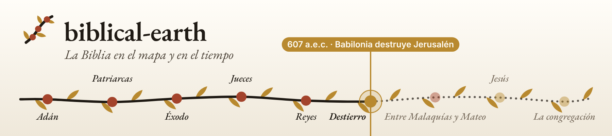

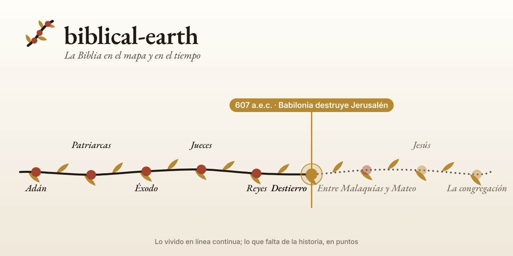

### 1.4. A escala real

Las aceitunas están donde les toca en el tiempo, con marcas cada mil años. Así se ve que de Malaquías al año 100 hay 542 años, solo el último 13 % de la rama, y que Éxodo y Jueces casi se tocan.

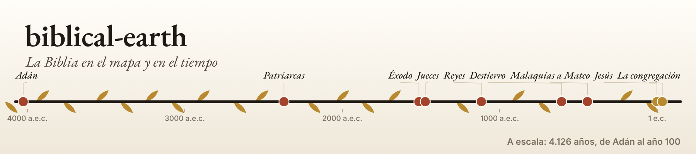

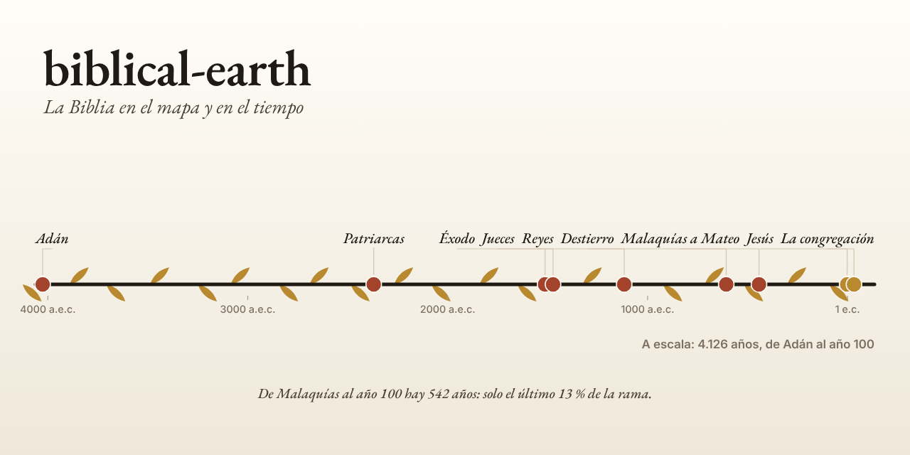

### 1.5. La rama crece hacia arriba

La rama sube en diagonal en el banner y en vertical en la tarjeta social, de Adán abajo a la congregación arriba, con el nombre y el lema a la izquierda. En la versión social cada época lleva también su año de inicio.

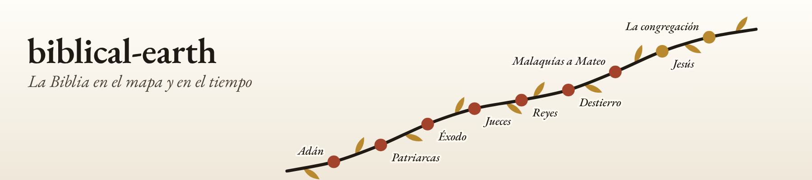

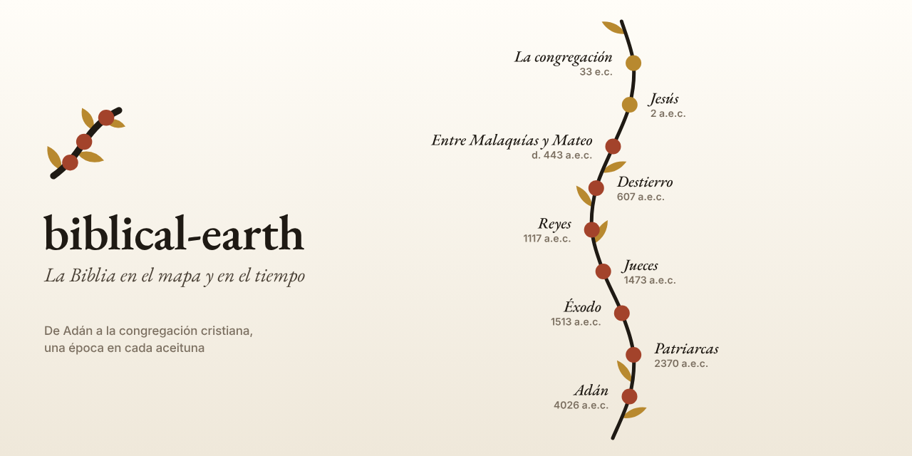

### 1.6. Cada época con su lugar

Debajo de cada aceituna hay un lugar donde pasa esa época: Edén, Harán, Sinaí, Jordán, Jerusalén, Babilonia, Egipto, Belén y Antioquía. Une el tiempo con el mapa sin dibujar ningún mapa.

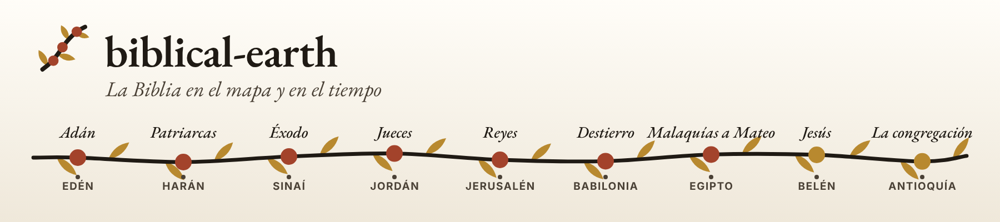

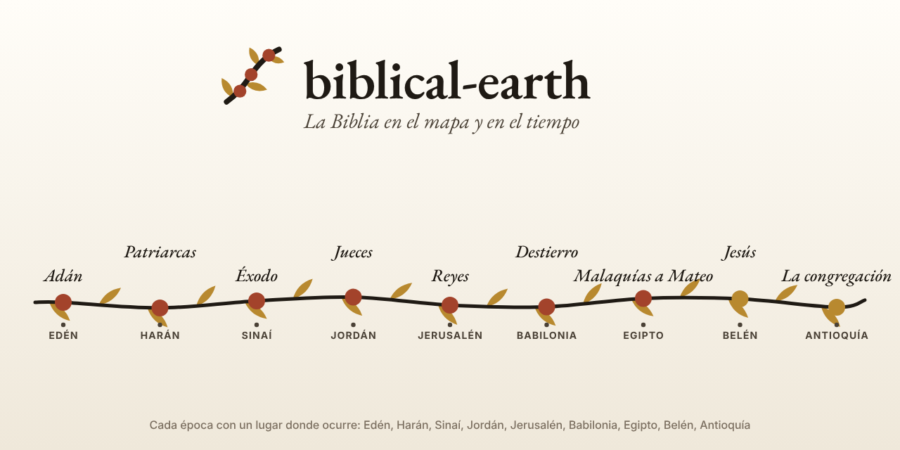

## Seis variantes del banner 6

De la primera ronda nos quedamos con el banner 6, la aplicación en miniatura. Estas seis variantes lo desarrollan con dos cambios que valen para todas:

- **Las rutas tienen dirección.** Cada tramo lleva una flecha en su mitad, del color del viaje, igual que en el sitio. Lo recorrido hasta la fecha del cursor va en línea continua y lo que falta del viaje, en puntos, con la misma leyenda del sitio: «Recorrido hasta esta fecha» y «Lo que falta del viaje». Cada viaje tiene su color del sitio: el primero terracota, el segundo verde azulado, el tercero morado y el viaje a Roma azul.
- **La línea de tiempo enseña todo lo que hay.** Tiene carriles como los de la aplicación: Pablo con sus viajes, Cartas con rombos, Sucesos, Emperadores, Gobernadores y Sumos sacerdotes. Encima va la franja «Toda la historia», de Adán, en 4026 a.e.c., al año 100, con las eras y la ventana que se está mirando. Los viajes siguen siendo el ejemplo, pero ya no parecen el proyecto entero.

Todo sale de [`data/`](../../data): paradas, cartas, sucesos, periodos y eras, con la cronología de la TNM. En 900 × 200 el mapa va a la izquierda y la línea de tiempo a la derecha, porque una franja de mapa bajo la barra solo tendría 80 píxeles de alto y no cabría ningún viaje. En 1280 × 640 se mantiene la disposición de la aplicación: mapa arriba, línea de tiempo debajo y la ficha del viaje a la derecha. Las seis se leen en la columna del README de GitHub; lo comprobamos con el banner a 700 píxeles de ancho.

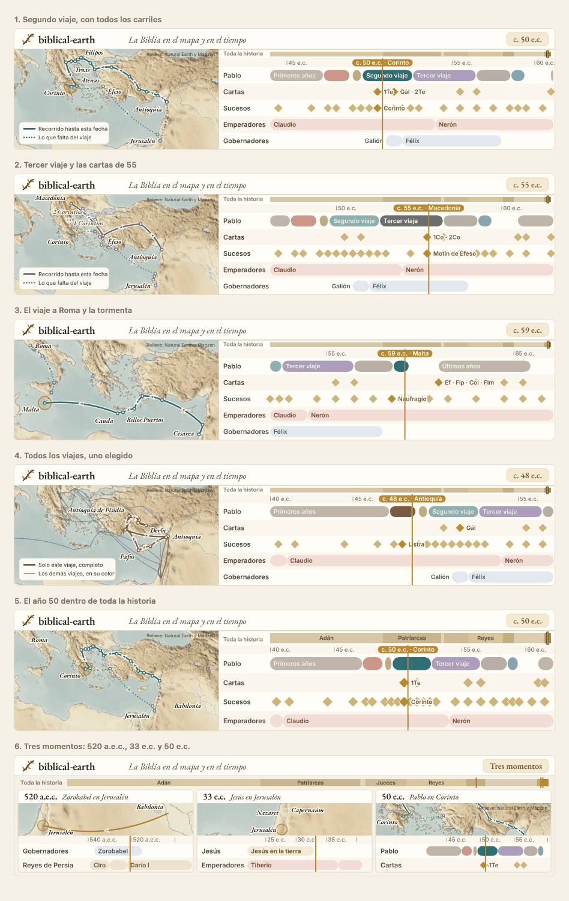

### 6.1. Segundo viaje, con todos los carriles

Otoño del año 50: Pablo acaba de llegar a Corinto en el segundo viaje, y lo que queda hasta Antioquía va en puntos. Debajo están los seis carriles, con 1 Tesalonicenses, que escribe en Corinto ese otoño, Claudio de emperador, Galión y Félix, y Ananías de sumo sacerdote.

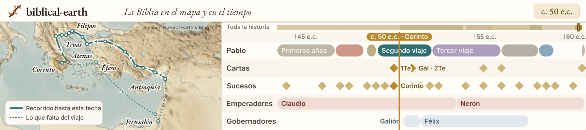

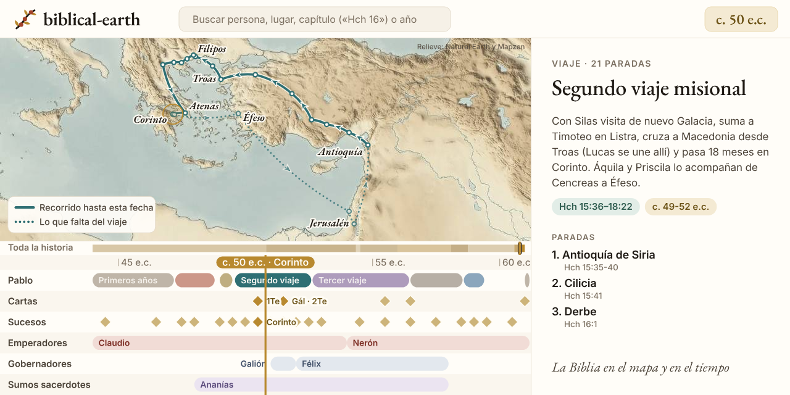

**Texto.** El nombre, el lema «La Biblia en el mapa y en el tiempo», «c. 50 e.c. · Corinto», los nombres de siete lugares y de los carriles. La versión social añade la ficha del viaje con su resumen, «Hch 15:36–18:22» y las tres primeras paradas.

### 6.2. Tercer viaje y las cartas de 55

Año 55: Pablo ha salido de Éfeso y está en Macedonia. Las dos cartas de ese año salen como arcos dorados hacia Corinto: 1 Corintios desde Éfeso y 2 Corintios desde Macedonia, con el motín de Éfeso marcado en Sucesos.

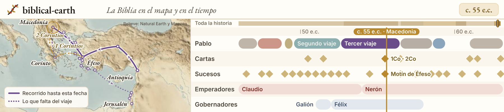

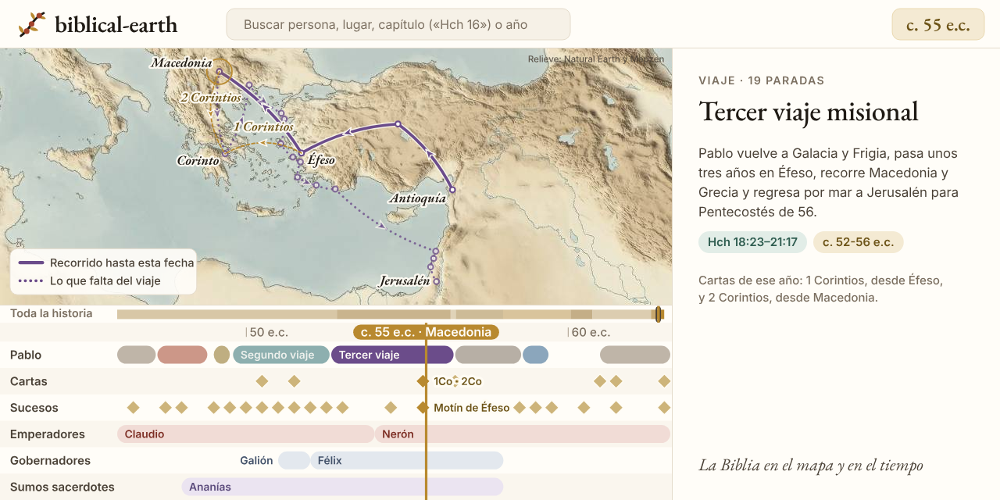

**Texto.** El nombre, el lema, «c. 55 e.c. · Macedonia», «1 Corintios» y «2 Corintios» sobre el mapa, y «1Co · 2Co» y «Motín de Éfeso» en los carriles. La versión social explica de dónde sale cada carta.

### 6.3. El viaje a Roma y la tormenta

Año 59: el barco ha salido de Cesarea, la tormenta lo ha arrastrado de Bellos Puertos y Cauda a Malta, y allí pasan el invierno. De Malta a Roma el camino va en puntos, y en Cartas esperan las que escribirá desde Roma: Efesios, Filipenses, Colosenses y Filemón.

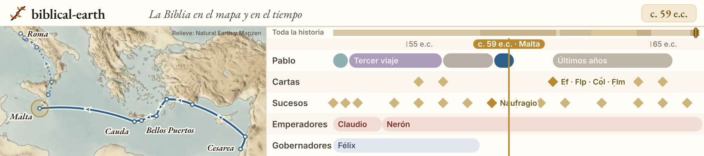

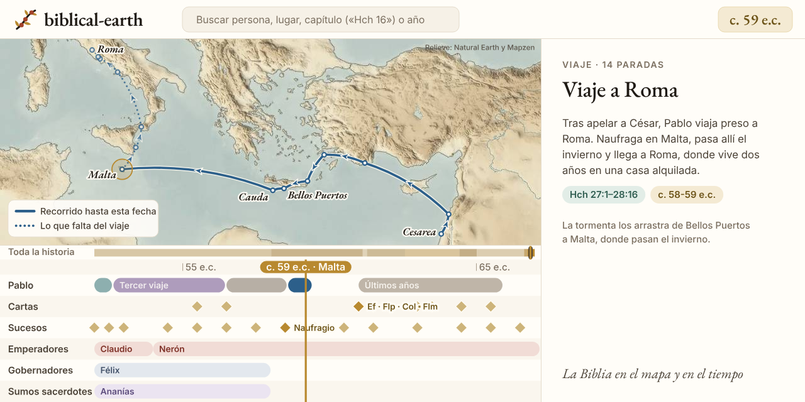

**Texto.** El nombre, el lema, «c. 59 e.c. · Malta», Roma, Malta, Cauda, Bellos Puertos y Cesarea, «Naufragio» y «Ef · Flp · Col · Flm». El banner pequeño no lleva leyenda para no tapar Malta; la social sí.

### 6.4. Todos los viajes, uno elegido

Es el estado «Solo este viaje» del sitio: el primer viaje entero, en fuerte y con sus flechas, y los demás viajes de Pablo al fondo, finos y cada uno en su color. Así se ve de un vistazo cuánto viajó y dónde encaja este viaje.

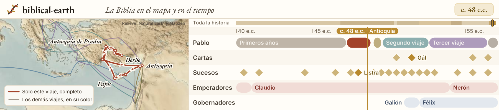

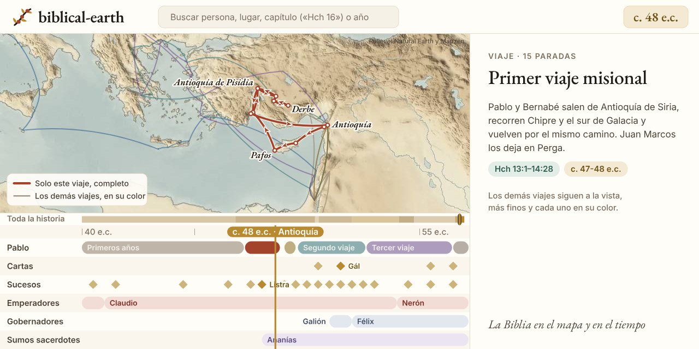

**Texto.** El nombre, el lema, «c. 48 e.c. · Antioquía», cuatro lugares y la leyenda «Solo este viaje, completo» y «Los demás viajes, en su color». La segunda línea de la leyenda es nueva; el sitio no la tiene.

### 6.5. El año 50 dentro de toda la historia

Un recorte más ancho, de Roma a Babilonia, con Jerusalén, para que el segundo viaje se vea dentro del mundo bíblico entero. La franja «Toda la historia» crece y nombra las eras, así que el año 50 aparece como una raya dorada al final de más de cuatro mil años.

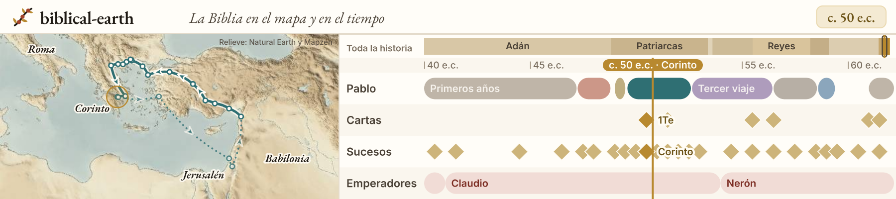

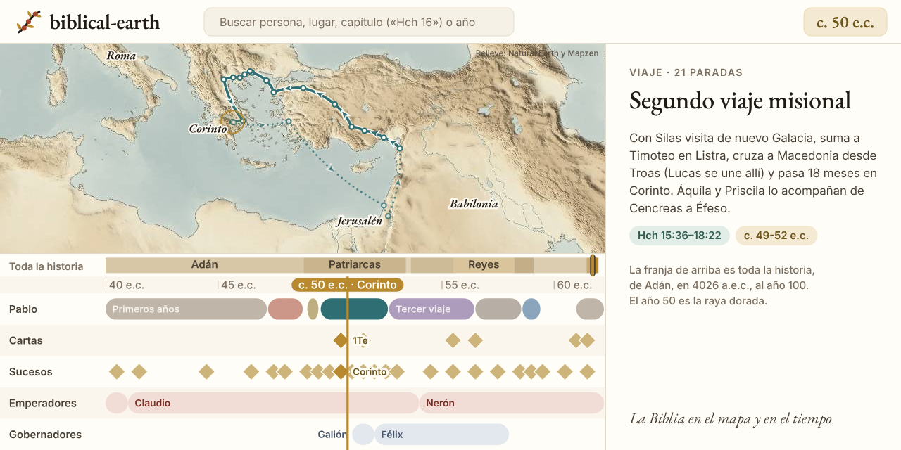

**Texto.** El nombre, el lema, «c. 50 e.c. · Corinto», Roma, Corinto, Jerusalén y Babilonia, y los nombres de las eras que caben: Adán, Patriarcas y Reyes, y en la versión social también Jueces.

### 6.6. Tres momentos

Tres paneles con su mapa y su línea de tiempo: en 520 a.e.c., Zorobabel gobierna en Jerusalén y se reanuda la obra del templo; en 33 e.c., Jesús está en Jerusalén; en 50 e.c., Pablo llega a Corinto. Arriba, la franja de toda la historia marca los tres años, así que se ve que el sitio cubre la Biblia entera y no solo el siglo I.

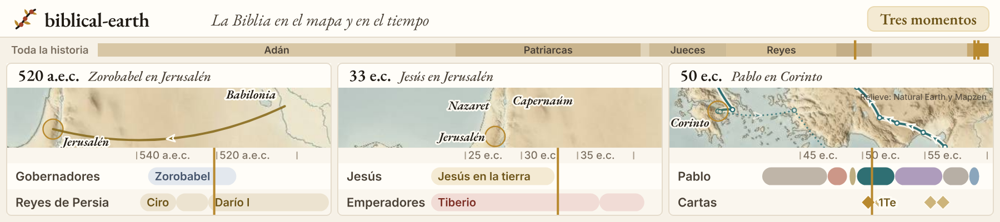

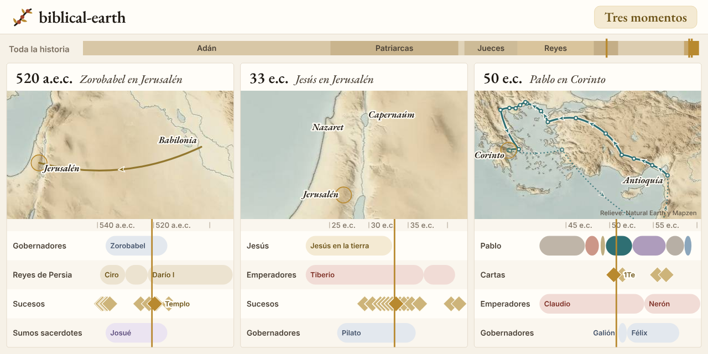

**Texto.** El nombre, el lema, «Tres momentos», las tres fechas con su frase, y los carriles de cada panel: Gobernadores y Reyes de Persia, Jesús y Emperadores, Pablo y Cartas. La versión social añade Sucesos, Sumos sacerdotes y Gobernadores. La línea de Babilonia a Jerusalén del primer panel es la vuelta del destierro de 537 a.e.c.

## Primera ronda: seis propuestas con la rama de olivo

El banner actual del README, [`docs/images/banner.svg`](../images/banner.svg), es un degradado oscuro con la marca y el nombre. Aquí hay seis banners más ambiciosos, todos construidos alrededor de la [rama de olivo](../logo/README.md) que ya es el logo, para elegir uno.

Cada propuesta tiene dos tamaños:

- `banner.svg`, de 900 × 200, para lo alto del README en GitHub. `vista.png` es su render al doble de resolución.
- `social.svg`, de 1280 × 640, para la vista previa del enlace en GitHub, Telegram y WhatsApp. `social.png` es su render a tamaño real.

Todo el texto está convertido en trazos con las fuentes del propio repo, EB Garamond e Inter, así que el SVG se ve igual en GitHub que aquí. El nombre sigue siendo «biblical-earth» mientras no haya otro. Los datos que aparecen, épocas, lugares y viajes, salen de [`data/`](../../data), y las fechas siguen la cronología de la TNM. Las propuestas 2 y 6 llevan dentro un recorte de nuestro propio relieve, [`site/maps/`](../../site/maps), con la atribución que piden sus [créditos](../ideas/mockups/kit/maps/CREDITS.md).

### Las seis de un vistazo

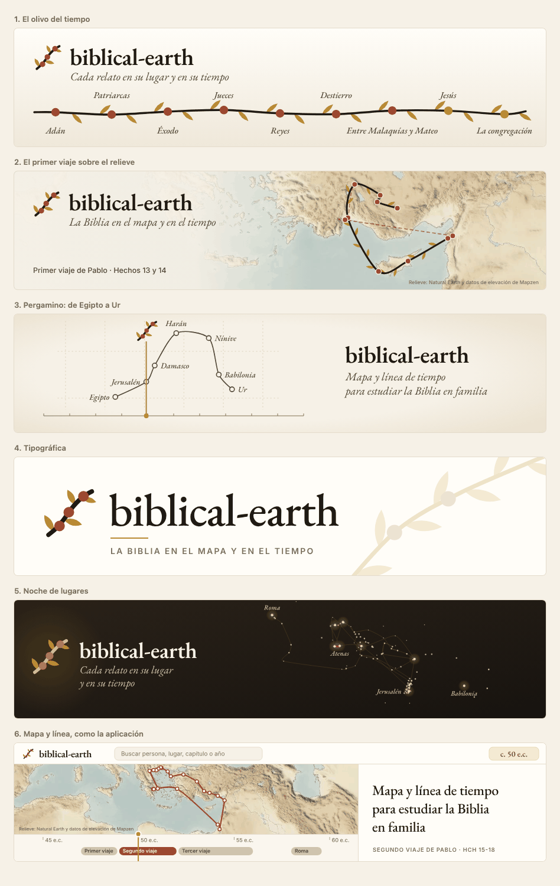

### 1. El olivo del tiempo

La rama de olivo se estira de Adán a la congregación cristiana y cada aceituna es una época: Adán, los patriarcas, el Éxodo, los jueces, los reyes, el destierro, entre Malaquías y Mateo, Jesús y la congregación. Las dos últimas van en oro porque son las épocas de las Escrituras Griegas.

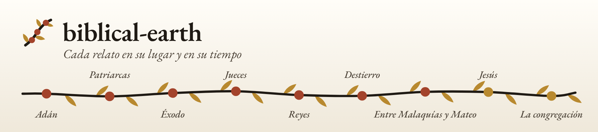

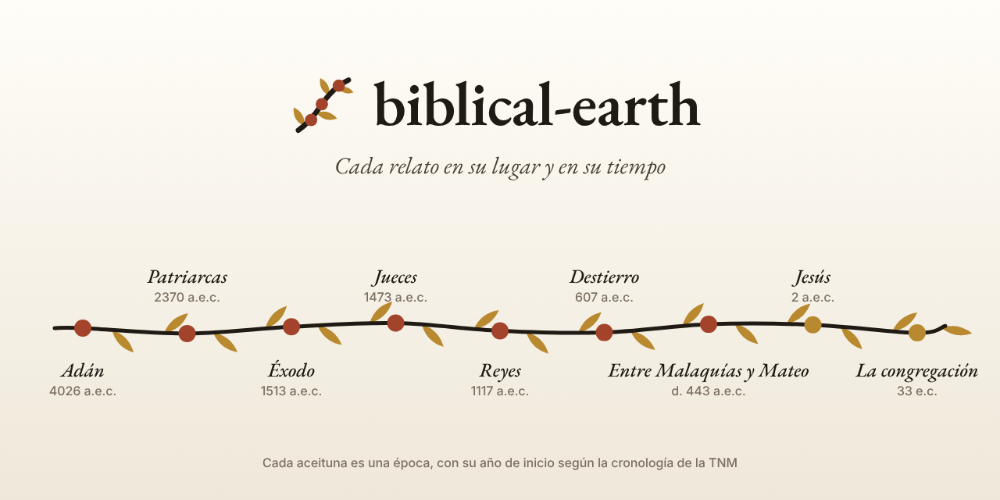

**Texto.** El nombre, «Cada relato en su lugar y en su tiempo» y el nombre de cada época. La versión social añade el año de inicio de cada una y una nota que dice que siguen la cronología de la TNM.

### 2. El primer viaje sobre el relieve

El tallo del olivo es el recorrido real del primer viaje de Pablo, de Antioquía de Siria a Derbe, sobre nuestro relieve del Mediterráneo oriental; las aceitunas son las paradas y la vuelta va en línea discontinua. Es la que más se parece a lo que el sitio hace de verdad.

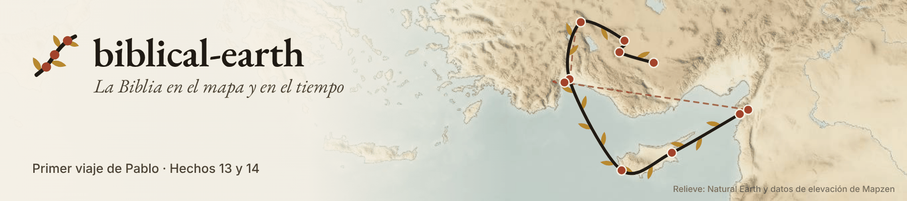

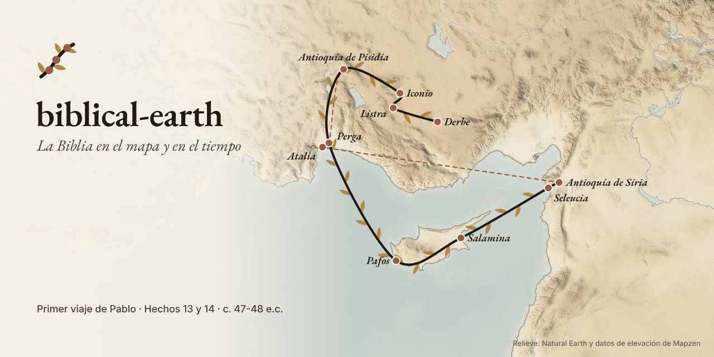

**Texto.** El nombre, «La Biblia en el mapa y en el tiempo», «Primer viaje de Pablo · Hechos 13 y 14» y la atribución del relieve. La versión social nombra las diez paradas y añade «c. 47-48 e.c.».

### 3. Pergamino: de Egipto a Ur

Sobre papel de pergamino, el mundo bíblico de Egipto a Ur es una línea fina con siete lugares, dibujada con sus posiciones reales. El olivo hace de cursor del tiempo: baja por Jerusalén hasta una línea de tiempo, igual que el cursor dorado de la aplicación.

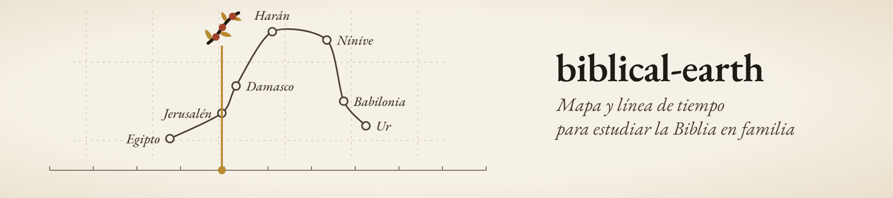

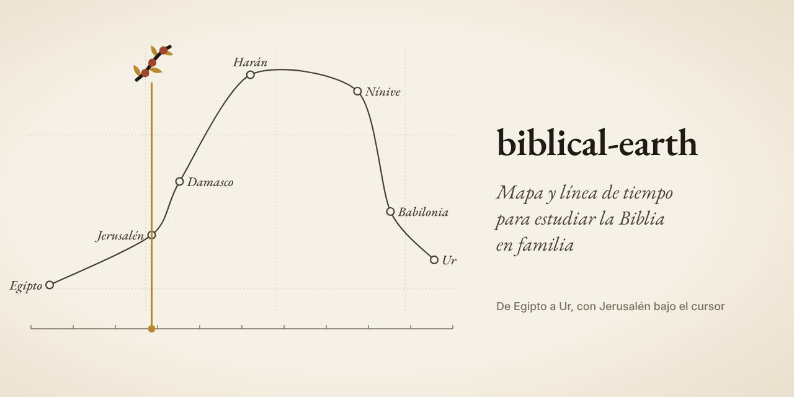

**Texto.** El nombre, «Mapa y línea de tiempo para estudiar la Biblia en familia» y los nombres de Egipto, Jerusalén, Damasco, Harán, Nínive, Babilonia y Ur.

### 4. Tipográfica

Solo el nombre en grande con la EB Garamond, la marca al lado y una rama de olivo muy tenue que se sale del marco por la derecha. Es la más tranquila y la que mejor aguanta si el nombre cambia.

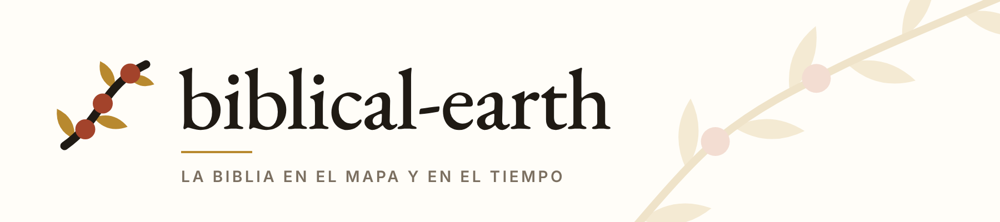

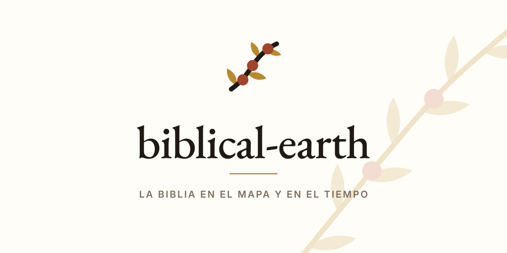

**Texto.** El nombre y «La Biblia en el mapa y en el tiempo» en versalitas.

### 5. Noche de lugares

Fondo de noche con el olivo en oro, y los lugares de [`data/lugares`](../../data/lugares) son estrellas en su posición real. Las líneas finas que las unen son los cuatro viajes de Pablo, así que el mapa del Mediterráneo aparece solo, sin dibujar ninguna costa.

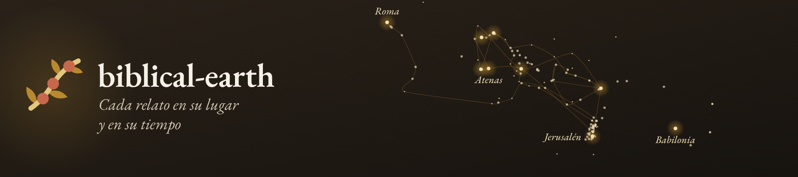

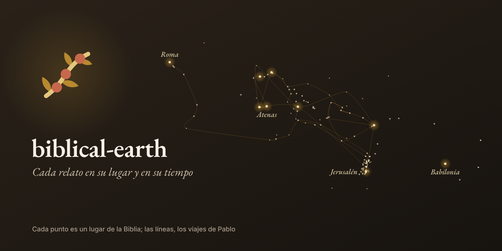

**Texto.** El nombre, «Cada relato en su lugar y en su tiempo» y los nombres de Roma, Atenas, Jerusalén y Babilonia. La versión social explica que cada punto es un lugar y cada línea un viaje de Pablo.

### 6. Mapa y línea, como la aplicación

Una miniatura de la propia aplicación: la barra de arriba con el logo, el buscador y la fecha, el mapa con el segundo viaje de Pablo, la línea de tiempo con el cursor dorado en el año 50 y el panel lateral. Quien lo ve entiende qué es el sitio antes de abrirlo.

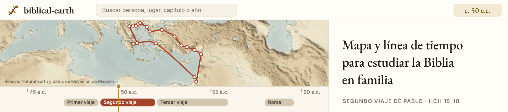

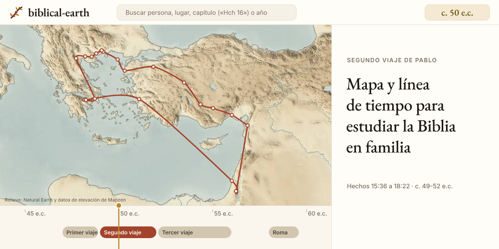

**Texto.** El nombre, «Mapa y línea de tiempo para estudiar la Biblia en familia», «Segundo viaje de Pablo», el buscador de ejemplo, «c. 50 e.c.», los años de 45 a 60 e.c., los cuatro viajes y la atribución del relieve.

### Qué cambia al elegir uno

- El `banner.svg` elegido sustituye a [`docs/images/banner.svg`](../images/banner.svg), que es el que enseña el README.
- La vista previa social de GitHub se sube a mano en los ajustes del repositorio y solo admite PNG o JPG, así que lo que se sube es el `social.png` de la propuesta.
- Las propuestas 2 y 6 llevan el relieve dentro y pesan de 140 a 310 KB por SVG. Las otras van de 25 a 255 KB, porque todo el texto va en trazos.
