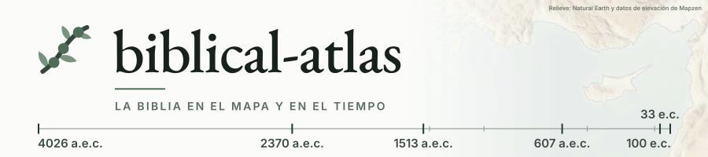
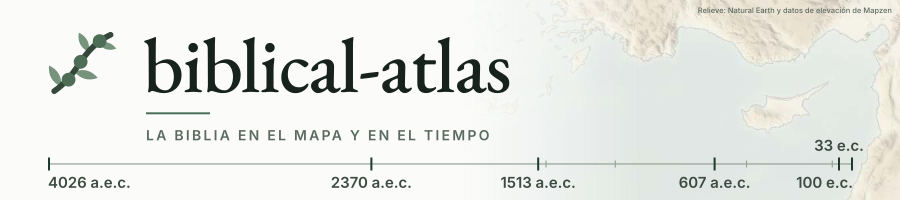
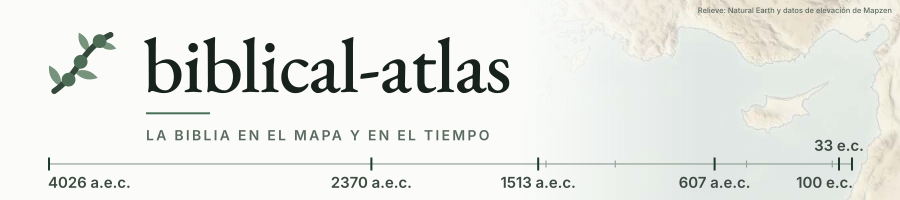
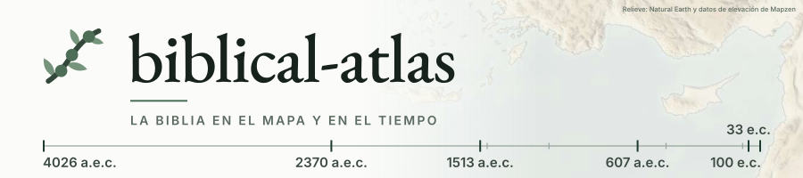
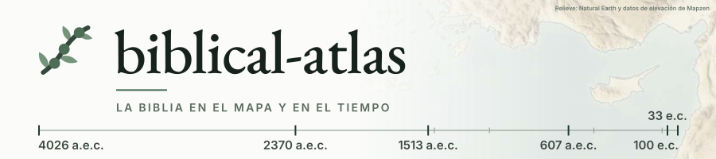

# El fundido del banner

El banner actual cubre el mapa con blanco hasta x=515 y lo va destapando hasta x=715, donde aún queda un velo del 25 %. Cuatro variantes para ver más tierra a la derecha. Los números son las coordenadas del degradado sobre un ancho de 900 y la opacidad del velo que queda al final.

| Variante | Empieza | Acaba | Velo al final |
|---|---|---|---|
| actual | 515 | 715 | 25 % |
| a | 460 | 640 | 0 % |
| b | 515 | 700 | 0 % |
| c | 400 | 600 | 10 % |
| d | 440 | 720 | 0 % |

