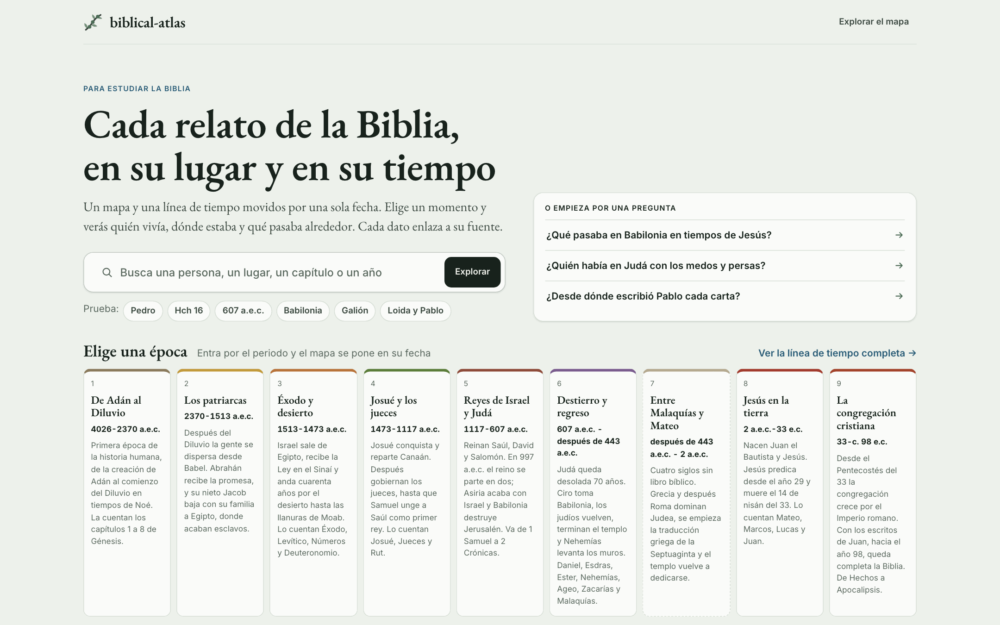

# Primeros pasos

La aplicación vive en [biblical-atlas.geiser.cloud](https://biblical-atlas.geiser.cloud/). No hay nada que instalar ni ninguna cuenta que crear: se abre en el navegador, en el ordenador, en la tablet o en el móvil.

## La portada

La primera vez, el sitio abre en la portada: las épocas de la Biblia, los cuatro recorridos guiados y unas preguntas guía. Cualquiera de ellas lleva al mapa con la fecha ya puesta.



Con una dirección que ya lleva una vista (por ejemplo, un enlace que te han pasado) el sitio abre directamente en el mapa. Para volver a la portada, pulsa el nombre de arriba a la izquierda.

## Lo que ves en el mapa

Tres marcos gobernados por una sola fecha:

- **El mapa**, arriba a la izquierda. Antiguo, actual o los dos con una cortina. Los puntos son lugares; las líneas, viajes; los arcos, cartas.
- **La ficha**, a la derecha (en el móvil, una hoja inferior). Lo seleccionado, con sus pasajes, sus fuentes y sus vídeos.
- **La línea de tiempo**, abajo. Va de milenios a días. El cursor es la fecha que manda.

Prueba esto en el primer minuto:

1. Escribe «Hch 16» en la búsqueda (o pulsa `/`). El cursor va al año 50, el mapa encuadra los lugares del capítulo y la ficha lo abre, con el enlace para leerlo en jw.org.
2. Arrastra el cursor de la línea de tiempo. Pablo se mueve por su ruta y la ficha de la fecha dice qué pasa.
3. En la barra de arriba, pulsa el mapa actual (el globo) y luego la cortina. Los mismos lugares sobre el mapa de hoy.

Todo lo demás está en [Uso](usage.md).

## Servirla desde tu ordenador

Para trabajar con los datos, o para tenerla sin depender del sitio, hace falta Python 3.12 o más nuevo:

```bash
git clone https://github.com/GeiserX/biblical-atlas.git
cd biblical-atlas
pip install -r requirements.txt
python3 scripts/build.py
cd site && python3 -m http.server 8080
```

Abre <http://localhost:8080>. `scripts/build.py` escribe `site/data.json`, `site/data.js` y `site/stats.json` a partir de `data/`; sin ese paso el mapa no tiene datos.

`site/index.html` también abre con doble clic, desde `file://`, con tres límites: el relieve antiguo va como imagen bajo el mapa (el navegador no deja a MapLibre leer ficheros locales), la cortina no está disponible y las fichas no muestran vídeos.

En los dos casos hace falta conexión: MapLibre GL JS 6.11.2 llega desde unpkg.com con su huella SRI, y el mapa actual usa las teselas de [OpenFreeMap](https://openfreemap.org/) con el estilo Positron, sin clave. Si ese estilo no responde, el mapa actual pasa a una imagen propia.

## Qué hacer después

- [Uso](usage.md): cada vista, la dirección de la página y el teclado.
- [Cómo funciona](how-it-works.md): de dónde salen los datos y las reglas de las fuentes.
- [Desarrollo](development.md): compilar, validar y proponer un cambio.
