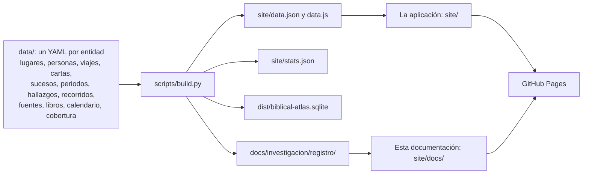

# Cómo funciona

La confianza que pide un mapa de la Biblia se gana con dos cosas: saber de dónde sale cada dato y poder comprobarlo. Esta página explica las dos, y cómo está montada la aplicación.

## De dónde salen los datos

- **jw.org y la Traducción del Nuevo Mundo son la fuente principal, y la información más reciente de jw.org gana.** Cuando dos publicaciones difieren, vale la más nueva y el cambio queda en el historial del hecho, con la fuente antigua y la nueva.
- **Enlazamos, no copiamos.** Cada hecho lleva un resumen de 40 palabras como mucho, escrito con nuestras palabras, y el enlace a jw.org donde se lee la fuente completa. Ningún párrafo, mapa, imagen ni vídeo de jw.org entra en el repositorio.
- **Nivel 2 solo si jw.org lo ha usado.** Arqueología, papers y coordenadas externas entran cuando jw.org ha citado esa fuente o afirma lo mismo, siempre junto a una fuente de nivel 1 y sin contradecirla en pantalla. Nada de otras confesiones.
- **Fechas siempre con fuente.** Si jw.org da la fecha, es la fecha. Si se calcula a partir de datos de jw.org, la cuenta queda escrita y el hecho lleva `status: pending` hasta que una publicación la dé.
- **Un lugar incierto lleva candidatos, no un punto.** Una zona, un punto o una franja, cada uno con su estado, su fuente y su razón. Las coordenadas vienen de OpenBible.info; qué lugar es cada uno, de jw.org.

Cada hecho, y cada hecho anidado (una relación, una parada, un candidato, un nombre), lleva cuatro campos obligatorios: `sources`, `reason` (por qué hacemos esa asociación), `checked_on` (el día en que se leyó la fuente) y `status` (`verified` o `pending`). Un hecho sin ellos no pasa la validación. Todo esto está escrito, dato a dato, en el [registro de investigación](investigacion/registro/index.md); el método completo y el esquema de cada tipo están en [`docs/investigacion/README.md`](https://github.com/GeiserX/biblical-atlas/blob/main/docs/investigacion/README.md).

## Del YAML al mapa

- `scripts/build.py` lee `data/`, comprueba que cada id citado existe, crea los capítulos de la Biblia que ninguna fuente escribe (`mateo-26` sale de `data/books.yaml`) y escribe lo derivado. Nada de eso se edita a mano; `data.json`, `data.js` y `stats.json` no se versionan.
- `scripts/validate.py` comprueba el esquema, las fechas, los textos de más de 40 palabras, el vocabulario de las relaciones y la cobertura de la Biblia. Con `--links` pide cada URL una vez. `scripts/review.py` lista lo que lleva más de un año sin releer.
- El sitio se publica en GitHub Pages en cada cambio de `main` (`pages.yml`): compila los datos, construye esta documentación en `site/docs/` y sube `site/` entero como un solo artefacto.

## La aplicación

- **Estática.** `index.html`, `acerca.html`, `calendario.html`, los scripts de `js/` y las hojas de `css/` se sirven tal cual. No hay servidor, base de datos en línea ni cuentas.
- **Scripts clásicos que comparten `window.BE`.** No usa módulos ES porque desde `file://` el navegador bloquea los `import` locales, y el sitio tiene que abrir con doble clic. Cada tipo de entidad se registra en su propio fichero (`js/tipos/`).
- **MapLibre GL** dibuja el mapa. El relieve antiguo es propio, hecho con Natural Earth y datos de elevación abiertos, en cuatro extensiones que se funden al acercarte. El mapa actual usa las teselas de OpenFreeMap con el estilo Positron.
- **Dónde está cada persona en cada momento.** Una parada anclada va en su fecha; las paradas en tiempo narrativo se reparten entre las dos anclas que las rodean, y el marcador lleva entonces un halo discontinuo y el rótulo «posición estimada». Fuera de las fechas de los datos, la ficha dice que no sabemos dónde estaba.
- **Vídeos de jw.org.** Cada lugar, persona y capítulo tiene su lista de vídeos públicos que lo mencionan. El índice se construye fuera del repositorio a partir de subtítulos que no se publican; en el sitio solo queda el título, la URL pública y el número de menciones.

Los módulos, las interfaces y cómo añadir un tipo están en [`site/README.md`](https://github.com/GeiserX/biblical-atlas/blob/main/site/README.md); las decisiones tomadas, en [Decisiones](decisiones.md).

## Qué no hace

- No explica ni interpreta la Biblia. Sitúa el relato en su lugar y en su tiempo y lleva siempre a leer el pasaje.
- No prepara otros idiomas hasta que hagan falta. Solo en español.
- No hay analítica ni cuentas. Lo que recuerda (la última vista, los capítulos leídos, la letra grande, el modo reunión) vive en el almacenamiento de tu navegador.

## Licencia

[GPL-3.0-or-later](https://github.com/GeiserX/biblical-atlas/blob/main/LICENSE) para el código y los datos propios. Las coordenadas de OpenBible.info son CC BY 4.0, Natural Earth es dominio público y el resto de los créditos, con la licencia de cada uno, está en [Acerca de](https://biblical-atlas.geiser.cloud/acerca.html#gracias).
