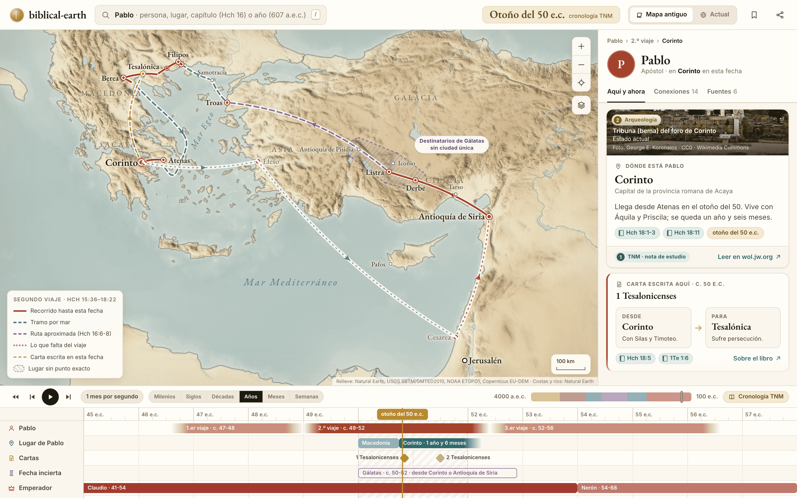

# Ideas de biblical-earth

Aquí están las ideas de producto, las maquetas y el modelo de datos de biblical-earth. Es un borrador de diseño y todavía no hay código: describe qué queremos construir y por qué.

## Qué queremos

Una web abierta para estudiar la Biblia con un **mapa**, una **línea de tiempo con zoom** y un **panel lateral**. Las tres piezas obedecen a una sola fecha, el **cursor de tiempo**. Mueves el cursor y el mapa enseña lo que existía en ese momento, la línea marca quién vivía y el panel cuenta qué pasaba.

Por debajo hay un grafo: personas, lugares, hechos, viajes, cartas y hallazgos, unidos por relaciones que tienen su fecha y su fuente. El estudiante nunca ve el grafo entero. Ve una persona, un lugar o un hecho en el centro y, a su alrededor, lo que estaba conectado con él en esa fecha. Desde ahí salta de nodo en nodo.

La fuente principal (nivel 1) es la Traducción del Nuevo Mundo (TNM) y wol.jw.org, con su cronología. La arqueología y la investigación (nivel 2) acompañan y nunca corrigen. De jw.org sólo enlazamos: no copiamos textos ni imágenes.

## Preguntas que el producto responde de forma obvia

- ¿Qué pasaba en Babilonia en tiempos de Jesús? → [pantalla 08](pantallas-grafo-y-contexto.md#08--babilonia-en-tiempos-de-jesús)
- ¿Quién había en Israel en la época de los medos y persas? → [pantalla 09](pantallas-grafo-y-contexto.md#09--israel-en-la-época-de-los-medos-y-persas) y [pantalla 05](pantallas-mapa-y-tiempo.md#05--línea-de-tiempo)
- ¿Dónde estaba Pablo en tal año, desde dónde escribió cada carta y qué pasaba en la ciudad que la recibía? → [pantalla 01](pantallas-mapa-y-tiempo.md#01--pantalla-principal) y [pantalla 03](pantallas-mapa-y-tiempo.md#03--cartas-de-pablo)
- ¿Qué pasó en este punto del mapa en esta fecha? → [pantalla 13](pantallas-busqueda-y-estudio.md#13--fuentes-y-cronología)
- ¿Cómo se relaciona esta persona con aquella? → [pantalla 10](pantallas-grafo-y-contexto.md#10--conexión-entre-dos)
- ¿Dónde queda hoy este lugar bíblico? → [pantalla 02](pantallas-mapa-y-tiempo.md#02--mapa-antiguo-frente-a-actual)
- ¿Dónde estaba el Edén? ¿Por qué no hay un punto? → [pantalla 04](pantallas-mapa-y-tiempo.md#04--lugares-inciertos)
- ¿Por qué 607 a.e.c. y no 587? → [pantalla 13b](pantallas-busqueda-y-estudio.md#13b--cronología-tnm-y-fecha-secular-607-aec)

## Principios de diseño

1. **Una fecha manda.** El cursor gobierna el mapa, la línea, el grafo y el panel. Nunca enseñan fechas distintas.
2. **Nunca el grafo entero.** Siempre una vista centrada, filtrada por fecha y con un límite de vecinos.
3. **La incertidumbre se dibuja.** Un lugar incierto es una zona o un abanico de candidatos, cada uno con su base. Una fecha incierta tiene los bordes difuminados. Un cálculo nuestro va rayado y rotulado. Nunca ponemos un punto falso.
4. **Cada dato tiene su fuente a un clic.** Nivel 1 o nivel 2, con enlace. Lo que no tiene fuente dice «sin verificar».
5. **Leemos en la fuente, no la copiamos.** Referencias como «Hch 16:12-15», resúmenes nuestros y el botón «Leer en wol.jw.org ↗».
6. **Lo antiguo y lo moderno a la vez.** Cada nombre de la época lleva su equivalente actual, a un clic o con cortina.
7. **Una sola línea de tiempo con niveles.** El zoom abre los nombres. No hay una segunda banda de episodios encima.
8. **Buscar es seleccionar.** El resultado es un nodo con su contexto en el tiempo y en el mapa. Lo demás se atenúa.
9. **Toda vista se puede compartir.** La dirección guarda la fecha, la selección y las capas.
10. **Primero el móvil, el teclado y la lectura.** Si funciona con una mano y con lector de pantalla, funciona para todos.

## Galería de maquetas

Son capturas de maquetas HTML hechas con el [kit](mockups/README.md), con datos comprobados en wol.jw.org. Cada imagen lleva a su ficha: qué pregunta responde, cómo se llega, qué se puede pulsar y sus estados alternativos.

<table>
<tr>
<td width="50%"> <b>01 · Pantalla principal.</b> Pablo en Filipos hacia el 50 e.c., con el viaje hecho, lo que falta y qué pasaba en Roma.</td>
<td width="50%"> <b>02 · Antiguo frente a actual.</b> Cortina entre el mapa de la época y el de hoy, con la tabla de nombres.</td>
</tr>
<tr>
<td> <b>03 · Cartas de Pablo.</b> Cada carta es una flecha de origen a destino y la ficha cuenta qué pasaba en los dos extremos.</td>
<td> <b>04 · Lugares inciertos.</b> El Edén es una zona y el Sinaí tiene cuatro candidatos, cada uno con su base.</td>
</tr>
<tr>
<td> <b>05 · Línea de tiempo.</b> Tres zooms en una sola línea: milenios, décadas del periodo persa y días de nisán del 33.</td>
<td>  <b>06 y 06b · Móvil.</b> La hoja inferior a media altura y abierta del todo, con el viaje en vertical.</td>
</tr>
<tr>
<td> <b>07 · Grafo centrado en Pablo.</b> Personas, lugares, cartas y hechos conectados con Pablo a mediados del 51.</td>
<td> <b>08 · Babilonia en tiempos de Jesús.</b> La ciudad a lo largo del tiempo y qué pasaba allí en el 30 e.c.</td>
</tr>
<tr>
<td> <b>09 · Israel con los medos y persas.</b> Quién había en Judá, en Babilonia y en Susa, con el cursor en 520 a.e.c.</td>
<td> <b>10 · Conexión entre dos.</b> Tres caminos de Loida a Pablo, ordenados por lo sólidos que son.</td>
</tr>
<tr>
<td> <b>11 · Búsqueda.</b> Buscar «Pedro» enmarca su vida en el tiempo y sus lugares en el mapa.</td>
<td> <b>12 · Modo lectura.</b> Hechos 16 pasaje a pasaje, con el mapa siguiendo la lectura.</td>
</tr>
<tr>
<td> <b>13 · Fuentes y cronología.</b> Pablo ante Galión: nivel 1, nivel 2, la otra propuesta de fecha y lo que no está verificado.</td>
<td> <b>13b · 607 frente a 587/586.</b> La fecha TNM manda y la secular aparece como nota, con el razonamiento de los 70 años.</td>
</tr>
<tr>
<td> <b>14 · Recorrido guiado.</b> El regreso de 537 a.e.c. en ocho paradas, con cifras, lo que no sabemos y una pregunta de repaso.</td>
<td> <b>15 · Portada.</b> Búsqueda, nueve épocas a escala real, recorridos y de dónde salen los datos.</td>
</tr>
<tr>
<td> <b>00 · Demostración del kit.</b> La maqueta que prueba el kit: mapa, rutas, zona incierta, línea de tiempo y ficha.</td>
<td></td>
</tr>
</table>

## Documentos

| Documento | Qué contiene |
|---|---|
| [Catálogo de ideas](catalogo-de-ideas.md) | 159 ideas numeradas en 9 áreas (tiempo, mapa, grafo, fichas, búsqueda, aprendizaje, fuentes, móvil y contribución), cinco perfiles de estudiante, las 15 ideas del primer corte y la lista de hechos comprobados. |
| [Pantallas: mapa y tiempo](pantallas-mapa-y-tiempo.md) | Pantallas 01 a 06b. |
| [Pantallas: grafo y contexto](pantallas-grafo-y-contexto.md) | Pantallas 07 a 10. |
| [Pantallas: búsqueda y estudio](pantallas-busqueda-y-estudio.md) | Pantallas 11 a 15. |
| [Modelo de datos](modelo-de-datos.md) | Por qué Theographic no basta y nuestro modelo: aristas con fecha, fechas ancladas y narrativas, candidatos de ubicación, cartas con dos extremos y ejemplos YAML. |
| [Fuentes y proyectos](fuentes-y-proyectos.md) | Publicaciones de nivel 1 que enlazamos, términos de uso de jw.org, proyectos parecidos, datos abiertos, geografía antigua, imágenes con licencia y herramientas. |
| [Kit de maquetas](mockups/README.md) | Cómo crear y renderizar una maqueta: mapas base, proyección, componentes, [fuentes tipográficas](mockups/kit/fonts/) (EB Garamond, Inter y Noto Serif Hebrew, licencia OFL) y [créditos de las fotos](mockups/kit/photos/CREDITS.md). |
| [Datos de ejemplo](mockups/data/README.md) | Los JSON comprobados que usan las maquetas y el formato de fechas (años astronómicos: 1 a.e.c. = 0). |

## Decisiones tomadas

- **Un cursor de tiempo único** mueve el mapa, la línea de tiempo con zoom (de milenios a días) y el panel. La velocidad de reproducción se adapta al zoom.
- **Carriles por persona y por imperio** en la línea de tiempo. El mapa sólo enseña lo vigente en la fecha y deja un rastro tenue de lo anterior.
- **Pablo en cada momento.** Al mover la línea se ve dónde estaba, dónde escribió cada carta, a quién iba y qué pasaba en la ciudad que escribe y en la que recibe.
- **Pulsar un punto del mapa** en la fecha elegida enseña qué pasó allí.
- **Navegación como grafo.** Una persona en el centro, su contexto alrededor y ramas nuevas en cada salto, filtradas por fecha.
- **Mapa antiguo y mapa actual** a un clic, o superpuestos con cortina. Un mapa sólo moderno desorienta.
- **Cartografía propia.** Dibujamos nuestros mapas a partir de hechos (coordenadas, costas, relieve) con diseño propio. De jw.org sólo enlazamos. Más adelante podemos pedir permiso para usar su material.
- **Incertidumbre visible.** Vidas que se difuminan donde no hay fechas, viajes en «tiempo narrativo» rotulado como aproximado y lugares inciertos como zonas o abanicos de candidatos.
- **Búsqueda por nodo y vecinos**, por capítulo («Hch 16») y por año («607 a.e.c.»).
- **Cronología TNM como principal.** La secular aparece como nota cuando difiere (607 frente a 587/586 a.e.c.). Internamente usamos años astronómicos (1 a.e.c. = 0).
- **Un YAML por entidad en git** (persona, lugar, suceso, viaje, periodo, hallazgo), con fuentes por niveles. Un paso de compilación genera JSON.
- **Sitio estático.** MapLibre GL, teselas propias, JSON en el navegador y ningún servidor.
- **Rutas por calzadas reales** con los datos de Itiner-e, y por mar cuando el texto lo dice.
- **Fotos.** No existen fotos de la época. Usamos objetos de museo y ruinas actuales con licencia libre y el crédito a la vista, y enlazamos a las ilustraciones de jw.org.
- **Theographic** sirve para arrancar el índice de nombres y versículos, no como modelo. Los datos abiertos de otros autores sólo aportan hechos neutros, como coordenadas.
- **Primer corte.** Los viajes de Pablo (Hch 9-28) y sus cartas.

## Preguntas abiertas

- **Permiso de jw.org.** ¿Pedimos permiso para enlazar o mostrar sus mapas e ilustraciones dentro de la aplicación? La vía está en [fuentes y proyectos](fuentes-y-proyectos.md#16-términos-de-uso-de-jworg-y-cómo-pedir-permiso).
- **Licencia de los datos de Itiner-e.** El artículo es CC BY 4.0, pero el conjunto de datos no declara licencia.
- **Coordenadas sin verificar:** Seleucia del Tigris, Ctesifonte, Nehardea y Betania del otro lado del Jordán.
- **Nombres que cambian con el tiempo**, como Afec y Antípatris. ¿Desde qué fecha usamos cada uno?
- **Límites entre potencias mundiales.** El paso de Grecia a Roma no tiene un año verificado y hoy se dibuja difuminado.
- **Fechas que calculamos nosotros**, como Ester reina en 489 a.e.c. y el decreto de Hamán en 484 a.e.c. ¿Las mostramos rayadas o las ocultamos hasta tener una fuente?
- **Nombres que varían según el libro.** Esdras escribe «Jesúa» y Ageo y Zacarías escriben «Josué» para el mismo sumo sacerdote. ¿Qué nombre sale en la ficha y cómo enlazamos el otro?
- **Contribuciones.** ¿Quién revisa una corrección propuesta y cómo se registra su fuente?

## Siguiente paso

Un **prototipo navegable del primer corte**: los viajes de Pablo y sus cartas en un sitio estático con MapLibre GL. Debe tener el cursor único, la línea de tiempo con zoom, el mapa antiguo y el actual, la ficha de carta con sus dos extremos y la búsqueda por capítulo. Los datos saldrán de los YAML del [modelo de datos](modelo-de-datos.md), empezando por los JSON ya comprobados en [`mockups/data/`](mockups/data/README.md).
