# Área desconocida: de dónde viene un viaje cuando la fuente no lo sitúa

## El problema

> Cuando jw.org no lo especifica y dice que no sabe dónde está ese «Oriente», que se quede como está, con un «área desconocida». Luego podemos animar esa área, como si sus paredes se vinieran abajo mientras se mueve hacia el destino, bastante rápido, para ser completos y fieles a los hechos. Creo que se puede hacer en muchas cosas, por ejemplo cuando no sabes dónde acaba de verdad un viaje.

> No lo pongas en un sitio neutro, en ninguna parte: haz una conjetura con fundamento de dónde pudo estar, investigando en jw.org y en otras fuentes.

Hasta ahora, un viaje cuyo texto nombra una salida o una vuelta sin situarla empezaba o acababa en el primer lugar con ficha. Los astrólogos salían de Jerusalén, aunque Mateo dice que vienen de Oriente, y su vuelta «a su país» no se dibujaba. Los 12.000 salían de Jabés-Galaad, aunque Jueces los manda desde una asamblea que no sitúa al enviarlos. El mapa no mentía, pero callaba la mitad del relato.

## Qué hemos hecho

**Los datos.** Una parada puede ser un área desconocida: `place: null` y una sola clave nueva, `unknown_area`, con las palabras de la fuente (`words`, 7 como mucho, para que nunca formen una racha de 8 copiadas) y, solo si la fuente lo da, el rumbo (`direction`, uno de los ocho de la rosa). No hay coordenadas ni ficha de lugar inventada. Lo demás es lo de cualquier parada: `reference`, `date`, `note`, `sources`, `reason`, `checked_on` y `status`. Solo puede ir primera o última, y el viaje necesita al menos una parada con lugar. Si una publicación deja adivinar dónde estaba, el área lleva `guesses`: una o varias zonas, la preferida primero, cada una una forma (elipse, círculo, caja o polígono) con su nombre corto, su nota, sus fuentes, la fuente que la propone (`according_to`, con la que el sitio escribe «según …»), su fuerza (`strength`: probable o posible), su razón con nuestras palabras y `status: conjecture`, que dice que es una conjetura y no lo que dice el texto. Un área de origen es la parada 0 y una de destino la siguiente a la última: las paradas con lugar conservan su número, y un enlace a la parada 1 sigue abriendo la misma. `validate.py` lo comprueba y `build.py` la pasa a `data.json` igual que en el YAML, con `lugar: null` y `unknown_area`; el servidor MCP del atlas lee el fichero sin cambios y enseña la parada sin lugar. El esquema está en [la investigación](../investigacion/README.md), apartado «Viajes».

**El mapa.** Un área con zona conjeturada se dibuja en esa zona, con el aspecto de lo incierto (contorno de trazos, relleno claro y halo) en el color del viaje, un hilo de puntos hasta la parada vecina y un rótulo con las palabras de la fuente y «zona probable: región de Babilonia». Las otras zonas van más claras, con «o Partia». La leyenda nombra el área solo mientras está abierta: «Origen de los astrólogos de Oriente: Oriente; zona probable: región de Babilonia, según Perspicacia «Estrella»». La ficha de la parada da cada zona con su fuerza («zona probable» o «zona posible»), quién la propone, su razón, sus fuentes y «No es lo que dice el texto». El «según» sale de `according_to` de cada zona, nunca del orden de sus fuentes. Nadie se sitúa en la zona: `BE.donde` no da posición. Pulsar el rótulo o la zona abre la ficha de su parada, nunca la de un lugar.

**El encuadre.** Elegir un viaje con área encuadra sus paradas y su zona preferida solo si las paradas de verdad siguen distinguiéndose: al menos 40 px entre las dos más alejadas. Con los astrólogos no se cumple (Jerusalén y Belén quedarían a 4 px), así que el mapa encuadra Jerusalén y Belén y pone en el borde, del lado de la zona, una ficha pequeña con una flecha: «Oriente · zona probable: región de Babilonia». Pulsarla encuadra la zona con su parada vecina. Con Balaam, de Petor a Peor, sí se cumple y la zona entra en el encuadre. Elegir la parada del área encuadra su zona y su vecina. Elegir el viaje o el área deja el cursor dentro de la fecha del viaje. Un área sin zona (hoy, solo un lugar sin punto ni candidato en un extremo) se dibuja como un óvalo en píxeles de pantalla junto a la parada vecina, que el encuadre no cuenta.

**La animación.** El área depende solo de la fecha. La de origen se ve hasta que el viaje llega a su vecina; al cruzar ese momento, cada vértice de la zona va hacia la parada mientras se apaga, así que el contorno se cierra a la vez que entra en ella. Si la zona no se ve, la que se mueve es una copia de unos 120 px que sale de la ficha del borde. La de destino se abre desde la última parada al salir, hacia su zona o hacia el borde, y se cierra al acabar el viaje, en vez de quedarse el año en gris. Dura 0,45 s de reloj, sea cual sea la velocidad, y es la misma al arrastrar el cursor, hacia delante y hacia atrás. Con «reducir movimiento», o en el modo reunión, que en el sitio quita todo movimiento, solo hay los dos estados. La fuente de datos del mapa solo se escribe cuando algo cambia. Sin biblioteca: `requestAnimationFrame` y la fuente de datos del mapa para la zona, y una transición de CSS para el óvalo de un área sin zona.

**El tiempo.** El área no entra en el reparto de las paradas: va pegada a su vecina, un tramo de camino (0,04 años) antes de la llegada o después de la salida, como estimada. Si la fecha del viaje no deja sitio, el área sale de ella y el viaje se dibuja también ese rato, porque sin eso el origen de los astrólogos, que están en Jerusalén desde el primer día de su fecha, nunca se vería abierto. Mientras el viaje está en un área, nadie lo sitúa: `BE.donde` no da posición y el marcador de la persona no se dibuja.

**Las fichas, la línea y la lectura.** La ficha del área dice «Origen del viaje» o «Destino del viaje» (la de una parada con lugar, «Parada 1 de 2», cuenta solo las paradas con lugar), que la fuente no dice dónde, el rumbo si lo hay, la nota, el pasaje y un botón a la parada vecina. La ficha del viaje la lista como las demás. En el carril de una persona (Balaam, Lot) el área es una marca más de su viaje. En el modo lectura, cada área es un pasaje propio: el origen va antes que lo demás de su versículo y el destino después, y al pisarlo el mapa no se mueve si la parada vecina ya se ve; si no se ve, va a ella, nunca a la época.

## Dónde se ha usado

Leímos cada viaje cuya primera o última parada se quedó fuera porque el texto no la sitúa. El área entra solo cuando el texto cuenta esa salida o esa vuelta con palabras propias para el sitio, y su zona sale de lo que dicen las publicaciones. Todas las zonas son conjeturas.

| Viaje y área | Qué dice el texto | Qué dicen las fuentes | Zona dibujada y cuán segura |
|---|---|---|---|
| Astrólogos, origen «Oriente» (rumbo este) | Vienen de Oriente; allí vieron la estrella (Mt 2:1, 2; la nota de 2:2 lo toma como el lugar donde estaban). | Perspicacia «Estrella»: de la vecindad de Babilonia. «Herodes»: probablemente de Babilonia o Mesopotamia, el antiguo centro de la astrología. *Ejemplos de fe*: probablemente de la lejana Babilonia. «Este» da esa dirección. *El hombre en busca de Dios*, cap. 4: algunos doctos los creen de una escuela de astrología de Partia. | **Región de Babilonia**, elipse de 480 × 220 km sobre la llanura del Éufrates y el Tigris, según «Estrella»: la conjetura más fundada, porque tres publicaciones la dan como probable. **Partia**, círculo de 350 km (el del candidato de su ficha), zona posible: solo lo recoge un libro, como opinión de algunos doctos. |
| Astrólogos, destino «su país», sin rumbo | Vuelven a su país por otro camino (Mt 2:12), sin situarlo ni darle rumbo. | *Jesús: el camino*, cap. 7: su país es donde vieron la estrella. | Las mismas dos zonas, con la misma confianza. |
| Los 12.000, origen «el campamento», parada pendiente | La asamblea los envía (Jue 21:10) sin decir desde dónde. 21:8 llama «el campamento» a la reunión de Mizpá; el pueblo está luego en Betel (21:2) y el campamento, en Siló (21:12). | Perspicacia «Mizpá» pone allí la reunión y «Siló», la llegada de las 400; ninguna sitúa el campamento al enviarlos. | **Entre Mizpá, Betel y Siló**, elipse de 26 × 12 km, zona posible según Jueces 21: deducción nuestra con los sitios del relato. |
| Lot, destino «la región montañosa» | Por miedo deja Zóar y vive con sus hijas en una cueva de la región montañosa (Gé 19:30). | Perspicacia «Zóar»: según parece, la ciudad estaba en Moab o cerca, junto a los montes moabitas, al sudeste del mar Muerto, y la región de la cueva era cercana. | **Montes junto a Zóar**, elipse de 30 × 14 km al este de su candidato: razonable, porque la fuente dice «cercana», aunque Zóar misma es incierta. |
| Balaam, destino «su lugar» | Se va a su lugar (Nú 24:25). Balac lo manda a su casa (24:11) y él dice que vuelve a su pueblo (24:14), que era Petor (22:5). Muere después con los jefes madianitas (Nú 31:8; Jos 13:21, 22). | Perspicacia «Balaam»: «su lugar» no tiene por qué ser Petor, y cita que se quedó entre los madianitas. «Madián»: parece que muchos vivían entonces junto a Moab y al reino de Sehón. | **Madianitas junto a Moab**, elipse de 100 × 50 km al este de Peor y de Hesbón, sin tocarlos, según «Balaam»: la preferida. **Petor**, círculo de 60 km, zona posible según Números 24, que «Balaam» no descarta. |
| Correos de Ezequías | Van hasta Zabulón (2Cr 30:10); no cuenta la vuelta. Gente de Aser también acude (30:11). | Perspicacia «Ezequías» y «Zabulón» no cuentan la vuelta. | Ninguna: el texto no cuenta ese movimiento, así que no hay área. Una vuelta a Jerusalén sería una parada deducida. |
| `abimelec-va-a-ver-a-isaac` | Se van en paz (Gé 26:31), sin palabras para el sitio. | Venían de Guerar (26:26). | Ninguna: la vuelta a Guerar sería una parada deducida. |
| `amos-a-betel` | Amasías le manda huir a Judá (Am 7:12); el texto no dice que fuera. | | Ninguna: no se cuenta la vuelta. |
| `campana-contra-moab` | Vuelven a su tierra (2Re 3:27). | Su tierra se sabe: Israel, que sale de Samaria (3:6). | Ninguna: sería una vuelta deducida, no un área. |
| `israel-contra-benjamin` | Cada uno se va a su tribu y a su herencia (Jue 21:24). | | Ninguna: es cada territorio, no un sitio. |
| `regreso-del-funcionario-etiope` | Sigue su camino (Hch 8:39); su tierra es Etiopía (8:27). | Etiopía tiene ficha. | Ninguna: sería una llegada deducida. |
| `juda-y-simeon-contra-los-cananeos`, `ehud-libra-a-israel-de-moab`, `campana-del-norte-de-josue`, `joab-en-gabaon`, `pedro-de-lida-a-cesarea`, `juda-a-timna`, `nabucodonosor-contra-jerusalen-617`, `abner-lleva-a-mical-a-hebron` | Salen sin que el texto nombre de dónde. | Algunos tienen una salida deducible (Guilgal para Josué, Hebrón para Joab). | Ninguna: sin palabras para el sitio. |
| `apolos-de-efeso-a-corinto`, `bernabe-y-marcos-a-chipre`, `elias-huye-al-horeb` | El texto no narra ese tramo. | | Ninguna. |

**Un lugar sin punto ni candidato** en un extremo del viaje se dibuja como un área sin zona, con su nombre y «sin ubicación conocida». Hoy ninguna parada de viaje cae en un lugar así; la prueba lo comprueba quitando en una copia de los datos los candidatos de Mahanaim, que abre y cierra `abner-en-gabaon`. La conjetura de un lugar así ya tiene su sitio en el esquema: un candidato de zona en su ficha. Son trece (Enoc, Nod, Elasar, Goyim, Pitom, Pul y otros) y ninguno es parada de un viaje; investigarlos es trabajo de las fichas de lugar, no de este cambio.

**Dónde no encaja.** Un sitio sin nombre en medio de un viaje (el campamento amalequita de 1Sa 30, el lugar del primer encuentro de Elías con Abdías) no tiene una sola parada vecina de la que salir o a la que llegar, así que no se dibuja como área; sigue en la nota de la parada. Un lugar sin punto en medio del viaje tampoco.

## Capturas

La llegada de los astrólogos a Jerusalén, en 1440 de ancho y tema claro, a 0, 110, 225, 340 y 450 ms de la transición: la zona de la región de Babilonia se va hacia Jerusalén mientras se cierra y se apaga, y Partia se apaga con ella. La secuencia se tomó con la zona en el encuadre (pulsada la ficha del borde).

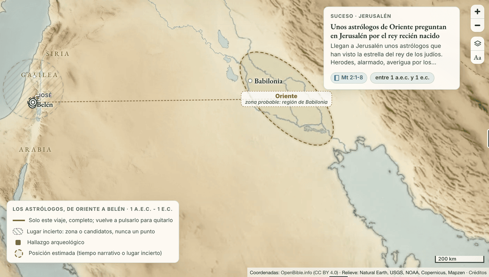
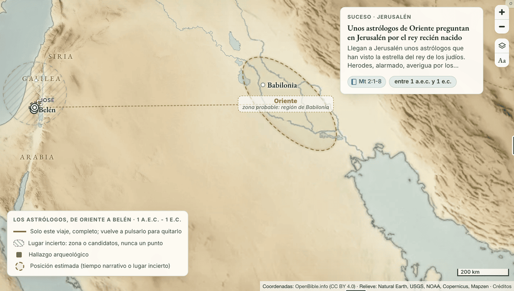
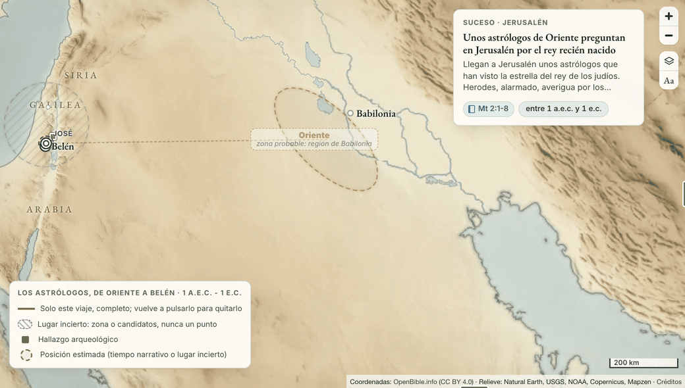
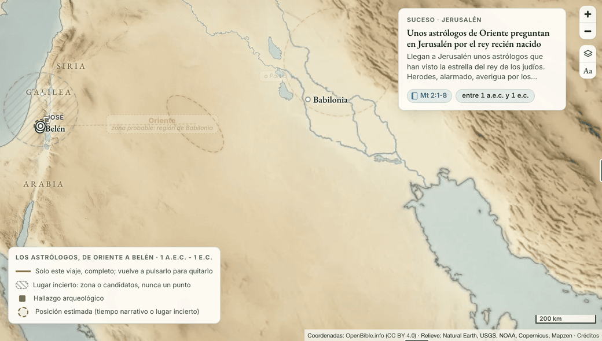
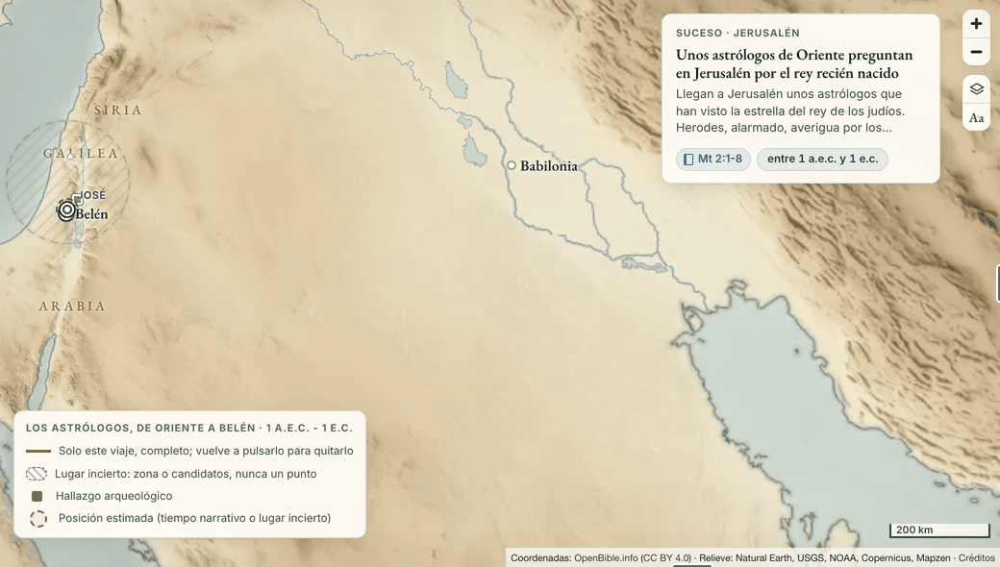

Lo mismo en un teléfono de 430 de ancho:

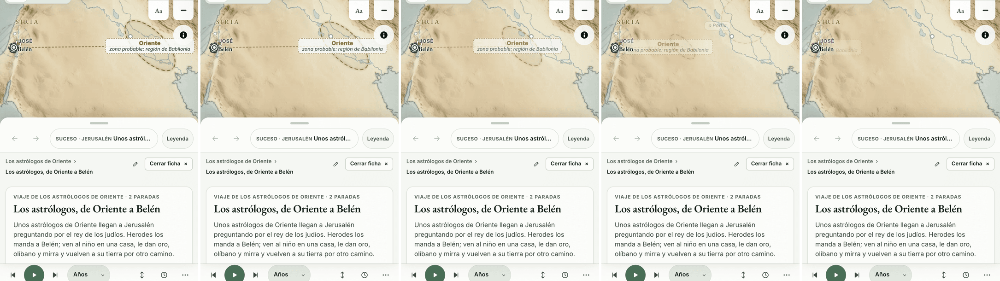

En el modo reunión no hay transición, como en todo el sitio: antes y después de la llegada.

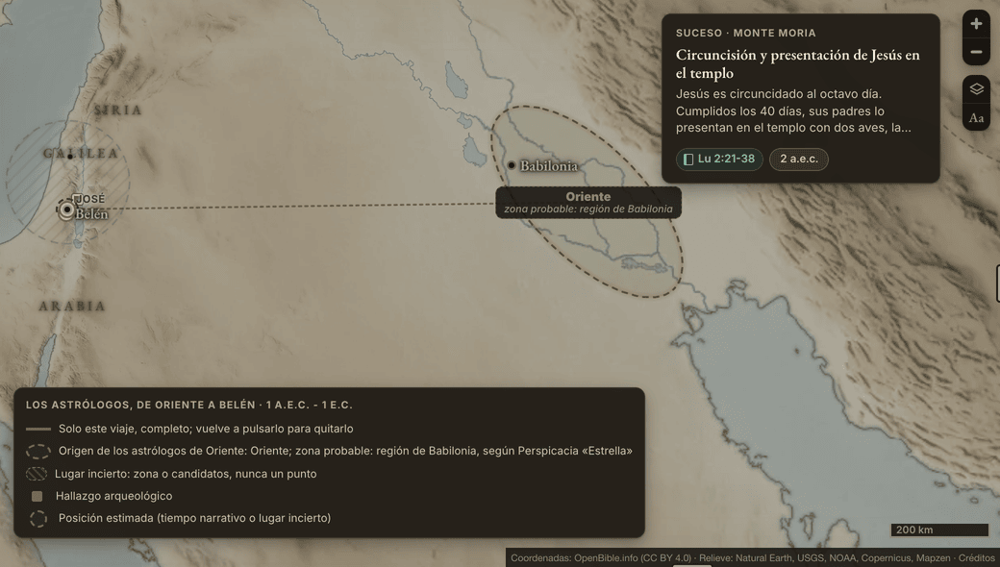
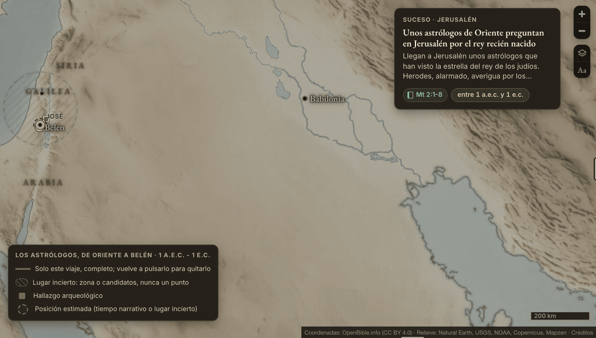

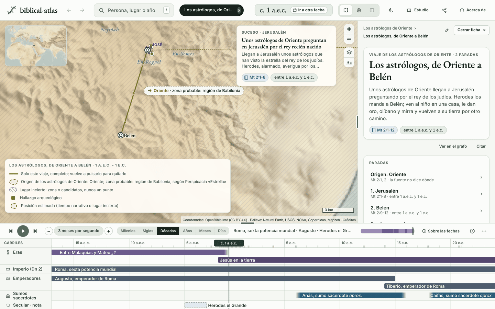
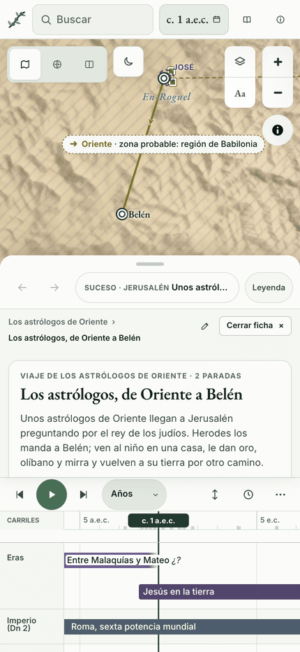
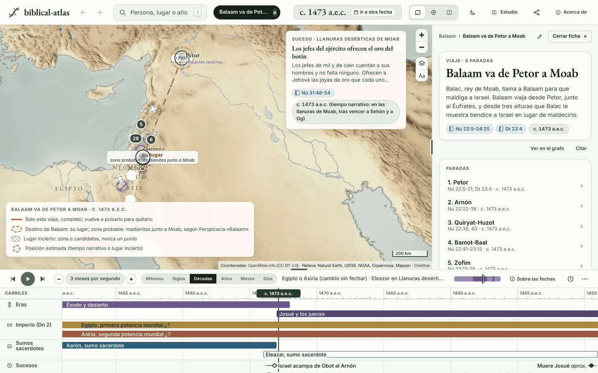
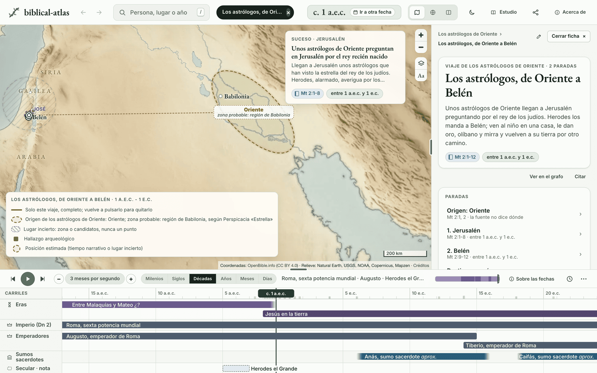
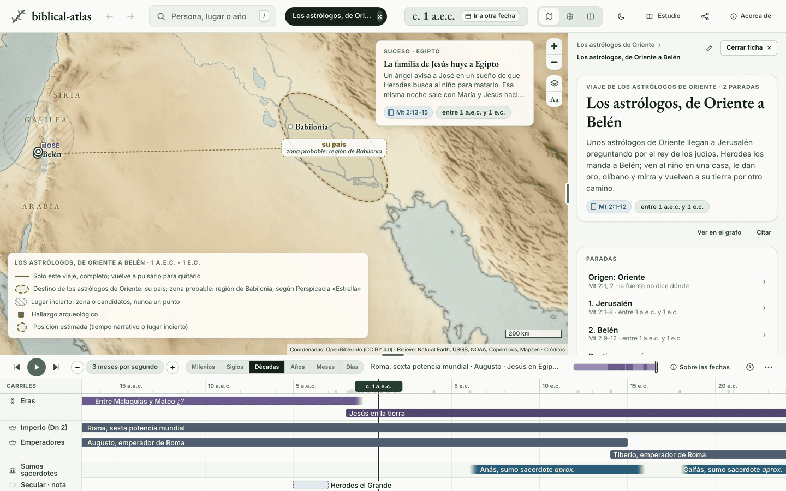
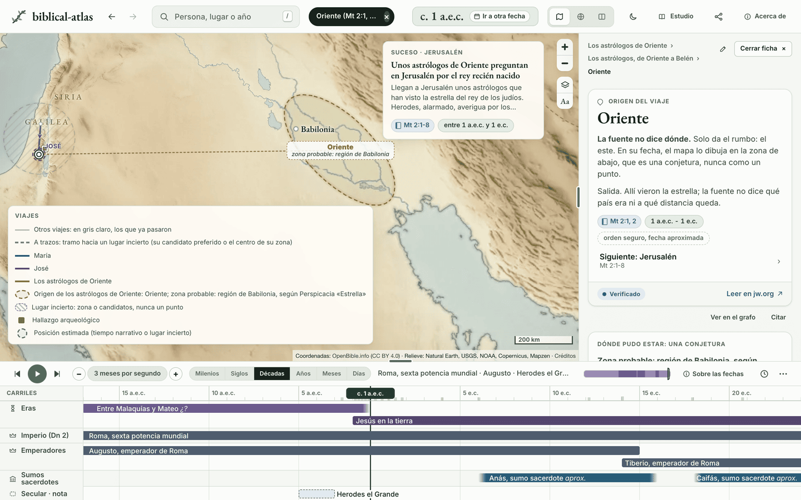
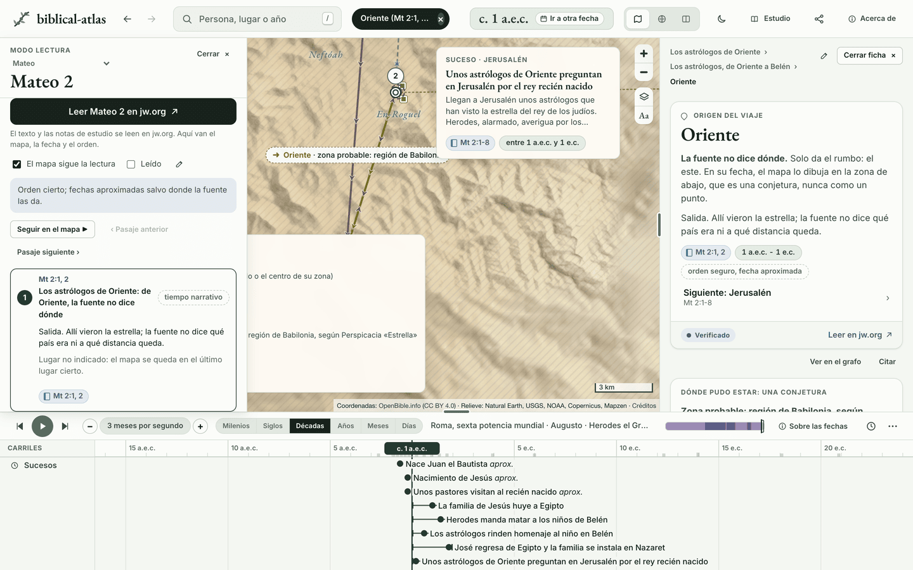
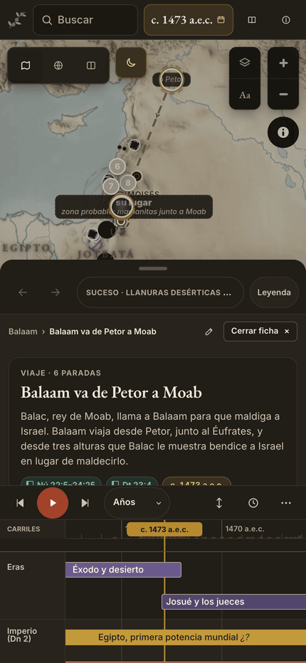

## Lo que queda por decidir

1. **Los viajes de grupo no tienen carril.** Por la decisión 1B de [viajes-modelo.md](viajes-modelo.md), un grupo no lleva marcador ni carril, así que el origen de los astrólogos y el de los 12.000 no tienen marca en la línea de tiempo; sí su ficha, su fila en la ficha del viaje, su pasaje en la lectura y su zona en el mapa. Las áreas de Balaam y de Lot sí van en su carril. ¿Damos a los viajes de grupo un carril propio cuando se eligen?
2. **El modo reunión no anima.** El sitio quita en él todo movimiento, y el área solo cambia de estado. ¿Lo dejamos así o el área es la excepción?
3. **El modo lectura no va a la zona.** Al pisar el pasaje del área, el mapa se queda si la parada vecina ya se ve; la ficha del borde señala la zona.
4. **Vueltas que se saben pero no se dibujan.** La campaña contra Moab, el funcionario etíope y la campaña del norte de Josué podrían llevar una parada deducida y pendiente. Es otra regla, la de las paradas deducidas, y aquí no se toca.
5. **Los trece lugares sin punto ni candidato** se quedan para las fichas de lugar: su conjetura es un candidato de zona, y ninguno es parada de un viaje.
