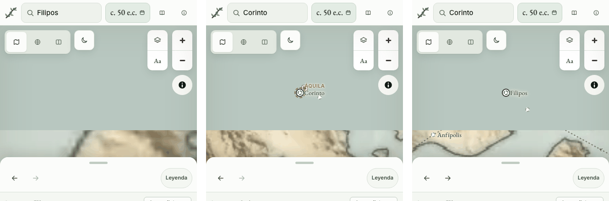
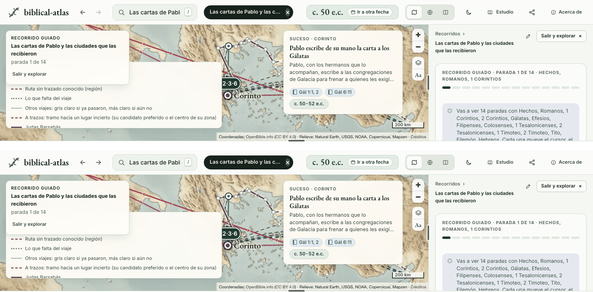
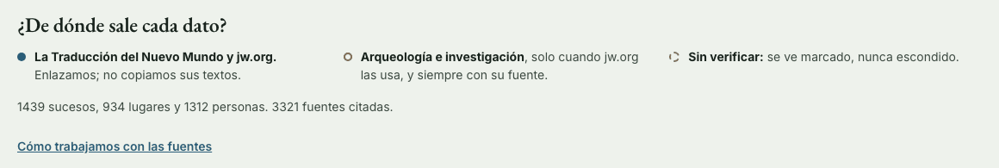

# Atrás y adelante: lo que queda por decidir

Ya están los botones de «atrás» y «adelante», como los del navegador ([atras-adelante.md](atras-adelante.md), opción E). Al usarlos salieron cuatro flecos. El quinto, la cifra de fuentes de la portada, venía de antes. Cada pregunta trae lo que hace hoy el sitio, medido en un navegador real, las opciones con lo que cuestan y lo que recomendamos. Se contesta con letras. No cambia nada de `site/` ni de `data/`.

**Cómo lo medimos.** Chromium sin interfaz en un Mac mini, con `main` en a9cee0ce, los datos compilados con `python3 scripts/build.py` y `site/` servido en local. Medimos en el ordenador a 1440 × 900 y en el teléfono a 430 × 900, con toque. Para la pregunta 2 el mapa carga de verdad. En ninguna sesión hubo errores de consola.

## 1. «Volver al mapa» empieza una visita nueva

**Lo que pasa.** Desde `#t=50.3000` buscamos Pablo y luego Corinto: entrada 2, con «Atrás: Pablo». Pulsamos «Acerca de» y, allí, «Volver al mapa». El mapa vuelve a Corinto, con la fecha y la selección, pero en una visita nueva: entrada 0, Atrás apagado y «No hay nada atrás». `history.length` pasa de 4 a 6. El Atrás del navegador lleva primero a «Acerca de» y, con otro Atrás, al Corinto de antes, que sí tiene «Atrás: Pablo». Con el calendario pasa lo mismo.

**Por qué.** «Volver al mapa» es un enlace a `index.html#<la vista>` ([`acerca.html`](../../site/acerca.html), [`calendario.html`](../../site/calendario.html)). El navegador carga la página de nuevo y crea una entrada sin estado, así que [`visit-history.js`](../../site/js/visit-history.js) empieza otra visita.

**Opciones.**

- **A. `history.back()` cuando la página de antes es el mapa, y el enlace de hoy en los demás casos.** Lo medimos: llamar a `history.back()` en «Acerca de» deja Corinto en la entrada 2, con «Atrás: Pablo», y `history.length` no crece. El enlace se queda para quien abre «Acerca de» con un enlace compartido, para quien llega al calendario desde «Acerca de» y para quien sale desde la portada. Esto último también lo medimos: desde la portada, `history.back()` vuelve a la portada, y el botón promete el mapa. `document.referrer` no distingue los dos casos (en los dos es `index.html`), así que `linea.js`, que ya escribe `?desde=` al salir, añadiría una marca de «salí desde la portada». Cuesta unas diez líneas entre las dos páginas y `linea.js`.
- **B. Llevar la visita en la dirección** (`?desde=…&visita=…&paso=…`). El mapa seguiría la visita en la entrada 3. Pero la entrada de antes en el navegador es «Acerca de», así que el Atrás del sitio llevaría allí, o tendría que saltar dos con `history.go(-2)` y dejaría de coincidir con el del navegador, que es la regla de los botones. Cada ida y vuelta añade dos entradas.
- **C. Dejarlo.** El Atrás del navegador funciona, pero con dos pulsaciones.

**Recomendamos A.** Hace lo que promete «Volver», sin entradas nuevas, y el Atrás del sitio y el del navegador siguen coincidiendo. B arrastra «Acerca de» dentro del historial de la visita.

## 2. ¿Cada entrada recuerda el encuadre del mapa?

**Lo que pasa.** Buscamos Filipos: el mapa la encuadra en zoom 7,5. La movemos a mano hasta zoom 9,5, más al nordeste, y no se crea entrada ni cambia la dirección. Buscamos Corinto, en zoom 8. Al pulsar Atrás vuelve Filipos, pero en zoom 8 y centrada en otro punto. No es lo que dejamos (9,5) ni el encuadre de la primera vez (7,5). En el teléfono, los mismos números. Si se recarga después de mover, el mapa vuelve a 7,5.

**Por qué.** El mapa no está en la entrada. Al volver, el sitio encuadra la selección y `encuadrarLugares` ([`mapa.js`](../../site/js/mapa.js)) conserva el zoom de la vista anterior si pasa de 7,5. Por eso el encuadre al volver depende de la vista desde la que se vuelve.

**Opciones.**

- **A. Dejarlo.** Atrás devuelve la selección y la encuadra.
- **B. La entrada guarda su encuadre en `history.state`, no en la dirección.** Al terminar un movimiento del mapa (`moveend`), el sitio reescribe el estado de la entrada actual con su centro y su zoom. Mover el mapa sigue sin crear entrada. Atrás, Adelante y una recarga devuelven el mapa como se dejó. Un enlace compartido abre como hoy, con el encuadre de la selección, y una entrada sin encuadre guardado (de antes de cargar el mapa) también. Para eso `mapa.js` escribe el encuadre, `base.js` lo aplica al volver en vez de encuadrar la selección y `visit-history.js` conserva el campo, con una prueba en el navegador.
- **C. El encuadre en la dirección** (`&c=lon,lat,zoom`). También lo llevarían los enlaces compartidos, pero la dirección cambia con cada movimiento, y un enlace hecho a 1440 abre en el teléfono con el mismo zoom y quizá sin la selección a la vista. Habría que decidir qué manda cuando la selección y el encuadre no coinciden.
- **D. Mover el mapa crea entrada.** Atrás desharía cada arrastre, la lista se llenaría de entradas con el mismo nombre («Filipos», «Filipos») y la promesa de los botones era recorrer selecciones y vistas, no gestos.

**Recomendamos B.** Atrás devuelve el mapa que se veía, y no cambia qué crea entrada ni qué abre un enlace compartido.

## 3. Un recorrido abierto desde la búsqueda crea dos entradas

**Lo que pasa.** Desde Pablo (entrada 1) buscamos «Las cartas de Pablo y las ciudades» y pulsamos Intro. Salen dos entradas nuevas: `history.length` pasa de 3 a 5 y estamos en la entrada 3, «…, parada 1». El primer Atrás lleva a la entrada 2, el recorrido sin parada, que se ve igual que la parada 1: solo se enciende Adelante. Hace falta un segundo Atrás para volver a Pablo. En el teléfono pasa lo mismo, y también al abrirlo desde un enlace de una ficha. Desde la portada se crea una sola entrada, y un enlace compartido con `paso=4` abre en la parada 4 con una sola.

**Las dos entradas.** Las dos crea `empujar()`, llamado por `revisar()` desde el pintor de `BE.historia` en [`buscar.js`](../../site/js/buscar.js), en dos fotogramas seguidos:

1. En el primer fotograma cambia la selección al recorrido. El pintor del historial corre antes que el de [`recorridos.js`](../../site/js/recorridos.js), porque `buscar.js` se carga antes en `index.html`. El parámetro `paso` todavía no existe, porque solo se escribe cuando `seguirSeleccion` ha puesto `R.id`. Primera entrada, sin parada.
2. En ese mismo fotograma `seguirSeleccion` abre la parada 1. En el siguiente, la vista ya incluye `paso=1` y es distinta de la anterior. Segunda entrada.

Desde la portada no pasa porque `BE.historia.entrar()` deja quieto el historial hasta que la persona vuelve a pulsar.

**Opciones.**

- **A. Una sola entrada.** El parámetro `paso` escribe ya, en cuanto se elige el recorrido, la parada en la que va a abrir: la de la dirección, la guardada o la 1. Lo probamos en una copia: una entrada, Atrás vuelve a Pablo en el ordenador y en el teléfono, y el enlace con `paso=4` sigue abriendo en la parada 4. Es una línea en `recorridos.js` y un caso en [`tests/site/historia.test.mjs`](../../tests/site/historia.test.mjs).
- **B. Dejarlo.**

**Recomendamos A.** Es un fallo: una entrada que se ve igual que la siguiente no lleva a ninguna parte.

## 4. Tras Atrás, soltar una marca de la línea cuesta dos clics

**Lo que pasa.** En `#t=50.5&v=8`, en el ordenador, pulsamos Galión (entrada 1) y luego «Segundo viaje misional» (entrada 2). Atrás devuelve Galión, con el cursor en 51,7527. Un clic en Galión no cambia nada: ni la selección, ni el cursor, ni el historial. Hace falta un segundo clic para soltarla. En el teléfono, con «La congregación cristiana» y «Roma, sexta potencia mundial», el primer toque tras Atrás solo mueve el cursor al punto tocado (de 50,1761 a 49,8522), y el segundo la suelta. Sin Atrás, el segundo clic suelta, como pide la [PR #97](https://github.com/GeiserX/biblical-atlas/pull/97).

**La causa.** La PR #97 hace que un segundo clic en la misma marca la suelte. Para eso [`linea.js`](../../site/js/linea.js) recuerda la última marca pulsada (`lastClicked`), y una selección que llega de otro sitio la olvida: `if (!desdeFranja) lastClicked = null`. Atrás, de la [PR #94](https://github.com/GeiserX/biblical-atlas/pull/94), vuelve a poner la selección desde la dirección, así que para la línea llega de otro sitio. El primer clic solo «lleva el cursor a la marca» (`nextSel` en [`linea-filas.js`](../../site/js/linea-filas.js)), y en el ordenador el cursor ya estaba dentro.

**Es un fallo y no pide decisión.** Atrás tiene que devolver la entrada como se dejó, y en ella esa marca era la última pulsada. El arreglo es que cada entrada recuerde qué marca se pulsó, y que Atrás y Adelante se lo devuelvan a la línea. Una selección que llega de la búsqueda, del mapa o de un enlace sigue la regla de la PR #97. Lo probamos en una copia, recordando la marca solo al volver con Atrás o Adelante: el primer clic tras Atrás suelta, en el ordenador y en el teléfono.

Aparte queda un caso parecido que sí es una decisión, y no la planteamos aquí: Galión elegido desde la búsqueda también necesita dos clics para soltarse, y el primero no hace nada porque el cursor ya está dentro. Es la regla de la PR #97 tal como se escribió.

## 5. «3321 fuentes citadas» en la portada

**Lo que pasa.** La portada dice, bajo «¿De dónde sale cada dato?»: «1439 sucesos, 934 lugares y 1312 personas. 3321 fuentes citadas.» Es la misma cifra que el sitio publicado hoy.

**Qué cuenta.** [`portada.js`](../../site/js/portada.js) (`pintarDatos`) cuenta todas las claves de `D.fuentes`. [`scripts/build.py`](../../scripts/build.py), al cargar los datos, añade una fuente por cada capítulo de la Biblia citado como `<libro>-<capítulo>` que nadie ha escrito (`fuente_capitulo`, con `implicita: true`). La insignia «fuentes» del [README](../../README.md) lee la misma cifra en `site/stats.json`.

**Las cifras de hoy:**

| Qué | Cuántas |
|---|---|
| Entradas en `D.fuentes`, lo que dice la portada | 3321 |
| Escritas en `data/sources/` | 2487 |
| Escritas que algún dato cita | 2463 |
| Escritas que nada cita | 24 |
| Capítulos de la Biblia que añade `build.py` (de 1189) | 834 |
| Obras distintas entre las escritas (2125 artículos son de *Perspicacia*) | 56 |
| Referencias bíblicas distintas en los datos, como «Gé 2:7, 8» | 3247 |
| Citas: pares de dato y fuente en la base SQLite (5034 datos) | 23.982 |

Así que «citadas» no es exacto: 24 no las cita nadie. Y 834 de las 3321 son capítulos que el sitio enlaza solo, no fuentes que hayamos escrito. La [PR #81](https://github.com/GeiserX/biblical-atlas/pull/81) ya lo dejó anotado: entonces eran 3027 en total y 2295 escritas.

**Opciones.**

- **A. Solo lo escrito:** «2463 fuentes de jw.org». Los capítulos de la Biblia dejan de contar.
- **B. Las dos cosas:** «2463 páginas de jw.org y 834 capítulos de la Biblia».
- **C. Los pasajes:** «3247 pasajes de la Biblia citados». Es lo más concreto para quien lee, pero deja fuera *Perspicacia* y las demás obras.
- **D. Las citas:** «23.982 citas». Es la cifra más alta, pero cuenta enlaces, no fuentes.
- **E. Como hoy, contando bien:** «3297 fuentes citadas». Solo quita las 24 que nada cita.

Cualquier opción cambia dos líneas de `portada.js` y lo que `build.py` escribe en `stats.json`, para que la insignia del README diga lo mismo que la portada.

**Recomendamos B.** Responde a «¿De dónde sale cada dato?» con lo que de verdad hay detrás, y las dos cifras son exactas. Salen de un campo que ya existe, `implicita`.

## Lo que tocaría cada opción recomendada

- **1A:** `site/acerca.html`, `site/calendario.html` y la marca de la portada en `site/js/linea.js`.
- **2B:** `site/js/mapa.js`, `site/js/base.js`, `site/js/visit-history.js` y una prueba en `tests/site/historia.test.mjs`.
- **3A:** una línea de `site/js/recorridos.js` y un caso en `tests/site/historia.test.mjs`.
- **4:** `site/js/linea.js` y `site/js/buscar.js`, con un caso en `tests/site/timeline-marks.test.mjs`.
- **5B:** `site/js/portada.js` y el resumen de `scripts/build.py`.

Nada de esto toca `data/`.
