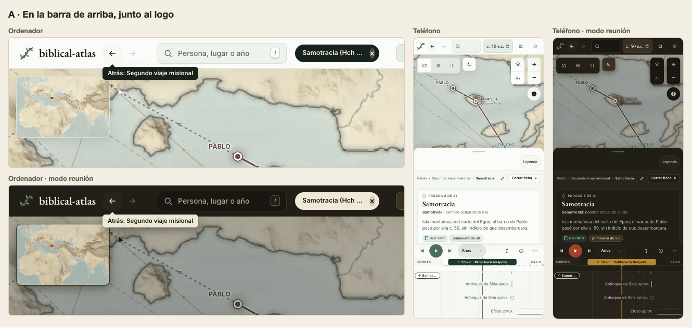
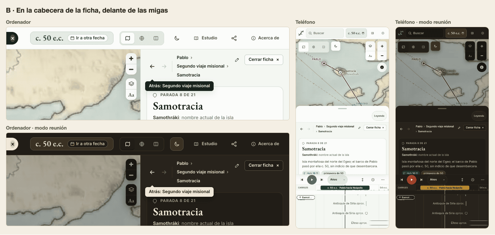
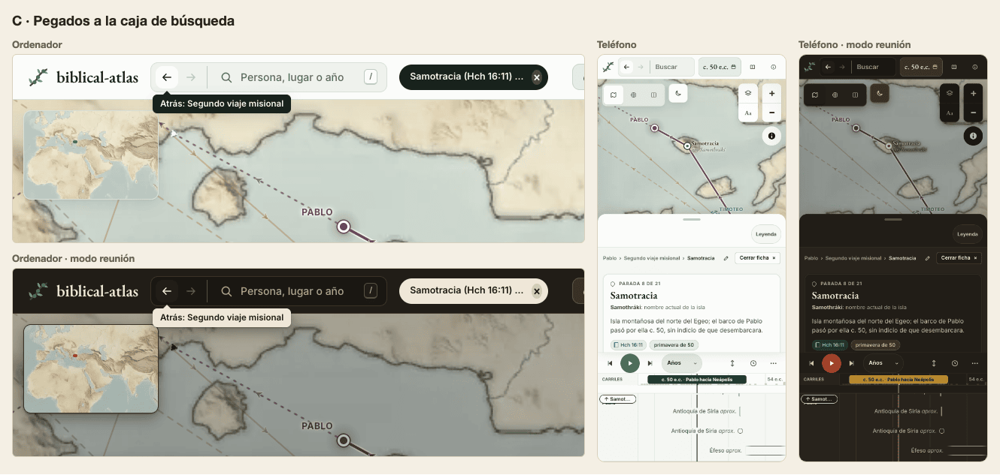
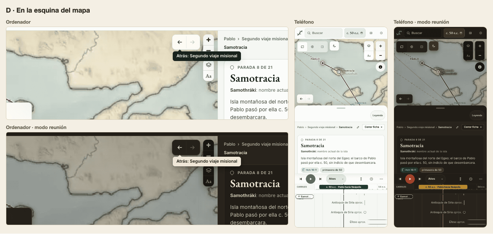
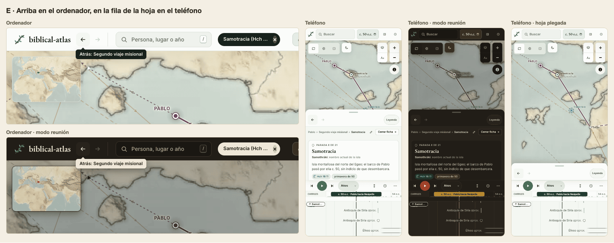

# Atrás y adelante: dónde ponerlos

Lo que se pidió: cuando pulsas algo, tener un botón de «atrás» y otro de «adelante», como los del navegador. Este documento dice qué recorren, propone cinco sitios con su maqueta sobre el sitio de verdad y recomienda uno. No cambia nada de `site/`.

## Qué hace hoy Atrás

El sitio ya escribe historial de verdad. Cada vista nueva es una entrada del navegador, y de eso se encarga `BE.historia` en [`site/js/buscar.js`](../../site/js/buscar.js). Lo medimos en un navegador real.

**Crea una entrada:**

- abrir una ficha desde el mapa, la línea, una relación de otra ficha, una miga o un resultado de búsqueda;
- quitarla, con Esc, con «Cerrar ficha» o con un segundo clic en su marca de la línea;
- un año buscado, como «607 a.e.c.», o elegido en «Ir a otra fecha»;
- abrir o mover el grafo, la conexión, la lectura, un recorrido o la portada;
- cada pasaje de la lectura y cada parada de un recorrido.

**No crea entrada:**

- mover o ampliar el mapa, arrastrar o ampliar la línea y reproducir;
- «Suceso anterior» y «Suceso siguiente», y las flechas;
- el mapa antiguo, el actual o la cortina, y las capas;
- «Ahora mismo» y la sincronía.

Lo que no crea entrada se queda en la entrada en la que estás. Un ejemplo medido: Pablo, luego Jerusalén desde su ficha, luego Corinto desde la búsqueda, luego el mapa actual y Esc. Atrás pasa por Corinto, Jerusalén y Pablo. Al llegar a Jerusalén el mapa vuelve a ser el antiguo.

**Lo que sorprende hoy:**

1. **Alt + ← y ⌘ + ← no van atrás.** El sitio las toma como «mover el cursor un paso» y anula el atajo del navegador, porque el manejador de `keydown` de [`site/js/base.js`](../../site/js/base.js) no mira Alt ni ⌘. Lo medimos: el cursor pasa de 50,3 a 50,1 y la tecla queda anulada.
2. **Desde la primera vista, Atrás sale del sitio**, a la página anterior o a la pestaña vacía.
3. **«Ahora mismo» no tiene entrada**, aunque el grafo y la lectura sí. Atrás lo cierra y, en el mismo paso, vuelve a la vista anterior.
4. **La lista del navegador no sirve.** La pulsación larga en su flecha enseña la lista de entradas, pero todas dicen lo mismo: el título de la pestaña no cambia nunca.

## Qué recorren atrás y adelante

Los botones recorren las mismas entradas que el navegador: selecciones y vistas, no cada arrastre ni cada cambio de zoom. Llaman a `history.back()` y `history.forward()`, así que el botón del sitio y el del navegador nunca discrepan.

Proponemos un solo cambio en lo que crea entrada. «Ahora mismo» y la sincronía de [`site/js/ahora.js`](../../site/js/ahora.js) pasan a tener la suya, como el grafo y la lectura. El mapa base y las capas siguen sin entrada: son maneras de mirar, no sitios a los que se va, y comparar el mapa antiguo con el actual llenaría el historial.

## Cinco sitios

Cada imagen enseña el ordenador a 1440 × 900 y el teléfono a 430 de ancho, con el tema claro y el modo reunión. El recorrido de ejemplo es Pablo › Segundo viaje misional › Samotracia. Atrás está activo y su rótulo dice «Atrás: Segundo viaje misional». Adelante está apagado.

### A. En la barra de arriba, junto al logo

Donde las tiene el navegador, y se ven en todas las vistas. En el ordenador la búsqueda pierde 65 px de 315. En el teléfono es caro: la caja baja de 176 a menos de 100 px, pierde la palabra «Buscar» y se queda en la lupa.

### B. En la cabecera de la ficha, delante de las migas

Junto a donde caen casi todos los clics. Las migas pasan de dos líneas a tres en el ordenador y de una a dos en el teléfono. Con la hoja plegada en el teléfono no se ven.

### C. Pegados a la caja de búsqueda

Buscar es seleccionar, así que la caja es el sitio de «ir a». El texto que se escribe pierde 79 px en el ordenador y 51 en el teléfono. Desaparecen con la búsqueda en el modo presentación de un recorrido.

### D. En la esquina del mapa

No quita sitio a nada fijo. Tapa un trozo de mapa, se mezcla con el zoom y las capas, y choca con el grafo y la conexión, que ocupan el mapa entero.

### E. Arriba en el ordenador, en la fila de la hoja en el teléfono

En el ordenador es A. En el teléfono van en la fila de la hoja, a la izquierda de «Leyenda», en un hueco que hoy está vacío. Esa fila se ve también con la hoja plegada y queda al alcance del pulgar. Cuando sale la tira del suceso de esta fecha, la tira se acorta lo que miden los dos botones.

**Descartados.** En la barra de la línea de tiempo ya están «Suceso anterior» y «Suceso siguiente», y dos pares de flechas juntos se confunden. Alrededor del resaltado «Samotracia ×» de la barra tampoco: en el teléfono no existe.

## Lo que comparten todas

- **Apagados cuando no hay adónde ir.** Atrás se apaga en la primera vista de la visita: no saca del sitio, y para salir queda el del navegador. Adelante se apaga hasta que se vuelve atrás.
- **El rótulo dice adónde.** «Atrás: Samotracia», «Adelante: Neápolis». El nombre sale de la vista de destino. Puede ser el de la ficha, «la portada», «Lectura de Hechos 16, pasaje 3», «Grafo de Pablo» o «De Babilonia a Jerusalén, parada 4». Sin nada elegido es la fecha, «El mapa en c. 50 e.c.». Apagados dicen «No hay nada atrás» y «No hay nada adelante».
- **Cómo sabe el nombre.** El navegador no deja leer las entradas vecinas. Cada entrada guarda su número en `history.state`, y el sitio guarda en `sessionStorage` la dirección de cada número de esta pestaña. Para eso `base.js` y [`site/js/portada.js`](../../site/js/portada.js) deben conservar `history.state` al reescribir la dirección. Hoy lo ponen a `null`.
- **Teclado.** El sitio no añade teclas. Alt + ← y Alt + → en Windows y Linux, y ⌘ + ←, ⌘ + →, ⌘ + [ y ⌘ + ] en el Mac, son del navegador. Vuelven a funcionar cuando `base.js` deje pasar las flechas con Alt, ⌘ o Ctrl. Las flechas solas siguen moviendo el cursor.
- **Sin menú propio de sitios recientes.** El navegador ya lo tiene, con la pulsación larga o el clic derecho en su flecha. Basta con que el título de la pestaña diga dónde estás, por ejemplo «Samotracia · biblical-atlas». Así sirve también en los marcadores y en el historial.
- **En la portada no se ven**, porque la portada tapa el sitio. Si se entró por ella, Atrás vuelve a ella con el rótulo «Atrás: la portada».
- **Modo reunión y letra grande.** Llevan los colores de los otros botones de icono de la barra. Con la letra grande no cambian, como los demás iconos. Con el dedo medirán 44 × 44 px, como pide [`site/css/tactil.css`](../../site/css/tactil.css).
- **Accesibilidad.** Son dos `<button>` dentro de un grupo con `aria-label="Historial de la visita"`. Cada uno lleva en `aria-label` y en `title` el mismo rótulo, y `disabled` cuando está apagado. En el orden del tabulador van después del logo y antes de la búsqueda. Tras pulsar, el foco se queda en el botón y el anuncio que ya existe para lectores de pantalla dice la vista nueva.

## Qué recomendamos

**E.** En el ordenador las flechas van donde la mano ya las busca, como en el navegador, y siguen a la vista en todas las vistas de estudio. En el teléfono A le quitaría a la búsqueda su palabra, mientras que la fila de la hoja tiene el hueco, se ve con la hoja plegada y queda al alcance del pulgar.

**Lo que tocaría la construcción:**

- [`site/index.html`](../../site/index.html) y [`site/css/base.css`](../../site/css/base.css) llevan el par de botones en la barra y en la fila de la hoja. Una regla por ancho enseña uno de los dos.
- En `site/js/buscar.js`, `BE.historia` numera cada entrada, guarda la lista de la pestaña, pone nombre a cada vista y enciende, apaga y rotula los botones.
- `site/js/base.js` conserva `history.state` al escribir la dirección, deja pasar las flechas con Alt, ⌘ o Ctrl y pone el título de la pestaña de cada vista.
- `site/js/portada.js` conserva `history.state` al entrar.
- `site/js/ahora.js` da su entrada a «Ahora mismo» y a la sincronía.
- Un `tests/site/historia.test.mjs` nuevo prueba en un navegador real, como [`landing.test.mjs`](../../tests/site/landing.test.mjs), una entrada por acción, los rótulos y los botones apagados. Comprueba también que el botón del sitio y el del navegador llegan al mismo sitio y que Alt + ← no mueve el cursor. `landing.test.mjs` sigue pasando sin cambios.

**Lo que no toca:** `linea.js`, `mapa.js`, `grafo.js`, `lectura.js`, `recorridos.js` ni `data/`.

## Cómo se hicieron las maquetas

Son capturas del sitio de `main` servido en local, con los dos botones añadidos encima. Llevan el estilo de los botones de icono de la barra y sus colores en los dos temas. El rótulo negro imita el `title` que enseña el navegador al pasar el ratón.
