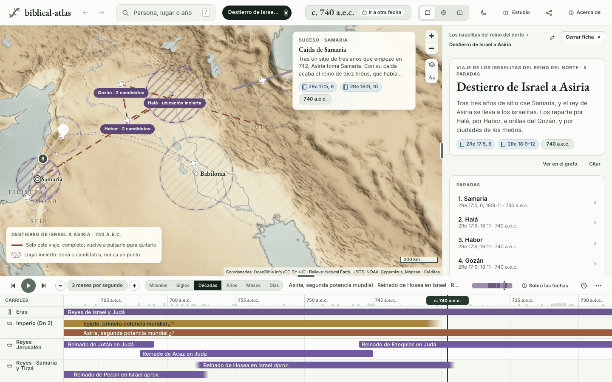
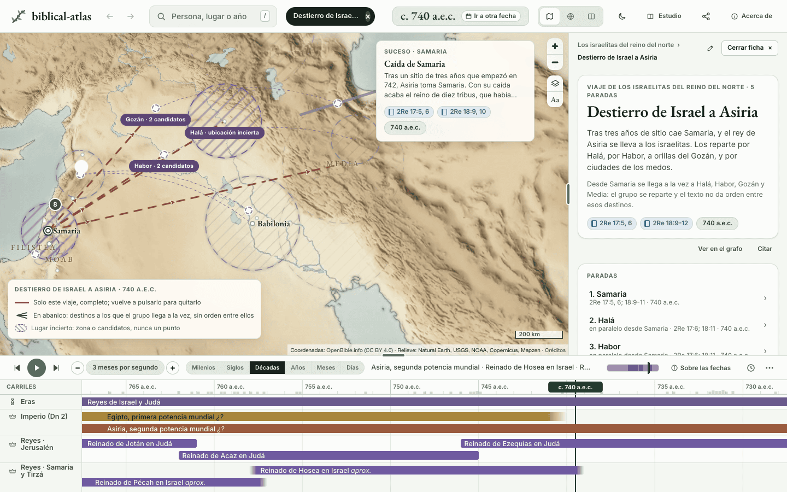
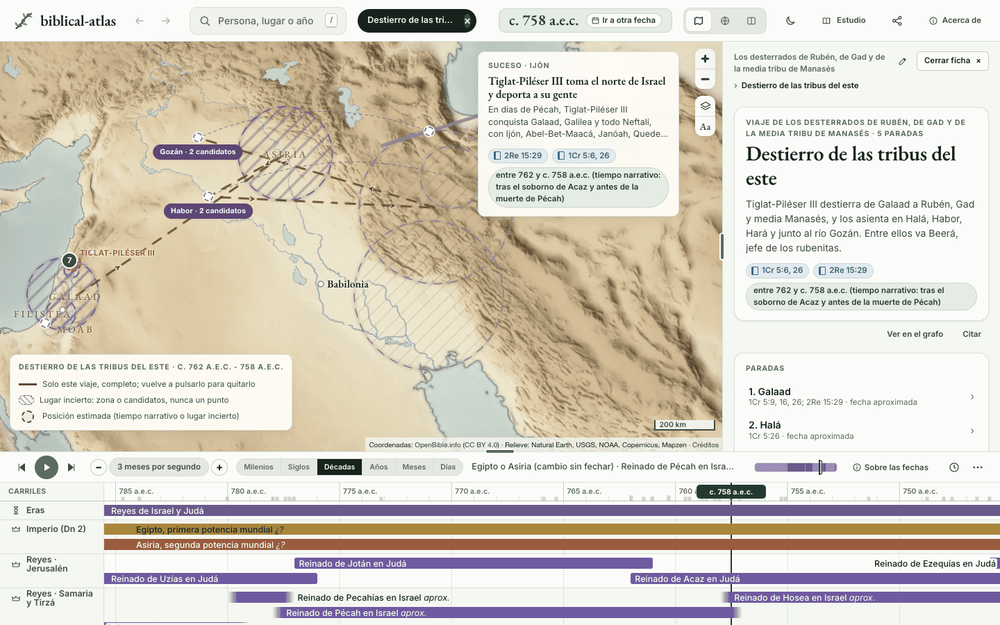
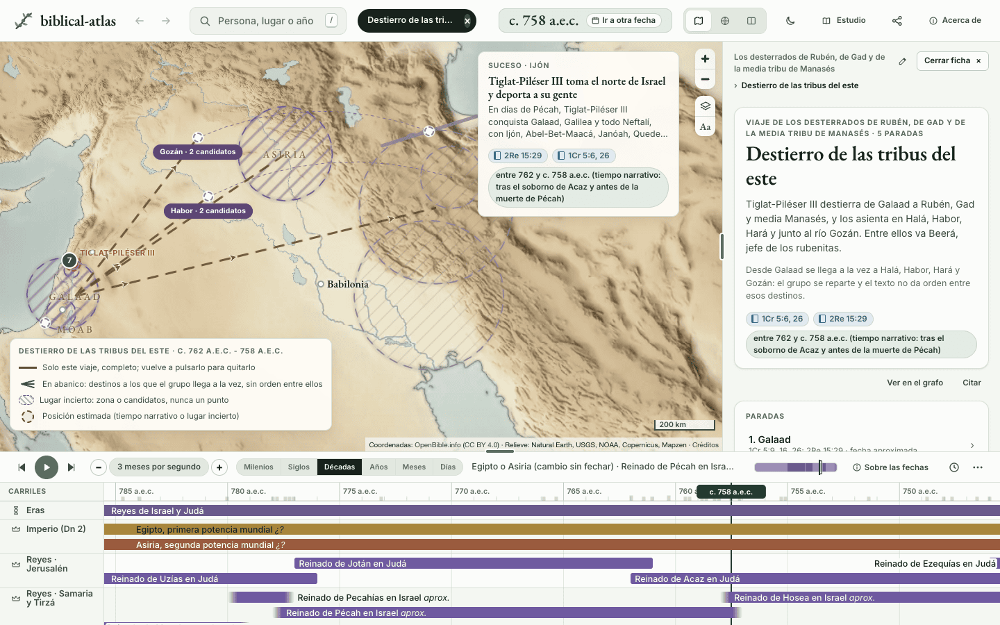
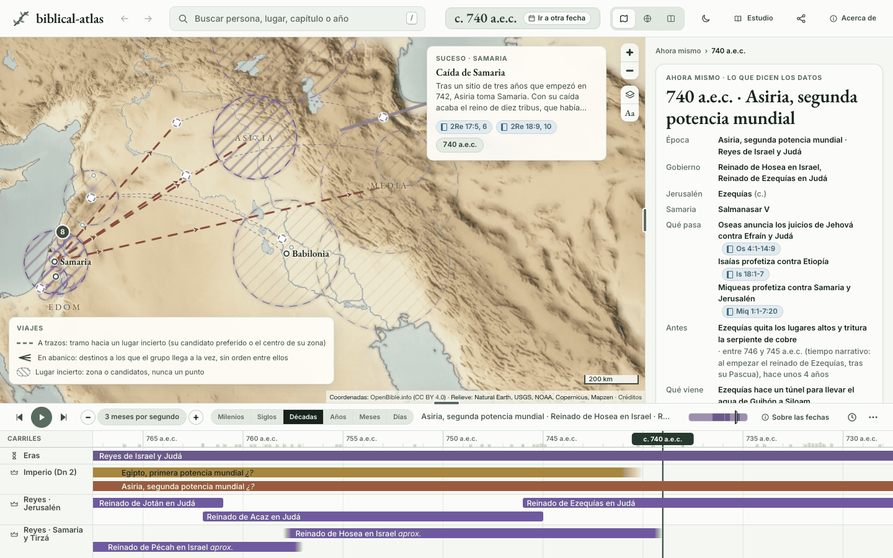
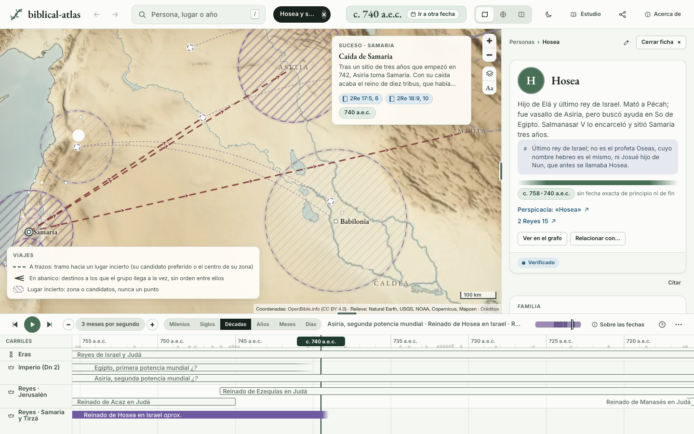
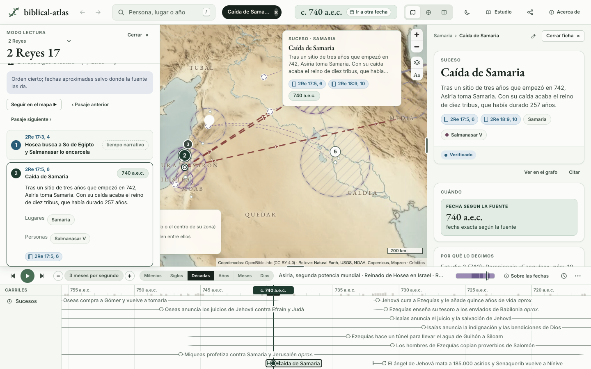
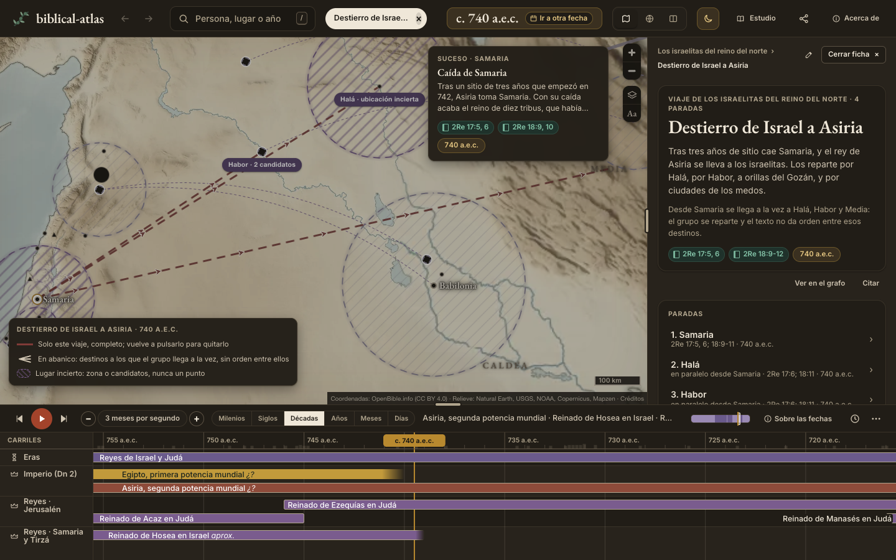
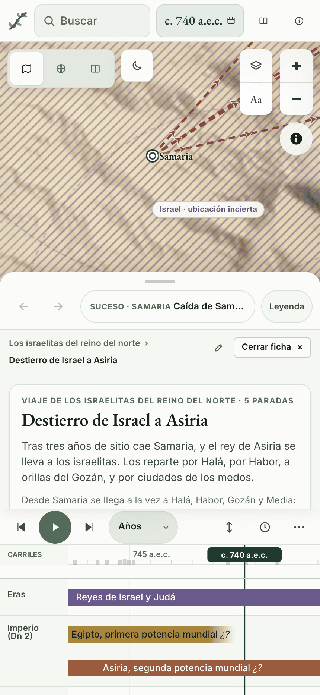

# Destinos en paralelo

Un viaje es una lista de paradas en orden, y el mapa las une en ese orden. En dos viajes las últimas paradas no son etapas, sino destinos: el rey de Asiria reparte a los desterrados de Israel por Halá, por Habor junto al río Gozán y por las ciudades de los medos (2Re 17:6; 18:11), y Tiglat-Piléser lleva a las tribus del este a Halá, Habor, Hará y el río Gozán (1Cr 5:26). Antes, el sitio dibujaba una ruta de Halá a Habor, de Habor al Gozán y del Gozán a Media, un orden que el texto no da.

## Lo que decidimos

**Una clave opcional en la parada, `branches_from`,** con el `order` de la parada de la que se sale. Las paradas que la nombran son destinos a los que se llega a la vez, sin orden entre ellos. Una parada sin la clave sigue, como siempre, a la anterior que no la lleva. Un viaje sin `branches_from` no cambia en nada: dibujamos todos los viajes antes y después del cambio y salen iguales. El esquema completo está en el [README de la investigación](../investigacion/README.md).

```yaml
- order: 1
  place: samaria
- order: 2
  place: hala
  branches_from: 1
- order: 3
  place: habor
  branches_from: 1
```

**Solo en un viaje de grupo.** Un grupo se reparte; una persona no llega a dos sitios a la vez. Por eso ningún marcador avanza por una de las ramas. Un grupo no lleva marcador, y [`validate.py`](../../scripts/validate.py) rechaza la clave en el viaje de una persona.

**Reglas de `validate.py`:**

- la parada nombrada existe, es del mismo viaje y es anterior, así que no puede haber ciclos;
- no es a su vez un destino en paralelo, porque ningún texto pide hoy una cadena de ramas;
- de ella salen al menos dos caminos, contando la parada que sigue en la línea; si sale uno solo, la clave no dice nada;
- un acompañante con tramo `{person, from, to}` va en la ruta de `from` a `to`, que sigue una sola rama. Ir de Samaria a Habor son las paradas 1 y 3, no la 2. Sus tramos van todos por la misma ruta: nadie va a Halá y a Habor. Nadie va en todo un viaje con destinos en paralelo, porque estaría en todos a la vez.

**En `data.json`**, que escribe [`build.py`](../../scripts/build.py), cada parada conserva `orden` y `lugar`, que leen el sitio y el servidor MCP del atlas, y la clave nueva va aparte, con su nombre en inglés. La SQLite la guarda en la columna `branches_from` de `paradas`.

## En el sitio

Las pruebas de cada regla están en [`tests/site/destinos-paralelos.test.mjs`](../../tests/site/destinos-paralelos.test.mjs), y la comparación de antes y después en [`tests/site/comparar-rutas.mjs`](../../tests/site/comparar-rutas.mjs).

- **El mapa** dibuja un trazo de la parada de salida a cada destino y ninguno entre dos destinos. Cada trazo sigue las reglas de cualquier ruta. Va a trazos si toca un lugar sin punto propio (su candidato preferido o el centro de su zona), de puntos si toca una parada pendiente, con flechas hacia el destino y en gris el año siguiente. Un destino sin dónde dibujarse no lleva trazo. Si la parada de salida no tiene punto, el trazo sale de la última parada anterior que lo tiene.
- **La leyenda** añade la fila «En abanico: destinos a los que el grupo llega a la vez, sin orden entre ellos».
- **La línea de tiempo** pone los destinos de una misma salida en el mismo momento, después de la salida. La ventana en que el mapa dibuja el viaje va de la salida a ese momento.
- **La ficha del viaje** dice «Desde Samaria se llega a la vez a Halá, Habor y Media», y la fila de cada destino dice «en paralelo desde Samaria».
- **La ficha de cada destino** cambia «Parada 3 de 4» por «Destino en paralelo desde Samaria» y repite la frase.
- **El modo lectura** dibuja el abanico, nunca una línea entre destinos, y Atrás y Adelante devuelven un destino como cualquier otra parada.

## Capturas

El destierro de Israel en 740 a.e.c., con el viaje elegido, antes y después:

| Antes | Después |
|---|---|
|  |  |

El destierro de las tribus del este, antes y después:

| Antes | Después |
|---|---|
|  |  |

Sin nada elegido, con Hosea elegido y en el modo lectura de 2 Reyes 17:

| Nada elegido | Hosea elegido | Modo lectura |
|---|---|---|
|  |  |  |

Tema oscuro y móvil, y la ficha de Habor tras pulsar Atrás:

| Oscuro | Móvil | Atrás, móvil y oscuro |
|---|---|---|
|  |  |  |

## Otros viajes que miramos

Buscamos en `data/journeys` grupos que se dividen, mensajeros enviados a varios sitios y listas de ciudades sin orden. Solo los dos destierros dan destinos en paralelo con claridad:

- **Los correos de Ezequías** (2Cr 30:6-10) van «de ciudad en ciudad» por Efraín y Manasés hasta Zabulón: es un recorrido, no un reparto. Se queda como está.
- **El censo de David** (2Sa 24:5-8) da su recorrido en orden, de Aroer a Beer-seba, y la vuelta a Jerusalén. Se queda como está.
- **Judá y Simeón contra los cananeos** (Jue 1) cuenta una campaña, una ciudad tras otra. Se queda como está.
- **Los simeonitas** (1Cr 4:39-43) se dividen: unos van a Guedor y quinientos al monte Seir. Ya son dos viajes, cada uno con su jefe.
- **La campaña de Tiglat-Piléser III** (2Re 15:29) nombra las ciudades que toma. Es el viaje de una persona y sigue el orden de sus sucesos. Se queda como está.
- **La campaña de Senaquerib** (2Re 18:17; 19:8): desde Lakís manda al Rabsaqué a Jerusalén mientras él sigue a Libna. Jerusalén no es hoy una parada del viaje.
