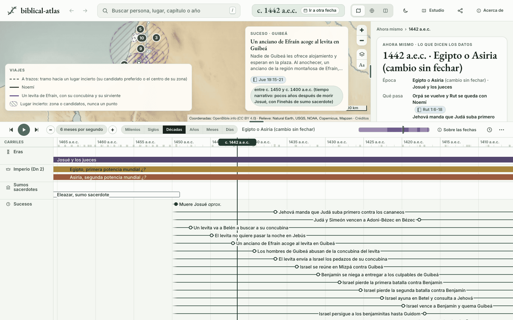
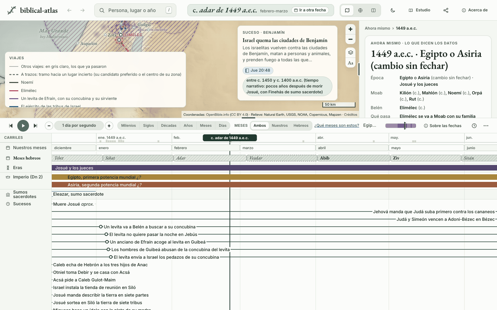
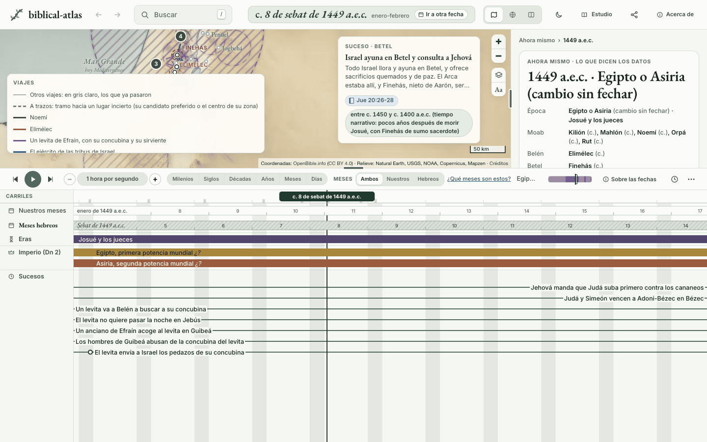
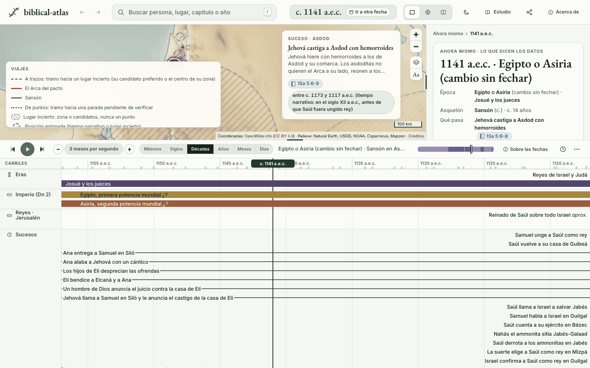
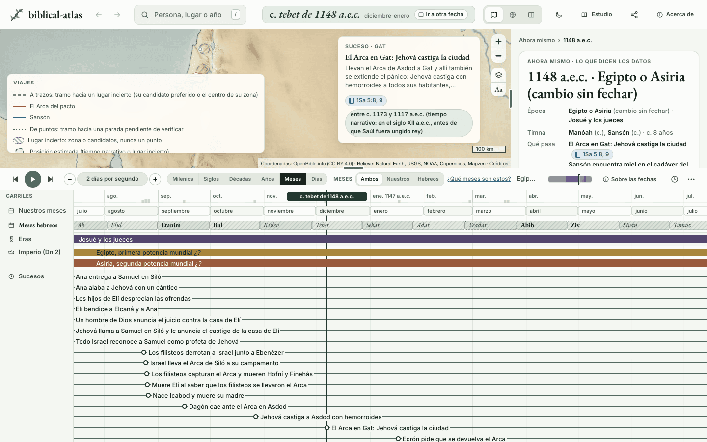

# Relatos de días repartidos por decenios

En la línea de tiempo, relatos que el texto cuenta en días o meses ocupaban decenios. El levita de Jueces 19 viajaba durante 17 años, la guerra contra Benjamín duraba 36 y el Arca pasaba 28 años entre Siló y Quiryat-Jearim, aunque 1 Samuel 6:1 dice que estuvo siete meses en Filistea. Como un viaje se dibuja mientras duran sus paradas y las paradas siguen a sus sucesos, el error salía también en el mapa.

## De dónde salía

Un suceso con `narrative_order` y una fecha de años (un tramo sin anclar) no tiene sitio propio en la línea: `repartoRelato` (`site/js/trayectorias.js`) junta los de una serie que van entre dos anclas y `colocar` los reparte por igual en el tramo libre. Jueces 19 a 21 son 18 sucesos con la misma fecha, «entre c. 1450 y c. 1400 a.e.c.», que Perspicacia («Jueces, Libro de», «Orden del libro») sitúa poco después de morir Josué. Repartidos por igual, cada uno se lleva 2,8 años, y el relato entero, 50.

El reparto no sabe qué sucesos cuenta el texto seguidos. Para él, Jueces 19 a 21 es lo mismo que Jueces 2 a 11, que sí abarca siglos.

Con Epafras pasaba otra cosa. Su parada de Colosas, fechada c. 59-61, cuenta el mismo versículo que el suceso «Epafras da a conocer las buenas noticias en Colosas», de tiempo narrativo entre 33 y 61, y la parada tomaba la ventana entera de ese suceso: de 33 a 61.

## Los casos peores

`node scripts/relato_spans.mjs` corre el código del sitio sobre los datos compilados y lista cuánto ocupa cada tanda de una serie (sucesos seguidos con la misma fecha sin anclar) y cada viaje. Antes del cambio, los más largos:

| Años | Qué | Lo que dice el texto |
|---:|---|---|
| 183,3 | Jueces 2 a 11 (49 sucesos) | Siglos de jueces; abarcarlos es correcto |
| 173,0 | Rut 1 a 4 (7) | Unos diez años en Moab (Rut 1:4) y después una cosecha |
| 63,6 | Viaje: campaña de Gedeón | Una noche y la persecución que sigue (Jue 7 y 8) |
| 54,4 | Viaje: Noemí vuelve a Belén | Un viaje |
| 53,7 | Viaje: Judá y Simeón contra los cananeos | Una campaña |
| 50,0 | Jueces 19 a 21 (18) | Cinco días en Belén, una noche en Guibeá, tres días de guerra y cuatro meses en Rimón |
| 39,8 | 1 Samuel 3 a 7 (17) | Siete meses en Filistea (6:1) y veinte años en Quiryat-Jearim (7:2) |
| 39,5 | Viaje: huida de Moisés a Madián | La huida; la parada en Madián tomaba los 40 años que vivió allí |
| 36,1 | Viaje: Israel contra Benjamín | Tres días de batalla (Jue 20:22-30) y cuatro meses (20:47) |
| 28,5 | Viaje: Epafras a Roma | Un viaje dentro del primer encierro de Pablo, c. 59-61 |
| 28,1 | Viaje: el Arca, de Siló a Quiryat-Jearim | Siete meses en Filistea |
| 19,4 | Viaje: los 600 benjaminitas | Cuatro meses en el peñasco (Jue 20:47) |
| 17,2 | Viaje: Jesús a los 12 años en la Pascua | Un viaje; la parada de Nazaret tomaba los 17 años de Lucas 2:51 |
| 16,7 | Viaje: el levita y su concubina | Unos seis días |

Lo que dicen las fuentes de los tres casos medidos:

- **Jueces 19 a 21.** El suegro retiene al levita tres días, un cuarto y lo deja salir de tarde el quinto (19:4-10); llegan a Guibeá al ponerse el sol y esa noche ocurre el crimen (19:14-26). Israel lucha «el segundo día» (20:24) y vence «el tercer día» (20:30), después de que Jehová prometiera la victoria «mañana» (20:28). Los 600 pasan cuatro meses en el peñasco de Rimón (20:47) y vuelven cuando Israel les ofrece la paz (21:13, 14). Finehás sirve ante el Arca (20:28). Perspicacia («Jueces, Libro de») dice que estos capítulos pasaron probablemente pocos años después de morir Josué; no da cifra, y el fin del tramo, c. 1400, es una generación, mientras vive Finehás. No dice cuánto tardan el levita en llegar a casa, Israel en reunirse en Mizpá ni la fiesta anual de Siló.
- **1 Samuel 4 a 7.** El mensajero llega a Siló el mismo día de la batalla (4:12); el Arca está siete meses en tierra filistea (6:1), hasta que la devuelven, y Perspicacia («Arca del pacto») dice que en esos meses pasó de una ciudad a otra; Ana canta el día en que presenta a Samuel (1Sa 2:1; Perspicacia «Ana»), destetado quizás con tres años como mínimo (Perspicacia «Samuel»); desde que llega a Quiryat-Jearim pasan veinte años hasta que Samuel habla a Israel (7:2, 3). Perspicacia («Arca del pacto» y «Quiryat-jearim») dice que el Arca siguió allí unos setenta años, hasta que David la llevó a Jerusalén.
- **Epafras.** Perspicacia («Epafras») pone su viaje a Roma en el primer encierro de Pablo, c. 59-61. Cuándo enseñó en Colosas no lo dice.

## Lo que decidimos y por qué

El arreglo es de datos y de motor a la vez.

- **Datos.** `narrative_order.elapsed` dice el tiempo que el texto da desde el suceso anterior de la serie, o desde `since`: `days`, `months` (meses lunares) o `years`, con su `reason` y el versículo. Si el texto ata dos sucesos sin dar plazo («a raíz de eso», «al llegar a su casa»), `elapsed` va sin cifra y su `reason` lo dice. Ningún año se inventa: el plazo es relativo, y la fecha de cada suceso sigue siendo su tramo de siempre. `validate.py` recorre cada serie como el sitio y rechaza lo que el sitio no sabría dibujar: una cifra que no es un número finito y no negativo, un `since` que no es la cabeza de la cadena ni un suceso atado de ella, un plazo a un lado del cual hay un ancla (una fecha de mes o de día), fechas que no se tocan y un bloque más largo que el tramo común de las fechas de sus sucesos.
- **Motor.** Los sucesos atados forman un bloque tan largo como dice el texto. Los que van entre dos plazos sin `elapsed` propio se reparten por igual entre ellos, como antes entre dos anclas: Asdod, Gat y Ecrón quedan dentro de los siete meses sin que pongamos cifra a cada uno. Un paso sin cifra se dibuja de un día, lo mínimo que se ve, y dos sucesos del mismo día van con seis horas entre ellos para que se vea su orden. El reparto por igual de la tanda no cambia: el bloque toma el trozo que ese reparto daba a sus sucesos y va en medio de él, así que nada de fuera del bloque se mueve. Si no cabe en ese trozo, sus sucesos se quedan exactamente con el reparto de antes y el sitio apunta el bloque como sin sitio; una prueba pide que en los datos reales no haya ninguno.
- **Una parada con fecha anclada no sale de ella** aunque la cuente un suceso de tiempo narrativo más largo: la fecha anclada es la que da la fuente para esa parada.

Por qué así. Un bloque compacto con aspecto de fecha exacta mentiría sobre el año, y un relato de días repartido en 36 años miente sobre lo que dura. Lo que sabemos de verdad son dos cosas distintas: el tramo de años en que cae el relato, que lo da la fuente, y los plazos internos, que los da el texto. El bloque respeta las dos: nunca sale del tramo, y por dentro sigue los plazos. Su sitio dentro del tramo es convención del dibujo: va en medio del trozo que le toca, que es lo que menos afirma. Pegado al principio diría «justo después» de lo anterior, y la fuente no lo dice: de Jueces 19 a 21 solo dice «probablemente pocos años después». Si una fuente da una pista con cifra, se escribe como fecha más estrecha de sus sucesos, y el trozo del bloque ya cae dentro de ella. Sus marcas siguen siendo huecas y «situadas por el orden del relato», el aspecto que ya tiene el tiempo narrativo, y la ficha sigue diciendo «entre c. 1450 y c. 1400 a.e.c.».

El paso de un día donde el texto no da plazo es una convención del dibujo, no un dato, y el lector lo ve: la ficha de cada suceso atado enseña la razón de su plazo, y la de uno sin cifra dice que el texto no da cuánto tiempo pasa y que en la línea va un día después solo para que se vea el orden. Con el cursor dentro de un suceso que coloca el orden del relato, el texto emergente de la fecha de arriba dice «Fecha estimada: sabemos el orden del relato, no el día». Cuando una fuente dé un plazo, basta con escribirlo.

Un enlace compartido antes de este cambio puede llevar un suceso y una fecha dentro del reparto antiguo. Si la fecha cae fuera de donde la línea pone hoy el suceso, el cursor va al suceso.

Una coincidencia, no una comprobación: con estos plazos el Arca llega a Quiryat-Jearim hacia 1147 a.e.c., y David la sube a Jerusalén en 1070. Son 77 años, y Perspicacia dice «unos setenta». El año 1147 no lo da ningún dato: sale de dónde deja el bloque el reparto por igual, así que el parecido es coherencia y no prueba.

## Qué se movió

Medido con `relato_spans.mjs --compare` sobre cada suceso, carta, parada de viaje y estancia de persona, contra `main`: 99 posiciones (36 sucesos, 47 paradas, 16 estancias y ninguna carta).

| Qué | Antes | Después |
|---|---:|---:|
| Jueces 19 a 21, los 18 sucesos | 50,0 años | 4,3 meses, hacia 1424 a.e.c. |
| Viaje del levita y su concubina | 16,7 años | 7 días |
| Viaje de Israel contra Benjamín | 36,1 años | 4,1 meses |
| Viaje de los 600 benjaminitas | 19,4 años | 4,0 meses |
| Viaje de los 12.000 contra Jabés-Galaad | 2,8 años | 1,0 mes |
| 1 Samuel 4 a 6: de la batalla de Ebenézer a la vuelta del Arca | 25,7 años | 7 meses |
| Viaje del Arca, de Siló a Quiryat-Jearim | 28,1 años | 7 meses en Filistea y 20 años en Quiryat-Jearim |
| Viaje de Epafras a Roma | 28,5 años | 2,5 años (su fecha, c. 59-61) |
| Viaje de la huida de Moisés a Madián | 39,5 años | 1,0 año |
| Viaje de Jesús a los 12 años | 17,2 años | 0,8 años |
| Viaje de José a Egipto | 12,0 años | 1,0 año |

Cada cosa que se mueve, y por qué:

- **36 sucesos, todos dentro de un bloque.** Los 18 de Jueces 19 a 21; los 16 de 1 Samuel 4:1 a 7:14, de la batalla de Ebenézer a la victoria de Mizpá; y la presentación de Samuel con el cántico de Ana, que van el mismo día (1Sa 2:1; Perspicacia «Ana»). Ningún suceso fuera de un bloque se mueve: «Jehová llama a Samuel» sigue en 1161-1157 a.e.c., como en `main`.
- **34 paradas de los viajes de esos relatos**, que siguen a sus sucesos: el levita (6), Israel contra Benjamín (12), los 600 (4), los 12.000 (2), el Arca (7) y Ana con Samuel a Siló (3).
- **13 paradas de otros viajes**: siete tomaban la ventana entera de un suceso narrativo más largo que su propia fecha anclada (Epafras en Colosas, Moisés en Madián, José en Egipto, Jefté al volver de Tob, Eliseo al volver del Jordán, Jesús en Nazaret a los 12 años, Timoteo en Corinto) y ahora quedan dentro de esa fecha; las otras seis son paradas vecinas de la misma persona, que se corren con ellas (tres de José, dos de la vuelta de Moisés a Egipto y una de Eliseo).
- **16 estancias de persona**, copias de esos sucesos: Ana, Elcaná, Elí y Samuel en la presentación; Hofní y Finehás hijo de Elí en el campamento y la captura; Elí al morir; Josué el betsemita en Bet-Semes; Abinadab y Eleazar en Quiryat-Jearim; Samuel en Mizpá; Finehás hijo de Eleazar en Betel.

Lo que implican las fechas de Samuel, nacido c. 1180 a.e.c.: lo presentan en Siló con unos 3 o 4 años, ya destetado; los hijos de Elí desprecian las ofrendas cuando tiene de 7 a 11 y Elí bendice a sus padres cuando tiene de 10 a 15, «con Samuel niño»; Jehová lo llama con 17 a 22, «aún un muchacho», en el sentido de quien está en la mocedad. Esas tres posiciones son las de `main`.

## Capturas

Antes, a escala de decenios: el levita, la reunión en Mizpá y las batallas van de 1450 a 1415 a.e.c.

Después: el mismo relato cabe en unas semanas de 1449 a.e.c. y el mapa dibuja el viaje del levita.

Después, a escala de días: el ayuno en Betel cae el día de la segunda batalla, y el mapa dibuja la guerra contra Benjamín.

El Arca antes (decenios) y después (meses): de Ebenézer a Asdod, Gat y Ecrón dentro de los siete meses.

En el teléfono, el Arca en Gat: [despues-arca-430.png](img/fechas-relato/despues-arca-430.png). Las demás capturas a 430 px están en la misma carpeta.

## Lo que queda

- **Más relatos del mismo tipo.** La campaña de Gedeón (63,6 años), Barac y Sísara (18,7), la guerra de Abimelec (15,0) y Sansón están dentro de las tandas de Jueces 2 a 11 y 12 a 16, que abarcan siglos de verdad. Con el bloque en el trozo de sus sucesos, atarlos ya no mueve el resto de la era; queda escribir sus plazos, junto con los años que el libro sí da (veinte de Jabín, cuarenta de paz, siete de Madián, tres de Abimelec).
- **Rut sigue ocupando 173 años.** No se tocó: el nacimiento de Obed no tiene fecha en el texto tras la boda, y con un paso de un día parecería del día siguiente. Pide un plazo derivado con su cuenta y `status: pending`, que `elapsed` hoy no tiene.
- **Epafras llega a Roma al final de su ventana.** Su parada de Colosas va de 59 a casi 61,5 y la de Roma es un instante al final, mientras la carta a los Colosenses saluda de su parte desde Roma y su suceso en Roma va de 59,5 a 61,5. El mapa lo pone en Roma por ese suceso, pero el viaje se dibuja tarde. Viene del empujón mínimo entre paradas de `prepararParadas`, que borra la duración de una parada empujada; arreglarlo mueve cientos de paradas y es otro cambio.
- **El empujón de quince días por tramo** de `prepararParadas` se nota ahora que el relato va por días: el Arca tarda casi un mes de Bet-Semes a Quiryat-Jearim en el mapa. En `main` el desajuste era el mismo en proporción.
