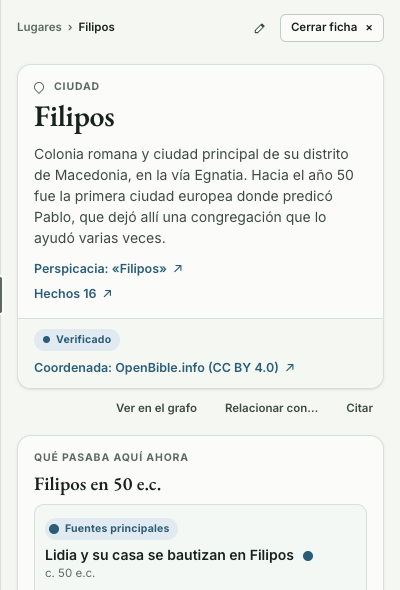
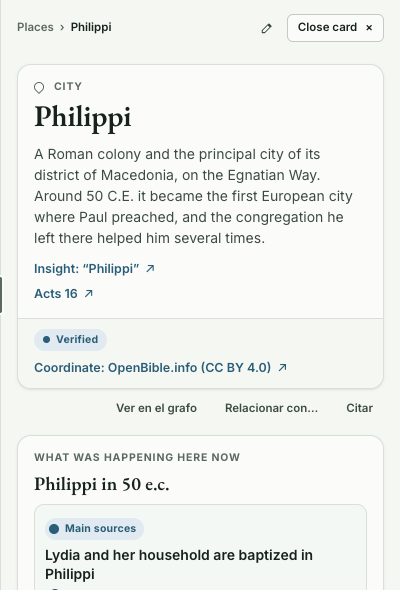
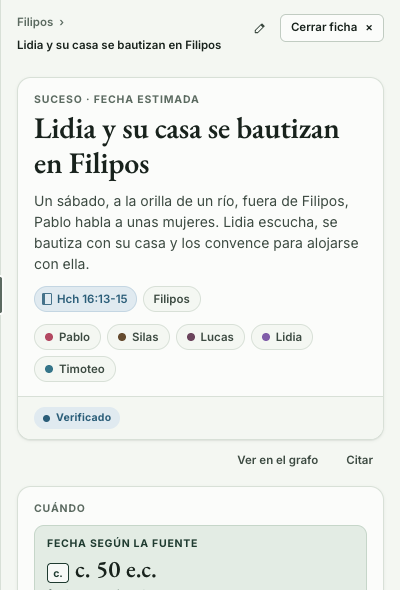
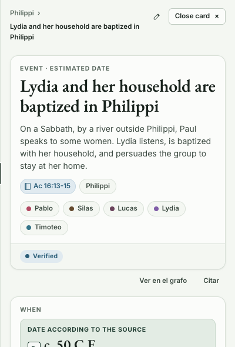
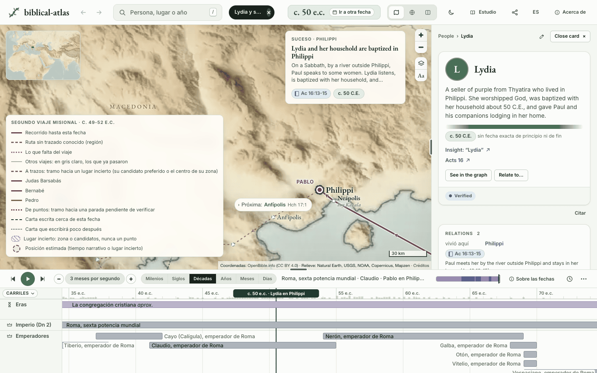
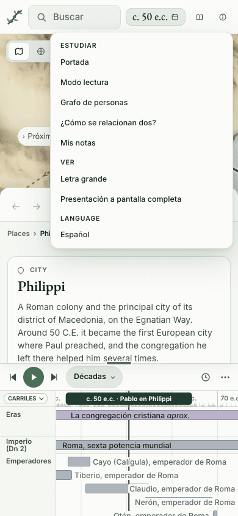

# Inglés: el atlas en dos idiomas

Queremos que el núcleo del atlas acabe en inglés, cotejado con la Traducción del Nuevo Mundo en inglés y con jw.org en inglés, que a veces dicen más que la edición española. Llegará poco a poco. El sitio detecta el idioma del navegador y deja cambiarlo, y la documentación, el README y las imágenes con texto siguen al idioma. Traducir nosotros es delicado, así que cada tanda se revisa entera contra la Biblia y las fuentes. Nunca traducimos a ciegas.

Este documento decide el modelo antes de tocar los datos. Tiene cuatro preguntas: cómo guardan los datos dos idiomas, cómo elige el sitio el idioma, cómo siguen al idioma los documentos y en qué orden van las tandas, con su revisión. Al final están el prototipo que lo prueba, las trampas y lo que decide el dueño.

## Lo que hay hoy

- **Todo lo que se lee está en español.** Los textos de `data/`, unas 800 cadenas de la interfaz en 33 ficheros de `site/`, las páginas [`acerca.html`](../../site/acerca.html) y [`calendario.html`](../../site/calendario.html), los documentos, el README y la frase del banner. Las 800 cadenas son una cuenta aproximada de los literales con palabras en español, sin contar comentarios.
- **El núcleo ya está en inglés.** Las claves de los YAML, los tipos y los valores cerrados se escriben en inglés desde la migración ([modelo.md](../investigacion/modelo.md#1-qué-va-en-inglés-y-qué-no)). Lo que falta es el contenido.
- **Los ids siguen en español** (`filipos`, `lidia-se-bautiza`) y viven en las direcciones compartidas (`#sel=lugar:filipos`) y en los nombres de fichero. No cambian con el idioma.

## Cuánto texto hay

[`scripts/translation_size.py`](../../scripts/translation_size.py) cuenta cada texto de `data/`, también en los hechos anidados, por tipo y por clase. Cada celda de clase es «campos / palabras».

| Tipo | Fichas | Campos | Palabras | Nombres y títulos | Prosa | Razones | Historial | Títulos de enlace | Fechas escritas (se escriben solas) | Búsqueda |
|---|---|---|---|---|---|---|---|---|---|---|
| places | 934 | 8836 | 89946 | 2802 / 5668 | 2556 / 51537 | 1321 / 23736 | 174 / 3806 | 1968 / 5172 | 0 (0) | 15 / 27 |
| people | 1312 | 12927 | 126904 | 2896 / 3147 | 2552 / 54509 | 4073 / 54126 | 261 / 5746 | 2612 / 6886 | 511 (334) | 22 / 41 |
| journeys | 238 | 3865 | 61657 | 246 / 1380 | 1117 / 18645 | 1244 / 27783 | 22 / 630 | 0 / 0 | 1236 (373) | 0 / 0 |
| letters | 22 | 163 | 1944 | 0 / 0 | 73 / 1115 | 22 / 534 | 2 / 46 | 44 / 173 | 22 (19) | 0 / 0 |
| events | 1439 | 8567 | 138977 | 1439 / 11237 | 1561 / 51888 | 1465 / 43746 | 417 / 9672 | 1895 / 5881 | 1444 (473) | 346 / 1545 |
| periods | 89 | 480 | 4945 | 89 / 413 | 101 / 1734 | 89 / 1948 | 21 / 392 | 0 / 0 | 91 (76) | 89 / 196 |
| finds | 7 | 35 | 512 | 7 / 29 | 10 / 268 | 7 / 159 | 1 / 13 | 3 / 6 | 7 (1) | 0 / 0 |
| tours | 4 | 147 | 2104 | 4 / 27 | 138 / 1933 | 4 / 122 | 1 / 22 | 0 / 0 | 0 (0) | 0 / 0 |
| sources | 2493 | 2461 | 4786 | 2461 / 4786 | 0 / 0 | 0 / 0 | 0 / 0 | 0 / 0 | 0 (0) | 0 / 0 |
| books | 66 | 362 | 1826 | 195 / 264 | 5 / 53 | 66 / 1200 | 0 / 0 | 0 / 0 | 96 (77) | 0 / 0 |
| calendar | 27 | 182 | 2236 | 56 / 118 | 70 / 1040 | 56 / 1078 | 0 / 0 | 0 / 0 | 0 (0) | 0 / 0 |
| vocabulary | 97 | 181 | 419 | 181 / 419 | 0 / 0 | 0 / 0 | 0 / 0 | 0 / 0 | 0 (0) | 0 / 0 |
| **total** | 6728 | 38206 | 436256 | 10376 / 27488 | 8183 / 182722 | 8347 / 154432 | 899 / 20327 | 6522 / 18118 | 3407 (1353) | 472 / 1809 |

Lo que se lee de la tabla:

- **436.256 palabras en 38.206 campos.** La prosa y las razones son el 77 %: 337.154 palabras que alguien tiene que escribir con sus palabras y otro tiene que cotejar.
- **Los lugares, la primera tanda, son 934 fichas, 8.836 campos y 89.946 palabras.** Una quinta parte del total.
- **Parte se escribe sola.** 1.353 de las 3.407 fechas escritas son solo años con su era («c. 50 e.c.» pasa a «c. 50 C.E.»). Las 3.706 citas («Hch 16:13-15») no se traducen: se escriben con la abreviatura inglesa al enseñarlas. Los 868 capítulos de la Biblia que son fuente (32 escritos y 836 implícitos) salen de los libros.
- **Las fuentes casi se escriben solas.** De 2.461 títulos, 2.127 son artículos de Perspicacia. En una muestra de 35 fuentes, las 20 de Perspicacia y 11 de las 15 restantes traen en su propia página el enlace a la versión inglesa (`hreflang="en"`). Las otras 4 son notas de estudio, que viven en wol.jw.org con el mismo número de documento, y un número antiguo de La Atalaya.

## Pregunta 1. Dónde viven los dos idiomas en los datos

### A. Un mapa por campo: `name: {es: Filipos, en: Philippi}`

**Cuesta:** cambiar el tipo de cada texto de las 4.045 fichas. Todo lo que lee un texto pasa a leer un mapa: `validate.py` (2.300 líneas), `build.py`, `review.py`, el registro, `apply.py`, la cobertura y `ochos.py`.

**Rompe:** la adopción por tandas. Durante meses convivirían cadenas y mapas en el mismo campo, y cada lector tendría que aceptar las dos formas. El cambio no se puede hacer por partes sin esa doble forma.

### B. Un bloque `en` junto a cada objeto, en el mismo fichero (la que recomendamos)

```yaml
id: filipos
name: Filipos
names:
- name: Filipos
  en:
    name: Philippi
summary: Colonia romana y ciudad principal de su distrito de Macedonia...
links:
- title: 'Perspicacia: «Filipos»'
  url: https://www.jw.org/es/biblioteca/libros/Perspicacia-para-comprender-las-Escrituras/Filipos/
  type: perspicacia
  en:
    title: 'Insight: “Philippi”'
    url: https://www.jw.org/en/library/books/Insight-on-the-Scriptures/Philippi/
checked_on: '2026-09-29'
status: verified
en:
  name: Philippi
  summary: A Roman colony and the principal city of its district of Macedonia...
  reason: 'Insight (“Philippi”) describes the place; it appears at Ac 16:12-40...'
  checked_on: '2026-10-03'
  status: verified
```

Cada objeto con textos lleva su propio bloque: la ficha, cada nombre, cada enlace, cada relación, cada parada, cada entrada del historial. El bloque solo lleva los textos de ese objeto y, si el objeto tiene `url`, su página en ese idioma.

**Cuesta:** lo que hizo el prototipo. [`scripts/languages.py`](../../scripts/languages.py) dice qué es un texto y qué se escribe solo. [`validate.py`](../../scripts/validate.py) gana una función. [`build.py`](../../scripts/build.py) quita los bloques antes de componer `data.json` y escribe la capa inglesa aparte. Los conjuntos cerrados de claves (paradas, libros, nombres de mes, fiestas, la explicación del calendario) aceptan `en`.

**Rompe:** nada de lo que lee el español. Con los bloques puestos, `site/data.json` y `stats.json` salen idénticos byte a byte a los de `main`, y el registro y cada tabla de la base SQLite, iguales. `review.py` y `apply.py` siguen funcionando; `apply.py` reescribe con `sort_keys=False` y conserva el bloque.

**El riesgo:** una tanda toca los mismos ficheros que los carriles de datos. El bloque va al final de cada objeto, así que una fusión choca solo si alguien cambia la última línea de ese mismo objeto. Las tandas de un tipo van cuando sus carriles están quietos.

### C. Un fichero hermano por ficha: `data/places/filipos.en.yaml`

**Cuesta:** 4.045 ficheros más, y que `build.py` y `validate.py` excluyan el sufijo al recorrer las carpetas (hoy `filipos.en.yaml` sería un lugar llamado `filipos.en`).

**Rompe:** la pareja. Un texto anidado se señala por su posición, como `names[0]` o `relations[3]`, y la posición cambia cuando alguien reordena la lista en el español. Un cambio en el español tampoco se ve junto a su inglés, así que el inglés envejece sin que nadie lo note. Su única ventaja es no chocar con los carriles, y B la consigue si las tandas eligen su momento.

### D. Dos árboles completos: `data/es/` y `data/en/`

**Rompe:** la estructura se duplica. Coordenadas, fechas, relaciones y fuentes en dos sitios que se separan con el primer arreglo hecho en uno solo. La descartamos.

### Lo que fija el modelo B

- **La unidad es la ficha.** Si el primer nivel lleva `en`, cada texto de dentro necesita su pareja, y el bloque de arriba lleva `checked_on` (el día en que se cotejó con la fuente inglesa) y `status`. Un bloque dentro de una ficha sin el de arriba es un error: no hay fichas a medias.
- **Un tipo se da por completo en [`data/languages.yaml`](../../data/languages.yaml).** Mientras una tanda avanza, las fichas sin inglés siguen validando. Cuando acaba, la última tanda añade el tipo a `en.complete`, y desde ese día cada ficha nueva de ese tipo necesita su inglés para pasar la validación. Así ningún carril de datos deja huecos después.
- **Lo que se escribe solo no se escribe.** Las fechas simples las escribe `build.py`. Una fecha como «primavera de 50 e.c.» sí necesita su pareja. Las citas no se tocan en los datos: son claves, como los ids, y el sitio las enseña con la abreviatura inglesa del libro.
- **Las fuentes son una sola lista por hecho.** Un id de fuente es un documento; su bloque `en` lleva `title`, `work`, `url` y `checked_on` de la página inglesa del mismo documento. Los capítulos de la Biblia salen del bloque `en` de su libro (`slug: acts`). Una fuente que no es de jw.org (OpenBible) no cambia. Cada fuente que cita una ficha con inglés tiene que tener su página inglesa, o la validación falla.
- **Palabras propias y 40 palabras, en cada idioma.** El tope de 40 palabras ya recorre el bloque. La racha de 8 palabras se comprueba contra las páginas inglesas: `ochos.py` lee las direcciones jw.org de un fichero JSON que se le pasa al lado.
- **Las claves y los ids no cambian.** Las claves ya están en inglés. Los ids, las selecciones de la dirección (`lugar:`) y los slugs de los libros se quedan en español, porque son direcciones que la gente ya comparte.
- **El sitio recibe dos ficheros.** `data.json` sigue siendo el español de siempre y `data.en.json` lleva solo los textos ingleses, con las claves de `data.json`, por tipo y por id.
- **Con los datos en trozos, la capa se funde trozo a trozo.** El sitio abrirá con un núcleo y pedirá después el detalle de las fichas, que trae resúmenes, razones y fuentes en español. Por eso `BE.idioma.apply(BE.D)` solo cambia los textos que los datos ya tienen y se puede llamar otra vez sin descargar nada: el cargador la llama tras unir cada trozo, y lo recién llegado pasa al inglés. Cuando la capa crezca, `build.py` la cortará igual que `data.json` (`data.en.core.json` y `data.en.detail.json`) y cada parte inglesa se fundirá después de su parte española. La línea de `base.js` que hoy espera a la capa pasará al cargador cuando entren los trozos.
- **La base SQLite** gana una tabla `textos (tipo, id, ruta, idioma, texto)` cuando haga falta. No cambia ninguna columna de hoy. El prototipo no la escribe.
- **El servidor MCP** ([biblical-atlas-mcp](https://github.com/GeiserX/biblical-atlas-mcp), solo lectura) lee `data.json`. Proponemos que acepte `BIBLICAL_ATLAS_LANG` y un argumento `lang` en cada herramienta, descargue `data.<lang>.json` al lado y lo funda igual que el sitio. Cada texto dice en qué idioma salió, porque una ficha sin traducir sale en español. Sus instrucciones dejan de decir que todo vuelve en español, y `lookup_passage` acepta las abreviaturas inglesas.
- **Un inglés viejo avisa.** Cuando el español de una ficha se relee y cambia después del cotejo inglés (`checked_on` de la ficha posterior al de su bloque), un aviso `stale_translation` lo dice. El prototipo no lo trae todavía.
- **Dónde va cada idioma al final.** Hoy el español está arriba y el inglés en su bloque. Cuando todos los tipos estén completos, un script puede darles la vuelta (inglés arriba, bloque `es`) sin tocar un solo texto. No hace falta decidirlo ahora.

## Pregunta 2. Cómo elige el sitio el idioma

| Paso | Regla |
|---|---|
| La dirección | `?lang=en` o `?lang=es` gana siempre. Va en la consulta, no en el `#`: el `#` es la vista, con sus parámetros y los enlaces a pasajes (`#p=Hch16:1`), y el idioma nunca los toca. |
| Lo guardado | La elección del botón queda en este navegador (`biblical-atlas:pref:idioma`). Un enlace compartido con `lang` gana sin cambiar lo guardado. |
| El navegador | Desde el lanzamiento, el primer idioma de `navigator.languages` que el atlas tiene, por su subetiqueta principal (`en-GB` es inglés, `es-MX` es español). |
| Ni uno ni otro | Inglés, desde el lanzamiento. Quien lee en francés entiende antes el inglés que el español. |
| Antes del lanzamiento | Español, como hoy, aunque el navegador esté en inglés. Solo `?lang=en` abre el inglés. |

- **La dirección lleva el idioma.** Desde el lanzamiento siempre. Antes, solo cuando la página no está en español, para que el sitio de hoy no cambie de dirección.
- **El botón.** En la barra de arriba, un botón con el código del otro idioma («EN» o «ES»). La portada no tiene barra y lleva el suyo, redondo, junto a «Letra grande»; desde ella el cambio vuelve a abrir la portada. En el teléfono la barra no tiene sitio: el botón va en el menú Estudio, bajo «Idioma». Antes del lanzamiento solo lo ve quien ya lee en inglés, para poder volver. Al pulsarlo se guarda la elección y se abre la misma vista en el otro idioma.
- **Dos capas de texto, separadas.** Los textos de los datos vienen de `data.<lang>.json` y se funden con `data.json` antes de que nada los lea. Las cadenas de la interfaz pasan por `BE.t('Suceso')`, con un catálogo por idioma ([`site/i18n/en.js`](../../site/i18n/en.js)) cuya clave es el texto español: una cadena sin traducir sale en español y envolver una cadena nunca rompe una página. Una prueba falla si una clave del catálogo ya no aparece en el código.
- **Los nombres españoles se siguen buscando.** Al fundir la capa, cada nombre o título que cambia queda como alias de búsqueda de su ficha: en inglés, «Lidia» encuentra a Lydia y «Filipos», a Philippi. Quien llega con un nombre aprendido en español no se queda sin resultado.
- **Una ficha sin traducir lo dice.** Sale en español con una línea arriba: «This card is not translated yet: you are reading it in Spanish.»
- **Las citas** se leen con la abreviatura inglesa («Ac 16:13-15») y abren la Biblia de estudio en inglés en los mismos versículos: jw.org usa las mismas anclas en todos los idiomas.

<table>
<tr>
<td width="50%"><br><b>Hoy.</b> La ficha de Filipos.</td>
<td width="50%"><br><b>Con <code>?lang=en</code>.</b> Nombre, resumen, enlaces y fuentes en inglés.</td>
</tr>
<tr>
<td><br>El bautismo de Lidia, en español.</td>
<td><br>En inglés: título, resumen, «Ac 16:13-15» y la fecha «c. 50 C.E.» escrita sola.</td>
</tr>
</table>





La captura grande enseña lo que queda: la línea de tiempo, la leyenda, el buscador, los verbos de las relaciones («vivió aquí»), las eras («50 e.c.») y las páginas `acerca.html` y `calendario.html`. Los verbos salen del vocabulario, que necesita su `en`; las eras, del formateador de fechas de `base.js`.

## Pregunta 3. Documentos, README e imágenes

### La documentación

**A. [mkdocs-static-i18n](https://github.com/ultrabug/mkdocs-static-i18n) con sufijos (la que recomendamos).** Cada página tiene su pareja al lado (`usage.md` y `usage.en.md`). Una sola compilación escribe `/docs/` y `/docs/en/`, Material pone el selector de idioma en la cabecera y una página sin traducir sale en español. **Cuesta:** una dependencia más, con su versión fijada en `docs/requirements-docs.txt`, y que `build.py` escriba el registro en los dos idiomas (`lugares.md` y `lugares.en.md`). **Rompe:** nada de lo publicado: las direcciones españolas siguen igual.

**B. Dos configuraciones (`mkdocs.yml` y `mkdocs.en.yml`).** Sin dependencias nuevas. **Cuesta:** dos árboles de páginas, dos menús que se separan y dos compilaciones en cada flujo, sin selector de idioma.

### El README, el banner y las capturas

- **README.md en inglés** y **README.es.md** en español, cada uno con el enlace al otro en la primera línea. GitHub enseña `README.md`, y el núcleo acaba en inglés.
- **El banner** es [`docs/images/banner.svg`](../images/banner.svg) y lleva la frase en español. Al lado va `banner.en.svg`, y lo mismo con `social.png`. Las capturas van por idioma en `docs/images/screenshots/<idioma>/`.

### La publicación

[`pages.yml`](../../.github/workflows/pages.yml) compila una vez con el plugin y comprueba también `site/docs/en/index.html`. [`docs.yml`](../../.github/workflows/docs.yml) compila en modo estricto igual, así que un enlace roto en cualquiera de los dos idiomas tira la compilación.

## Pregunta 4. Las tandas y su revisión

| Orden | Tanda | Tamaño |
|---|---|---|
| 0 | La base: los 66 libros (nombre, abreviatura y slug de la TNM inglesa, y sus hechos), el vocabulario (181 textos), el calendario (27 entradas), el catálogo de la interfaz (unas 800 cadenas) y las páginas inglesas de las fuentes (2.461 títulos: un script lee el `hreflang` y alguien coteja cada título). | 9.267 palabras más la interfaz |
| 1 | Lugares, en tandas de unos 100 ficheros. | 934 fichas, 89.946 palabras |
| 2 | Personas. | 1.312 fichas, 126.904 palabras |
| 3 | Sucesos. | 1.439 fichas, 138.977 palabras |
| 4 | Viajes, cartas, periodos, hallazgos y recorridos. | 360 fichas, 71.162 palabras |
| 5 | Documentación y README. | |

Cada tanda tiene dos papeles, siempre en dos agentes distintos:

- **Quien traduce** escribe desde las fuentes inglesas, nunca solo desde el texto español. Cada nombre se escribe como lo escribe la TNM inglesa en el versículo y en el título del artículo de Perspicacia. El resumen sale con palabras propias del artículo inglés. La razón cita los párrafos ingleses, que no siempre coinciden con los españoles, y los enlaces van a las páginas inglesas. Deja `status: pending` en el bloque.
- **Quien verifica**, otro agente, abre cada fuente inglesa de cada ficha y comprueba la grafía TNM de cada nombre, que el resumen dice lo mismo que el artículo inglés y que la ficha española, que no hay ocho palabras seguidas de la fuente (`ochos.py` con las páginas inglesas y su control) y que los enlaces responden. Solo entonces pasa el bloque a `verified`.

**Una tanda está hecha** cuando `validate.py` da 0 errores, `ochos.py` da 0 coincidencias contra las páginas inglesas (y su control falla como debe), `validate.py --links` no tiene fallos, las pruebas del sitio pasan y el PR trae la tabla de quien verifica: fichas abiertas, nombres corregidos y resúmenes cambiados. La última tanda de un tipo lo añade a `en.complete` de `data/languages.yaml`.

Si la fuente inglesa contradice a la española, gana la publicación más reciente y queda en `history` de la ficha, como cualquier cambio de entendimiento.

## El prototipo

Un lugar, una persona y un suceso llevan su inglés de punta a punta: Filipos, Lidia y su bautismo. Cada texto se escribió desde las páginas inglesas de Perspicacia («Philippi», «Lydia», «Timothy»), las notas de estudio de Hechos 16, los capítulos de la Biblia de estudio y la tabla de los libros, que se abrieron el 2026-10-03.

| Pieza | Qué hace |
|---|---|
| Datos | El bloque `en` en [`filipos.yaml`](../../data/places/filipos.yaml), [`lidia.yaml`](../../data/people/lidia.yaml) y [`lidia-se-bautiza.yaml`](../../data/events/lidia-se-bautiza.yaml), en cinco fuentes y en dos libros (Hechos y Filipenses). `data/languages.yaml` todavía no da ningún tipo por completo. |
| `scripts/languages.py` | Qué es un texto, qué fecha se escribe sola, qué página tiene cada fuente en inglés y la capa de un idioma. |
| `scripts/validate.py` | `validar_idiomas`: parejas, sello, direcciones, fuentes y tipos completos. Dice cuántas fichas tienen inglés. |
| `scripts/build.py` | `data.json` sin bloques, idéntico al de antes, y `data.en.json` con 1 lugar, 1 persona, 1 suceso, 2 libros y 38 fuentes. |
| [`site/js/language.js`](../../site/js/language.js) | El idioma, el botón, la capa sobre los datos, `BE.t` y las citas en inglés. Una línea en `base.js` espera a la capa, y otra en `recorridos.js` pone la entrada del menú. |
| `site/i18n/en.js` | 65 cadenas: las de las tres fichas. |
| [`scripts/translation_size.py`](../../scripts/translation_size.py) | Las cifras de arriba. |

Las pruebas son [`scripts/test_validate.py`](../../scripts/test_validate.py) (10 casos de `Idiomas`), [`scripts/test_build.py`](../../scripts/test_build.py) (4 casos de `CapaIngles`) y [`tests/site/language.test.mjs`](../../tests/site/language.test.mjs) (7 casos en un navegador de verdad).

## Trampas

- **Los nombres no se transliteran.** En la muestra, Nayot es «Naioth», Guemalí es «Gemalli», Peqahías es «Pekahiah» y Qaréah es «Kareah». Cada nombre sale de la TNM inglesa.
- **El número de documento empareja los artículos.** La página inglesa de Perspicacia lleva el mismo documento que la española (1200002798 en «Lidia» y «Lydia», 1200003467 en «Filipos» y «Philippi»), así que la clave `perspicacia` de una persona sirve en los dos idiomas. Su `#n`, el de una entrada numerada, se coteja en cada tanda.
- **Las notas de estudio no tienen página en www.jw.org** en ningún idioma: su página inglesa es la de wol.jw.org con el mismo número de documento. La validación lo acepta solo cuando la española ya es de wol.jw.org.
- **Algunos títulos de jw.org llevan raya**, como el de las notas de estudio de Hechos 16 entre «Acts Study Notes» y «Chapter 16». Nosotros no la usamos y escribimos una coma.
- **Una fuente sin página inglesa** (el número antiguo de La Atalaya de la muestra) deja sin traducir la ficha que la cita. Falta decidir si basta con su página española, marcada como tal.
- **Los homónimos se comparan por idioma.** Dos nombres iguales en español pueden no serlo en inglés, y al revés; `clave_nombre` de `validate.py` ya lo anticipa.
- **Las listas se funden por posición.** La capa conserva el largo y el orden de cada lista de `data.json`. Un elemento o una clave que los datos aún no tienen, porque su trozo no ha llegado, no se añade: espera a la llamada siguiente. Las relaciones `holds_office`, que `data.json` no lleva en `relaciones`, tampoco van en la capa.
- **Cambiar de idioma recarga la página** y vuelve a cargar `data.json`. La vista no se pierde porque está entera en la dirección. El cambio es una entrada más del historial, así que Atrás devuelve el idioma de antes.
- **La detección espera al lanzamiento.** Encenderla hoy daría a cada navegador inglés un sitio casi entero en español.

## Lo que decide el dueño

1. Cuando la fuente inglesa dice más que la española, ¿crece también la ficha española (citando la página inglesa) o cada idioma dice solo lo que dice su fuente?
2. Quien no lee ni español ni inglés, ¿recibe inglés (lo que recomendamos) o español?
3. ¿Cuándo se lanza (detección encendida y botón para todos): tras la tanda 0 y los lugares, o cuando también estén personas y sucesos?
4. Una fuente sin página inglesa: ¿basta con enlazar la española, marcada, o la ficha espera a otra fuente inglesa?
5. ¿README.md en inglés y README.es.md en español, o al revés?
6. El servidor MCP, ¿sigue respondiendo en español por defecto o pasa al inglés con el argumento `lang`?
