# Línea de tiempo: cinco diseños para elegir

La línea de tiempo del sitio no se lee bien y un clic hace cosas que nadie pidió. Aquí hay cinco diseños que funcionan, con los mismos datos del sitio, para probarlos y elegir uno. Ninguno cambia el sitio. Nada de esto toca `site/`.

Los cinco dibujan las mismas 1159 marcas: 945 sucesos, 95 paradas de Pablo, 74 reyes y gobernantes, 22 cartas, 15 eras e imperios y 8 viajes. Cómo se abren está [al final](#7-cómo-abrir-los-prototipos).

## 1. Qué falla en la línea de hoy

Medimos la línea de hoy en un navegador real, en 24 vistas: seis escalas por cuatro fechas, a 1440 px con ratón y a 430 px con el dedo.

**Un clic mueve tres cosas.** Pulsar una marca lleva el cursor a otra fecha, centra la vista y a veces cambia la escala.

| Clic | Desde | Qué pasa |
|---|---|---|
| Viaje «De Damasco a Antioquía» | 50 e.c., décadas | El cursor va a 34 e.c., su primera parada. La vista se corre 516 px. |
| Tiberio | 50 e.c., décadas | El cursor va a 14 e.c., el principio de su reinado. La vista se corre 1177 px. |
| Babilonia | 607 a.e.c., días | La escala pasa de días a 101 años. |
| «Los patriarcas» | 1513 a.e.c., décadas | La vista pasa de 40 años a 926. |
| Gálatas | 50 e.c., días | La vista salta más de un año, 11 825 px. |

Las tres cosas salen de una sola llamada. `seleccionar`, en `site/js/base.js`, mueve el cursor al «momento» de la marca y siempre vuelve a centrar la vista. Para un viaje, una persona o un reinado, ese momento es el primero. Las eras y los imperios piden además que la vista los enseñe enteros, y eso cambia la escala.

**Casi ningún nombre se lee.** De 1556 cosas con nombre en las 24 vistas a 1440 px, 116 enseñan el nombre entero, el 7,5 %. 1225 no enseñan ninguno, el 79 %. A 430 px se lee entero el 2,2 % y no tiene nombre el 91 %. Acercarse no los devuelve. En días, con el cursor en el 14 de nisán del 33, 37 de las 40 cajas de la semana no dicen qué son.

**Las marcas se tapan.** El 52 % de las marcas a 1440 px y el 71 % a 430 px tienen otra marca encima. Los rombos pegados se leen como una fila de flechas.

**Las formas no se aprenden solas.** Hay 13 tipos de marca. El rayado quiere decir tres cosas y hay cinco contornos de puntos distintos. El mismo rombo es una carta y es un suceso. El mismo suceso es una caja a 1440 px y un rombo a 430 px. La única leyenda, «Sobre las fechas», no explica rombos, cajas, píldoras ni paradas.

**El teclado tiene que pasar por todo.** En décadas hay entre 297 y 325 paradas de tabulador, y más de la mitad están fuera de la pantalla.

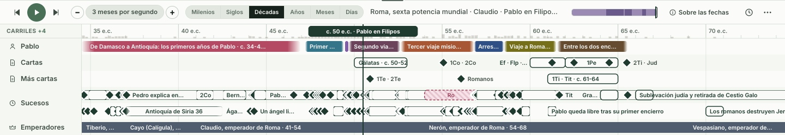

*Décadas, 50 e.c. Los viajes dicen «Primer …» y «Arres…», y 107 de los 112 rombos no tienen nombre.*

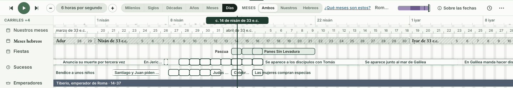

*Días, 14 de nisán del 33. Cada caja vacía es un suceso de ese día.*

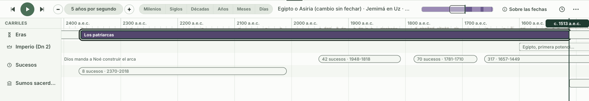

*Un clic en «Los patriarcas» desde una vista de 40 años. La línea enseña ahora 926 años y el cursor queda en el borde derecho.*

Más capturas de la línea de hoy, de la misma medición:

- En milenios, [607 a.e.c.](img/linea/hoy/today-millennia-607bce-1440.png). En siglos, [607 a.e.c. a 1440 px](img/linea/hoy/today-centuries-607bce-1440.png) y [a 430 px](img/linea/hoy/today-centuries-607bce-430.png). En décadas, [1513 a.e.c.](img/linea/hoy/today-decades-1513bce-1440.png) y [50 e.c. a 430 px](img/linea/hoy/today-decades-50ce-430.png). En años, [607 a.e.c.](img/linea/hoy/today-years-607bce-1440.png). En meses, [33 e.c.](img/linea/hoy/today-months-33ce-1440.png). En días, [33 e.c. a 430 px](img/linea/hoy/today-days-33ce-430.png).
- Después de un clic: [un suceso elegido](img/linea/hoy/today-click-event-selected-1440.png), [la lista que se abre sobre marcas apiladas](img/linea/hoy/today-click-chooser-1440.png) y [un toque en días a 430 px](img/linea/hoy/today-tap-event-days-430.png).

## 2. Las reglas de todos los diseños

1. **Pulsar una marca la elige y dice qué es.** No manda el cursor a su primer momento. Cada diseño dice qué hace el cursor y por qué.
2. **Pulsar no cambia la escala.** Si estás en días, sigues en días.
3. **Pulsar no mueve la vista.** Lo que estaba bajo el dedo sigue bajo el dedo.
4. **El nombre se lee siempre, en cualquier escala.** Donde los nombres chocan, el diseño lo resuelve con filas, con grupos que dicen cómo se llaman sus marcas o con una lista. Nunca lo quita ni lo deja en unas letras.
5. **Las formas se entienden sin leyenda.** Un momento, un tramo, una fecha aproximada, una fecha que calculamos y una fecha dudosa se distinguen a la vista.
6. **Hay mucha información.** El diseño decide qué enseña en cada escala y dice cómo se llega al resto.

## 3. Los diseños

Las capturas son de un navegador real y todas tienen la misma fecha y la misma escala. La primera pareja es 50 e.c. en años, con el suceso «Presos en Filipos: el terremoto y el carcelero» elegido. En esa ventana hay 122 marcas. La segunda pareja es la ventana más llena de esa escala, de 29 a 37 e.c., con 187 marcas y nada elegido. La lista no tiene ventana, así que su segunda pareja está en el centro de esos años, en abril de 33 e.c.

Probamos cada diseño con clics de ratón a 1440 px, sobre la marca y sobre su nombre, en años, días y décadas: 41 en «Carriles con nombre», 43 en «Panorama y detalle», 20 en «Cronología que se lee», 44 en «Grupos que se abren» y 42 en «La de hoy, arreglada». En los cinco, ningún clic cambió la escala ni la vista, y el cursor no quedó nunca en el final de la marca, que es el primer instante de lo que viene después. Lo que cambia de un diseño a otro es el cursor, los nombres y cuánto alto piden.

Después de que los jueces los probaran, arreglamos en los prototipos lo que encontraron. En los cinco, los enlaces de arriba tienen los mismos nombres y abren el otro diseño en la misma fecha, escala y marca elegida. Los cinco abren con el tema del sistema. Todos tienen «Ir a» para escribir una fecha, un enlace para saltar a las marcas y blancos de 44 px en el móvil. Los sucesos de un mismo día van en el orden del relato, que deducimos de sus pasajes porque los datos no lo traen. Lo que es de cada diseño va en su apartado.

### Carriles con nombre

Prototipo: [`mockups/linea/lanes/`](mockups/linea/lanes/index.html)

<table>
<tr>
<td width="77%">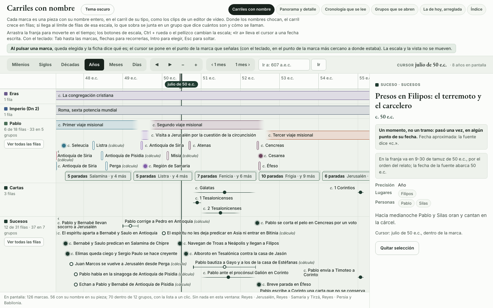</td>
<td>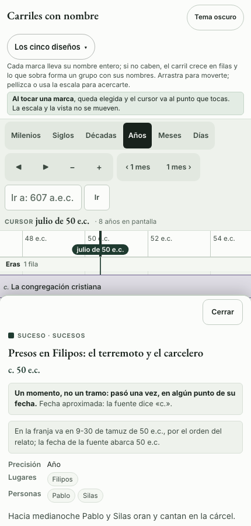</td>
</tr>
<tr>
<td>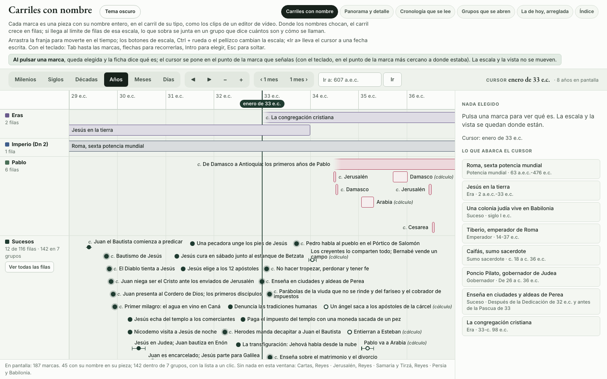</td>
<td>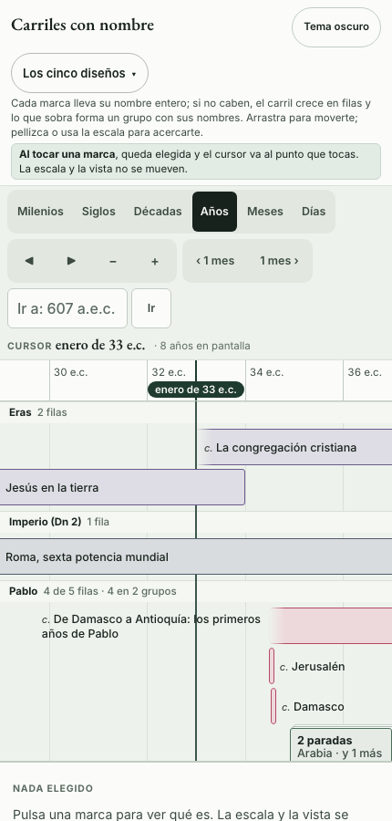</td>
</tr>
</table>

**Cómo se trabaja.** Los carriles de hoy, en el mismo orden, con el nombre del carril fijo a la izquierda. Cada marca es una pieza con su nombre entero. Los viajes de Pablo van en sus propias filas, encima de sus paradas. Los sucesos cuya fecha abarca mucho más que la pantalla (del año entero, vistos en días) van en un carril propio, «Sucesos con fecha más amplia», debajo de los que caen en ella. Arrastrar la franja mueve el tiempo. La escala cambia con sus botones, con Ctrl y la rueda o con dos dedos. La regla, «Ir a» y los botones de un paso mueven el cursor.

**Qué hace un clic.** Elige la marca y abre su ficha. El cursor va al punto de la marca que señalas; si señalas su nombre, al punto de la marca más cercano. La razón es que el cursor manda en el mapa: si señalas un momento de un viaje, el mapa enseña ese momento. El final de la marca no cuenta, porque es el primer instante del día o del año siguiente: el 11 de nisán se queda en el 11 de nisán. En la prueba el cursor se movió en 36 de 41 clics, así que la fecha cambia casi cada vez que alguien solo quiere leer una ficha.

**Cómo se leen los nombres.** Cada carril tiene un máximo de filas por escala. Lo que no cabe va a un grupo en la última fila, y cada grupo dice cuántos son y siempre el nombre de su primera marca: «5 paradas Salamina · y 4 más». Una marca que queda sola no forma un grupo de una: va como pieza con su nombre. Las eras y los imperios no se agrupan nunca, y en días no hay grupos. En 50 e.c. en años, 56 marcas tienen su pieza y 70 van en 12 grupos; en la ventana llena, 45 y 142 en 7. Un nombre que se saldría por un borde se mete en el sitio libre de su fila, al otro lado de su punto o en dos líneas; si no hay sitio, pasa al grupo, o a una fila propia donde no hay grupos. En 14 ventanas, de milenios a días y a los dos anchos, no quedó ningún nombre cortado.

**A qué renuncia.**
- En las escalas amplias, la mayoría de los nombres espera en la lista de su grupo: en 50 e.c. en años, 70 de 126 marcas. El grupo dice su primer nombre y su lista está a un clic, en la ficha.
- Pide alto. En días hay que bajar por 1631 px de filas a 1440 px y por 2776 px a 430 px. Los 13 sucesos del 14 de nisán del 33 empiezan 745 px por debajo del principio de los carriles a 1440 px, debajo de los días anteriores de esa semana.
- Al arrastrar 400 px, una pieza no cambia de fila, porque su fila sale de toda la historia y no de la vista. Lo que sí se mueve está en los bordes y entre carriles. Un carril que aparece empuja hacia abajo a los de debajo (59 movimientos en meses a 1440 px, cuando entra Pablo), y una pieza que llega al borde sin sitio para su nombre pasa al grupo (37 en años).
- Cada clic mueve el cursor, y con él la fecha del mapa.
- No tiene reproducción ni carriles de persona.

**Qué cuesta llevarlo al sitio.** Se queda el cálculo de fechas, el calendario, los carriles, el zoom y la reproducción. Se vuelve a escribir todo el dibujo y el rotulado, que pasan de SVG a botones. Calculamos que unas 1100 de las 2018 líneas de `linea.js` se cambian por 800 o 1000. El panel de la línea tiene que ser más alto.

### Panorama y detalle

Prototipo: [`mockups/linea/overview/`](mockups/linea/overview/index.html)

<table>
<tr>
<td width="77%">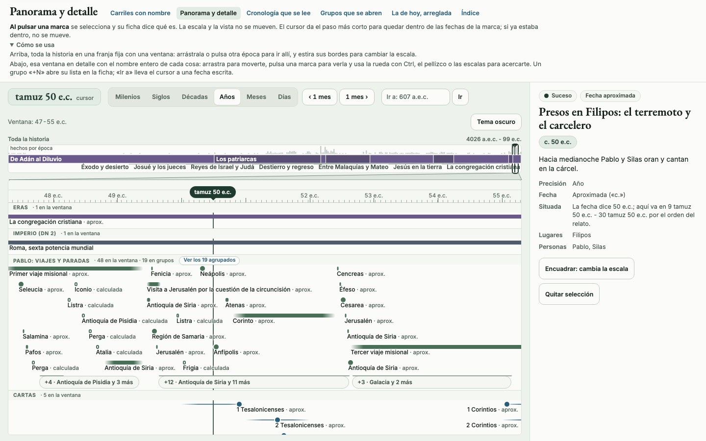</td>
<td>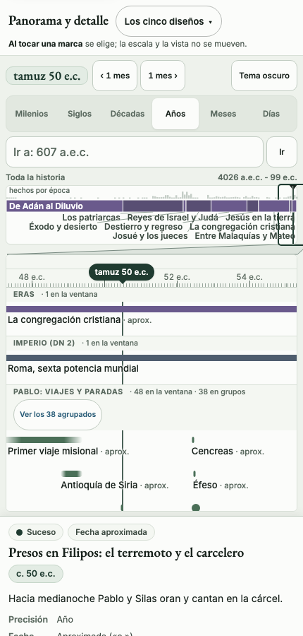</td>
</tr>
<tr>
<td>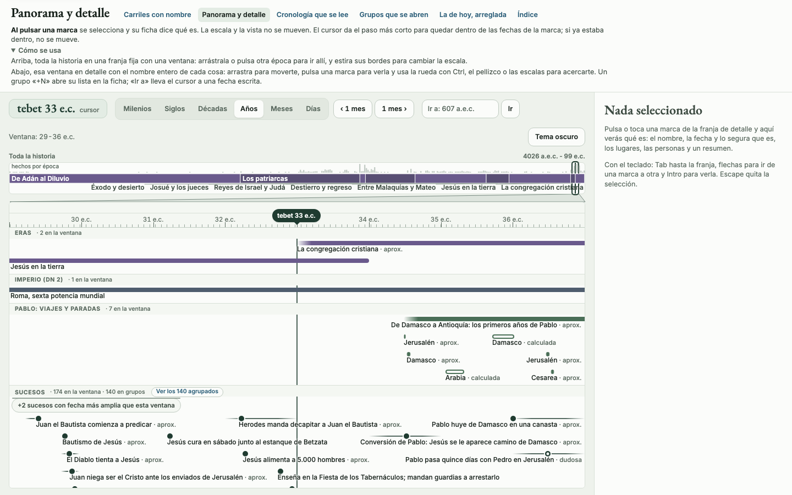</td>
<td>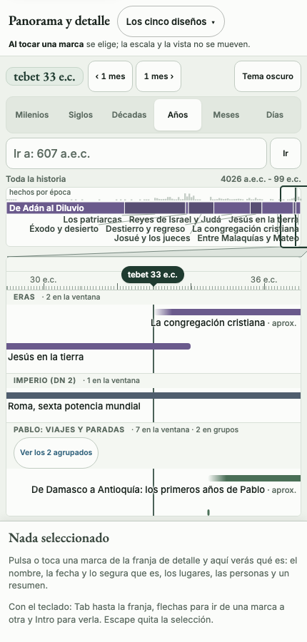</td>
</tr>
</table>

**Cómo se trabaja.** Arriba, toda la historia en una franja fija con una ventana. Abajo, esa ventana en detalle, carril por carril, con el nombre debajo de cada marca. Arrastrar el detalle mueve el tiempo. Arrastrar la ventana del panorama da saltos grandes y estirar sus bordes cambia la escala. La regla, «Ir a» y los botones de un paso mueven el cursor, que puede quedarse fuera de la ventana: la bandera lo dice en el borde, con una flecha.

**Qué hace un clic.** Elige la marca y abre su ficha. El cursor da el paso más corto para quedar dentro de la fecha que da la fuente. Si ya estaba dentro, no se mueve. En la prueba se movió en 16 de 43 clics. Cuando el cursor estaba antes que la marca, ese paso acabó en su primer momento. Y la fecha de la fuente es a menudo más ancha que la marca dibujada: una marca situada por el orden del relato se dibuja en unos días, pero su fecha abarca el año entero. Por eso, tras el paso, la línea del cursor puede quedar a más de 100 px del punto que se pulsó. Es una razón más para que el clic no mueva el cursor. La ficha tiene el botón «Encuadrar: cambia la escala», que es la única forma de que una marca cambie la escala.

**Cómo se leen los nombres.** En meses y días cada marca tiene su fila. De milenios a años cada carril tiene un máximo de filas, y lo que no cabe queda en un grupo en su sitio del tiempo. El grupo dice su primer nombre entero si cabe, y si no, sus fechas o cuántos son: «+12 · Antioquía de Siria y 11 más». Pulsar un grupo abre su lista en la ficha: la franja no se mueve y ninguna marca cambia de sitio. La cabecera de cada carril dice cuántas van en grupos y tiene «Ver los 19 agrupados». En 50 e.c., 67 marcas con nombre y 12 grupos. En la ventana llena, 46 y 10. Las palabras de certeza son enteras: «aprox.», «calculada», «dudosa».

**A qué renuncia.**
- Pide alto: en 50 e.c. los carriles miden 1192 px a 1440 px y 1847 px a 430 px. A 430 px la franja de detalle mide 364 px y enseña unas 6 marcas enteras; en una pantalla de 760 px de alto, 224 px.
- Al arrastrar 400 px ninguna marca cambia de fila en décadas, años y días, y 5 en meses. Pero un carril que crece o aparece empuja a los de debajo: 210 movimientos en meses a 1440 px y 426 a 430 px.
- Un grupo no enseña todos sus nombres en la franja: hay que abrirlo.

**Qué cuesta llevarlo al sitio.** El minimapa y las barras de densidad de hoy se convierten en el panorama. Se vuelve a escribir el dibujo, el rotulado, el puntero y el teclado, unos dos tercios de `linea.js`. El panel necesita 450 px o más.

### Cronología que se lee

Prototipo: [`mockups/linea/list/`](mockups/linea/list/index.html)

<table>
<tr>
<td width="77%">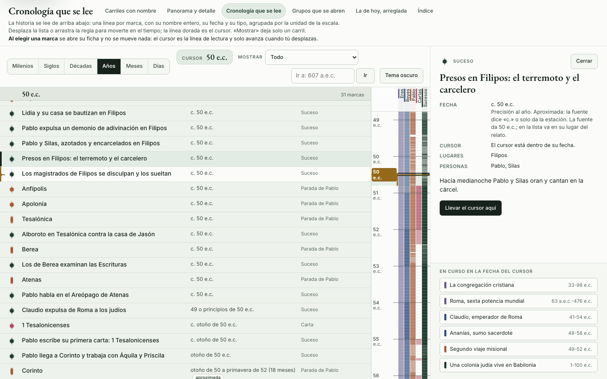</td>
<td>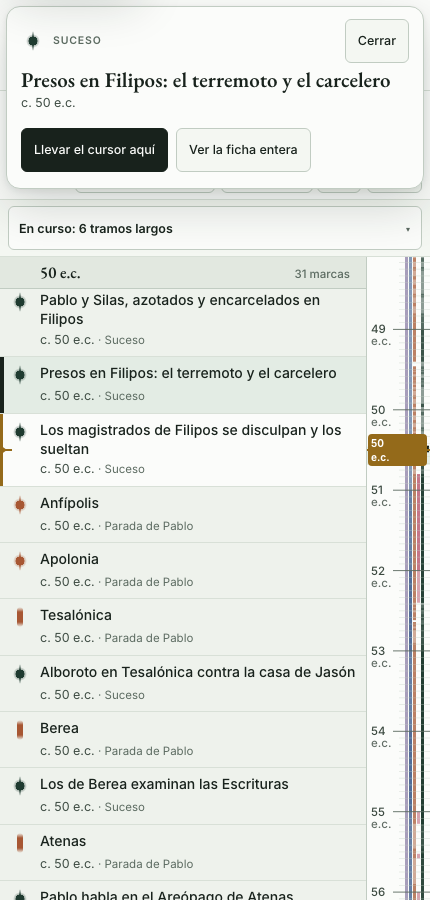</td>
</tr>
<tr>
<td>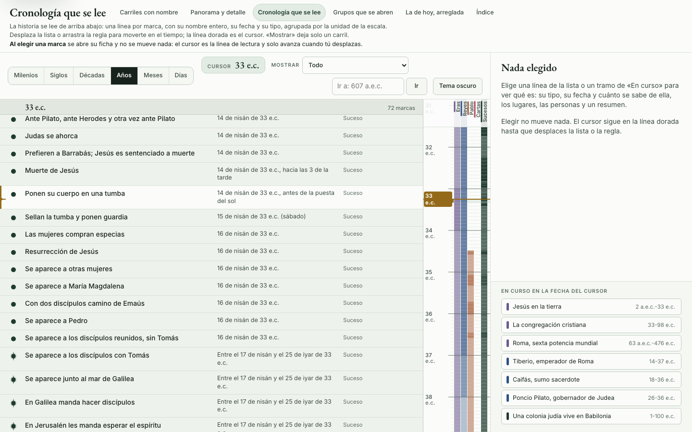</td>
<td>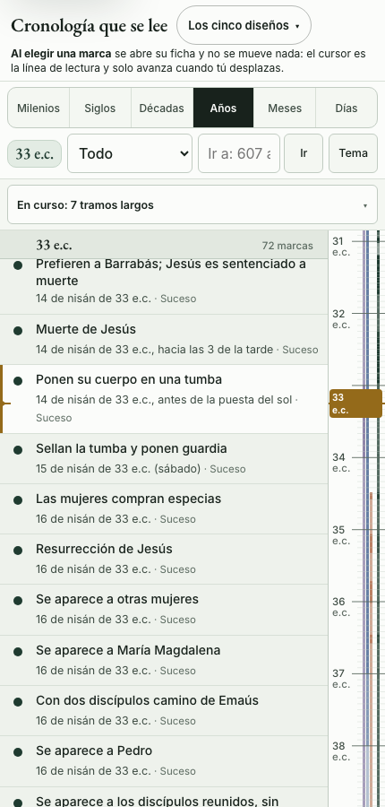</td>
</tr>
</table>

**Cómo se trabaja.** El tiempo baja por la página. Cada marca es una línea con su nombre, su fecha y su tipo, bajo cabeceras de la unidad de la escala. A la derecha hay una regla fina con todo el tramo, con una columna por tipo y su nombre arriba. Desplazar la lista o arrastrar la regla mueve el tiempo. «En curso» dice qué tramos largos contienen la fecha del cursor, y también los sucesos cuya fecha abarca diez años o más. «Mostrar» deja la lista en un solo carril: Pablo, los reyes, las eras o los sucesos. «Ir a» lleva a una fecha escrita, un año o un día.

**Qué hace un clic.** Elige la línea y abre su ficha. El cursor no se mueve. No lo hizo en ninguno de los 20 clics. Para llevarlo a la marca está el botón «Llevar el cursor aquí» de la ficha. Es el único diseño en el que el cursor nunca acaba en un primer momento.

**Cómo se leen los nombres.** Una lista no tiene choques. Todas las marcas tienen su línea con el nombre entero, en todas las escalas. Las palabras dicen también la fecha y la certeza: «c. otoño de 50 e.c.», «cálculo nuestro», «fecha incierta». Los sucesos de un mismo día van en el orden del relato: el 14 de nisán empieza por «Celebra la Pascua con los apóstoles» y acaba en «Ponen su cuerpo en una tumba».

**A qué renuncia.**
- Deja de ser un dibujo del tiempo. Los tramos no se ven uno al lado de otro.
- Caben 18 líneas enteras a 1440 px (20 contando las que corta el borde) y 10 a 430 px (12). La lista mide 62 678 px en años.
- Leer mueve la fecha, porque el cursor es la línea de lectura. El mapa se redibujaría mientras alguien lee.
- En el móvil, la ficha abre corta encima de la cabecera y no tapa ninguna línea de la lista; «Ver la ficha entera» la abre del todo.

**Qué cuesta llevarlo al sitio.** El dibujo de la franja se cambia entero por una lista y una regla, unas 650 líneas. El coste grande es el sitio en la pantalla. Una lista vertical no cabe en la franja de abajo. En el escritorio sería una columna junto al mapa. En el móvil sería la hoja, como en la [pantalla 06b](pantallas-mapa-y-tiempo.md#06--móvil).

### Grupos que se abren

Prototipo: [`mockups/linea/clusters/`](mockups/linea/clusters/index.html)

<table>
<tr>
<td width="77%">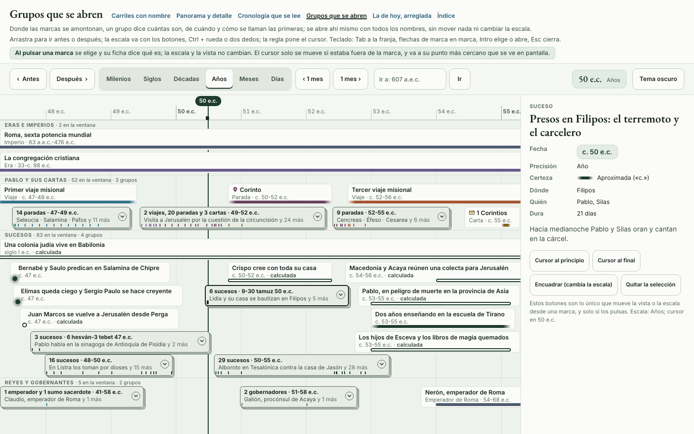</td>
<td>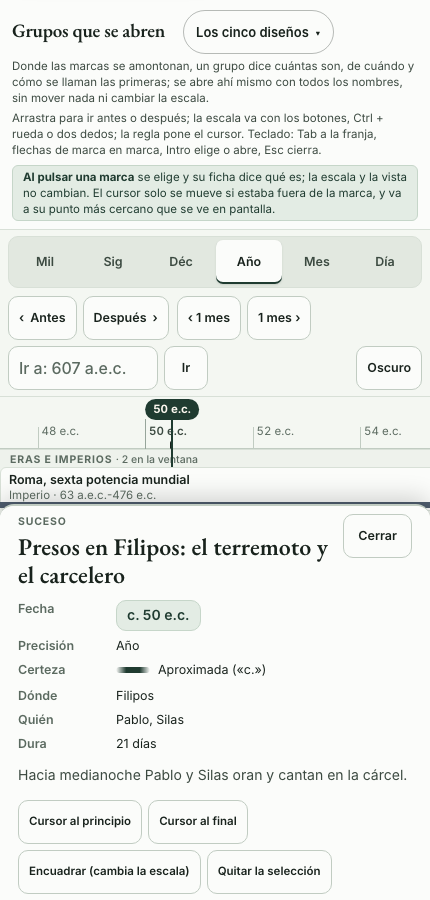</td>
</tr>
<tr>
<td>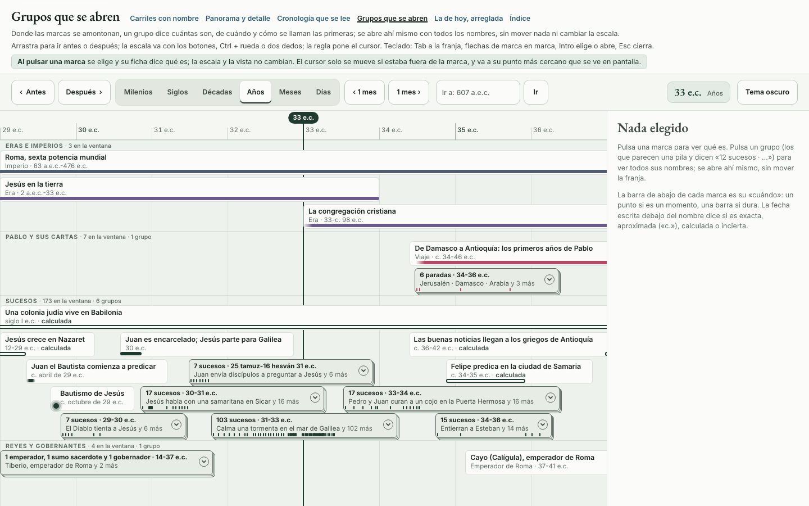</td>
<td>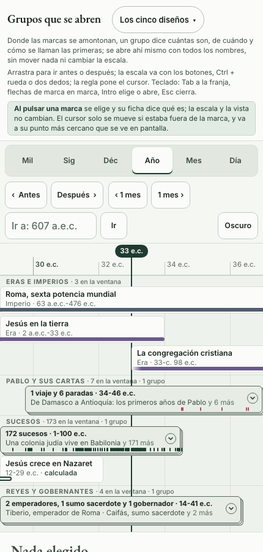</td>
</tr>
</table>

**Cómo se trabaja.** Cuatro bandas: eras e imperios, Pablo y sus cartas, sucesos, reyes y gobernantes. Donde las marcas caben, van solas con su nombre y su fecha. Donde se amontonan, forman un grupo. Las eras y los imperios no se agrupan nunca: su banda pide las filas que necesita. Pulsar un grupo abre una lista flotante con todos sus nombres. Arrastrar mueve el tiempo, la regla mueve el cursor y la escala cambia con sus botones o con Ctrl y la rueda; la rueda sola no la cambia. Tiene «Ir a» y botones de un paso.

**Qué hace un clic.** Elige la marca y abre su ficha, que dice qué hizo el cursor. El cursor solo se mueve si estaba fuera de la marca, y va a su punto más cercano, nunca a su final. En la prueba se movió en 12 de 44 clics. Un segundo clic en la marca elegida la deja elegida, como en los otros diseños.

**Cómo se leen los nombres.** El grupo es la mejor pieza de los cinco diseños. Dice cuántas marcas tiene, de qué tipo, de qué fechas y cómo se llaman las primeras: «2 viajes, 20 paradas y 3 cartas · 49-52 e.c.». En su borde de abajo hay una raya por cada marca, en su fecha. Abrirlo no mueve nada, y elegir un nombre de la lista no la devuelve arriba. Ya no se pierde ninguna marca. En 16 ventanas, de milenios a días y a los dos anchos, cada marca de la ventana está en una pieza o en un grupo, y la cabecera de cada banda cuenta lo que dibuja. Antes faltaban 17 marcas en 8 de esas ventanas, entre ellas Tiberio, Caifás, Poncio Pilato y Claudio.

**A qué renuncia.**
- Casi todo espera detrás de un toque. En 50 e.c. van solas 16 marcas a 1440 px y 4 a 430 px. En días, a 1440 px, los sucesos de la semana del 14 de nisán van en un solo grupo.
- Al arrastrar 400 px a 1440 px, las marcas solas cambian de fila: 43 veces en décadas, 7 en años, 49 en meses y 24 en días. Las que llegan al borde derecho se apoyan en él y se recolocan. A 430 px, ninguna.
- La lista de un grupo tapa la banda de debajo mientras está abierta.

**Qué cuesta llevarlo al sitio.** Se quedan el modelo de tiempo, el eje, el cursor, la reproducción y el minimapa. Se vuelven a escribir el dibujo de las marcas y el puntero, entre 700 y 900 líneas. Pide el modo grande que el sitio ya tiene.

### La de hoy, arreglada

Prototipo: [`mockups/linea/minimal/`](mockups/linea/minimal/index.html)

<table>
<tr>
<td width="77%">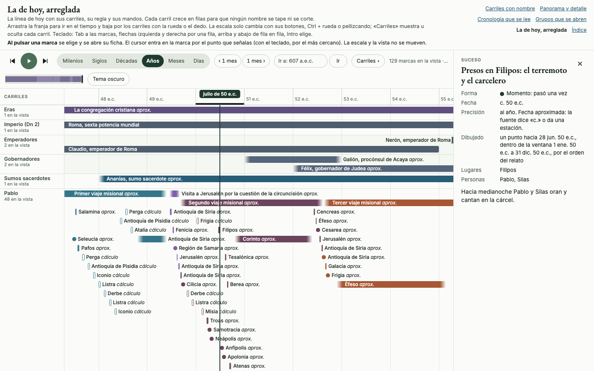</td>
<td>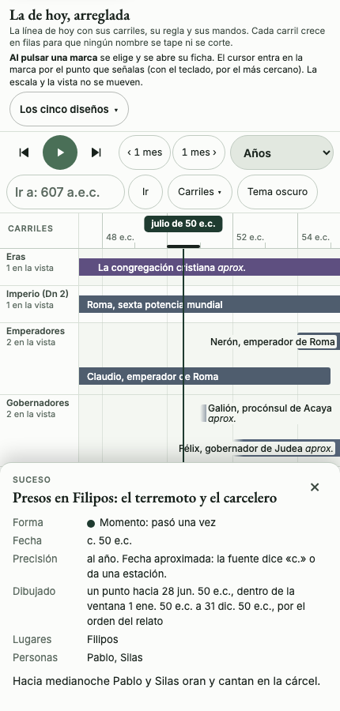</td>
</tr>
<tr>
<td>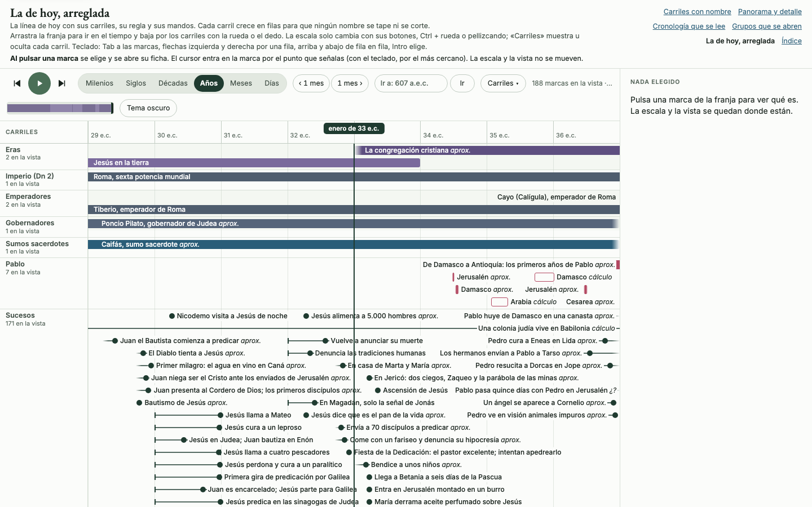</td>
<td>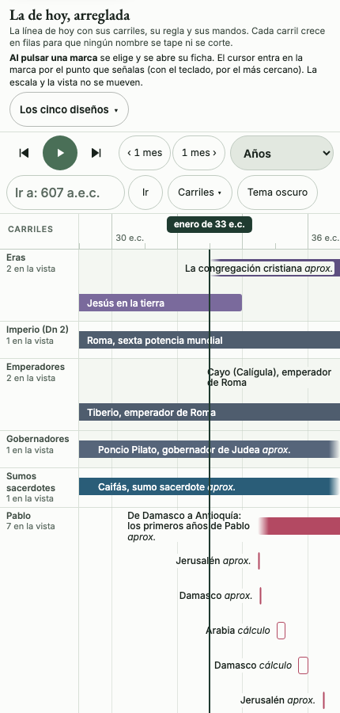</td>
</tr>
</table>

**Cómo se trabaja.** La línea de hoy con sus mandos: marca anterior, reproducir, marca siguiente, las seis escalas, los pasos del cursor, «Ir a», el menú «Carriles» y el minimapa. Los mismos carriles, y cada uno crece en filas hasta que cabe todo. Un carril sin nada en la vista no ocupa sitio, y una línea al final dice cuáles son. Arrastrar los carriles mueve el tiempo y la rueda baja por ellos. La regla mueve el cursor, como hoy. Con el teclado, la franja es una sola parada de tabulador y las flechas van de fila en fila.

**Qué hace un clic.** Elige la marca y abre su ficha, que dice qué hizo el clic. El cursor entra en la marca por el punto que señalas, nunca por su final. Es la regla de hoy para un clic en un carril vacío, llevada también a las marcas. En la prueba el cursor se movió en 28 de 42 clics. Con el dedo, un toque a menos de 12 px de una marca la elige.

**Cómo se leen los nombres.** Nada se agrupa. Todas las marcas de la vista tienen su nombre entero en la franja: 123 en 50 e.c. y 185 en la ventana llena. Una barra que solo asoma unos píxeles por un borde no cuenta todavía como vista. Un nombre que no cabe junto a su marca en el borde pasa a otra fila con sitio. Cada forma dice una sola cosa. Hueco es solo fecha calculada, y lo dudoso se difumina y lleva «¿?».

**A qué renuncia.**
- Se paga en alto. En 50 e.c. los carriles miden 1928 px a 1440 px y 5483 px a 430 px. En milenios, 22 190 px y 50 416 px.
- No decide qué enseñar en cada escala. Lo enseña todo.
- Al arrastrar 400 px, casi ninguna marca cambia de fila en su carril (1 en décadas y 1 en años a 1440 px; 20 en años a 430 px), pero los carriles de arriba crecen o aparecen y empujan a los de abajo: 241 movimientos en décadas y 202 en meses a 1440 px, 623 en meses a 430 px.

**Qué cuesta llevarlo al sitio.** Es el cambio más pequeño. Se quedan los mandos, el eje, los meses, el minimapa y el menú de carriles. Se cambian el dibujo y el rotulado, entre 800 y 1000 líneas, un 40 % de `linea.js`. La franja pasa a desplazarse en vertical.

### Lo que hay que cambiar con cualquiera de los cinco

- `seleccionar`, en `site/js/base.js`, deja de mover el cursor al momento de la marca y de centrar la vista.
- El encuadre de eras e imperios al elegirlos desaparece de `site/js/tipos/periodo.js` y de `site/js/linea.js`.
- Arrastrar la franja pasa a mover el tiempo. Hoy mueve el cursor.
- La franja pasa a ser una sola parada de tabulador, con flechas para ir de marca en marca.
- La [pantalla 05](pantallas-mapa-y-tiempo.md#05--línea-de-tiempo) dice que pulsar una era acerca el zoom y la [06](pantallas-mapa-y-tiempo.md#06--móvil), que un toque en un tramo va a su principio. El principio 3 del [README](README.md#principios-de-diseño) pide rayar los cálculos nuestros. Las tres frases chocan con las reglas y se cambian con el diseño elegido.

## 4. Los diseños, regla por regla

Tres jueces probaron los cinco prototipos en un navegador real. Cada uno miró una cosa: el **escritorio** con ratón y teclado, el **móvil** de 430 px con el dedo, y la **lectura**, que es si las formas se entienden sin leyenda y si lo usa todo el mundo. Cada celda da los tres veredictos en ese orden.

| Diseño | R1 elegir | R2 escala | R3 vista | R4 nombres | R5 formas | R6 cantidad | Nota |
|---|---|---|---|---|---|---|---|
| Carriles con nombre | sí · en parte · sí | sí · sí · sí | sí · sí · sí | en parte · en parte · en parte | sí · sí · en parte | sí · sí · sí | 7,5 · 7 · 6,5 |
| Panorama y detalle | en parte · sí · en parte | sí · sí · sí | en parte · sí · en parte | en parte · en parte · en parte | sí · sí · sí | sí · en parte · sí | 6 · 6 · 6 |
| Cronología que se lee | sí · sí · sí | sí · sí · sí | sí · sí · sí | sí · sí · sí | sí · sí · sí | en parte · en parte · en parte | 7 · 8 · 8 |
| Grupos que se abren | en parte · en parte · en parte | sí · sí · sí | en parte · sí · sí | no · en parte · en parte | sí · sí · sí | en parte · en parte · en parte | 5 · 5 · 7 |
| La de hoy, arreglada | sí · sí · sí | sí · sí · sí | sí · en parte · en parte | sí · en parte · en parte | sí · sí · en parte | en parte · en parte · no | 6,5 · 4,5 · 5 |

El orden de cada juez:

| Juez | 1.º | 2.º | 3.º | 4.º | 5.º |
|---|---|---|---|---|---|
| Escritorio | Carriles | Cronología | La de hoy | Panorama | Grupos |
| Móvil | Cronología | Carriles | Panorama | Grupos | La de hoy |
| Lectura | Cronología | Grupos | Carriles | Panorama | La de hoy |

Los veredictos son de antes de los arreglos: los jueces probaron los prototipos tal como salieron de los diseñadores. Lo que encontraron y arreglamos está en cada diseño, en la parte 3. Lo que queda está en «A qué renuncia».

**En qué están de acuerdo.** Ningún diseño cambia la escala con un clic. «Cronología que se lee» es el único que cumple de R1 a R4 para los tres. «La de hoy, arreglada» no gana en ninguna mirada.

**En qué no.**
- **Quién gana.** Dos jueces ponen primero la lista. El de escritorio pone primero los carriles, porque la lista deja de ser un dibujo del tiempo.
- **«Grupos que se abren».** El juez de lectura lo pone segundo, por su contraste y porque el grupo funciona bien con teclado y lector de pantalla. Los otros dos lo ponen último o penúltimo. En R4 el de escritorio dice «no» porque encontró marcas que faltan. Lo comprobamos y faltaban, también en la vista de 50 e.c. a 430 px. Ya no falta ninguna.
- **«Panorama y detalle» y R3.** Dos jueces vieron que abrir un «+N más» mueve el carril. El de móvil lo dio por bueno porque el tiempo no se mueve. Lo medimos: 40 de 71 marcas cambiaban de sitio. Ahora el grupo abre su lista en la ficha y la franja no se mueve.
- **«Carriles con nombre» y R5.** El juez de lectura leyó el nombre sobre una raya como algo que duró, y es un momento dentro de una ventana. El punto sobre una línea con topes de «Panorama» dice lo mismo y lo leyó bien, así que los carriles lo llevan ahora también.
- **«Carriles con nombre» y R1.** El de móvil dice «en parte» porque en el móvil la ficha quedaba debajo de la franja y no se veía qué es la marca. Ahora es una hoja que siempre se ve, abajo o arriba según dónde está lo tocado.

Lo que medimos nosotros en las dos ventanas de las capturas, después de los arreglos:

| Diseño | 50 e.c., 1440 px | 50 e.c., 430 px | 29-37 e.c., 1440 px | 29-37 e.c., 430 px |
|---|---|---|---|---|
| Carriles con nombre | 56 con nombre, 12 grupos | 27 con nombre, 9 grupos | 45 con nombre, 7 grupos | 24 con nombre, 6 grupos |
| Panorama y detalle | 67 con nombre, 12 grupos | 33 con nombre, 8 grupos | 46 con nombre, 10 grupos | 25 con nombre, 5 grupos |
| Cronología que se lee | todas, 18 líneas enteras a la vista | todas, 10 | todas, 16 | todas, 10 |
| Grupos que se abren | 16 solas, 9 grupos | 4 solas, 3 grupos | 12 solas, 8 grupos | 4 solas, 3 grupos |
| La de hoy, arreglada | todas, 1928 px de alto | todas, 5483 px | todas, 3333 px | todas, 8164 px |

En los cuatro diseños con grupos, cada grupo dice al menos un nombre o, en «Panorama y detalle» si no cabe, sus fechas. En 14 ventanas, de milenios a días y a los dos anchos, ningún nombre quedó cortado por un borde en «Carriles con nombre», «Panorama y detalle» y «La de hoy, arreglada». En «Grupos que se abren», un nombre empieza 1 px antes del borde izquierdo en una de ellas.

Al arrastrar 400 px en 20 pasos, cuántas veces cambió de fila una marca que seguía en pantalla, en décadas, años, meses y días a 1440 px (antes de los arreglos, lo que midieron los jueces):

| Diseño | Ahora | Antes |
|---|---|---|
| Carriles con nombre | 2 · 37 · 59 · 10 | 188 · 321 · 94 · 350 |
| Panorama y detalle | 0 · 0 · 5 · 0 | 196 · 294 · sin medir · 155 |
| Grupos que se abren | 43 · 7 · 49 · 24 | 20 · 8 · sin medir · 30 |
| La de hoy, arreglada | 1 · 1 · 0 · 0 | 2344 · 1618 · 149 · 1065 |

En «Carriles con nombre» la cuenta incluye el carril de Pablo que aparece a mitad del arrastre y empuja lo de debajo. En «Panorama y detalle» y «La de hoy, arreglada» las marcas no cambian de fila, pero un carril que crece arriba empuja a los de abajo: 57, 30, 210 y 0 movimientos en el primero, y 241, 72, 202 y 0 en el segundo. En «Grupos que se abren» las marcas solas junto al borde derecho se siguen recolocando.

## 5. Qué recomendamos

Recomendamos una mezcla: **«Carriles con nombre» como franja y «Cronología que se lee» como forma de leerlo todo.** La línea del sitio es una franja bajo el mapa y comparte la fecha con él, así que en el escritorio tiene que seguir siendo un dibujo del tiempo. De las cuatro franjas, la de carriles es la que dos de los tres jueces ponen más arriba. Conserva los carriles que ya conoce quien usa el sitio, dice en cada carril cuánto enseña y cuánto agrupa, y en días le da una pieza a cada marca. La lista es el único diseño que cumple de R1 a R4 sin peros, y en el móvil es el gesto natural, pero sola no enseña qué pasaba a la vez. Juntas se cubren. La franja enseña el tiempo y la lista dice todos los nombres.

La mezcla, pieza por pieza:

1. **Escritorio.** La franja de «Carriles con nombre», con su máximo de filas por escala, en un panel más alto que el de hoy.
2. **El clic**, de «Cronología que se lee». Elegir no mueve nada, tampoco el cursor. La ficha lleva «Llevar el cursor aquí» y, de «Panorama y detalle», «Encuadrar: cambia la escala».
3. **El grupo**, de «Grupos que se abren». Cuántas marcas, de qué fechas, los primeros nombres enteros y una raya por marca. Las eras y los imperios no se agrupan nunca. En días no hay grupos.
4. **Leerlo todo.** Pulsar un grupo abre, en la columna de la ficha, la lista de «Cronología que se lee» con sus marcas. «Ver todas las filas» se queda en la cabecera del carril. No abrimos los grupos dentro de la franja, porque eso mueve las marcas de alrededor.
5. **Móvil.** La hoja lleva la lista, con un filtro por carril para seguir solo a Pablo o solo a los reyes. La ficha es una zona fija que siempre se ve, como en «Panorama y detalle».
6. **Las palabras**, de «Panorama y detalle»: «aprox.», «calculada» y «dudosa» después del nombre, y el punto sobre una línea con topes para un momento dentro de una ventana.
7. **Los mandos.** «Ir a» de la lista. Marca anterior, reproducir y marca siguiente, de «La de hoy, arreglada».

Las tres cosas que pedíamos arreglar antes de llevarlo al sitio ya están arregladas en los prototipos y medidas. Una pieza no cambia de fila mientras se arrastra: su fila sale de toda la historia, no de la vista. En «Carriles con nombre», «Panorama y detalle» y «La de hoy, arreglada» ningún nombre empieza fuera del borde: se mete en el sitio libre de su fila o pasa al grupo. En «Grupos que se abren» queda uno que empieza 1 px antes del borde izquierdo en una de las 14 ventanas. Y pellizcar la lista cambia la escala sin ampliar la página. Además, el cursor no queda nunca en el final de una marca, que es el primer instante de lo que viene después. Quedan dos cosas por resolver en el sitio: un carril que aparece a mitad de un arrastre empuja a los de debajo, y en días los sucesos del día más lleno quedan por debajo de los días anteriores de la semana.

No tomamos el desplazamiento de la lista como cursor. Las otras dos cosas que no queríamos, la rueda sin Ctrl como zoom y el cursor que viaja pegado al borde al arrastrar, ya no están en ningún prototipo.

## 6. Lo que decide el dueño

1. **¿Qué hace el cursor al pulsar una marca?** Se queda quieto y la ficha tiene un botón, va al punto señalado, o da el paso más corto hasta la marca. Recomendamos que se quede quieto. Las otras dos reglas acaban a veces en el primer momento de la marca, y cualquier cambio de fecha redibuja el mapa.
2. **¿Puede crecer el panel de la línea?** Todos los diseños piden más alto que los 250 px de hoy. Recomendamos que en el escritorio abra en el modo grande que el sitio ya tiene, de hasta 600 px, y que se pueda encoger con el separador.
3. **¿Vale que las escalas amplias nombren poco?** En décadas y en siglos no caben todos los nombres en ninguna franja. La ventana más llena pediría 157 filas en décadas y 262 en siglos. Recomendamos grupos que dicen sus primeros nombres, con la lista completa a un clic.
4. **En el móvil, ¿lista o franja?** Recomendamos la lista. La franja de carriles queda para pantallas anchas.
5. **¿Desplazar la lista mueve el cursor?** Recomendamos que no. Leer no debería cambiar la fecha, igual que elegir. El cursor se mueve con la regla, con «Ir a» y con el botón de la ficha.
6. **¿Arrastrar la franja mueve el tiempo?** Hoy mueve el cursor. Las cuatro franjas lo cambian: arrastrar mueve la vista y la regla mueve el cursor. Recomendamos el cambio.
7. **¿Las reglas 2 y 3 atan también a los mandos?** Los botones de escala, la fecha escrita, el minimapa y «Encuadrar» existen para mover. Recomendamos que las reglas valgan para las marcas, y que un mando pueda mover la vista o la escala si su nombre lo dice.
8. **¿Qué hace un segundo clic en la marca elegida?** Hoy la suelta. En cuatro de los cinco diseños sigue elegida. Recomendamos que siga elegida y que se suelte con Esc o pulsando en vacío.
9. **¿Añadimos dos datos?** Los datos no dicen si un suceso dura o pasa una vez, ni el orden de los sucesos de un mismo día. El 14 de nisán del 33 tiene 13 sin orden. Los prototipos deducen ese orden de los pasajes de cada suceso, y sale bien, pero es una deducción. Recomendamos añadir los dos datos, en un cambio de datos aparte.
10. **¿Entran los carriles de persona en la comparación?** Los prototipos no los tienen. Recomendamos diseñarlos sobre el diseño elegido, no antes.

## 7. Cómo abrir los prototipos

Desde la raíz del repositorio:

```bash
python3 -m http.server 8000 --bind 127.0.0.1 -d docs/ideas
```

Hay que servir `docs/ideas` entero. Si se sirve solo `docs/ideas/mockups/linea`, los prototipos no encuentran la letra del kit: lo dicen arriba, en un aviso, y salen con la letra del sistema. Los nombres no se montan: se miden con la misma letra con la que se pintan.

| Diseño | Dirección |
|---|---|
| Los cinco, con una frase de cada uno | `http://127.0.0.1:8000/mockups/linea/` |
| Carriles con nombre | `http://127.0.0.1:8000/mockups/linea/lanes/` |
| Panorama y detalle | `http://127.0.0.1:8000/mockups/linea/overview/` |
| Cronología que se lee | `http://127.0.0.1:8000/mockups/linea/list/` |
| Grupos que se abren | `http://127.0.0.1:8000/mockups/linea/clusters/` |
| La de hoy, arreglada | `http://127.0.0.1:8000/mockups/linea/minimal/` |

Todos abren en 50 e.c., en años, con el tema del sistema. La dirección guarda la fecha, la escala, la vista, la marca elegida y el tema, con las mismas claves en los cinco, así que una vista se puede copiar y pegar. Cada prototipo tiene arriba enlaces a los otros cuatro, que abren el otro en la misma fecha, escala y marca, y un botón de tema.

De dónde salen los datos y cómo se regeneran está en el [README de los prototipos](mockups/linea/README.md).
