# Viajes en la línea y en el mapa: cuatro preguntas

## Elegido

**A, B, A, B**, lo que recomendábamos, y ya está en el sitio:

1. **A.** El carril de cada viajero, elegido o fijado, lleva un tramo por viaje en su color del mapa, sus paradas debajo y, después, los sucesos y los sitios donde vivió. «Viajes de Pablo» hace lo mismo y conserva su id `pablo`. Pulsar una marca del carril ya no lo quita.
2. **B.** Cualquier nombre de carril va en dos líneas, o en tres en el teléfono, y el carril crece hasta su nombre. Ninguno se corta a 1440 ni a 430, tampoco fijado ni con «Letra grande».
3. **A.** Con una persona elegida, el mapa enseña lo mismo que sin nada elegido: el viaje en curso. Pablo en el 44 pasa de 8 rutas suyas a 1, y Jesús en el 32 de 19 rutas a 10.
4. **B.** Campo cerrado `repeats: yearly` en los tres viajes de cada año, comprobado con 1Sa 1:3, 1Sa 7:16 y Lu 2:41. Se ve como «↻ cada año» tras el nombre en la línea, sobre la ruta y en la leyenda del mapa.

Así queda con Jesús, David, Abrahán, Pablo y Samuel elegidos: el ordenador a la izquierda y el teléfono a la derecha, con el tema claro arriba y el modo reunión abajo.

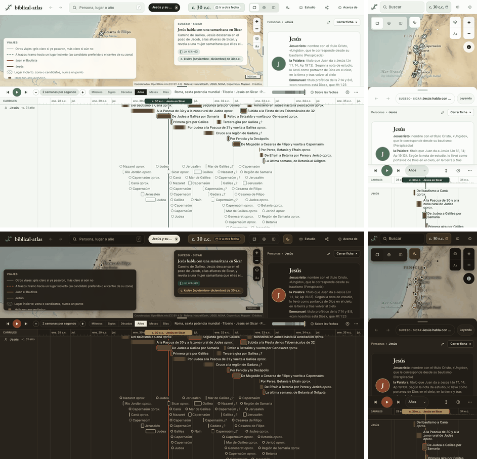

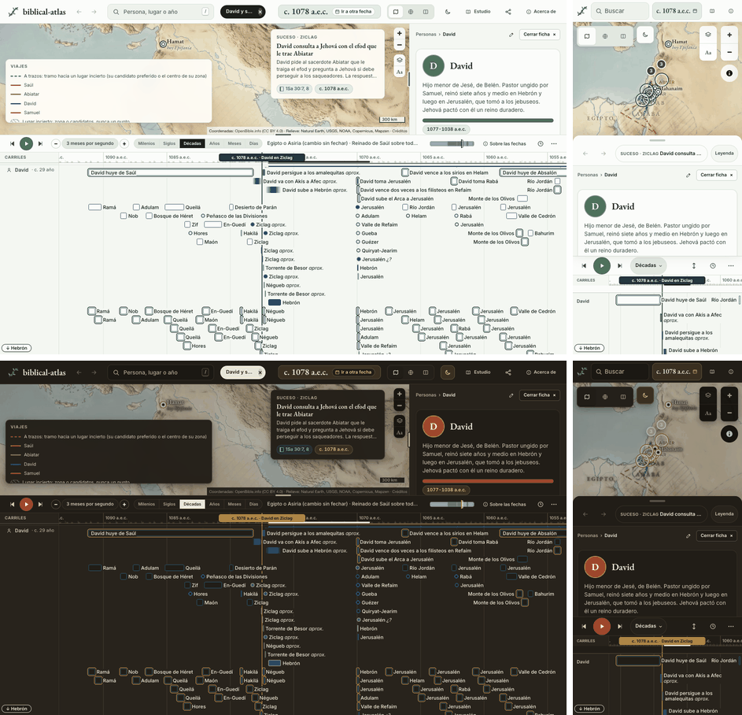

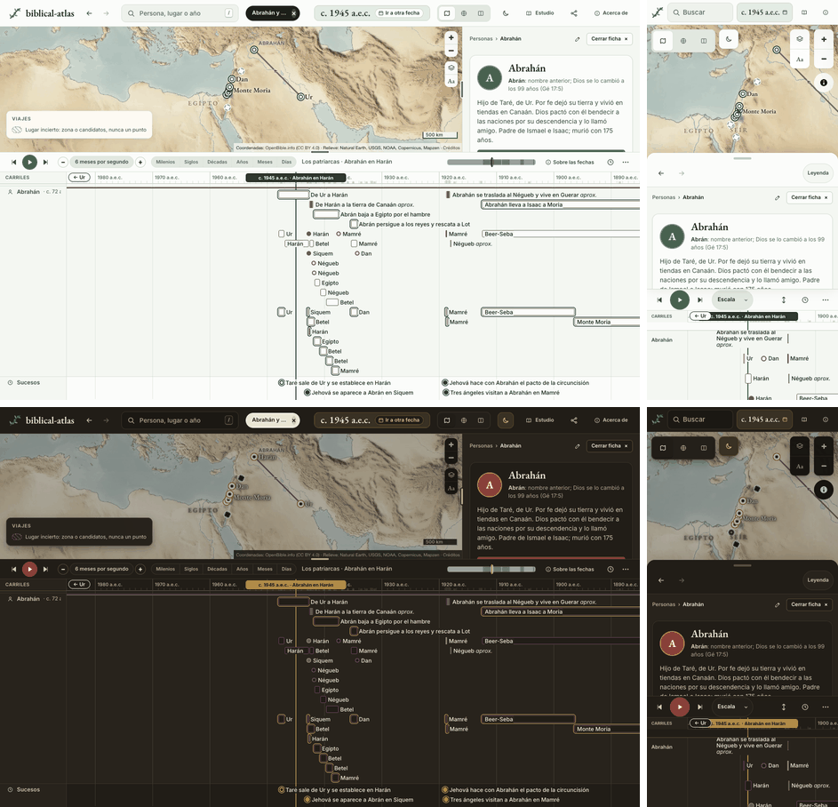

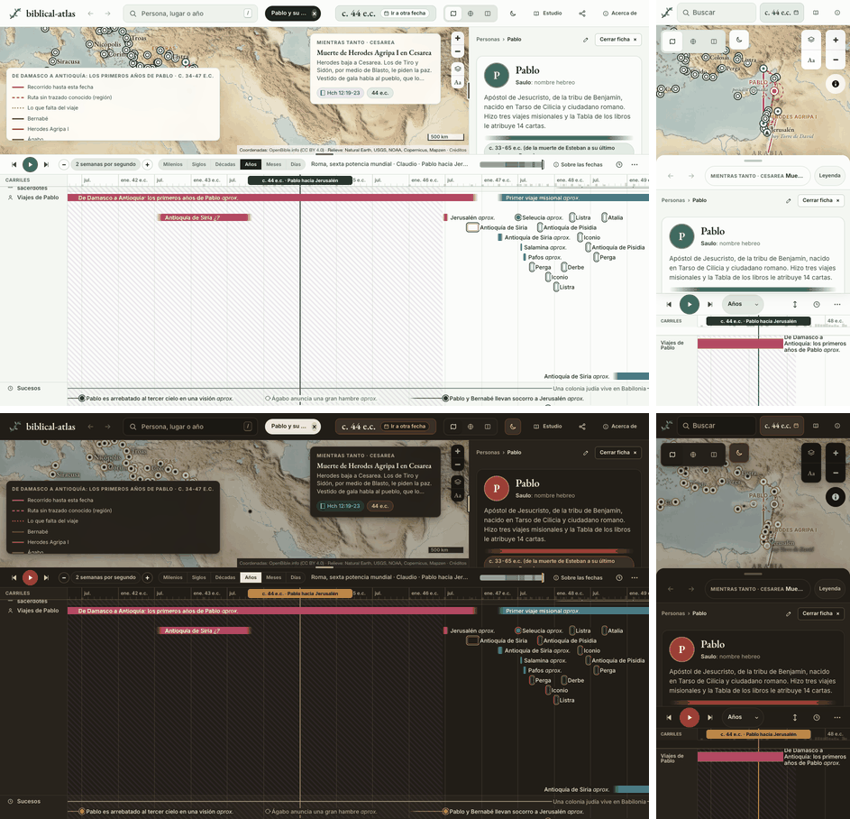

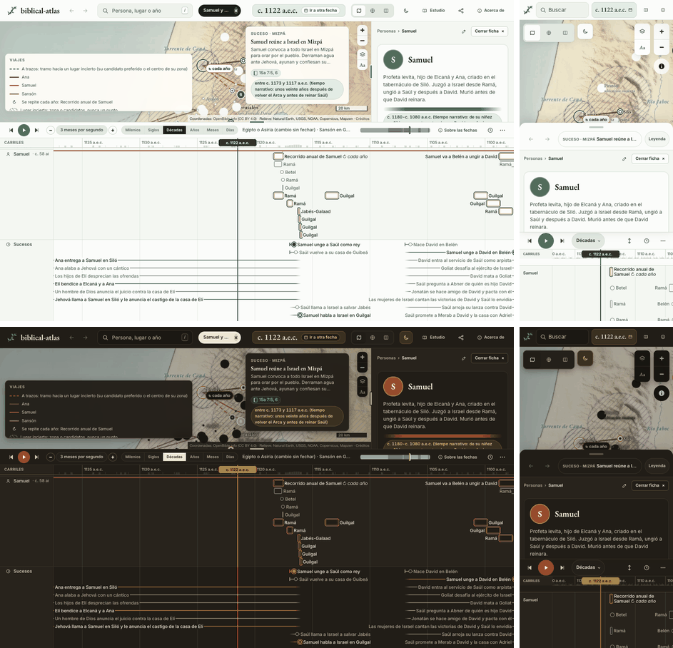

Desde que viajan 125 personas, la línea de tiempo y el mapa tratan sus viajes de cuatro maneras que no encajan entre sí. Solo Pablo tiene un carril con un tramo por viaje. Solo «Viajes de Pablo» parte su nombre en dos líneas. Con Pablo elegido, el mapa vuelve a pintar todos sus viajes, el de la fecha en color y el resto en gris. Y los viajes que se hacían cada año salen como si se hubieran hecho una vez. Este documento plantea cada pregunta con sus opciones, una maqueta por opción sobre el sitio de verdad, lo que cuesta construirla y lo que recomendamos. No cambia nada de `site/` ni de `data/`.

Cada imagen enseña el ordenador a 1440 × 900 y el teléfono a 430 de ancho, con el tema claro y el modo reunión.

## 1. Los viajes de los demás viajeros en la línea

El carril fijo «Viajes de Pablo» pinta hoy un tramo por viaje y debajo sus paradas (`marcasPablo` en [`site/js/linea.js`](../../site/js/linea.js)). Al elegir a cualquier otro de los 124 viajeros sale un carril con su nombre, y sus paradas van sueltas, mezcladas con los sucesos que lo sitúan y los sitios donde vivió (`carrilPersona`). No se ve dónde empieza ni dónde acaba cada viaje. Los ejemplos son Jesús (16 viajes), David (13) y Abrahán (6).

### A. Cada viajero elegido lleva sus viajes como barras, como Pablo

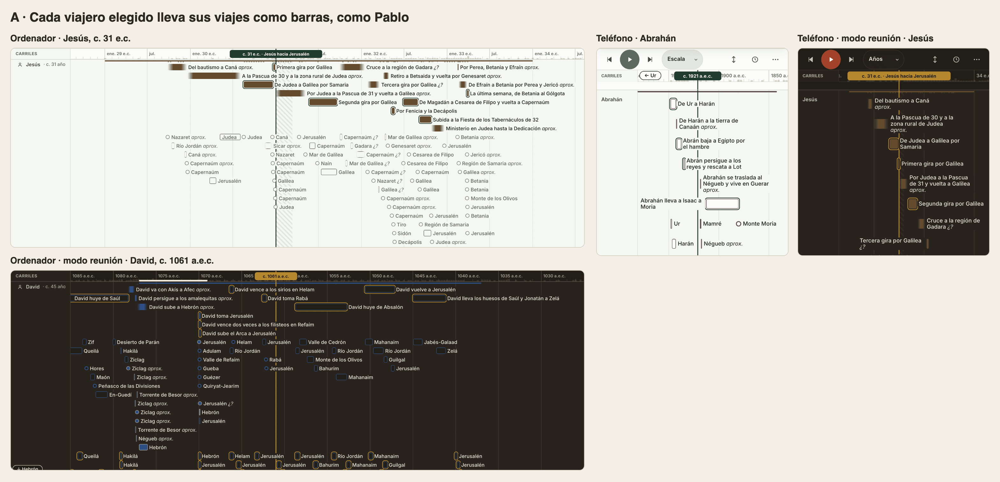

El carril de la persona hace lo mismo que el de Pablo: un tramo por viaje con su nombre, sus paradas en filas propias debajo y, al final, los sucesos y los sitios donde vivió. Un viajero fijado conserva sus barras, así que se pueden comparar dos, como Pedro y Pablo. Los tramos de un viajero llevan todos su color, el mismo que en el mapa, porque el mapa da un color por persona y solo a Pablo uno por viaje.

**Coste.** Pequeño. `carrilPersona` usa la misma función que `marcasPablo`, generalizada a cualquier persona, y [`site/js/linea-filas.js`](../../site/js/linea-filas.js) admite un tercer grupo de filas. [`tests/site/timeline-marks.test.mjs`](../../tests/site/timeline-marks.test.mjs) comprueba los tramos de Jesús, David y Abrahán.

### B. Un solo carril «Viajes»: el de quien está elegido, y el de Pablo si no hay nadie

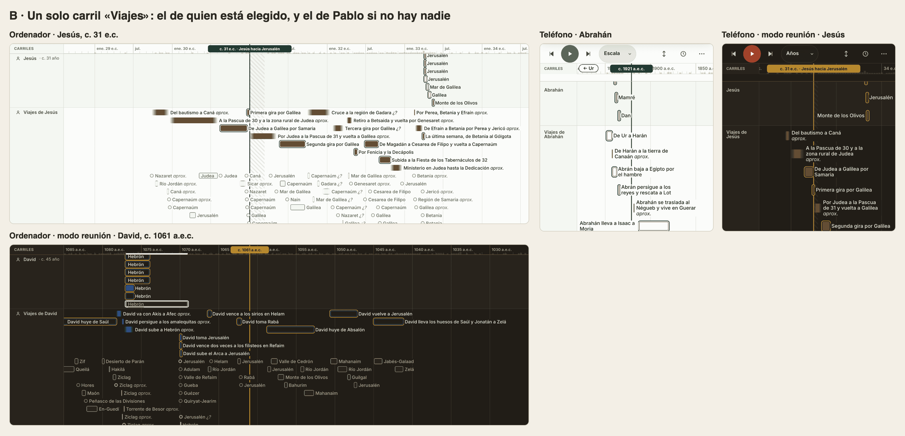

El carril fijo cambia de dueño con la selección: «Viajes de Jesús», «Viajes de David» y, sin nadie elegido, «Viajes de Pablo». Para no repetir paradas, el carril de la persona se queda con los sucesos y los sitios donde vivió. Una persona queda partida en dos carriles, el contenido de uno cambia según lo que se elige y no se pueden ver los viajes de dos personas a la vez. El id `pablo` de `carriles=pablo` en los enlaces compartidos pasaría a significar «el carril de viajes».

**Coste.** Medio. `elegirCarriles` cambia el dueño y el nombre del carril en cada selección, `carrilPersona` quita las paradas de viaje y hay que decidir qué hace un enlace viejo con `carriles=pablo`.

### C. Como hoy

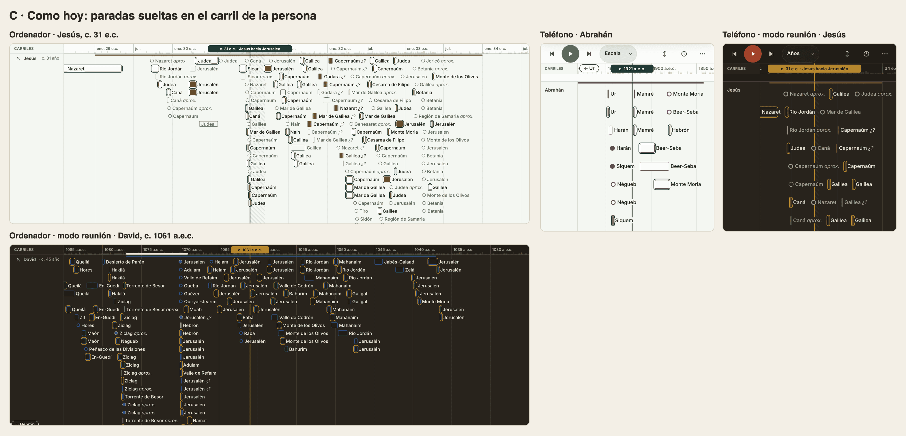

Sin coste. Los viajes de los demás siguen sin principio ni fin visibles en la línea.

**Recomendamos A.** Es una sola regla para los 125 viajeros, Pablo incluido, y no añade carriles. Es además la base de la pregunta 4.

## 2. Nombres de carril en dos líneas

Hoy solo «Viajes de Pablo» puede ir en dos líneas ([`site/css/linea.css`](../../site/css/linea.css)). Los demás se cortan con «…». Medido en el navegador: a 1440 se cortan «Reyes · Persia y Babilonia», «Reyes · Samaria y Tirzá», «Reyes · Jerusalén» y «Sumos sacerdotes». A 430 se cortan además «Imperio (Dn 2)» y «Gobernadores».

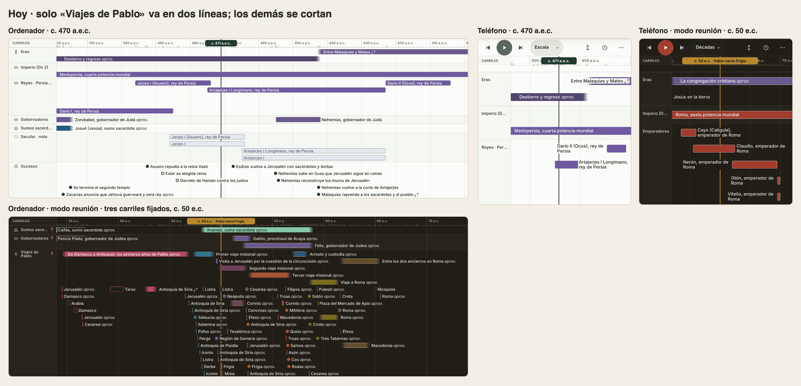

### A. Todos en una línea, con la columna de nombres más ancha

El nombre más largo, «Reyes · Persia y Babilonia», necesita 154 px de texto. Con el icono, los márgenes y la chincheta de un carril fijado, la columna pasa de 150 a 236 px en el ordenador. En el teléfono pasa de 92 a 160 px, y la franja de las marcas baja de 338 a 270 px, un 20 % menos.

**Coste.** Dos líneas de CSS. El precio es el ancho que pierde la línea, sobre todo en el teléfono.

### B. Todos pueden ir en dos líneas, como «Viajes de Pablo»

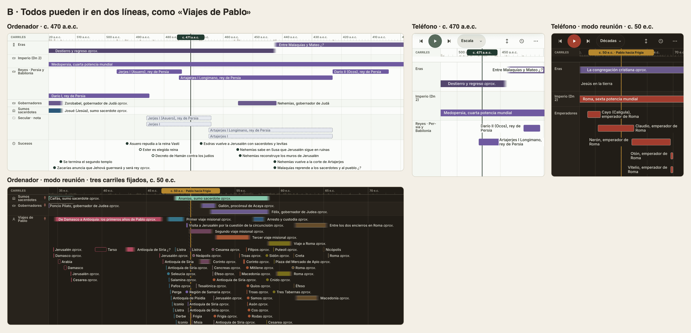

La regla de «Viajes de Pablo» pasa a todos. En el ordenador van en dos líneas «Reyes · Persia y Babilonia», «Sumos sacerdotes» y, fijado, «Viajes de Pablo». En el teléfono van en dos líneas casi todos, «Reyes · Persia y Babilonia» en tres, y «Gobernadores» se parte con guion porque es una sola palabra. Ningún nombre de los medidos se corta.

**Coste.** Tres líneas de CSS. La prueba que añadimos para «Viajes de Pablo» se extiende a todos los nombres.

### C. Nombres más cortos, todos en una línea

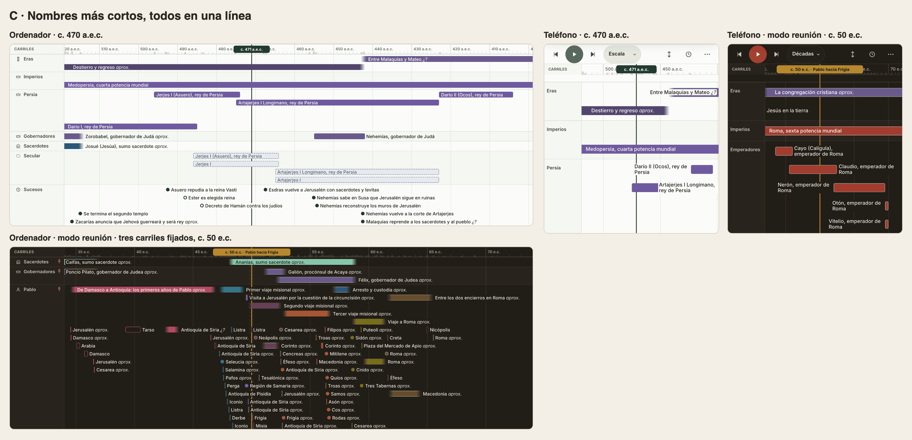

«Imperio (Dn 2)» pasa a «Imperios», «Sumos sacerdotes» a «Sacerdotes», «Secular · nota» a «Secular» y cada carril de reyes se nombra solo por su primera capital: «Jerusalén», «Samaria», «Persia». «Viajes de Pablo» vuelve a «Pablo». En el teléfono «Gobernadores» cabe quitando 6 px de margen. Se pierde exactitud. El carril «Persia» lleva también a Nabucodonosor y a Nabonido, en el teléfono no se ve la corona y «Samaria» parece un lugar, y «Pablo» deshace el cambio de nombre que hicimos porque el carril solo enseñaba viajes. Con la opción A de la pregunta 1 ese último pesa menos, porque todos los carriles de viajero llevan sus viajes y el nombre de la persona basta.

**Coste.** Pequeño en código (`catalogo` y `reinos` en `linea.js`), pero cambia nombres que ya se conocen.

**Recomendamos B.** Todos los nombres siguen enteros y exactos, la línea no pierde ancho y la regla ya existe para un carril.

## 3. Pablo elegido en el mapa

Desde la última corrección del mapa, sin nada elegido se ve un solo viaje de Pablo, el de la fecha. Al elegir a Pablo se vuelven a pintar todos: el de la fecha en color, los ya pasados en gris y los que aún no han empezado con su color. Con cualquier otra persona elegida pasa lo mismo. El ejemplo es Pablo en Corinto hacia el 51 e.c., durante el segundo viaje. En las maquetas del mapa se ha quitado la tarjeta «Mientras tanto», que tapaba las rutas.

### A. Solo el viaje en curso en la fecha del cursor

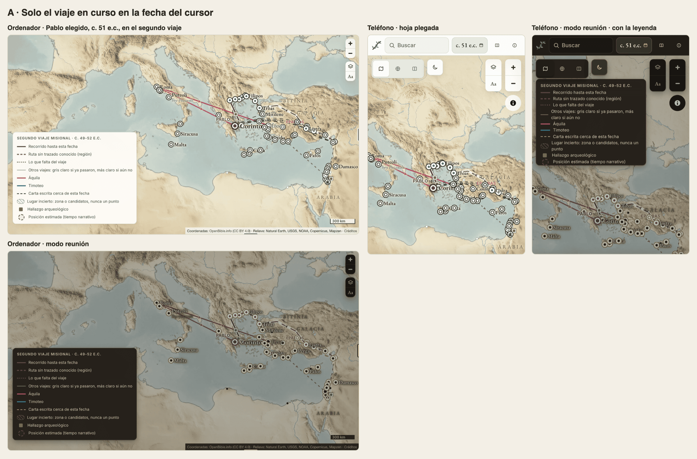

Elegir a Pablo no cambia las rutas: se ve el mismo viaje que sin selección, más los de otros viajeros de esa fecha, como Áquila y Timoteo. Pablo en el 44, en sus primeros años, pasa de 8 rutas suyas a 1. La misma regla con otros viajeros: Jesús en el 32 pasa de 19 rutas a 10, porque ocho de sus viajes caen en ese año y dos acabaron hace menos de uno. La vista de todos sus viajes queda en la línea, con la opción A de la pregunta 1, y en la lista de la ficha.

**Coste.** Una condición en `geoRutas` de [`site/js/mapa.js`](../../site/js/mapa.js). [`tests/site/map-journeys.test.mjs`](../../tests/site/map-journeys.test.mjs) cambia su caso de persona elegida.

### B. Como hoy: todos, el de la fecha en color y los demás en gris

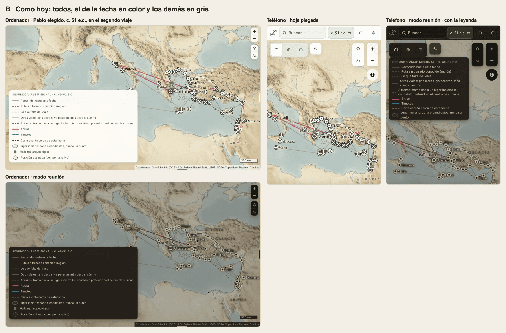

Sin coste. Con la persona elegida se vuelve a la vista que quitamos por no leerse: rutas grises y de color unas encima de otras, sobre todo en Grecia y Asia Menor.

### C. Todos, cada uno en su color, con la leyenda que los nombra

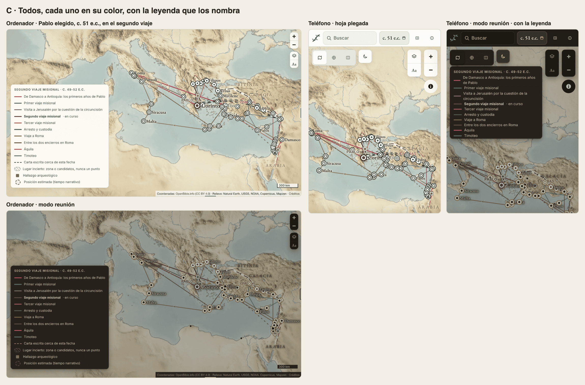

La leyenda nombra los ocho viajes con su color y marca el de la fecha. Solo funciona con Pablo, que tiene un color por viaje. Jesús, David y los demás tienen uno por persona, así que sus viajes saldrían todos del mismo color. Además la paleta se repite: Áquila sale del mismo rosa que «De Damasco a Antioquía». En el teléfono la leyenda tapa media pantalla.

**Coste.** Medio. `geoRutas` y `pintarLeyenda` en `mapa.js`, y un color por viaje para cada viajero si se quiere para todos.

**Recomendamos A.** Es la regla que ya tiene el mapa sin selección, y por la misma razón: un viaje solo se lee mejor que ocho juntos. Elegir a alguien pasa a decir «dónde está ahora», y la línea enseña su vida entera.

## 4. Viajes que se repiten cada año

Tres viajes cuentan una costumbre de cada año: Elcaná y Ana suben a Siló ([`elcana-sube-a-silo`](../../data/journeys/elcana-sube-a-silo.yaml), 1Sa 1:3), el recorrido anual de Samuel ([`recorrido-de-samuel`](../../data/journeys/recorrido-de-samuel.yaml), 1Sa 7:16) y la subida de la familia de Jesús a la Pascua ([`pascua-de-jesus-a-los-12`](../../data/journeys/pascua-de-jesus-a-los-12.yaml), Lu 2:41). Cada uno está escrito una vez, y la repetición solo se lee en su resumen. Las maquetas parten de la opción A de la pregunta 1, porque hoy esos viajes no tienen tramo propio en la línea.

### A. Como hoy: escrito una vez, con la nota en la ficha

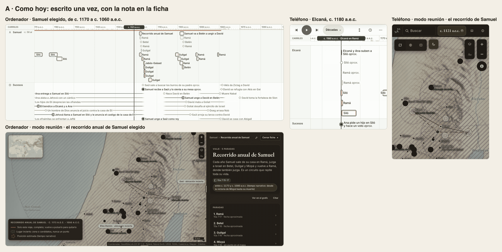

Sin coste. En la línea, el recorrido de Samuel ocupa un tramo corto hacia c. 1121 a.e.c., donde lo pone su suceso ancla, aunque su fecha diga de c. 1173 a c. 1080 a.e.c. Nada en la línea ni en el mapa dice que se repite.

### B. Una marca «cada año» en la línea y en el mapa

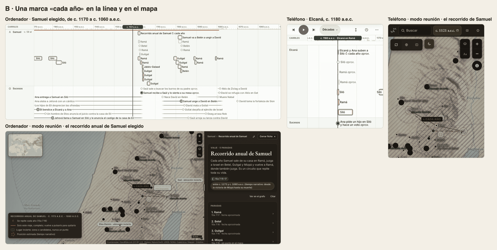

El nombre del viaje lleva «↻ cada año» en la línea, la ruta lleva la misma marca en el mapa y la leyenda dice «Se repite cada año» con su texto. Las fechas no cambian. Vale igual para los tres viajes.

**Coste.** Pequeño. Un campo cerrado nuevo en el YAML del viaje, `repeats: yearly`, con su fuente y su razón como cualquier hecho. Toca el [esquema](../investigacion/README.md), [`scripts/validate.py`](../../scripts/validate.py), [`scripts/build.py`](../../scripts/build.py), `linea.js`, `mapa.js` y la leyenda.

### C. Una muesca por año en todo el tiempo en que se repite

El tramo se alarga a todo el tiempo en que se repite, con una muesca por año: 93 en el de Samuel. El mapa queda como en B. Solo es posible cuando los datos dan ese tiempo. Samuel lo tiene en su propia fecha, pero Elcaná solo tiene c. 1180 a.e.c. y la Pascua solo el año 12 e.c., así que esos dos se quedarían como en B hasta que una publicación dé el periodo. Además las paradas siguen en c. 1121 mientras el tramo cubre 93 años. Las muescas solo se distinguen desde la escala de décadas.

**Coste.** El de B más el dibujo de las muescas y una regla para los viajes sin periodo.

**Recomendamos B.** Dice lo que dice el texto, que el viaje se repite, sin inventar años, y vale para los tres viajes con los datos de hoy.

## Lo que recomendamos, junto

**A, B, A, B.** Cada viajero lleva sus viajes como barras en su carril. Todos los nombres de carril pueden ir en dos líneas. Con alguien elegido, el mapa enseña solo el viaje en curso. Y los viajes de cada año llevan la marca «cada año».

La construcción tocaría `linea.js`, `linea-filas.js`, `linea.css`, `mapa.js`, el esquema de los viajes, `validate.py` y `build.py`, y los tres YAML de los viajes que se repiten. No toca `trayectorias.js`, `grafo.js` ni el resto de `data/`. `timeline-marks.test.mjs` y `map-journeys.test.mjs` cambian con ella.

## Cómo se hicieron las maquetas

Son capturas del sitio de `main` servido en local, con los datos compilados de `main` y cada opción aplicada sobre una copia de `linea.js`, `linea-filas.js`, `linea.css` o `mapa.js`. La marca «cada año» del mapa y su fila de la leyenda se añadieron encima. Los recuentos de nombres cortados y de rutas salen del navegador, en esas mismas páginas.
