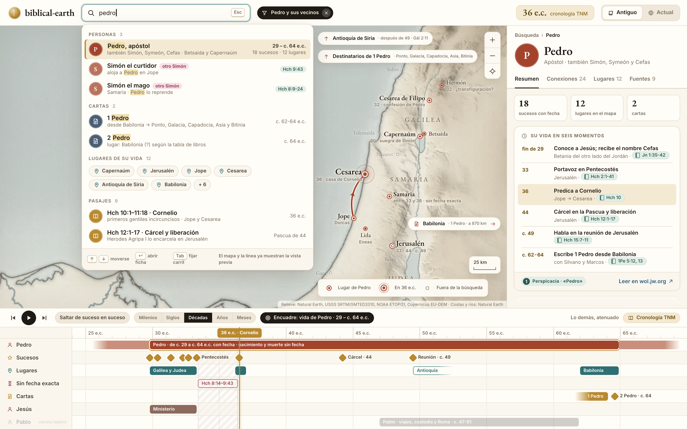
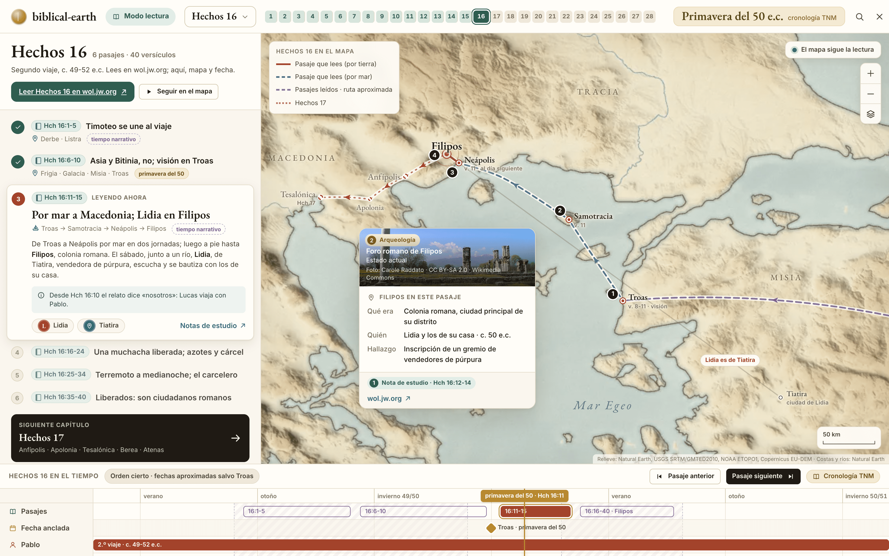
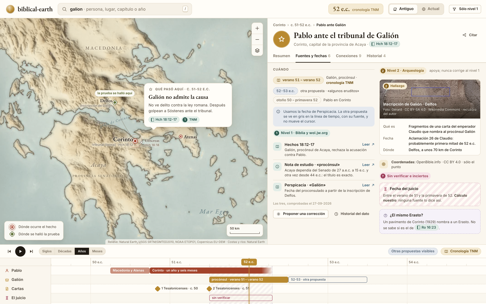
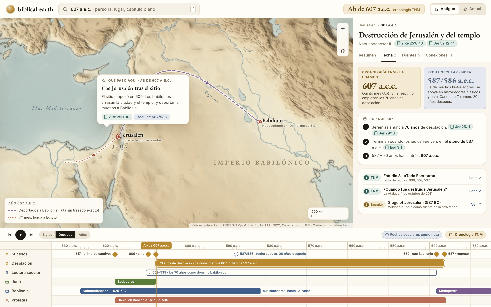
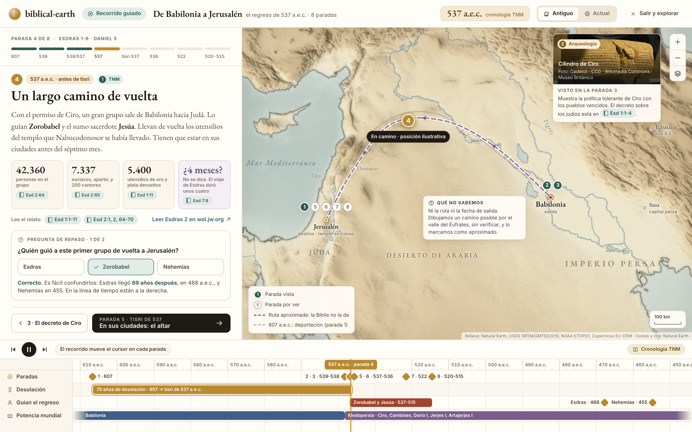
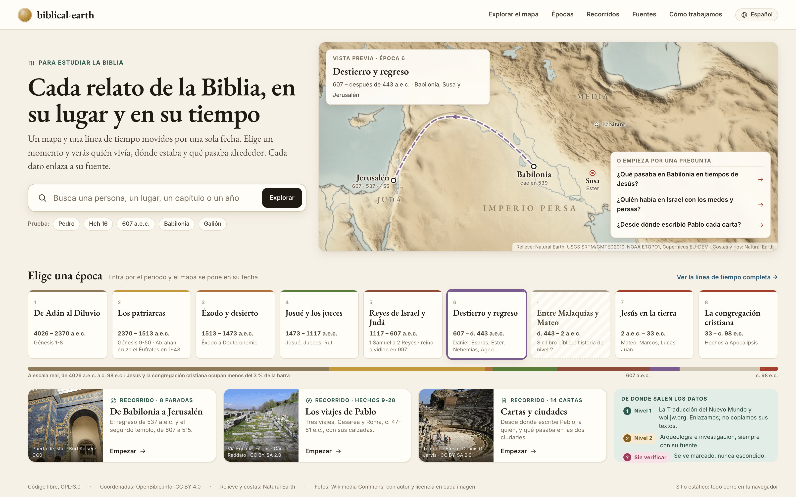

# Pantallas: búsqueda y estudio

Estas pantallas acompañan al estudiante desde que llega hasta que estudia un capítulo. Muestran cómo encuentra lo que busca, cómo lee con el mapa al lado, cómo sabe de dónde sale cada dato y cómo aprende siguiendo una historia. Todas comparten el cursor de tiempo, el mapa y las reglas de fuentes del resto del producto.

| # | Pantalla | Pregunta del estudiante |
|---|---|---|
| 11 | [Búsqueda: «Pedro»](#11--búsqueda-pedro) | ¿Qué hizo Pedro, dónde y cuándo? |
| 12 | [Modo lectura: Hechos 16](#12--modo-lectura-hechos-16) | Estoy leyendo Hechos 16: ¿dónde pasa cada cosa? |
| 13 | [Fuentes y cronología](#13--fuentes-y-cronología) | ¿De dónde sale este dato y cuánto me puedo fiar? |
| 13b | [Cronología TNM y fecha secular: 607 a.e.c.](#13b--cronología-tnm-y-fecha-secular-607-aec) | ¿Por qué 607 y no 587? |
| 14 | [Recorrido guiado: de Babilonia a Jerusalén](#14--recorrido-guiado-de-babilonia-a-jerusalén) | Cuéntame la historia paso a paso |
| 15 | [Portada](#15--portada) | ¿Qué es esto y por dónde empiezo? |

Las maquetas son HTML en [`mockups/src/`](mockups/src/) renderizados con el kit de [`mockups/`](mockups/README.md). Los datos salen de [`mockups/data/`](mockups/data/README.md) y de lecturas en wol.jw.org hechas el 27-09-2026. Cada HTML lleva sus URL en un comentario al principio. Los identificadores como `B-01` remiten al [catálogo de ideas](catalogo-de-ideas.md).

Reglas comunes:

- **Ningún texto de la TNM ni imagen de jw.org.** Sólo referencias (`Hch 16:11-15`), resúmenes nuestros y botones «Leer en wol.jw.org ↗».
- **Cronología TNM primero.** La secular aparece como nota cuando difiere, nunca como alternativa al mismo nivel.
- **Lo incierto se ve.** Si una fecha no está en la fuente, sale difuminada o marcada como «tiempo narrativo». Si la calculamos nosotros, dice «cálculo nuestro». Si no está verificada, lleva la etiqueta rosa «sin verificar».
- **Cada foto lleva autor y licencia a la vista.** No hay fotos de la época: son ruinas actuales y objetos de museo.

---

## 11 · Búsqueda: «Pedro»

*HTML: [`mockups/src/11-busqueda-pedro.html`](mockups/src/11-busqueda-pedro.html)*

**Pregunta que responde.** ¿Qué hizo Pedro, dónde y cuándo? Y, sin pedirlo: ¿hay otros Simón que pueda confundir con él?

**Qué se ve.**

- **Desplegable por tipos.** Mientras se escribe «pedro», los resultados se agrupan en Personas, Cartas, Lugares de su vida y Pasajes. Cada fila dice qué es, sus fechas y cuántos sucesos y lugares tiene. Los homónimos llevan la etiqueta «otro Simón»: Simón el curtidor (Hch 9:43) y Simón el mago (Hch 8:9-24).
- **El resultado ya se aplica mientras eliges.** El mapa y la línea de tiempo muestran la vista previa del resultado resaltado, sin tener que pulsar Intro.
- **Nodo y vecinos, resto atenuado.** El mapa pierde color. Sólo quedan vivos los lugares de Pedro, cada uno con su año: Capernaúm (30, suegra de Simón), Cesarea de Filipo (32, confesión), Jope y Cesarea (36, Cornelio), Jerusalén (33 · 44 · c. 49). Samaria dice «entre 33 y 36 · sin fecha exacta».
- **Lo que queda fuera del encuadre se señala en el borde.** Tres flechas llevan a Antioquía de Siria («después de 49 · Gál 2:11»), a los destinatarios de 1 Pedro y a Babilonia («1 Pedro · a 870 km»).
- **Ficha a la derecha.** Nombres (Simón, Symeón, Cefas), tres cifras (18 sucesos con fecha, 12 lugares, 2 cartas) y «su vida en seis momentos», cada uno con referencia. Debajo, «Lo que no afirmamos»: que estuviera en Roma y el año y el lugar de su muerte.
- **Línea de tiempo encuadrada en su vida.** La barra de Pedro va de c. 29 a c. 64 e.c. y se difumina por los dos extremos: no hay fecha de nacimiento ni de muerte. El carril «Sin fecha exacta» dibuja Hch 8:14–9:43 como tramo rayado entre 33 y 36. Jesús y Pablo aparecen como carriles vecinos atenuados.

**Cómo se llega.**

- Tecla `/` o clic en la barra de búsqueda, desde cualquier pantalla.
- Desde la portada, con la búsqueda grande o el ejemplo «Pedro».
- Enlace directo: `/buscar?q=pedro&fecha=36`.

**Qué se puede pulsar.**

| Elemento | Acción |
|---|---|
| Fila de persona | Abre la ficha y fija el filtro «Pedro y sus vecinos» en la barra superior |
| Etiqueta «otro Simón» | Abre la ficha del homónimo con el aviso de desambiguación |
| Fila de carta (1 Pedro) | Abre la ficha de carta con origen (Babilonia) y destinatarios (Ponto, Galacia, Capadocia, Asia y Bitinia) |
| Chip de lugar | Encuadra el mapa en ese lugar y mueve el cursor a su primer suceso con Pedro |
| Fila de pasaje | Abre el modo lectura en ese capítulo (pantalla 12) |
| `Tab` en una fila | Fija la persona como carril en la línea de tiempo sin salir de la búsqueda |
| Flecha de borde del mapa | Desplaza el mapa hasta el lugar fuera del encuadre |
| Filtro «Pedro y sus vecinos ✕» | Quita el atenuado y vuelve a la vista normal |
| «Saltar de suceso en suceso» | El cursor salta al siguiente suceso de Pedro, no al año siguiente |
| Referencia de un momento | Abre el pasaje con su botón «Leer en wol.jw.org ↗» |

**Estados alternativos.**

- **Vacío.** «No encontramos "Pedrp". ¿Querías decir Pedro?» y tres sugerencias por tipo. Nunca una lista vacía sin salida.
- **Ambiguo.** Si el texto coincide con varias personas del mismo nombre (hay más de veinte Zacarías), la primera fila dice cuántas hay y las agrupa por época, cada una con su fecha y su referencia principal.
- **Incierto.** Un lugar sin coordenada fija (Betania del otro lado del Jordán) sale en la lista, pero sin punto en el mapa, con la nota «ubicación incierta».
- **Cargando.** El desplegable aparece al instante con los tipos, y las cifras se rellenan después. Todo está en el navegador, así que la espera es corta.
- **Móvil.** La búsqueda ocupa la pantalla entera. Al elegir un resultado, el mapa vuelve con la ficha en una hoja inferior a media altura.

**Ideas del catálogo.** B-01, B-06, B-07, G-12, F-01, T-06, T-16, T-13, M-13, M-16, M-17, C-11.

---

## 12 · Modo lectura: Hechos 16

*HTML: [`mockups/src/12-lectura-hechos-16.html`](mockups/src/12-lectura-hechos-16.html)*

**Pregunta que responde.** Estoy leyendo Hechos 16. ¿Dónde pasa cada cosa, en qué orden y cuándo?

**Qué se ve.**

- **El texto no está aquí.** Se lee en wol.jw.org con el botón grande «Leer Hechos 16 en wol.jw.org ↗». Aquí están el mapa, la fecha y el índice.
- **Índice de pasajes** con su referencia y un título nuestro: Hch 16:1-5 (Timoteo se une al viaje), 16:6-10 (Asia y Bitinia, no; visión en Troas), 16:11-15 (por mar a Macedonia; Lidia en Filipos), 16:16-24, 16:25-34 y 16:35-40. Los leídos llevan una marca verde.
- **El pasaje abierto** tiene un resumen escrito por nosotros, la ruta (Troas → Samotracia → Neápolis → Filipos), las personas (Lidia) y los lugares enlazados (Tiatira). Una nota avisa de que desde Hch 16:10 el relato habla en primera persona del plural.
- **El mapa sigue la lectura.** Las paradas llevan el número del pasaje: 1 Troas, 2 Samotracia, 3 Neápolis, 4 Filipos. El tramo que se está leyendo va sólido. Lo leído antes y sin ruta conocida va en violeta discontinuo (Hch 16:6-8). Hechos 17 asoma en punteado hacia Anfípolis, Apolonia y Tesalónica.
- **Ficha de Filipos en esta fecha**, con foto del foro romano (Carole Raddato, CC BY-SA 2.0), qué era la ciudad, quién estaba allí y el hallazgo relacionado (una inscripción de vendedores de púrpura, según la nota de estudio de Hch 16:14).
- **Fecha honesta.** La barra de abajo dice «Orden cierto · fechas aproximadas salvo Troas». Sólo la estancia en Troas tiene fecha (primavera del 50). Los pasajes van rayados, como tiempo narrativo.
- **Siguiente capítulo** en una tarjeta oscura: «Hechos 17 · Anfípolis · Apolonia · Tesalónica · Berea · Atenas».

**Cómo se llega.**

- Buscando «Hch 16», «Hechos 16» o «Acts 16».
- Desde una fila de pasaje en la búsqueda (pantalla 11) o desde cualquier referencia de una ficha.
- Desde el selector de libro y capítulo de la barra superior.
- Enlace directo: `/leer/hechos/16#11`.

**Qué se puede pulsar.**

| Elemento | Acción |
|---|---|
| Número de capítulo (1-28) | Cambia de capítulo. Los leídos salen en verde; el progreso se guarda en el navegador, sin cuenta |
| Un pasaje del índice | Lo abre, mueve el cursor a su fecha y encuadra el mapa en su ruta |
| «Seguir en el mapa ▶» | Reproduce el capítulo: el mapa pasa de pasaje en pasaje |
| Chip de persona (Lidia) | Abre su ficha sin salir del modo lectura |
| Chip de lugar (Tiatira) | Dibuja la línea «Lidia es de Tiatira» y centra Tiatira un momento |
| «Notas de estudio ↗» | Abre la nota de estudio del pasaje en wol.jw.org |
| Parada numerada en el mapa | Abre el pasaje correspondiente |
| «Pasaje anterior / siguiente» | Mueve el índice y el mapa a la vez |
| «Siguiente capítulo» | Pasa a Hechos 17 con el mapa ya encuadrado |
| «El mapa sigue la lectura» | Al desactivarlo, el mapa se queda quieto y se explora a mano |

**Estados alternativos.**

- **Capítulo sin geografía** (un salmo, una parte de Proverbios): el mapa se sustituye por la ficha del libro, con escritor, lugar y fecha de escritura según la tabla de los libros.
- **Pasaje sin lugar conocido:** el pasaje sale en el índice con «lugar no indicado», y el mapa mantiene el último lugar cierto con una nota.
- **Cargando:** el índice aparece primero. El mapa se dibuja después sin mover el índice.
- **Móvil:** el índice es una hoja inferior. El mapa ocupa la parte de arriba y los números de parada son grandes para el dedo.

**Ideas del catálogo.** A-02, A-09, B-02, B-10, B-18, F-03, F-13, F-14, M-08, M-09, M-12, T-17.

---

## 13 · Fuentes y cronología

*HTML: [`mockups/src/13-fuentes-y-cronologia.html`](mockups/src/13-fuentes-y-cronologia.html)*

**Pregunta que responde.** ¿De dónde sale este dato? ¿Qué dice la Biblia, qué añade la arqueología y qué no se sabe?

**Qué se ve.**

- **Un hecho con su ficha:** Pablo ante el tribunal de Galión, en Corinto (Hch 18:12-17). Pestañas: Resumen, Fuentes y fechas (6), Conexiones (9) e Historial (4).
- **Bloque «Cuándo».** Tres fechas, cada una con su papel:
  - Galión procónsul del verano de 51 al verano de 52 (cronología TNM, fecha principal, en dorado).
  - «52-53 e.c. · otra propuesta · "algunos eruditos"», en gris azulado, como nota.
  - Pablo en Corinto del otoño de 50 a la primavera de 52, que acota el hecho.
  - Una nota explica la regla: usamos la fecha de Perspicacia; la otra se ve en gris y no mueve el cursor.
- **Nivel 1 · Biblia y wol.jw.org.** Tres fuentes con resumen propio y botón «Leer ↗»: Hechos 18:12-17, la nota de estudio sobre «procónsul» (Acaya dependía del Senado de 27 a.e.c. a 15 e.c. y otra vez desde 44 e.c.) y Perspicacia «Galión». Debajo: «Las tres, comprobadas el 27-09-2026».
- **Nivel 2 · Arqueología**, con la frase «apoya; nunca corrige al nivel 1». Foto real de la inscripción de Delfos (Gérard, CC BY-SA 4.0), qué es, su fecha (probablemente primera mitad de 52) y dónde se halló, a unos 70 km de Corinto.
- **Coordenadas de terceros señaladas:** «OpenBible.info · CC BY 4.0 · sólo el punto».
- **Sin verificar e inciertos**, con trama rayada: la fecha del juicio (entre el verano de 51 y la primavera de 52, cálculo nuestro, ninguna fuente lo dice así) y «¿el mismo Erasto?» (un pavimento de Corinto de 1929 nombra a un Erasto; no se sabe si es el de Ro 16:23).
- **Mapa con dos tipos de punto:** dónde ocurre el hecho (Corinto) y dónde se halló la prueba (Delfos, rombo verde).
- **Línea de tiempo** con el carril de Galión, su otra propuesta en contorno y el carril «El juicio» marcado como sin verificar.

**Cómo se llega.**

- Desde cualquier ficha, pestaña «Fuentes», o con el icono «¿de dónde sale esto?» junto a un dato.
- Buscando «Galión» o pulsando Corinto en el mapa hacia el 51-52 e.c.
- Enlace directo: `/hecho/pablo-ante-galion/fuentes`.

**Qué se puede pulsar.**

| Elemento | Acción |
|---|---|
| «Leer ↗» de una fuente de nivel 1 | Abre la fuente en wol.jw.org |
| Una fecha del bloque «Cuándo» | Lleva el cursor a esa fecha; la propuesta secular lo lleva en modo nota, con el aviso visible |
| «Sólo nivel 1» (barra superior) | Oculta todo lo de nivel 2 en el mapa, la línea de tiempo y las fichas |
| Tarjeta del hallazgo | Abre la ficha del hallazgo, con museo, fecha de descubrimiento y bibliografía |
| Rombo de Delfos en el mapa | Dibuja la línea «la prueba se halló aquí» hasta el hecho |
| Tarjeta «sin verificar» | Explica por qué no está verificado y qué fuente haría falta |
| «Proponer una corrección» | Abre el formulario con el dato y la fuente que se propone |
| «Historial del dato» | Muestra quién cambió el dato, cuándo y con qué fuente |
| «Citar» | Copia la referencia del hecho con sus fuentes |

**Estados alternativos.**

- **Sin nivel 2:** el bloque de arqueología no aparece. No se rellena con nada.
- **Sin discrepancia:** una sola fecha, sin nota.
- **Todo sin verificar:** la ficha entera lleva la trama rosa y no aparece en recorridos ni en preguntas de repaso hasta que alguien la verifique.
- **Móvil:** las fuentes van en una lista vertical por niveles, y la foto ocupa todo el ancho con el crédito debajo.

**Ideas del catálogo.** C-01, C-03, C-04, C-06, C-08, C-09, C-10, C-11, F-05, F-07, F-08, P-02, P-06, B-11.

---

## 13b · Cronología TNM y fecha secular: 607 a.e.c.

*HTML: [`mockups/src/13b-cronologia-607.html`](mockups/src/13b-cronologia-607.html)*

**Pregunta que responde.** ¿Por qué la destrucción de Jerusalén es de 607 a.e.c. si muchos libros dicen 587 o 586?

**Qué se ve.**

- **Dos tarjetas de fecha, con peso distinto.** «Cronología TNM · la usamos»: 607 a.e.c., quinto mes (Ab). «Fecha secular · nota»: 587/586 a.e.c., la de muchos historiadores, apoyada en historiadores clásicos y en el Canon de Tolomeo. La segunda lleva borde discontinuo y colores fríos.
- **«Por qué 607» en tres pasos**, cada uno con su referencia: Jeremías anuncia 70 años de desolación (Jer 25:11; 29:10); terminan cuando los judíos vuelven, en el otoño de 537 a.e.c. (Esd 3:1); 537 + 70 años hacia atrás da 607.
- **Fuentes:** el estudio 3 de «Toda Escritura» y el artículo de La Atalaya del 1 de octubre de 2011, de nivel 1. Wikipedia sale como nivel 2 y sólo para la otra fecha.
- **Mapa:** Jerusalén arrasada, deportados hacia Babilonia en violeta discontinuo («ruta sin trazado exacto») y la huida a Egipto del séptimo mes.
- **Línea de tiempo:** el carril «Desolación» va de tisri de 607 a tisri de 537. Debajo, el carril «Lectura secular» muestra c. 609-539 como dominio babilónico, en contorno. En el carril de sucesos, 587/586 aparece como un rombo fantasma: «fecha secular, 20 años después».

**Cómo se llega.** Buscando «607 a.e.c.» o «587 a.e.c.» (las dos llevan aquí), desde la pestaña Fecha de la ficha, o pulsando el rombo fantasma de la línea de tiempo.

**Qué se puede pulsar.** Cada referencia abre su pasaje. «Leer ↗» abre el estudio o el artículo en wol.jw.org. El conmutador «Fechas seculares como nota» las oculta del todo. Las cuentas de los tres pasos se pueden abrir para ver cada suma.

**Estados alternativos.** Cuando la diferencia es de un año o menos, no hay tarjeta doble: basta con una nota corta junto a la fecha. En móvil, las dos tarjetas se apilan, con la de la TNM arriba.

**Ideas del catálogo.** C-02, C-04, C-06, C-12, T-07, T-16, M-09, M-10.

---

## 14 · Recorrido guiado: de Babilonia a Jerusalén

*HTML: [`mockups/src/14-recorrido-guiado.html`](mockups/src/14-recorrido-guiado.html)*

**Pregunta que responde.** Cuéntame paso a paso cómo volvieron los judíos de Babilonia, con el mapa y la fecha a la vista.

**Qué se ve.**

- **Progreso en ocho paradas**, con el año bajo cada tramo: 607 (Jerusalén destruida), 539 (cae Babilonia), 538/537 (decreto de Ciro), 537 (el viaje), tisri de 537 (el altar), 536 (el fundamento), 522 (la obra se prohíbe) y 520-515 (Ageo, Zacarías y el templo terminado). Las paradas vistas salen en verde y la actual en dorado.
- **La parada actual, «Un largo camino de vuelta»**, con una narrativa corta escrita por nosotros, en letra de lectura.
- **Cuatro cifras con referencia:** 42.360 personas (Esd 2:64), 7.337 esclavos aparte y 200 cantores (Esd 2:65), 5.400 utensilios de oro y plata (Esd 1:11). La cuarta, «¿4 meses?», va en violeta discontinuo porque la Biblia no da la duración: Perspicacia la estima por el viaje de Esdras (Esd 7:9).
- **«Lee el relato»** con las referencias y el botón «Leer Esdras 2 en wol.jw.org ↗».
- **Pregunta de repaso** sobre una confusión frecuente: ¿quién guió este grupo? Esdras, Zorobabel o Nehemías. La respuesta explica la diferencia con fechas: Esdras llegó 69 años después (468 a.e.c.) y Nehemías en 455, y los dos se ven en la línea de tiempo.
- **Mapa.** Las paradas se agrupan por lugar (1, 5, 6, 7 y 8 en Jerusalén; 2 y 3 en Babilonia). La parada 4 está en la ruta, con la etiqueta «posición ilustrativa». La ruta va en violeta discontinuo. Una tarjeta, «Qué no sabemos», dice que no se conocen ni la ruta ni la fecha de salida y que el trazado es un camino posible, sin verificar. La deportación de 607 queda como rastro tenue.
- **Lo visto en la parada anterior sigue a mano:** el Cilindro de Ciro (Daderot, CC0), de nivel 2, con la nota de que el decreto sobre los judíos está en Esd 1:1-4.
- **Línea de tiempo** que el recorrido mueve solo. Carriles: Paradas, Desolación (607 → tisri de 537), Guían el regreso (Zorobabel y Jesúa; Esdras; Nehemías) y Potencia mundial (Babilonia → Medopersia).

**Cómo se llega.**

- Desde la portada, tarjeta «De Babilonia a Jerusalén».
- Desde la época «Destierro y regreso», botón «Seguir el recorrido».
- Desde una ficha incluida en el recorrido (Zorobabel, el decreto de Ciro), aviso «Esta ficha forma parte de un recorrido».
- Enlace directo: `/recorrido/babilonia-jerusalen/4`.

**Qué se puede pulsar.**

| Elemento | Acción |
|---|---|
| Un tramo de la barra de progreso | Salta a esa parada |
| «3 · El decreto de Ciro» / «Parada 5» | Parada anterior o siguiente. El cursor y el mapa se mueven con animación corta |
| Referencia de una cifra | Abre el versículo con su botón a wol.jw.org |
| Una opción de la pregunta | Marca la respuesta y enseña la explicación. Nada se puntúa ni se envía |
| Parada numerada en el mapa | Salta a esa parada |
| Tarjeta «Qué no sabemos» | Abre la base documental de la ruta y de la duración |
| «Salir y explorar» | Deja el recorrido en la fecha actual con el mapa libre; al volver se retoma en la misma parada |
| Pausa / reproducir | Avance automático parada a parada, con tiempo para leer |

**Estados alternativos.**

- **Primera parada:** sin botón «anterior», con una tarjeta de entrada: qué se va a ver, cuántas paradas hay y qué libros se tocan.
- **Última parada:** resumen con las ocho fechas en una lista, «repasar las preguntas» y otros recorridos de la misma época.
- **Pregunta fallada:** la opción elegida se marca sin rojo agresivo y la explicación señala en la línea de tiempo dónde está cada persona.
- **Móvil:** la historia es una hoja inferior. El mapa, arriba, muestra sólo la parada actual y la ruta. Se pasa de parada deslizando el dedo.

**Ideas del catálogo.** A-01, A-04, A-05, A-13, A-16, T-01, T-10, T-11, M-08, M-09, M-10, C-03, C-11, F-13, G-12.

---

## 15 · Portada

*HTML: [`mockups/src/15-portada.html`](mockups/src/15-portada.html)*

Esta fue la primera propuesta. La portada del sitio es ahora el diseño 4 de [La portada: seis diseños para elegir](portada-disenos.md#4-entra-por-una-pregunta).

**Pregunta que responde.** ¿Qué es esto y por dónde empiezo?

**Qué se ve.**

- **Qué es, en una frase:** «Cada relato de la Biblia, en su lugar y en su tiempo». Debajo, qué hace el producto: un mapa y una línea de tiempo movidos por una sola fecha, y cada dato enlazado a su fuente.
- **Tres maneras de empezar, sin menú:**
  1. **Buscar.** Una búsqueda grande con ejemplos que enseñan lo que acepta: una persona (Pedro), un capítulo (Hch 16), un año (607 a.e.c.), un lugar (Babilonia) y un nombre poco conocido (Galión).
  2. **Elegir una época.** Nueve tarjetas: De Adán al Diluvio (4026-2370 a.e.c.), Los patriarcas (2370-1513), Éxodo y desierto (1513-1473), Josué y los jueces (1473-1117), Reyes de Israel y Judá (1117-607), Destierro y regreso (607 - después de 443), Entre Malaquías y Mateo, Jesús en la tierra (2 a.e.c. - 33 e.c.) y La congregación cristiana (33 - c. 98 e.c.). Cada una dice qué libros la cuentan.
  3. **Seguir un recorrido.** Tres tarjetas con foto libre y crédito: De Babilonia a Jerusalén, Los viajes de Pablo y Cartas y ciudades.
- **Vista previa en el mapa.** Al pasar el ratón por una época, el mapa enseña sus lugares y rutas. En la imagen, «Destierro y regreso»: Jerusalén, Babilonia, Susa y Ecbátana.
- **Preguntas para empezar:** las tres preguntas guía del producto, cada una con enlace a su vista.
- **La época sin libro bíblico también se ve.** «Entre Malaquías y Mateo» va con trama y dice «sin libro bíblico: historia de nivel 2». No se esconde el hueco.
- **Barra a escala real** bajo las épocas. Enseña algo que las tarjetas iguales esconden: de 4026 a.e.c. a c. 98 e.c., Jesús y la congregación ocupan menos del 3 % del tiempo.
- **De dónde salen los datos**, en tres líneas: nivel 1, nivel 2 y «sin verificar».
- **Pie sin ruido:** licencia del código, créditos de coordenadas, relieve y fotos, y «sitio estático: todo corre en tu navegador».

**Cómo se llega.** Es la raíz del sitio (`/`). El logo lleva aquí desde cualquier pantalla. Quien vuelve encuentra la última vista en «Seguir donde lo dejé» (ver más abajo).

**Qué se puede pulsar.**

| Elemento | Acción |
|---|---|
| Búsqueda / «Explorar» | Abre la vista principal con los resultados (pantalla 11) |
| Chip de ejemplo | Hace esa búsqueda |
| Tarjeta de época | Abre la vista principal con el cursor en el inicio de la época, la línea de tiempo encuadrada en ella y el mapa en sus lugares |
| Barra a escala real | Cada tramo es una época; pulsarlo hace lo mismo que su tarjeta |
| Tarjeta de recorrido | Empieza el recorrido en la parada 1 (pantalla 14) |
| Una pregunta | Abre su vista: [Babilonia en tiempos de Jesús (08)](pantallas-grafo-y-contexto.md#08--babilonia-en-tiempos-de-jesús), [Israel con los medos y persas (09)](pantallas-grafo-y-contexto.md#09--israel-en-la-época-de-los-medos-y-persas) o las cartas de Pablo (03) |
| «Ver la línea de tiempo completa» | Vista principal con zoom de milenios |
| Nivel 1, nivel 2, sin verificar | Abre «Cómo trabajamos», con las reglas de fuentes |
| «Español» | Cambia el idioma de la interfaz; los enlaces a wol.jw.org siguen el idioma elegido |

**Estados alternativos.**

- **Visitante que vuelve:** una fila discreta sobre las épocas, «Seguir donde lo dejé: Hechos 16 · primavera del 50 e.c.», guardada sólo en su navegador.
- **Sin conexión:** si el sitio está instalado, la portada funciona igual; los enlaces a wol.jw.org llevan un aviso de que necesitan conexión.
- **Móvil:** título corto, búsqueda arriba, épocas en una fila que se desliza de lado y recorridos debajo. El mapa de vista previa desaparece.

**Ideas del catálogo.** B-04, B-06, B-09, T-02, T-15, A-01, C-01, C-11, D-04, D-12, D-17.

---

## Más ideas para estas pantallas

Variantes que no dibujamos, agrupadas por pantalla.

**Búsqueda**

- **Búsqueda por pregunta con forma fija.** Escribir «Babilonia en 30 e.c.» o «quién había en Jerusalén en 455 a.e.c.» y obtener la vista correspondiente, sin lenguaje libre: sólo patrones conocidos (lugar + fecha, persona + fecha, dos personas).
- **Buscar dos personas a la vez.** «Pedro y Pablo» encuadra los dos carriles y marca en el mapa dónde coincidieron (Jerusalén c. 49, Antioquía).
- **Búsqueda por versículo exacto.** «1Pe 5:13» abre la ficha de la carta con el lugar de escritura resaltado y la nota «Babilonia literal, según Perspicacia».
- **Resultados por época.** Cuando un nombre cruza siglos (Babilonia), el desplegable ofrece «Babilonia en 607 a.e.c.», «en 539 a.e.c.» y «en tiempos de Jesús».
- **Historial de búsqueda local**, que nunca sale del navegador.

**Modo lectura**

- **Lectura en paralelo.** Dos capítulos a la vez con el mismo mapa: Hechos 16 y Filipenses, para ver a quién escribe Pablo diez años después.
- **Plan de lectura semanal.** El usuario pone sus capítulos de la semana y el recorrido se prepara solo, pasaje a pasaje.
- **Marcas de «mientras tanto».** Al leer Hechos 18, una tarjeta lateral dice qué pasaba en Roma (Claudio expulsa a los judíos, Hch 18:2) con su referencia.
- **Modo reunión.** Letra grande, mapa a pantalla completa y un solo botón «siguiente pasaje», para enseñar a varias personas.

**Fuentes**

- **Comparar dos fuentes lado a lado**, con las frases clave resumidas por nosotros y la diferencia marcada.
- **Mapa de pruebas.** Una capa que dibuja dónde se hallaron los objetos de nivel 2 (Delfos, Corinto, Babilonia) y a qué hechos apoyan.
- **Cola pública de «necesita fuente».** Una lista de datos sin verificar, ordenada por cuántas pantallas los usan, para quien quiera ayudar.
- **Fecha de comprobación en cada enlace**, con aviso si pasó más de un año.

**Recorridos**

- **Otros recorridos para el primer año:** los viajes de Pablo en diez paradas; Pedro, de pescador a apóstol; las cartas de Pablo y sus ciudades; el Éxodo, con el cruce del mar Rojo y el Sinaí como zonas de candidatos.
- **Recorrido que se escribe con los datos.** Cualquier persona con suficientes sucesos fechados genera un recorrido básico: una parada por suceso y una pregunta por fecha.
- **Resumen imprimible** del recorrido en una página: mapa, ocho fechas y preguntas, para estudiar en papel.
- **Repaso espaciado.** Las preguntas falladas vuelven a salir días después, guardadas sólo en el navegador.
- **Modo pantalla compartida.** Frases más cortas, iconos grandes y preguntas de elegir en el mapa («¿dónde está Babilonia?»).

**Portada**

- **Época del día.** Una época distinta resaltada cada vez, con su vista previa.
- **«Hoy hace…».** Sólo con fechas ancladas de precisión diaria (14 de nisán de 33, 5 de octubre de 539 a.e.c.). Nunca con fechas aproximadas.
- **Portada para quien no conoce la Biblia.** Tres frases sobre qué es cada época y un recorrido de entrada de cinco paradas.
- **Portada por idioma.** Los ejemplos de búsqueda y los nombres siguen la TNM de cada idioma: «Loida» en español, «Lois» en inglés.
