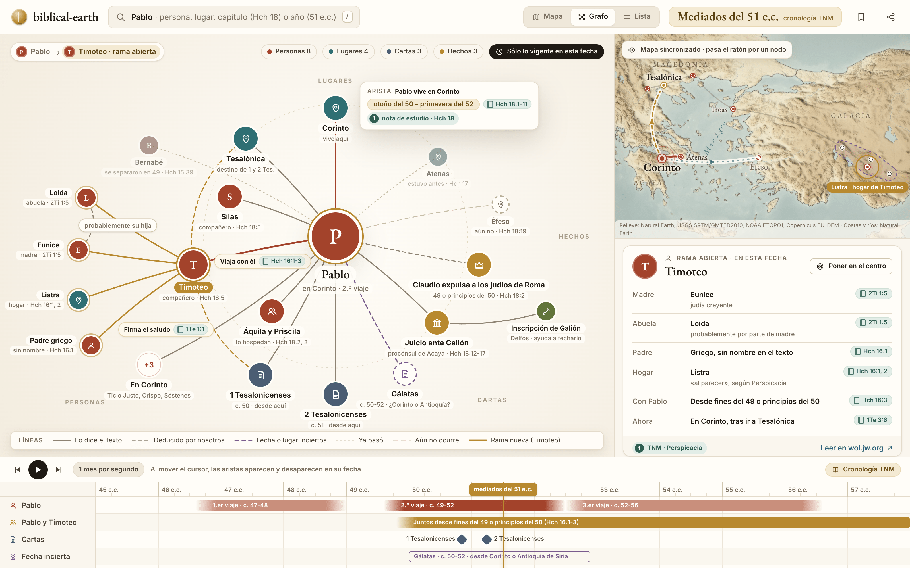
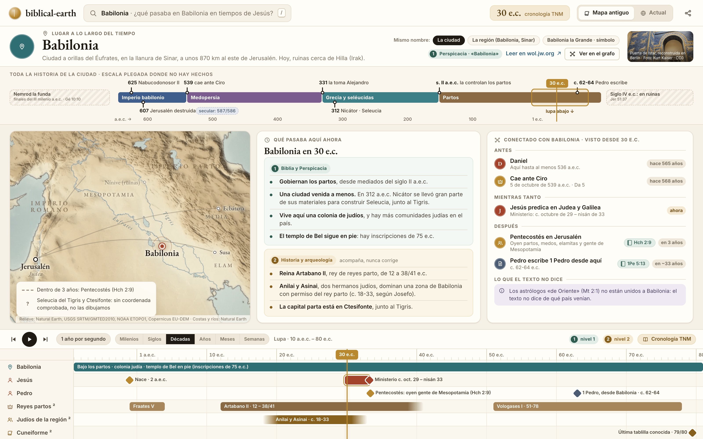
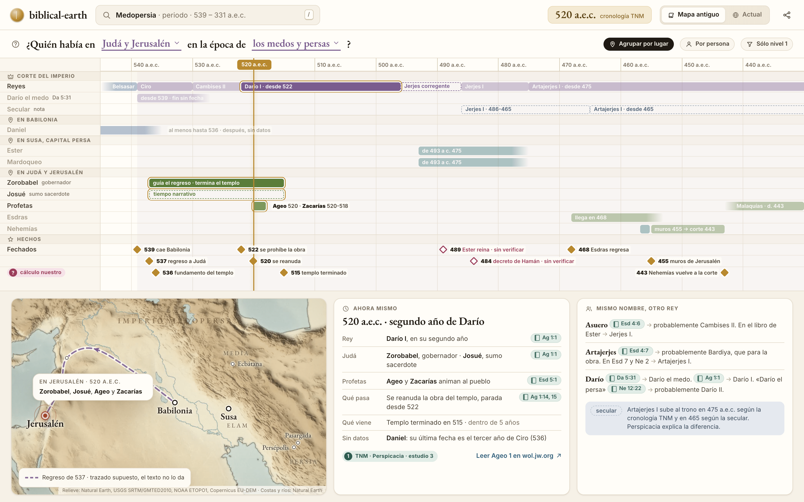
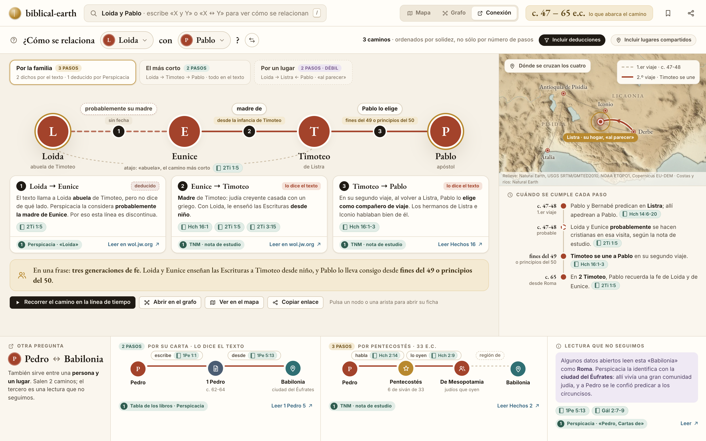

# Pantallas: grafo y contexto

Cuatro pantallas que tratan la Biblia como lo que es para un estudiante: una red de personas, lugares, cartas y hechos, cada relación con su fecha. Las cuatro comparten el cursor de tiempo, el mapa y las reglas de fuentes del resto del producto.

| # | Pantalla | Pregunta del estudiante |
|---|---|---|
| 07 | [Grafo centrado en Pablo](#07--grafo-centrado-en-pablo) | ¿Con quién y con qué estaba conectado Pablo en esta fecha? |
| 08 | [Babilonia en tiempos de Jesús](#08--babilonia-en-tiempos-de-jesús) | ¿Qué pasaba en Babilonia en tiempos de Jesús? |
| 09 | [Israel en la época de los medos y persas](#09--israel-en-la-época-de-los-medos-y-persas) | ¿Quién había en Israel en la época de los medos y persas? |
| 10 | [Conexión entre dos](#10--conexión-entre-dos) | ¿Cómo se relaciona X con Y? |

Las maquetas son HTML en [`mockups/src/`](mockups/src/) renderizados con el kit de [`mockups/`](mockups/README.md). Los datos salen de [`mockups/data/`](mockups/data/README.md) y de lecturas en wol.jw.org hechas el 27-09-2026; cada HTML lleva sus URL en un comentario al principio. Los identificadores como `G-05` remiten al [catálogo de ideas](catalogo-de-ideas.md).

Reglas comunes a las cuatro:

- **Ningún texto de la TNM ni imagen de jw.org.** Referencias (`Hch 16:1-3`), resúmenes nuestros y botones «Leer en wol.jw.org ↗».
- **Cada arista lleva verbo, fecha y referencia.** Una línea sin referencia no se dibuja.
- **Tres tipos de línea**, iguales en todas las pantallas: continua (lo dice el texto), discontinua (lo deduce una publicación de nivel 1 o lo deducimos nosotros, con la nota visible) y discontinua violeta (fecha o lugar inciertos).
- **Nivel 1 y nivel 2 nunca se mezclan en un mismo bloque.** El nivel 2 acompaña, nunca corrige.
- **Cronología TNM primero.** La secular aparece como nota cuando difiere.

---

## 07 · Grafo centrado en Pablo

*HTML: [`mockups/src/07-grafo-pablo.html`](mockups/src/07-grafo-pablo.html)*

**Pregunta que responde.** ¿Con quién estaba Pablo, dónde vivía, qué escribía y qué pasaba a su alrededor a mediados del 51 e.c.? Y en un segundo paso: ¿quién es Timoteo y de dónde viene?

**Qué se ve.**

- Pablo en el centro. Alrededor, cuatro sectores con rótulo: **Personas**, **Lugares**, **Cartas** y **Hechos**. Cada tipo tiene su color, el mismo que en el mapa y en la línea de tiempo.
- Sólo aparece lo vigente en la fecha del cursor. Lo que ya pasó se queda tenue con línea de puntos (Atenas, «estuvo antes · Hch 17»; Bernabé, «se separaron en 49»). Lo que aún no ocurre lleva línea discontinua gris (Éfeso, «aún no · Hch 18:19»).
- La arista más fuerte, «Pablo vive en Corinto», se ve más gruesa. Al pasar el ratón por ella sale su tarjeta: fechas (otoño del 50 – primavera del 52), referencia (Hch 18:1-11) y fuente (nota de estudio de Hch 18).
- **Rama abierta.** El estudiante pulsó Timoteo. Timoteo se queda en su sitio, marcado en dorado, y de él salen sus vecinos nuevos en dorado: Loida, Eunice, Listra y su padre griego sin nombre. La arista Loida → Eunice es discontinua y dice «probablemente su hija»: el texto no lo dice, Perspicacia lo deduce.
- Gálatas aparece como nodo incierto (borde violeta discontinuo): «c. 50-52 · ¿Corinto o Antioquía?».
- Los grupos grandes se pliegan: «+3 En Corinto» (Ticio Justo, Crispo, Sóstenes).
- **Mapa sincronizado** a la derecha: Corinto como posición actual, la carta a Tesalónica en dorado, el viaje pendiente a Éfeso por mar y Listra resaltada porque el ratón está sobre ella en el grafo.
- **Ficha de la rama abierta** bajo el mapa: madre, abuela, padre, hogar, desde cuándo va con Pablo y dónde está ahora, cada fila con su referencia.
- **Línea de tiempo** abajo con carriles Pablo, Pablo y Timoteo, Cartas y Fecha incierta. Al mover el cursor, las aristas aparecen y desaparecen en su fecha.

**Cómo se llega.**

- Buscar «Pablo» y elegir la vista **Grafo** en el conmutador Mapa · Grafo · Lista.
- Desde cualquier ficha de persona, botón «Ver en el grafo».
- Desde el mapa, pulsar el marcador de Pablo y después «Ver sus conexiones».
- Un enlace compartido guarda persona, rama abierta y fecha: `/grafo/pablo?rama=timoteo&fecha=51-07`.

**Qué se puede pulsar.**

| Elemento | Acción |
|---|---|
| Un nodo | Abre su rama sin perder el centro. La ficha de la derecha pasa a ese nodo |
| «Poner en el centro» | El nodo pasa al centro y Pablo queda como vecino. La miga de pan (Pablo › Timoteo) permite volver |
| Una arista | Tarjeta con verbo, fechas, referencia y fuente |
| Una referencia (`Hch 16:1-3`) | Abre el pasaje en el panel de lectura, con el botón «Leer en wol.jw.org ↗» |
| Filtros de tipo (Personas 8, Lugares 4…) | Muestran u ocultan un sector. El número dice cuántos nodos hay en esta fecha |
| «Sólo lo vigente en esta fecha» | Al desactivarlo aparecen todas las relaciones de la vida de Pablo, las de otras fechas atenuadas |
| «+3» | Despliega el grupo |
| Pasar el ratón por un nodo | Su lugar se resalta en el mapa |
| Reproducir | El grafo cambia mes a mes: Silas y Timoteo llegan, Galión entra como procónsul, Éfeso pasa de «aún no» a «ahora» |

**Estados alternativos.**

- **Vacío:** una persona sin relaciones fechadas en la fecha del cursor muestra sólo el centro y el mensaje «En esta fecha no sabemos nada de X», con botones al hecho anterior y al siguiente.
- **Incierto:** cuando la fecha de una relación es un rango, la arista se dibuja con los extremos difuminados y la tarjeta dice «entre 49 y 52; la fuente no da año». Los nodos de lugar incierto llevan borde violeta discontinuo.
- **Demasiados vecinos:** más de doce por sector se agrupan por tema («+14 saludos de Romanos 16»).
- **Cargando:** los anillos y el centro aparecen primero; los nodos entran por sectores con un esqueleto gris del tamaño final, para que nada salte de sitio.
- **Móvil:** el grafo ocupa la pantalla y el mapa se convierte en una miniatura en una esquina. La ficha de la rama sale en la hoja inferior. En pantallas pequeñas los sectores pasan a ser una lista con pestañas (Personas, Lugares, Cartas, Hechos) y la vista radial queda como opción.

**Ideas del catálogo que materializa.** G-01, G-02, G-03, G-04, G-06, G-07, G-12 (una persona sin nombre como nodo propio), G-14, G-17, T-01, T-06, T-16, C-01, B-08, B-10, F-01.

---

## 08 · Babilonia en tiempos de Jesús

*HTML: [`mockups/src/08-babilonia-en-tiempos-de-jesus.html`](mockups/src/08-babilonia-en-tiempos-de-jesus.html)*

**Pregunta que responde.** ¿Qué pasaba en Babilonia en tiempos de Jesús? Y detrás: ¿qué fue antes esta ciudad y qué relación tiene con el Nuevo Testamento?

**Qué se ve.**

- **Cabecera de la ficha:** nombre, una frase de situación (orillas del Éufrates, llanura de Sinar, unos 870 km al este de Jerusalén, hoy ruinas cerca de Hilla) y una foto libre con su crédito (Puerta de Istar reconstruida en Berlín, CC0).
- **Selector «Mismo nombre»:** la ciudad, la región (Babilonia, Sinar) y Babilonia la Grande como símbolo. Son tres nodos distintos y el estudiante elige cuál mira.
- **Tira de toda la historia de la ciudad**, de Nemrod al siglo IV e.c., con las eras en color (Imperio babilonio, Medopersia, Grecia y seléucidas, Partos) y los hitos fechados: 625 Nabucodonosor II, 607 Jerusalén destruida (con la nota «secular: 587/586»), 539 cae ante Ciro, 331 la toma Alejandro, 312 Nicátor y Seleucia, siglo II a.e.c. los partos, c. 62-64 Pedro escribe. Los tramos sin hechos se pliegan. La lupa marca el tramo que se ve abajo, de 10 a.e.c. a 80 e.c.
- **Mapa** de Mesopotamia con Babilonia, Jerusalén, Susa, Ecbátana, Nínive en ruinas, los ríos y los imperios de la fecha (Romano y Parto). Seleucia del Tigris y Ctesifonte no tienen coordenada comprobada: el mapa lo dice en su leyenda en vez de inventar un punto.
- **«Qué pasaba aquí ahora»**, en dos bloques separados:
  - Nivel 1 (Biblia y Perspicacia): gobiernan los partos; la ciudad está venida a menos desde que Nicátor se llevó materiales para construir Seleucia; hay una colonia judía; el templo de Bel sigue en pie (inscripciones de 75 e.c.).
  - Nivel 2 (historia y arqueología, «acompaña, nunca corrige»): Artabano II, rey parto; los hermanos judíos Anilai y Asinai (según Josefo); la capital parta está en Ctesifonte.
- **«Conectado con Babilonia, visto desde 30 e.c.»** en tres grupos: **Antes** (Daniel, hace 565 años; la caída ante Ciro, hace 568 años), **Mientras tanto** (Jesús predica en Judea y Galilea) y **Después** (Pentecostés en Jerusalén, en 3 años; Pedro escribe 1 Pedro desde aquí, dentro de unos 33 años). Cada fila dice la distancia en años desde el cursor.
- **«Lo que el texto no dice»:** los astrólogos «de Oriente» (Mt 2:1) no se unen a Babilonia, porque el texto no dice de qué país venían.
- **Línea de tiempo** en la escala Décadas con carriles Babilonia, Jesús, Pedro, Reyes partos², Judíos de la región² y Cuneiforme². El superíndice ² marca los carriles de nivel 2.

**Cómo se llega.**

- Buscar «Babilonia» y mover el cursor a 30 e.c.
- Buscar con pregunta de forma fija: «¿qué pasaba en Babilonia en 30 e.c.?».
- Desde el mapa, en cualquier fecha, pulsar Babilonia: se abre esta ficha en la fecha del cursor.
- Desde 1 Pedro 5:13, pulsar el nombre de la ciudad.

**Qué se puede pulsar.**

| Elemento | Acción |
|---|---|
| Un hito de la tira | Mueve el cursor a esa fecha. Todo lo demás se recalcula |
| La lupa | Se arrastra por la tira para cambiar el tramo de abajo |
| «Mismo nombre» | Cambia entre la ciudad, la región y el símbolo, cada uno con su ficha |
| Una fila de «Conectado con» | Abre la ficha de esa persona o hecho y mueve el cursor a su fecha, con un botón «Volver a 30 e.c.» |
| «secular: 587/586» | Abre la explicación de la diferencia de cronologías |
| «Ver en el grafo» | Abre la vista 07 con Babilonia en el centro |
| «Perspicacia · Babilonia» y «Leer en wol.jw.org ↗» | Llevan al artículo en wol.jw.org |
| Selector de zoom (Milenios … Semanas) | Cambia la escala de la línea de tiempo y la velocidad de reproducción |

**Estados alternativos.**

- **Vacío:** en una fecha sin hechos (por ejemplo, 150 a.e.c.), la tarjeta dice «No tenemos hechos de Babilonia en esta fecha» y muestra el anterior y el siguiente con su distancia en años.
- **Incierto:** los hitos sin año exacto («finales del III milenio a.e.c.», «siglo IV e.c.») van en cajas rayadas fuera de la escala. Los reinados con final incierto se difuminan (Artabano II, «12 – 38/41»).
- **Sólo nivel 1:** con el filtro activo desaparecen el bloque de nivel 2 y los carriles marcados con ², y queda un aviso: «3 carriles de nivel 2 ocultos».
- **Cargando:** la tira y el mapa aparecen primero; las tarjetas muestran esqueletos de tres filas.
- **Móvil:** la tira queda arriba como barra horizontal desplazable. «Qué pasaba aquí ahora» es la primera tarjeta de la hoja inferior; nivel 1 y nivel 2 son dos pestañas. El mapa se abre a pantalla completa con un botón.

**Ideas del catálogo que materializa.** F-02, F-03, F-13, G-11, G-12, T-02, T-05, T-07, T-09, T-16, T-21, A-05, C-01, C-02, C-09, C-11, M-13, B-04.

---

## 09 · Israel en la época de los medos y persas

*HTML: [`mockups/src/09-israel-medos-y-persas.html`](mockups/src/09-israel-medos-y-persas.html)*

**Pregunta que responde.** ¿Quién había en Israel en la época de los medos y persas? Y con ella: ¿qué rey mandaba cuando profetizaron Ageo y Zacarías, cuándo vivió Ester respecto a Esdras y Nehemías, y dónde estaba cada uno?

**Qué se ve.**

- **Pregunta de forma fija** en la cabecera: «¿Quién había en [Judá y Jerusalén] en la época de [los medos y persas]?». Las dos casillas son desplegables.
- **Sincronía:** una sola escala de 545 a 430 a.e.c. con carriles agrupados por lugar:
  - Corte del imperio: reyes (Belsasar, Ciro, Cambises II, Darío I, Jerjes I, Artajerjes I, con la corregencia de Jerjes desde 496 a.e.c. en contorno discontinuo), Darío el medo (desde 539, fin sin fecha) y una fila «Secular» con las fechas que difieren (Jerjes I y Artajerjes I, que suben al trono en 475 según la TNM y en 465 según la cronología secular).
  - En Babilonia: Daniel, «al menos hasta 536 · después, sin datos».
  - En Susa: Ester y Mardoqueo, de 493 a c. 475.
  - En Judá y Jerusalén: Zorobabel, Josué (en tiempo narrativo), los profetas Ageo, Zacarías y Malaquías, Esdras y Nehemías.
  - Hechos fechados: 539, 537, 536, 522, 520, 515, 468, 455, 443.
- **Cálculos nuestros marcados:** «489 Ester reina» y «484 decreto de Hamán» llevan rombo hueco y la etiqueta «sin verificar». Salen de contar años de reinado; ninguna fuente los da.
- **Cursor en 520 a.e.c.** Todo lo que corta el cursor se resalta y el resto baja de opacidad.
- **Mapa del imperio medopersa** con Jerusalén, Babilonia, Susa, Ecbátana, Pasargada y Persépolis. El regreso de 537 va en violeta discontinuo con la leyenda «trazado supuesto, el texto no lo da». Un globo sobre Jerusalén dice quién está allí en 520: Zorobabel, Josué, Ageo y Zacarías.
- **«Ahora mismo»:** 520 a.e.c. es el segundo año de Darío. Rey, gobernador y sumo sacerdote de Judá, profetas, qué pasa, qué viene (templo terminado en 515, dentro de 5 años) y de quién no hay datos (Daniel). Cada fila con su referencia.
- **«Mismo nombre, otro rey»:** Asuero, Artajerjes y Darío designan a reyes distintos según el libro. Cada uso lleva su referencia y el rey que propone Perspicacia (Esd 4:6 → probablemente Cambises II; en Ester → Jerjes I).

**Cómo se llega.**

- Buscar «medos y persas», «Medopersia» o «Ageo».
- Pregunta de forma fija desde el buscador: «¿quién había en Judá en 520 a.e.c.?».
- Desde la línea de tiempo principal, pulsar la franja de Medopersia y elegir «Ver quién había».
- Desde la ficha de Babilonia (08), pulsar la era «Medopersia» de la tira.

**Qué se puede pulsar.**

| Elemento | Acción |
|---|---|
| Casilla de lugar | Cambia el grupo principal: Judá y Jerusalén, Babilonia, Susa, todo el imperio |
| Casilla de época | Cambia el periodo: babilonios, medos y persas, griegos, romanos |
| «Agrupar por lugar» / «Por persona» | Reordena los carriles |
| «Sólo nivel 1» | Oculta la fila secular y los cálculos sin verificar |
| Una barra de persona | Abre su ficha y resalta su lugar en el mapa |
| Un rombo de hecho | Mueve el cursor a esa fecha |
| Un rombo hueco «sin verificar» | Explica el cálculo y pide una fuente («Proponer una corrección») |
| Una referencia | Abre el pasaje, con «Leer en wol.jw.org ↗» |
| Un rey en «Mismo nombre» | Muestra en la sincronía qué barra corresponde a cada uso del nombre |

**Estados alternativos.**

- **Vacío:** si en el lugar y la época elegidos no hay nadie conocido, se muestra «No sabemos de nadie en X en esta época» y se proponen los lugares vecinos que sí tienen personas.
- **Incierto:** las vidas se difuminan donde acaban los datos (Daniel después de 536). Los papeles sin fecha propia (Josué) se dibujan con borde discontinuo y la etiqueta «tiempo narrativo».
- **Discrepancia:** con cronología secular activada, la fila secular pasa a primer plano y cada diferencia lleva un enlace a su explicación.
- **Cargando:** el eje y los rótulos de carril aparecen primero; las barras entran con un esqueleto.
- **Móvil:** la sincronía gira a vertical, con el tiempo hacia abajo y un carril por columna (hasta tres columnas visibles, las demás con desplazamiento lateral). «Ahora mismo» va fijo arriba y el mapa se abre con un botón.

**Ideas del catálogo que materializa.** A-12, B-04, T-06, T-07, T-08, T-09, T-16, T-17, G-12, C-02, C-03, C-04, C-09, M-05, M-10, F-09.

---

## 10 · Conexión entre dos

*HTML: [`mockups/src/10-conexion-entre-dos.html`](mockups/src/10-conexion-entre-dos.html)*

**Pregunta que responde.** ¿Cómo se relaciona X con Y? Ejemplos: Loida con Pablo; Pedro con Babilonia.

**Qué se ve.**

- **Pregunta de forma fija:** «¿Cómo se relaciona [Loida] con [Pablo]?», con un botón para intercambiar los extremos. A la derecha, cuántos caminos hay y dos interruptores: «Incluir deducciones» e «Incluir lugares compartidos».
- **Los caminos se ordenan por solidez, no sólo por número de pasos.** Aquí salen tres:
  - **Por la familia, 3 pasos** (el elegido): Loida → Eunice → Timoteo → Pablo. Dos pasos los dice el texto y uno lo deduce Perspicacia.
  - **El más corto, 2 pasos:** Loida → Timoteo → Pablo, todo dicho por el texto. En la cadena se ve como un atajo gris por debajo, con la etiqueta «abuela · 2Ti 1:5».
  - **Por un lugar, 2 pasos, débil:** Loida → Listra ← Pablo. Compartir ciudad no es una relación entre personas, y además la familia vivía allí sólo «al parecer». Por eso la pestaña lleva borde discontinuo.
- **La cadena**: cuatro nodos grandes con sus números de paso. Cada arista lleva el verbo arriba («probablemente su madre», «madre de», «Pablo lo elige») y la fecha debajo («sin fecha», «desde la infancia de Timoteo», «fines del 49 o principios del 50»). El paso deducido es discontinuo.
- **Un paso, una tarjeta**: título, etiqueta «lo dice el texto» o «deducido», un resumen nuestro de dos o tres líneas, las referencias y la fuente con su botón de lectura.
- **«En una frase»:** el camino entero resumido: tres generaciones de fe, y Pablo lleva a Timoteo consigo desde fines del 49 o principios del 50.
- **Acciones:** recorrer el camino en la línea de tiempo, abrirlo en el grafo, verlo en el mapa, copiar el enlace.
- **«Dónde se cruzan los cuatro»:** mapa de Licaonia con Listra resaltada, el primer viaje como rastro tenue (Atalia, Antioquía de Pisidia, Iconio, Listra, Derbe) y la llegada de Pablo a Listra en el segundo viaje.
- **«Cuándo se cumple cada paso»:** c. 47-48, Pablo y Bernabé en Listra (Hch 14:6-20); c. 47-48, probable conversión de Loida y Eunice (nota de estudio de 2Ti 1:5), con punto hueco porque es probable; fines del 49 o principios del 50, Timoteo se une (Hch 16:1-3); c. 65, 2 Timoteo recuerda la fe de las dos (2Ti 1:5).
- **Otra pregunta, abajo:** Pedro ↔ Babilonia, entre una persona y un lugar.
  - Por su carta, 2 pasos, lo dice el texto: Pedro escribe 1 Pedro (c. 62-64) desde Babilonia (1Pe 1:1; 5:13).
  - Por Pentecostés, 3 pasos: Pedro habla (Hch 2:14) → judíos de Mesopotamia lo oyen (Hch 2:9) → Babilonia está en Mesopotamia. El último paso es geográfico y va en gris discontinuo.
  - **Lectura que no seguimos:** algunos datos abiertos leen esta «Babilonia» como Roma. Perspicacia la identifica con la ciudad del Éufrates, con sus razones (comunidad judía numerosa; a Pedro se le confió predicar a los circuncisos, Gál 2:7-9).

**Cómo se llega.**

- Escribir en el buscador «Loida y Pablo» o «Loida ↔ Pablo».
- En el grafo (07), seleccionar un nodo con Mayús y pulsar otro: «¿Cómo se relacionan?».
- Desde cualquier ficha, botón «Relacionar con…» y elegir el segundo nodo.
- Desde la vista Conexión del conmutador, con dos casillas vacías y ejemplos para empezar.

**Qué se puede pulsar.**

| Elemento | Acción |
|---|---|
| Una casilla (Loida, Pablo) | Cambia el extremo, con autocompletado que muestra tipo y fechas |
| Intercambiar | Invierte el sentido. Los verbos se reescriben («hijo de» en vez de «madre de») |
| Una pestaña de camino | Cambia la cadena, las tarjetas, el mapa y la lista de fechas |
| «Incluir deducciones» | Sin él, sólo quedan caminos en los que todo lo dice el texto |
| «Incluir lugares compartidos» | Añade los caminos débiles por un lugar común, marcados como tales |
| Un nodo de la cadena | Abre su ficha |
| Un número de paso o una arista | Lleva a la tarjeta del paso y resalta su lugar y su fecha |
| «Recorrer el camino en la línea de tiempo» | El cursor va de paso en paso y se detiene en cada fecha con el mapa encuadrado |
| «Abrir en el grafo» | Vista 07 con el camino resaltado y el resto atenuado |
| «Copiar enlace» | `/conexion/loida/pablo?camino=familia` |

**Estados alternativos.**

- **Sin camino:** «No encontramos relación entre X y Y en las fuentes de nivel 1». Se ofrece activar deducciones o lugares compartidos y se muestra lo más cerca que se llega («X y Y vivieron con 400 años de diferencia»).
- **Camino sólo deducido:** la cadena entera va discontinua y la cabecera avisa: «Este camino depende de una deducción; ninguna fuente lo dice de forma directa».
- **Camino largo (más de cinco pasos):** se pliega por el medio («… 4 pasos más …») y se despliega al pulsar.
- **Muchos caminos:** se muestran los tres más sólidos y un enlace «Ver los 11 caminos».
- **Personas con el mismo nombre:** si una casilla es ambigua («Santiago»), se pide elegir antes de buscar, con fechas y papel de cada uno.
- **Cargando:** los dos extremos aparecen al momento; la cadena se rellena de izquierda a derecha.
- **Móvil:** la cadena pasa a vertical, un nodo por fila con la arista entre medias. Las tarjetas de paso se despliegan bajo cada arista. El mapa y las fechas van en pestañas de la hoja inferior.

**Ideas del catálogo que materializa.** G-05, G-06, G-08, G-12, G-14, G-17, B-04, B-06, B-08, C-01, C-04, C-06, C-11, F-17, T-01, M-09.

---

## Fuentes de los datos de estas pantallas

Todas leídas en wol.jw.org el 27-09-2026. En el repositorio sólo hay referencias y resúmenes nuestros.

- Tabla de los libros de la Biblia (lugar y fecha de cada carta): https://wol.jw.org/es/wol/d/r4/lp-s/1001070071
- Estudio 3 de «Toda Escritura», sucesos fechados (607 frente a 587/586, Galión): https://wol.jw.org/es/wol/d/r4/lp-s/1101990130
- Perspicacia, «Babilonia»: https://wol.jw.org/es/wol/d/r4/lp-s/1200000530
- Perspicacia, «Daniel»: https://wol.jw.org/es/wol/d/r4/lp-s/1200001117
- Perspicacia, «Asuero», «Artajerjes» y «Darío»: https://wol.jw.org/es/wol/d/r4/lp-s/1200000142 · https://wol.jw.org/es/wol/d/r4/lp-s/1200000389 · https://wol.jw.org/es/wol/d/r4/lp-s/1200001124
- Perspicacia, «Pablo»: https://wol.jw.org/es/wol/d/r4/lp-s/1200003406
- Perspicacia, «Timoteo» y «Loida»: https://wol.jw.org/es/wol/d/r4/lp-s/1200004416 · https://wol.jw.org/es/wol/d/r4/lp-s/1200002768
- Perspicacia, «Pedro, Cartas de»: https://wol.jw.org/es/wol/d/r4/lp-s/1200003452
- Notas de estudio: Mt 2 (https://wol.jw.org/es/wol/b/r4/lp-s/nwtsty/40/2), Hch 2, 14, 15, 16 y 18 (https://wol.jw.org/es/wol/b/r4/lp-s/nwtsty/44/2, …/44/14, …/44/15, …/44/16, …/44/18), Gál 2 (https://wol.jw.org/es/wol/b/r4/lp-s/nwtsty/48/2), 1Te 1 y 3 (https://wol.jw.org/es/wol/b/r4/lp-s/nwtsty/52/1, …/52/3), 2Ti 1 (https://wol.jw.org/es/wol/b/r4/lp-s/nwtsty/55/1), Esd 4 y 5 (https://wol.jw.org/es/wol/b/r4/lp-s/nwtsty/15/4, …/15/5), Ne 1 y 12 (https://wol.jw.org/es/wol/b/r4/lp-s/nwtsty/16/1, …/16/12), Da 5 (https://wol.jw.org/es/wol/b/r4/lp-s/nwtsty/27/5), Ag 1 (https://wol.jw.org/es/wol/b/r4/lp-s/nwtsty/37/1).
- Nivel 2 de la pantalla 08 (reyes partos, Anilai y Asinai, Ctesifonte, última tablilla cuneiforme): [`mockups/data/babilonia-en-tiempos-de-jesus.json`](mockups/data/babilonia-en-tiempos-de-jesus.json), con sus URL.
- Coordenadas: OpenBible.info Bible Geocoding Data, CC BY 4.0, vía [`mockups/kit/places.json`](mockups/kit/places.json). Foto de la Puerta de Istar: crédito en [`mockups/kit/photos/CREDITS.md`](mockups/kit/photos/CREDITS.md).

**Sin verificar, y marcado así en pantalla:** Ester reina en 489 a.e.c. y decreto de Hamán en 484 a.e.c. (cálculo nuestro a partir de los años de reinado de Asuero), y el trazado del regreso de 537 (el texto no da la ruta). Loida como madre de Eunice y el hogar en Listra son deducciones de Perspicacia; en pantalla van como tales, nunca como texto bíblico.

---

## Más ideas para estas pantallas

Variantes que no dibujamos y que queremos probar.

**Grafo (07)**

- **Grafo sobre el mapa.** Los nodos de lugar se clavan en su coordenada real y las personas flotan junto a su lugar en esa fecha. Las aristas entre ciudades son las cartas y los viajes.
- **Dos centros lado a lado** (G-15): Pablo y Pedro en la misma fecha, con los nodos que comparten en medio (Jerusalén, la reunión de 49, Silvano).
- **Aristas que envejecen.** Una relación se aclara poco a poco desde su última mención, y la tarjeta dice «última mención: Hch 18:5».
- **Filtro por libro.** «Sólo lo que sale en Hechos» o «sólo lo que sale en las cartas», para ver qué aporta cada fuente al grafo de una persona.
- **Contador de apariciones.** Un número pequeño en cada nodo dice cuántos versículos lo unen al centro.
- **Historial de saltos como tira.** La miga de pan se convierte en una tira de miniaturas del grafo en cada salto, para volver a cualquiera.
- **Grafo de una congregación** (G-19): Corinto en el centro, con sus miembros conocidos, las cartas que recibió, quién las llevó y cuándo.
- **Portadores de cartas** (G-10): las personas que el texto presenta llevando una carta, dibujadas como aristas que viajan entre dos ciudades en una fecha.

**Lugar en el tiempo (08)**

- **Comparar dos ciudades en una fecha.** Babilonia y Jerusalén en 30 e.c., en dos columnas con las mismas filas: quién gobierna, quién vive allí, qué dice la Biblia.
- **Capas de la ciudad.** Un corte vertical con lo que se construyó y se destruyó en cada era, a partir de hallazgos con licencia libre.
- **Lo que queda hoy.** Pestaña con el yacimiento actual: fotos CC con fecha de toma, museo donde están los objetos y un enlace al mapa moderno.
- **Tira de la región**, no sólo de la ciudad: Mesopotamia con Babilonia, Seleucia, Ctesifonte y Nehardea cuando tengamos sus coordenadas comprobadas.
- **«Por aquí pasó»:** todas las personas bíblicas que estuvieron en la ciudad, ordenadas por fecha, en una sola fila de retratos con iniciales.
- **Profecía y cumplimiento sobre la tira** (G-13): la profecía en su fecha, una línea hasta el suceso que la cumple y la referencia de cada extremo.

**Sincronía (09)**

- **Sincronía libre.** Cualquier conjunto de carriles fijados (T-08): los profetas que vivieron la destrucción de 607 a.e.c., o las personas que rodean el bautismo de Jesús en 29 e.c.
- **Mapa por carril.** Al pasar el ratón por un carril, el mapa muestra sólo los lugares de esa persona en ese tramo.
- **Edad en la fecha** (T-18): cuando la Biblia la da, se ve dentro de la barra («Darío el medo, unos 62 años»).
- **Libros en su sitio.** Una fila con los libros bíblicos escritos en ese tramo (Ageo, Zacarías, Ester, Esdras, Nehemías, Malaquías) y desde dónde se escribieron.
- **Modo pregunta de examen** (A-04): se oculta una barra y se pregunta «¿quién era gobernador de Judá en 520?», con la respuesta y su referencia al pulsar.
- **Lámina imprimible** (D-14): la sincronía en A3 apaisado con las referencias, para una clase o una reunión.

**Conexión (10)**

- **Tres o más extremos.** «¿Qué tienen en común Silas, Timoteo y Lucas?»: nodos compartidos, fechas en que coinciden y lugares donde estuvieron juntos.
- **Conexión en el tiempo.** «¿Qué pasó entre 607 y 537 a.e.c. que une Jerusalén con Babilonia?»: los hechos del tramo como camino.
- **Explicar un versículo.** Desde una referencia, el camino entre todas las personas y lugares que nombra (por ejemplo, una lista de compañeros de viaje, cada uno con su ciudad).
- **Camino animado en el mapa.** El recorrido paso a paso con el cursor de tiempo, deteniéndose en cada fecha con su tarjeta.
- **Camino guardado como recorrido guiado** (A-01): un camino se convierte en lección de cinco pantallas que se puede compartir con un enlace.
- **Parentesco como árbol** (G-08): cuando todos los pasos son familiares, la cadena se dibuja como árbol genealógico, con las generaciones en filas.
- **Distancia en años y kilómetros.** Bajo la cadena, cuánto tiempo y cuánta distancia separan los extremos, y qué paso aporta más de cada una.
