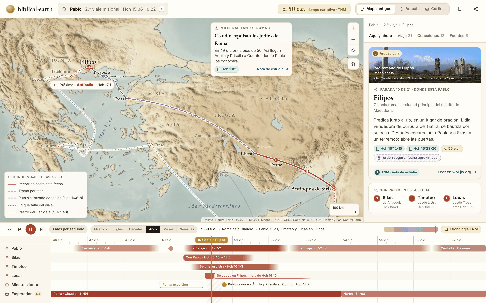
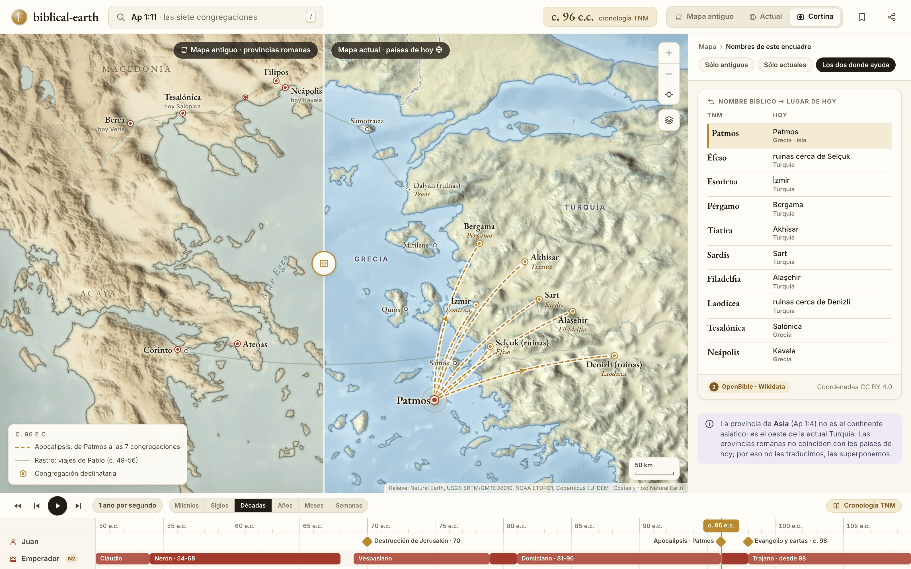
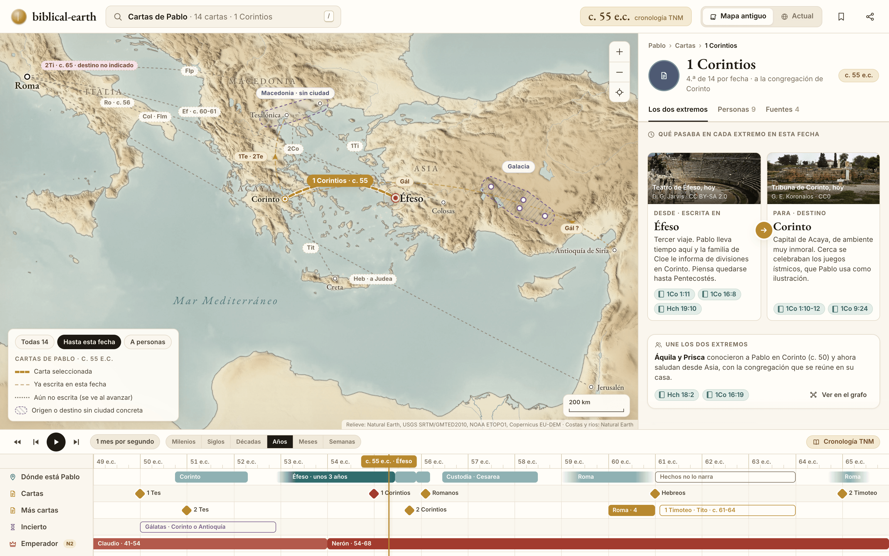
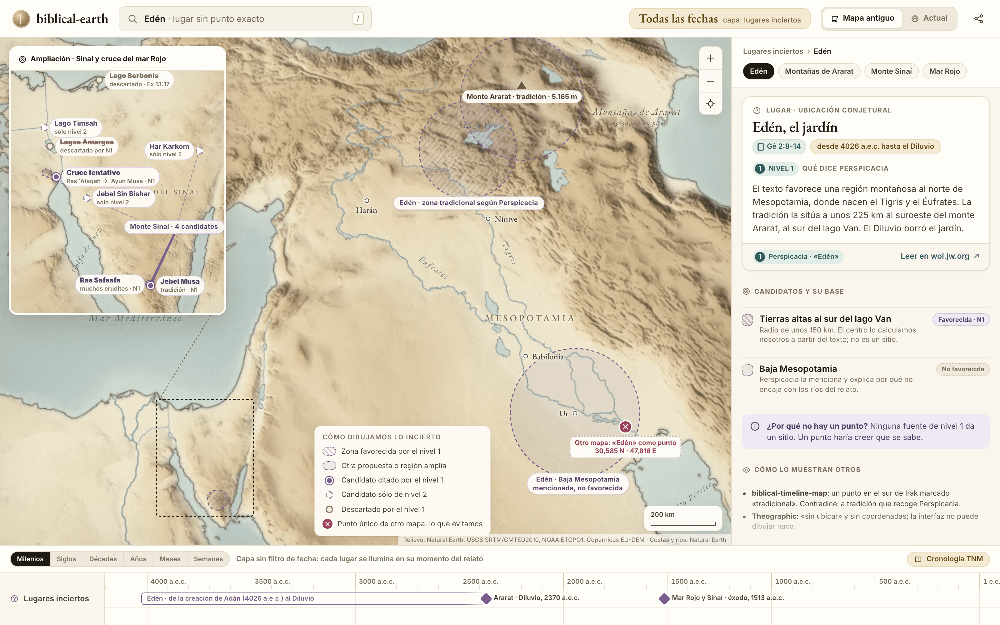
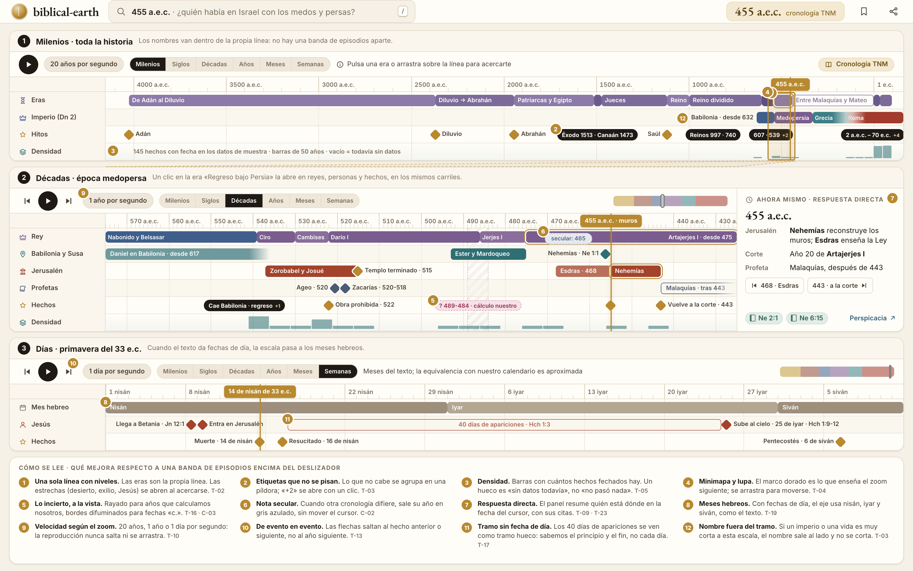
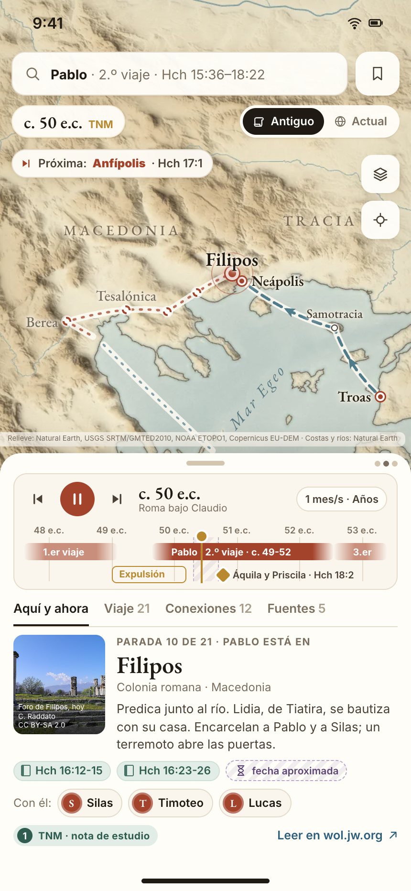
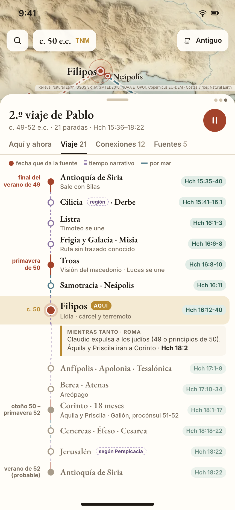

# Pantallas: mapa y tiempo

Este documento dibuja las pantallas del bloque «mapa y tiempo»: la pantalla principal, el conmutador de mapa antiguo y actual, las cartas de Pablo, los lugares inciertos, la línea de tiempo y el móvil. Cada lámina es una maqueta HTML renderizada con el kit de [`mockups/`](mockups/README.md). Usa datos comprobados en wol.jw.org y guardados en [`mockups/data/`](mockups/data/README.md).

Los códigos entre corchetes (T-02, M-11, F-04…) remiten a las ideas de [`catalogo-de-ideas.md`](catalogo-de-ideas.md).

Reglas que cumplen todas las láminas:

- Ningún texto de la TNM ni imagen de jw.org. Hay referencias («Hch 16:12-15»), resúmenes escritos por nosotros y botones «Leer en wol.jw.org ↗».
- La cronología TNM es la principal. La secular sale como nota cuando difiere.
- Las fotos son ruinas y objetos de museo de hoy, con licencia libre y el crédito a la vista. La fotografía nace hacia 1826, así que de la época bíblica no hay fotos.
- Lo incierto se dibuja como incierto: zonas, abanicos de candidatos, bordes difuminados y rayados.

| N.º | Pantalla | Pregunta principal |
|---|---|---|
| 01 | [Pantalla principal](#01--pantalla-principal) | ¿Dónde está Pablo ahora y qué pasa a su alrededor? |
| 02 | [Mapa antiguo frente a actual](#02--mapa-antiguo-frente-a-actual) | ¿Dónde queda hoy este lugar bíblico? |
| 03 | [Cartas de Pablo](#03--cartas-de-pablo) | ¿Desde dónde escribió cada carta, a quién, y qué pasaba en los dos extremos? |
| 04 | [Lugares inciertos](#04--lugares-inciertos) | ¿Dónde estaba el Edén? ¿Y el Sinaí? ¿Por qué no hay un punto? |
| 05 | [Línea de tiempo](#05--línea-de-tiempo) | ¿Quién había en Israel con los medos y persas? ¿Cómo me muevo por 4.000 años? |
| 06 | [Móvil](#06--móvil) | Lo mismo que la 01, con una mano |

---

## 01 · Pantalla principal

*Maqueta: [`mockups/src/01-principal.html`](mockups/src/01-principal.html)*

**Pregunta que responde.** ¿Dónde está Pablo en esta fecha, con quién va, qué ha recorrido, adónde va después y qué pasa mientras tanto en otro sitio?

**Qué se ve.** El segundo viaje (c. 49-52 e.c.) se está reproduciendo. El cursor está en el año 50, con Pablo en Filipos.

- **Mapa antiguo** con provincias de la época (Macedonia, Acaya, Asia, Galacia, Cilicia). La ruta ya hecha va en terracota continua. Los tramos por mar van en azul discontinuo. El tramo de Hch 16:6-8, que no tiene ruta conocida, va en malva y lleva su propia línea en la leyenda. Lo que falta del viaje va punteado. El primer viaje queda como rastro gris.
- **Próxima parada** en una píldora: «Próxima: Anfípolis · Hch 17:1».
- **Tarjeta «Mientras tanto · Roma»**, con una flecha hacia fuera del encuadre: Claudio expulsa a los judíos de Roma en 49 o a principios de 50, y así llegan Áquila y Priscila a Corinto (nota de estudio de Hch 18:2).
- **Panel lateral** con la ficha de la parada: foto del foro de Filipos con crédito, «Parada 10 de 21», resumen propio, referencias, la fecha «c. 50 e.c.» y la etiqueta «orden seguro, fecha aproximada», porque es tiempo narrativo. Debajo aparece quién va con Pablo en esa fecha: Silas, Timoteo y Lucas, cada uno con la cita que lo pone ahí.
- **Línea de tiempo** con carriles para Pablo, Silas, Timoteo, Lucas, «Mientras tanto» y el emperador (nivel 2). La franja rayada alrededor del cursor marca que la fecha exacta en Filipos no se conoce.

**Cómo se llega.**

- Buscando «Pablo», «2.º viaje» o «Hch 16» [B-02].
- Pulsando el tramo «2.º viaje» en el carril de Pablo de cualquier línea de tiempo.
- Desde un enlace directo que guarda fecha, encuadre y selección [B-08]; por ejemplo, `/pablo/viaje-2?t=50.4`.

**Qué se puede pulsar.**

| Elemento | Qué hace |
|---|---|
| Ciudad del mapa | Ficha del lugar en esta fecha: qué pasó allí y quién estaba [M-12, F-03]. |
| Tramo de ruta | Ficha del tramo: por tierra o por mar, referencias y cuánto duraba [F-06]. |
| Píldora «Próxima» | Mueve el cursor a la parada siguiente [T-13]. |
| Tarjeta «Mientras tanto» | Centra el mapa en Roma sin mover el cursor. «Nota de estudio ↗» abre la nota de Hch 18:2 en wol.jw.org. |
| Referencia «Hch 16:12-15» | Vista previa con nuestro resumen y el botón «Leer en wol.jw.org ↗», que abre [Hechos 16](https://wol.jw.org/es/wol/b/r4/lp-s/nwtsty/44/16) [B-10]. |
| Silas, Timoteo, Lucas | Grafo centrado en esa persona, en esta fecha (pantalla 07) [G-01]. |
| Pestañas del panel | «Viaje 21» da la lista de paradas (en el móvil, la 06b). «Conexiones 12» abre el grafo. «Fuentes 5» lista las fuentes por nivel [C-06]. |
| Conmutador «Mapa antiguo / Actual / Cortina» | Pantalla 02 [M-01, M-02]. |
| Carriles de la línea de tiempo | Pulsar una marca la elige y abre su ficha. El cursor entra en la marca por el punto pulsado, y ni la escala ni la vista se mueven. Fijar un carril lo sube arriba para compararlo [T-08]. |

**Estados alternativos.**

- *Pausa.* El botón central muestra «reproducir» y la píldora «Próxima» desaparece. La ficha no cambia.
- *Fecha sin datos.* Si el cursor cae en un año sin paradas, la ficha dice «No sabemos dónde estaba Pablo en esta fecha» y ofrece las dos paradas con fecha más cercanas [M-13, C-11]. Nunca se inventa una posición.
- *Tramo incierto.* En Hch 16:6-8 la ficha del tramo explica que el texto nombra regiones y no ciudades, y el mapa no dibuja una calzada concreta.
- *Cargando.* El mapa base sale primero y las rutas después. El panel muestra el esqueleto de la ficha con el nombre de la parada ya escrito, porque el nombre viaja en la dirección de la página.
- *Móvil.* Pantalla 06.

**Ideas que materializa.** T-01, T-06, T-07, T-09, T-10, T-16, T-17, T-23, M-08, M-09, M-12, M-18, F-03, F-13, F-14, A-05, C-01, C-02.

---

## 02 · Mapa antiguo frente a actual

*Maqueta: [`mockups/src/02-antiguo-vs-actual.html`](mockups/src/02-antiguo-vs-actual.html)*

**Pregunta que responde.** ¿Dónde queda hoy este lugar? ¿Qué es «Asia» en la Biblia? ¿Por qué el mapa de hoy me desorienta?

**Qué se ve.** El cursor está hacia el año 96, con Juan en Patmos y las siete congregaciones de Apocalipsis 1:11.

- **Cortina vertical.** A la izquierda, el mapa antiguo: pergamino, provincias romanas y nombres de la época (Macedonia, Acaya, Tesalónica, Berea, Neápolis). A la derecha, el mapa actual: colores de atlas, fronteras y países de hoy (Grecia, Turquía), con el nombre moderno arriba y el bíblico en cursiva debajo (Bergama / *Pérgamo*, Akhisar / *Tiatira*, Alaşehir / *Filadelfia*). El tirador redondo del centro se arrastra.
- **Etiqueta doble** en el lado antiguo, sólo donde ayuda: «Tesalónica · hoy Salónica», «Berea · hoy Veria» [M-03].
- **Arcos del Apocalipsis**, de Patmos a las siete congregaciones.
- **Panel «Nombres de este encuadre»**: una tabla TNM → hoy con país. Tiene un filtro de tres posiciones: «Sólo antiguos», «Sólo actuales» y «Los dos donde ayuda».
- **Nota sobre Asia.** La provincia de Asia (Ap 1:4) no es el continente asiático. Las provincias no coinciden con los países de hoy. Por eso no las traducimos, las superponemos.

**Cómo se llega.** Con el conmutador de la barra superior, en cualquier pantalla con mapa. Si el usuario busca un nombre moderno («Izmir», «Salónica»), la búsqueda abre este modo con la cortina ya puesta [B-05].

**Qué se puede pulsar.**

| Elemento | Qué hace |
|---|---|
| Tirador de la cortina | Arrastrar mueve la línea. Doble clic la centra. |
| «Mapa antiguo» / «Mapa actual» (rótulos de cada lado) | Pone todo el mapa en ese estilo. |
| Fila de la tabla (p. ej. «Laodicea → ruinas cerca de Denizli») | Centra y resalta el lugar en los dos lados. |
| Filtro «Sólo antiguos / Sólo actuales / Los dos» | Cambia las etiquetas del mapa, no el mapa base. |
| Insignia «OpenBible · Wikidata» | Explica de dónde salen las coordenadas y su licencia [C-08]. |

**Estados alternativos.**

- *Sin cortina.* Mapa antiguo o actual a pantalla completa, con las mismas etiquetas dobles.
- *Lugar sin identificar hoy.* La fila dice «sin identificar» en la columna «hoy». En el mapa se ve una zona, no un punto (pantalla 04).
- *Nombre que cambió con el tiempo.* La fila enseña los dos nombres con sus fechas de uso, por ejemplo Afec y Antípatris. Esas fechas aún no están comprobadas y no salen hasta que lo estén.
- *Móvil.* La cortina pasa a horizontal: arriba el mapa antiguo, abajo el actual. El tirador se arrastra con el pulgar.

**Ideas que materializa.** M-01, M-02, M-03, M-04, M-05, M-14, B-05, C-08.

---

## 03 · Cartas de Pablo

*Maqueta: [`mockups/src/03-cartas-de-pablo.html`](mockups/src/03-cartas-de-pablo.html)*

**Pregunta que responde.** ¿Desde dónde escribió Pablo cada carta, a quién iba, en qué fecha, y qué pasaba en ese momento en la ciudad desde la que escribe y en la ciudad que la recibe?

**Qué se ve.** El cursor está hacia el año 55 y la carta seleccionada es 1 Corintios, de Éfeso a Corinto.

- **Arcos de carta** desde el lugar de escritura hasta el destino, cada uno con su etiqueta corta («1Te · 2Te», «Ro · c. 56», «Ef · c. 60-61»). La carta seleccionada va en dorado grueso. Las ya escritas van en discontinuo fino. Las que aún no se han escrito en esta fecha van punteadas y se ven al avanzar el cursor.
- **Origen o destino sin ciudad concreta**, dibujado como zona rayada: Gálatas («Corinto o Antioquía de Siria», c. 50-52) va a una región, y 2 Corintios, 1 Timoteo y Tito salen de «Macedonia». 2 Timoteo lleva «destino no indicado» [F-08].
- **Tarjeta doble** en el panel, con foto actual de cada extremo. *Desde · Éfeso*: tercer viaje; la familia de Cloe le informa de divisiones en Corinto; piensa quedarse hasta Pentecostés. *Para · Corinto*: capital de Acaya, ambiente inmoral, los juegos ístmicos cerca. Cada lado lleva sus referencias.
- **«Une los dos extremos»**: Áquila y Prisca conocieron a Pablo en Corinto y ahora saludan desde Asia (Hch 18:2; 1Co 16:19). Lleva el enlace «Ver en el grafo».
- **Línea de tiempo** con dónde está Pablo, las cartas como hitos, un carril «Incierto» para Gálatas y el emperador.

**Cómo se llega.**

- Buscando «cartas de Pablo», «1 Corintios» o «1Co».
- Pulsando un rombo de carta en la línea de tiempo.
- Desde la ficha de un libro bíblico [F-10].

**Qué se puede pulsar.**

| Elemento | Qué hace |
|---|---|
| Arco o etiqueta de carta | Selecciona esa carta: mueve el cursor a su fecha y rellena la tarjeta doble [G-09, F-04]. |
| «Todas 14 / Hasta esta fecha / A personas» | Filtra los arcos. «A personas» deja las cartas a Timoteo, Tito y Filemón. |
| Foto de un extremo | Ficha del lugar en esa fecha, con el crédito completo. |
| Referencias («1Co 1:11», «Hch 19:10») | Vista previa y «Leer en wol.jw.org ↗» (por ejemplo, [1 Corintios 16](https://wol.jw.org/es/wol/b/r4/lp-s/nwtsty/46/16)). |
| Pestaña «Personas 9» | Quién se menciona en la carta, cada uno con su fecha y su lugar [A-18]. |
| Pestaña «Fuentes 4» | La [tabla de los libros de la Biblia](https://wol.jw.org/es/wol/d/r4/lp-s/1001070071) y *Perspicacia* («Corintios, Cartas a los»), con la fecha de comprobación [C-10]. |
| «Ver en el grafo» | Grafo con la carta en el centro y los dos lugares y las personas alrededor (pantalla 07). |

**Estados alternativos.**

- *Carta con origen dudoso* (Gálatas). La tarjeta «Desde» se parte en dos candidatos con su base y dice «La tabla de los libros da los dos».
- *Carta sin destino* (2 Timoteo). La tarjeta «Para» dice «destino no indicado» y no dibuja arco, sólo un halo en Roma.
- *Destino que es una región* (Gálatas, 1 Pedro). La tarjeta «Para» describe la región en esa fecha, no una ciudad.
- *Sin carta seleccionada.* El panel muestra la lista de las 14 cartas ordenadas por fecha, con el origen y el destino en una línea.
- *Móvil.* El arco seleccionado queda en el mapa. La tarjeta doble pasa a dos tarjetas apiladas en la hoja inferior, «Desde» arriba y «Para» abajo.

**Ideas que materializa.** G-09, G-10, G-19, F-04, F-08, F-10, F-11, A-18, T-16, C-01, C-10.

---

## 04 · Lugares inciertos

*Maqueta: [`mockups/src/04-lugares-inciertos.html`](mockups/src/04-lugares-inciertos.html)*

**Pregunta que responde.** ¿Dónde estaba el Edén? ¿Dónde se posó el arca? ¿Cuál es el monte Sinaí? ¿Por dónde se cruzó el mar Rojo? Y sobre todo: ¿por qué el mapa no me da un punto?

**Qué se ve.**

- **Edén** como zona rayada en las tierras altas al sur del lago Van. Es la ubicación tradicional que recoge *Perspicacia*: unos 225 km al suroeste del monte Ararat. El centro de la zona lo calculamos nosotros y la ficha lo dice. La Baja Mesopotamia sale como zona clara, «mencionada, no favorecida».
- **Lo que evitamos**, marcado con una cruz. Otro mapa pone el Edén como un punto en el sur de Irak (30,585 N · 47,816 E). Eso contradice la tradición que recoge *Perspicacia*.
- **Montañas de Ararat** como región, «no un pico». El monte Ararat (unos 5.165 m) aparece como el lugar donde lo sitúa la tradición.
- **Ampliación del Sinaí y el mar Rojo**: cuatro candidatos para el monte, con su base. Ras Safsafa («muchos eruditos») y Jebel Musa («tradición») están citados por el nivel 1; Jebel Sin Bishar y Har Karkom son sólo de nivel 2. El cruce tentativo va de Ras ʽAtaqah a ʽAyun Musa. Los lagos Amargos y el lago Serbonis aparecen descartados, con su referencia.
- **Leyenda de lo incierto**: zona favorecida por el nivel 1, otra propuesta, candidato citado por el nivel 1, candidato sólo de nivel 2, descartado, y «punto único de otro mapa».
- **Panel** con pestañas por lugar, «Qué dice Perspicacia» en resumen propio, los candidatos con su insignia de base, «¿Por qué no hay un punto?» y «Cómo lo muestran otros».

**Cómo se llega.**

- Buscando «Edén», «Sinaí», «Ararat» o «mar Rojo».
- Con la capa «Lugares inciertos». Esta capa no filtra por fecha. Cada lugar se ilumina en su momento del relato.
- Desde cualquier ficha con el aviso «identificación incierta» [F-08].

**Qué se puede pulsar.**

| Elemento | Qué hace |
|---|---|
| Zona o candidato | Selecciona el candidato en el panel: su base, sus fuentes y quién lo defiende [C-07]. |
| Pestañas «Edén · Montañas de Ararat · Monte Sinaí · Mar Rojo» | Cambian el encuadre y la ficha. |
| «Perspicacia · «Edén»» y «Leer en wol.jw.org ↗» | Abre el artículo [«Edén»](https://wol.jw.org/es/wol/d/r4/lp-s/1200001256) en wol.jw.org. |
| Marca de «otro mapa» | Explica qué muestra ese otro proyecto y por qué no lo seguimos. |
| Ampliación del Sinaí | Pulsarla la convierte en el mapa principal. |
| Hitos de la línea de tiempo (Diluvio, 2370 a.e.c.; éxodo, 1513 a.e.c.) | Mueven el cursor a esa fecha y encienden sólo los lugares de ese episodio. |

**Estados alternativos.**

- *Filtro «sólo nivel 1»* [C-09]. Desaparecen Jebel Sin Bishar, Har Karkom y el lago Timsah. Quedan las zonas y los candidatos que cita *Perspicacia*.
- *Lugar sin ningún candidato con base.* La ficha dice «No sabemos dónde estaba» y el mapa no dibuja nada. Sólo aparece la región del relato, si la hay.
- *Coordenada calculada por nosotros.* Aparece con la insignia «calculado» y la fórmula («225 km al SO del Ararat»).
- *Móvil.* Las zonas se mantienen. La lista de candidatos va en la hoja inferior y cada fila resalta su candidato en el mapa.

**Ideas que materializa.** M-10, M-11, M-13, F-08, C-01, C-03, C-07, C-08, C-09, C-11.

---

## 05 · Línea de tiempo

*Maqueta: [`mockups/src/05-linea-de-tiempo.html`](mockups/src/05-linea-de-tiempo.html)*

**Pregunta que responde.** ¿Cómo me muevo por más de 4.000 años sin perderme? Y en concreto: ¿quién había en Israel en tiempos de los medos y persas?

**Qué se ve.** La misma línea de tiempo en tres zooms. Las marcas numeradas remiten a la leyenda de abajo.

1. **Milenios.** Toda la historia, de Adán (4026 a.e.c.) al siglo I, en una línea. Las eras son la propia línea, sin una banda de episodios encima que repita lo mismo. Debajo van el carril «Imperio (Dn 2)» (Babilonia desde 632, Medopersia, Grecia, Roma), los hitos y la densidad de hechos. Los hitos que no caben se agrupan en píldoras: «Éxodo 1513 · Canaán 1473», «Reinos 997 · 740», «607 · 539 +2». El marco dorado es lo que muestra el zoom siguiente, y una lupa lo une con él.
2. **Décadas, época medopersa** (575-425 a.e.c.). La era «Regreso bajo Persia» se abre en carriles de reyes, de Babilonia y Susa, de Jerusalén, de profetas y de hechos. Aparecen Ciro, Cambises, Darío I, Jerjes I y Artajerjes I; Daniel en Babilonia; Ester y Mardoqueo en Susa; Zorobabel y Josué; Ageo y Zacarías; Esdras desde 468; Nehemías desde 455; Malaquías después de 443. Los años de Ester y del decreto de Hamán (489-484) son un cálculo nuestro y salen huecos; su ficha explica la cuenta. La subida de Artajerjes lleva la nota secular «465» sin mover el cursor. A la derecha, el panel «Ahora mismo» contesta en tres líneas quién está dónde en 455 a.e.c.
3. **Días, primavera del 33 e.c.** El eje pasa a los meses hebreos: nisán, iyar, siván. Jesús llega a Betania el 8 de nisán y entra en Jerusalén el 9. Muere el 14 de nisán y resucita el 16. Pasa 40 días apareciéndose (un tramo hueco que va del 16 de nisán al 25 de iyar) y sube al cielo el 25 de iyar. El 6 de siván es Pentecostés.

**Cómo se llega.** Es la franja inferior de todas las pantallas de escritorio. Se abre a pantalla completa con la tecla `T` o arrastrando su borde superior. Buscar un año («455 a.e.c.») la lleva al zoom de décadas con el cursor en ese año [B-03, T-20].

**Qué se puede pulsar.**

| Elemento | Qué hace |
|---|---|
| Era (p. ej. «Reino dividido») | La elige y abre su ficha, con el cursor en el punto pulsado. La escala no cambia. Para verla entera, su ficha tiene el botón «Ver este tramo en la línea» [T-02]. |
| Píldora agrupada («607 · 539 +2») | Despliega los hitos que contiene [T-03]. |
| Marco dorado | Se arrastra para mover el zoom siguiente [T-04]. |
| Escala «Milenios … Semanas» | Cambia el zoom. La velocidad de reproducción se ajusta sola: 20 años, 1 año o 1 día por segundo [T-10]. |
| Flechas ⏮ ⏭ | Saltan al hecho anterior o siguiente, no al año siguiente [T-13]. En el panel se ven como «468 · Esdras» y «443 · a la corte». |
| Tramo de persona o de rey | Ficha de la persona o del periodo [F-01, F-09]. |
| Marca hueca (cálculo nuestro) | Su ficha explica cómo se calculó el año y por qué no está verificado [C-03]. |
| Chip «secular: 465» | Muestra las dos cronologías, con sus fuentes [C-02, C-04]. |
| «Ne 2:1», «Perspicacia ↗» | Vista previa y enlace a wol.jw.org ([Nehemías 2](https://wol.jw.org/es/wol/b/r4/lp-s/nwt/16/2)). |

**Estados alternativos.**

- *Zoom de años y de meses.* Entre las décadas y los días hay dos niveles más. En «Años» aparecen las estaciones cuando el texto las da (la «primavera de 50» del viaje de Pablo). En «Meses», los meses hebreos si se conocen y, si no, el tramo narrativo.
- *Tramos vacíos.* Un siglo sin datos se pliega a una franja estrecha con el rótulo «sin datos en este tramo» [T-21]. La densidad lo avisa antes.
- *Muchos carriles.* Se muestran seis como mucho y el resto se agrupa en «+4 carriles». Fijar un carril lo sube arriba [T-08].
- *Cargando.* Las eras y el eje salen al momento. Los hitos se rellenan después, con la densidad como marcador de posición.
- *Móvil.* La línea de tiempo vive en la hoja inferior (06). Abierta del todo, pasa a vertical (06b) [T-22].

**Ideas que materializa.** T-01, T-02, T-03, T-04, T-05, T-07, T-09, T-10, T-13, T-16, T-17, T-19, T-20, T-23, C-02, C-03, C-12.

---

## 06 · Móvil

<table>
<tr>
<td width="50%"></td>
<td width="50%"></td>
</tr>
<tr>
<td><em>06 · hoja a media altura (<a href="mockups/src/06-movil.html">HTML</a>)</em></td>
<td><em>06b · hoja abierta del todo (<a href="mockups/src/06b-movil-hoja-abierta.html">HTML</a>)</em></td>
</tr>
</table>

**Pregunta que responde.** La misma que la pantalla principal, en un teléfono de 430 × 932 y con una mano. Pensamos sobre todo en quien lo usa en una reunión o leyendo la Biblia en el móvil.

**Qué se ve en 06 (media altura).**

- Mapa a pantalla completa. La ruta hecha va en terracota y la de mar en azul. La próxima parada va en una píldora.
- Arriba: la búsqueda, la fecha «c. 50 e.c. · TNM» y el conmutador «Antiguo / Actual». A la derecha, las capas y «centrar en Pablo».
- **Hoja inferior** con tres alturas (los tres puntos arriba a la derecha) [D-01]. A media altura lleva:
  - una **línea de tiempo compacta**: reproducción, fecha grande, contexto en una frase («Roma bajo Claudio»), el tramo del 2.º viaje, la expulsión de Roma y el encuentro con Áquila y Priscila;
  - las **pestañas** del panel de escritorio;
  - la **ficha** de Filipos con foto y crédito, resumen, referencias y «fecha aproximada»;
  - «Con él: Silas, Timoteo, Lucas»;
  - la insignia de nivel y «Leer en wol.jw.org ↗».

**Qué se ve en 06b (abierta).** El mapa queda reducido a una franja con la posición actual. La pestaña «Viaje» muestra el segundo viaje como **línea de tiempo vertical** [T-22]:

- El raíl es continuo donde la fuente da fecha: final del verano de 49, primavera de 50, del otoño de 50 a la primavera de 52 y el verano de 52 (probable).
- El raíl es rayado malva donde el tiempo es narrativo.
- El raíl es azul discontinuo en los tramos por mar.
- Filipos aparece resaltada con la etiqueta «aquí», y debajo va la tarjeta «Mientras tanto · Roma».
- Las paradas futuras van en gris.
- Las regiones llevan la etiqueta «región». Jerusalén (Hch 18:22) lleva «según Perspicacia», porque el texto sólo dice que subió a saludar a la congregación, sin nombrar la ciudad.

**Cómo se llega.** Es la pantalla de inicio en el móvil. La hoja se abre deslizando hacia arriba o tocando una pestaña. Se baja a la altura mínima deslizando hacia abajo; entonces sólo queda la línea de tiempo compacta y el mapa gana toda la pantalla.

**Qué se puede pulsar.**

| Elemento | Qué hace |
|---|---|
| Línea de tiempo compacta | Arrastrar de lado mueve el tiempo y arriba y abajo recorre los carriles. Un toque en una marca la elige, con el cursor en el punto tocado, sin cambiar la escala ni la vista. Pellizcar cambia el zoom. |
| «1 mes/s · Años» | Menú de velocidad y de zoom. |
| Parada de la lista vertical (06b) | Mueve el cursor a esa parada y baja la hoja a media altura para ver el mapa. |
| Referencia | Vista previa en una hoja secundaria, con «Leer en wol.jw.org ↗». |
| Persona («Silas») | Grafo centrado en esa persona, a pantalla completa. |
| Antiguo / Actual | Cambia el estilo del mapa. Mantenerlo pulsado activa la cortina horizontal (02). |

**Estados alternativos.**

- *Hoja mínima.* Sólo la línea de tiempo compacta, a unos 120 px de alto. Es la vista para seguir la reproducción mirando el mapa.
- *Horizontal.* El mapa ocupa la izquierda y la hoja pasa a panel lateral, como en escritorio.
- *Sin conexión.* Si los datos del viaje están guardados, todo funciona. Sin conexión, las fotos muestran su crédito sobre un fondo neutro, y los enlaces a wol.jw.org avisan de que hace falta red [D-04].
- *Texto grande.* Con el tamaño de letra del sistema al máximo, la ficha pierde la foto antes que el texto y las referencias bajan a una segunda línea [D-11].

**Ideas que materializa.** D-01, D-03, D-04, D-11, T-17, T-22, T-23, F-13, A-05, C-01.

---

## Más ideas para estas pantallas

Variantes que no hemos dibujado todavía.

**Pantalla principal**

- **Estela de días de viaje.** Cada tramo con su distancia y una estimación de días a pie o en barco, marcada como estimación y con la velocidad que usamos [M-18, A-13].
- **Temporada de navegación.** De noviembre a marzo, el mar se sombrea como «época de no navegar». Sirve para entender el invierno en Malta del viaje a Roma [M-21].
- **Perfil de altitud** del tramo de Perge a Antioquía de Pisidia, bajo el mapa, al pulsar el tramo [M-22].
- **Cámara que sigue a Pablo** durante la reproducción, con un botón para soltarla y explorar mientras la reproducción sigue.
- **«Qué cambió desde la última parada»**: quién se unió, quién se quedó y en qué provincia se entra [F-15].
- **Pausa automática** en los hechos marcados como clave (la visión en Troas, el terremoto en Filipos), con la ficha abierta [T-11].

**Mapa antiguo frente a actual**

- **Cortina circular**: una lupa que enseña el mapa actual dentro de un círculo que sigue al puntero.
- **Fronteras que cambian con la fecha**: la provincia de Acaya aparece y desaparece según su estatus en cada año [M-04].
- **Costas antiguas**: la costa de Éfeso en el siglo I, con las dos hipótesis que da *Perspicacia* dibujadas como dos líneas [M-06].
- **Modo «¿dónde queda hoy?»**: el usuario escribe su ciudad y el mapa marca la distancia a Jerusalén o a Corinto [M-19].

**Cartas de Pablo**

- **Portadores de cartas**: un segundo arco más fino con quién llevó cada carta, cuando el texto lo dice [G-10].
- **Cartas a una misma congregación en fila**: Tesalónica recibe dos cartas en poco tiempo; una ficha de congregación con las dos y lo que cambia entre ellas [F-11].
- **Cartas de otros autores** (Pedro, Santiago, Juan) en el mismo mapa, cada autor con su color, y 1 Pedro saliendo de la Babilonia del Éufrates.
- **Lectura por orden de escritura**: un recorrido guiado que abre las cartas en el orden de la tabla de los libros [A-01].

**Lugares inciertos**

- **Comparar dos candidatos lado a lado**: Ras Safsafa frente a Jebel Musa, con la distancia al campamento, el relieve y la base documental [F-16].
- **Historial de la identificación**: cuándo se propuso cada candidato y por quién (nivel 2), en una línea de tiempo pequeña.
- **Modo «¿qué sabemos?»** para niños: una sola frase por lugar y una zona grande sin tecnicismos [A-17].

**Línea de tiempo**

- **Regla temporal**: arrastrar entre dos puntos para medir años («De 607 a 537: 70 años») [T-15].
- **Edad en la fecha**: al pasar el cursor por la vida de una persona, su edad si la Biblia la da [T-18].
- **Bucle entre dos marcas** para repasar un tramo (la semana final, del 8 al 16 de nisán) [T-12].
- **Sincronía de dos regiones**: dos líneas de tiempo apiladas, Judá y Babilonia, con el mismo cursor [A-12].
- **Juego «ordena los hechos»**: arrastrar tarjetas a la línea y comprobar [A-08].
- **Densidad por tipo**: el histograma dividido en personas, lugares y hechos con sus colores de nodo.

**Móvil**

- **Modo reunión**: letra grande, sin reproducción y con la referencia que se está leyendo fija arriba [D-02].
- **Gesto de dos dedos en vertical** para cambiar de zoom temporal sin tocar el mapa.
- **Compartir la vista** como enlace o QR con fecha, encuadre y selección [B-08, B-14].
- **Widget de «este día en el relato»** con la fecha hebrea del día, cuando el texto la da.

---

## Datos y fuentes de estas láminas

Cada maqueta lleva sus fuentes en un comentario al principio del HTML. Los datos de muestra están en [`mockups/data/`](mockups/data/README.md), con las URL de wol.jw.org comprobadas el 26 y el 27 de septiembre de 2026. Las principales:

- [Tabla de los libros de la Biblia](https://wol.jw.org/es/wol/d/r4/lp-s/1001070071): lugar y fecha de cada carta.
- [Estudio 3 de «Toda Escritura»](https://wol.jw.org/es/wol/d/r4/lp-s/1101990130): fechas TNM de la historia bíblica.
- *Perspicacia*: [«Pablo»](https://wol.jw.org/es/wol/d/r4/lp-s/1200003406), [«Babilonia»](https://wol.jw.org/es/wol/d/r4/lp-s/1200000530), [«Edén»](https://wol.jw.org/es/wol/d/r4/lp-s/1200001256), [«Galión»](https://wol.jw.org/es/wol/d/r4/lp-s/1200001603).
- Apéndices de la edición de estudio: [A7-H](https://wol.jw.org/es/wol/d/r4/lp-s/1001070214) (del 14 de nisán al 25 de iyar) y [B12-A](https://wol.jw.org/es/wol/d/r4/lp-s/1001070232) (8 y 9 de nisán).
- Notas de estudio de [Hechos 16](https://wol.jw.org/es/wol/b/r4/lp-s/nwtsty/44/16), [17](https://wol.jw.org/es/wol/b/r4/lp-s/nwtsty/44/17) y [18](https://wol.jw.org/es/wol/b/r4/lp-s/nwtsty/44/18).
- Nivel 2 y datos externos: coordenadas de [OpenBible.info](https://www.openbible.info/geo/) (CC BY 4.0) y Wikidata (CC0); relieve y costas de Natural Earth y otras fuentes citadas en el mapa; fotos de Wikimedia Commons con su autor y su licencia en [`mockups/kit/photos/CREDITS.md`](mockups/kit/photos/CREDITS.md); fechas de emperadores romanos según la cronología secular.

**Sin verificar**, y marcado así en las láminas: los años de Ester reina (489 a.e.c.) y del decreto de Hamán (484 a.e.c.), que calculamos contando 495 como año 1.º de Asuero; el centro de la zona del Edén y el punto medio del cruce del mar Rojo, que también calculamos nosotros. Los límites entre las potencias griega y romana en el carril «Imperio (Dn 2)» se dibujan difuminados a propósito, porque no les damos un año.
