# La portada: seis diseños para elegir

La portada es lo primero que ve quien abre biblical-earth sin una dirección concreta. Aquí hay seis diseños que funcionan, cada uno con el sitio de verdad detrás, y un catálogo de ideas por zona para mezclarlos. El dueño eligió el diseño 4, «Entra por una pregunta», y es la portada del sitio: cómo funciona está en [site/README.md](../../site/README.md#portada). Los seis prototipos se quedan aquí como referencia.

Todas las cifras de esta página están medidas en un navegador real, a 1440x900 con ratón y a 430x900 con pantalla táctil.

## 1. La portada de hoy

<table>
<tr>
<td width="76%">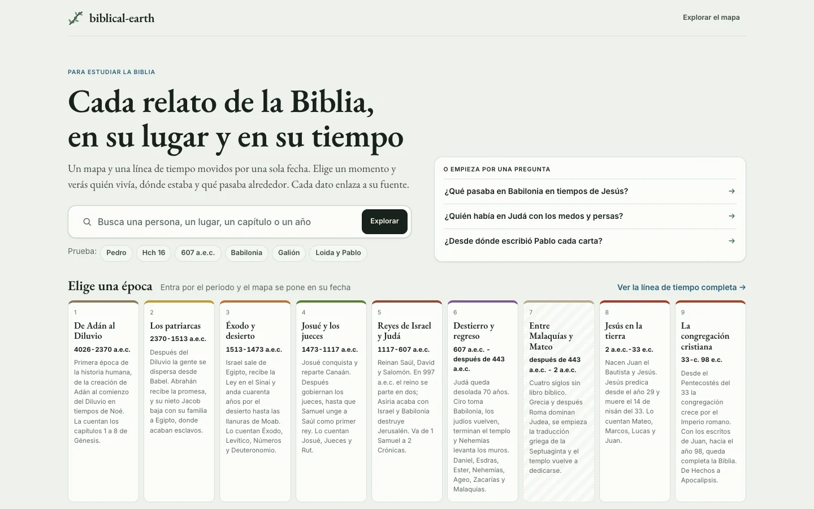</td>
<td width="24%">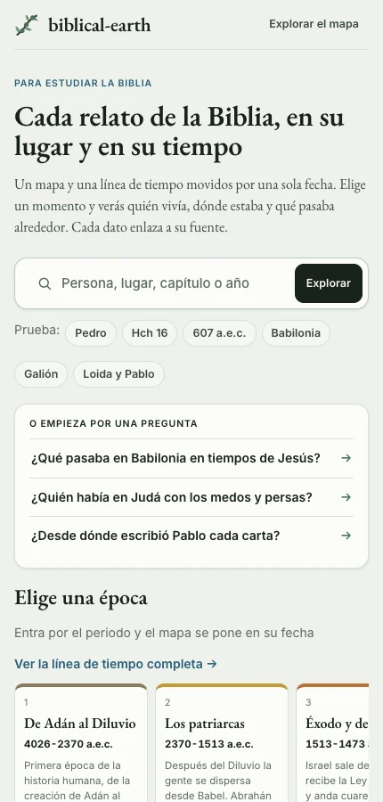</td>
</tr>
</table>

Qué queremos mejorar:

- **El mapa no se ve.** La portada es una hoja opaca puesta encima de un mapa que ya está pintado.
- **Hay demasiado en la primera pantalla.** 22 controles y 426 palabras, de las 567 que tiene la página.
- **El botón que enseña el mapa es el más pequeño.** «Explorar el mapa» mide 123x28 px. De los 36 controles, 22 miden menos de 44 px.
- **Las épocas no abren donde ocurrieron.** «Destierro y regreso» enseña Grecia.
- **Atrás no vuelve a la portada.** Después de «Explorar el mapa», Atrás saca del sitio.
- **En el teléfono se hace larga y lenta.** Con red lenta tarda unos 9 s en aparecer, mide 2022 px de alto y las épocas se desplazan de lado.

## 2. Lo que todos los diseños respetan

1. **Se entiende en cinco segundos.** Quien llega por primera vez sabe que es la Biblia en un mapa y en el tiempo, en español y para estudiar. También sabe qué hacer primero.
2. **El mapa sigue detrás.** Se ve o se nota desde la portada, y entrar es un paso que no pierde nada.
3. **El tema es el que ya se eligió.** La paleta Salvia, la rama de olivo, los títulos en serif, el relieve suave y el banner con su línea de seis fechas. Tranquilo y claro.
4. **Menos decisiones.** Una acción clara en la primera pantalla y, debajo, zonas que hacen una sola cosa.
5. **No se pierde nada.** La búsqueda, las preguntas, las épocas, los recorridos, «Seguir donde lo dejé», las fuentes y «acerca» siguen al alcance.
6. **Funciona para todos.** En el teléfono con una mano, con el teclado y con lector de pantalla, en claro y en modo reunión.
7. **Solo material nuestro.** Nuestro mapa y nuestro relieve con su crédito, nuestros dibujos y nuestras palabras. Ninguna foto, ninguna persona, nada copiado.

Una aclaración sobre el punto 6: el sitio no tiene un tema oscuro aparte. Lo oscuro es el modo reunión, que es cálido. Los seis diseños siguen ese modo.

## 3. Los seis diseños

Cada diseño se abre con un clic en su nombre. Para que funcione hay que servir la carpeta, como se explica [al final](#8-cómo-abrir-los-prototipos).

### 1. [El mapa detrás del velo](mockups/portada/veil/index.html)

<table>
<tr>
<td width="76%">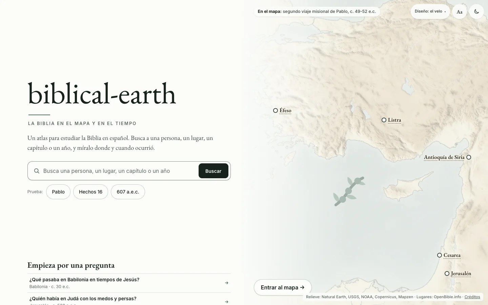</td>
<td width="24%">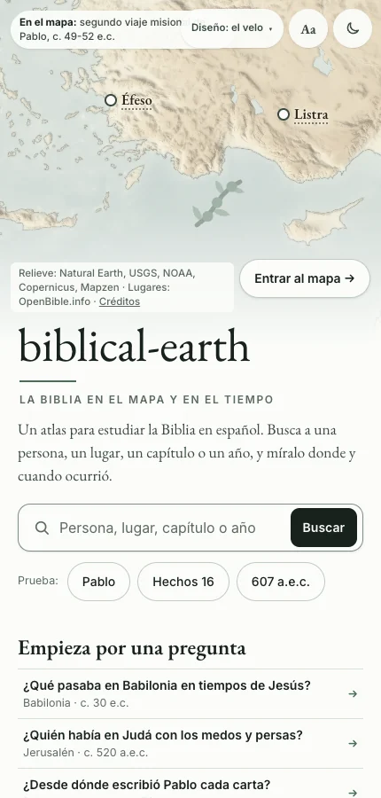</td>
</tr>
</table>

**Cómo se usa.** Es el banner convertido en página. A la izquierda se lee qué es el sitio y se busca. A la derecha está el mapa de verdad, lavado hacia el papel, con lugares que se pueden tocar. En el ordenador, al parar el ratón sobre una época o una pregunta, el mapa de detrás va a ese sitio antes de entrar.

**A qué renuncia.** No hay ninguna fecha que se pueda tocar en la primera pantalla. En el teléfono, «Entrar al mapa» y los lugares quedan arriba, lejos del pulgar.

**Qué cuesta.** Medio. Se reescribe la portada y su estilo, y el mapa necesita un modo «detrás de la portada». La imagen de fondo se rehace cada vez que cambie el estilo del mapa.

En cifras: 14 controles y 102 palabras en la primera pantalla. La página mide 2123 px en el ordenador y 2379 en el teléfono. Es la más corta de las seis en el teléfono.

### 2. [Una imagen a pantalla completa](mockups/portada/fullbleed/index.html)

<table>
<tr>
<td width="76%">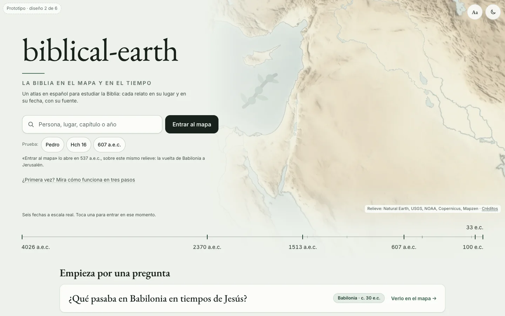</td>
<td width="24%">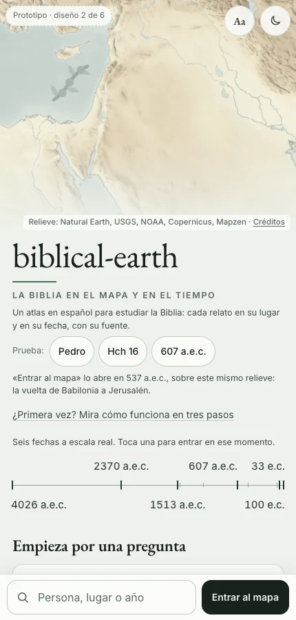</td>
</tr>
</table>

**Cómo se usa.** Nuestro relieve, de Egipto a Mesopotamia, ocupa casi toda la primera pantalla. Encima van el nombre, la búsqueda y un solo botón oscuro. Debajo está la línea de seis fechas del banner, y cada fecha se puede tocar. En el teléfono la búsqueda y el botón quedan fijos abajo, junto al pulgar.

**A qué renuncia.** El mapa vivo no se ve hasta entrar: la primera pantalla es una imagen. Es una página larga y en el teléfono los recorridos quedan a más de dos pantallas. «Entrar al mapa» abre en 537 a.e.c. y no en la fecha de siempre del sitio; una línea bajo el botón lo avisa.

**Qué cuesta.** Medio. Además de reescribir la portada, la compilación tiene que calcular el recorte de cada época y las seis fechas. Dos recortes se escriben a mano.

En cifras: 17 controles y 101 palabras en la primera pantalla. La página mide 3358 px en el ordenador y 4317 en el teléfono.

[La página entera](img/portada/fullbleed/page-desktop.webp) enseña las nueve épocas, cada una con un recorte del relieve. En el ordenador, cada punto del recorte lleva el número de su lugar en la línea de debajo; en el teléfono el recorte es pequeño y los puntos van sin número.

### 3. [Entra por el tiempo](mockups/portada/time/index.html)

<table>
<tr>
<td width="76%">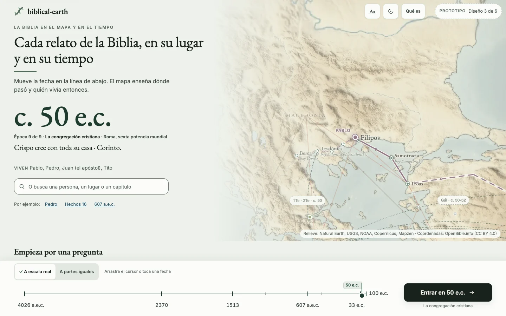</td>
<td width="24%">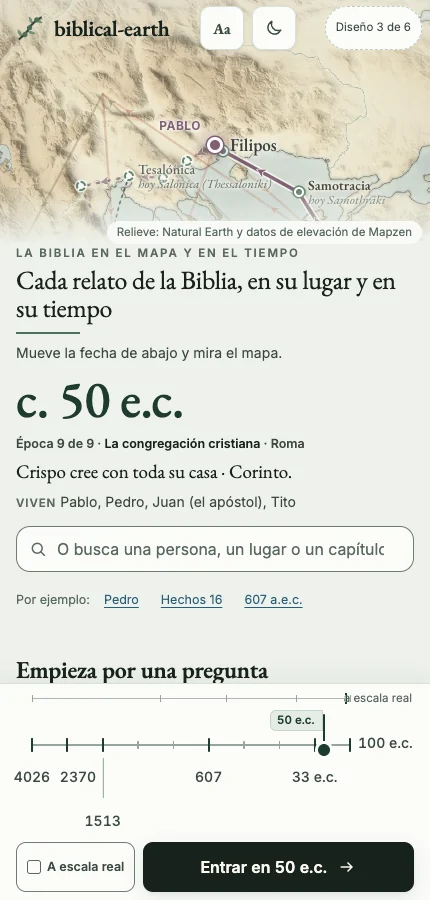</td>
</tr>
</table>

**Cómo se usa.** Se arrastra una fecha por toda la línea, de 4026 a.e.c. a 100 e.c. El año se lee en grande, una frase cuenta qué pasaba y quién vivía, y el mapa de detrás va a ese momento. El botón dice adónde lleva: «Entrar en 1513 a.e.c.».

**A qué renuncia.** Es la primera pantalla con más que descifrar. Todo cuesta dos pulsaciones. La primera prepara y la segunda entra. La barra de fecha ocupa una cuarta parte de la pantalla del teléfono (217 de 900 px) y 159 de 720 px en un portátil pequeño.

**Qué cuesta.** Medio. Hay que construir el cursor, la frase de cada fecha y el margen del mapa.

En cifras: 21 controles y 184 palabras en la primera pantalla. La página mide 2430 px en el ordenador y 3970 en el teléfono.

[Así queda al arrastrar hasta el Éxodo](img/portada/time/drag-1513-desktop.webp).

### 4. [Entra por una pregunta](mockups/portada/question/index.html)

<table>
<tr>
<td width="76%">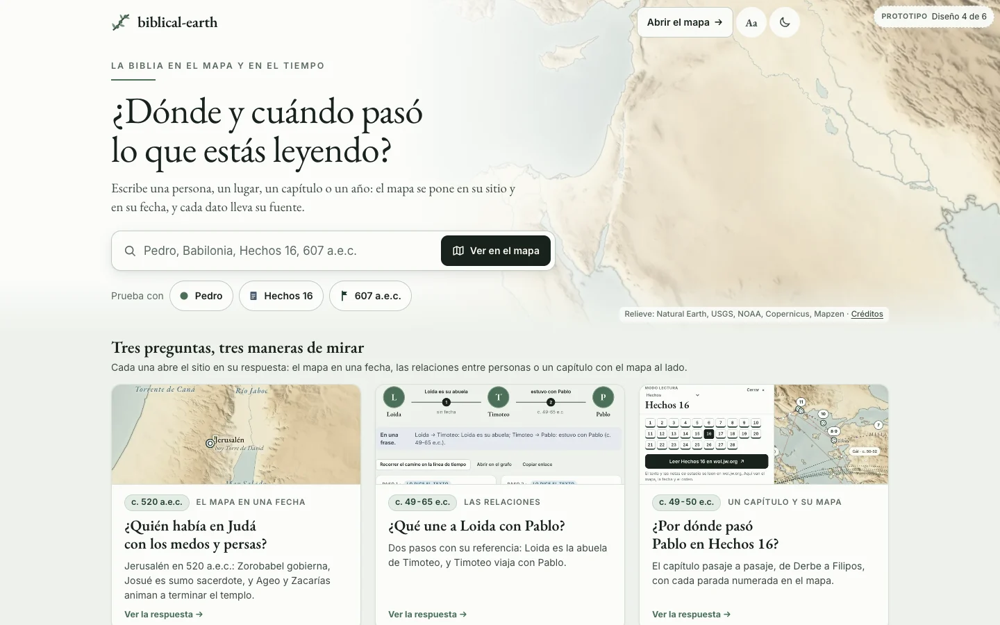</td>
<td width="24%">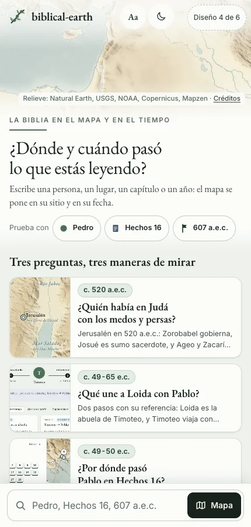</td>
</tr>
</table>

**Cómo se usa.** El título pregunta «¿Dónde y cuándo pasó lo que estás leyendo?» y la caja contesta mientras se escribe. Cada resultado lleva la forma de su tipo y su fecha. Tres tarjetas enseñan tres maneras de mirar: el mapa en una fecha, las relaciones entre personas y un capítulo con su mapa.

**A qué renuncia.** El mapa vivo no se ve desde la portada. Lo representan una imagen y tres capturas. No hay línea de fechas. La página es larga porque trae tres funciones nuevas: la lectura de la semana, un momento cualquiera y una pregunta de repaso.

**Qué cuesta.** Medio para la portada. Las tres funciones nuevas son trabajo aparte. El mapa no necesita nada nuevo.

En cifras: 13 controles y 192 palabras en la primera pantalla. La página mide 3264 px en el ordenador y unos 5050 en el teléfono (el bloque «Un momento cualquiera» cambia en cada visita).

[Así contesta la búsqueda](img/portada/question/suggest-desktop.webp).

### 5. [El sitio, funcionando](mockups/portada/live/index.html)

<table>
<tr>
<td width="76%">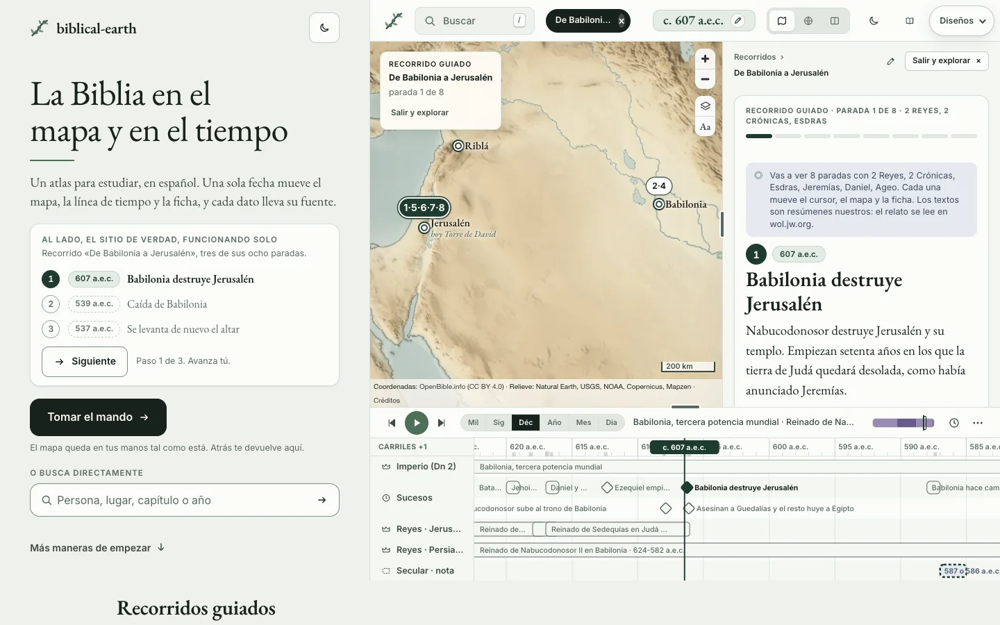</td>
<td width="24%">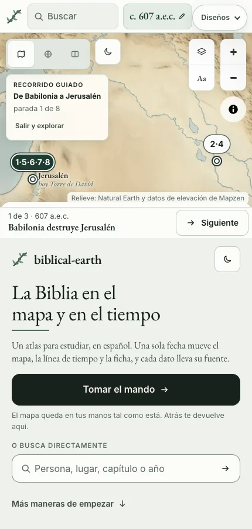</td>
</tr>
</table>

**Cómo se usa.** Media pantalla es el sitio de verdad, que reproduce una vez tres paradas del recorrido «De Babilonia a Jerusalén». «Tomar el mando» hace crecer ese marco hasta llenar la ventana. Los recorridos vienen los primeros, con su ruta dibujada sobre el relieve.

**A qué renuncia.** No se parece al banner. Lo primero que se ve es la aplicación entera, sin lavar y en movimiento. En el teléfono todos los controles del sitio se aprietan en una franja. Se entra dentro de un recorrido, no en un mapa libre. Es la página más larga.

**Qué cuesta.** Alto. El sitio tendría que dibujarse a medio ancho mientras la portada está abierta, y la escena pide funciones nuevas para no guardar lo que solo se miró.

En cifras: 8 controles propios y 133 palabras en la primera pantalla, más todo lo que enseña el sitio de al lado. La página mide 3164 px en el ordenador y 5876 en el teléfono.

[La página entera](img/portada/live/page-desktop.webp) enseña las tarjetas de los recorridos.

### 6. [La de hoy, afinada](mockups/portada/tuned/index.html)

<table>
<tr>
<td width="76%">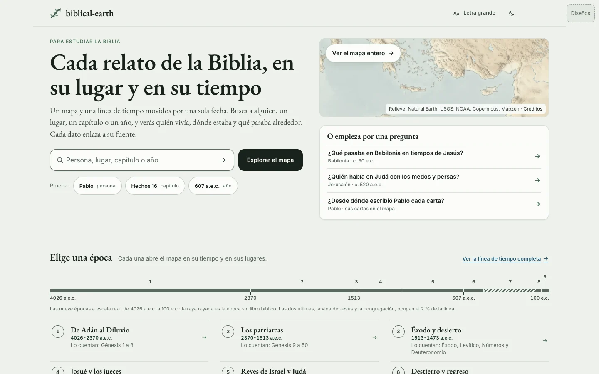</td>
<td width="24%">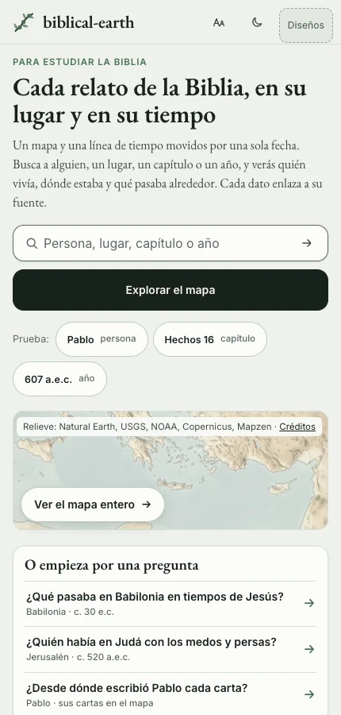</td>
</tr>
</table>

**Cómo se usa.** Es la portada de hoy, con las mismas zonas en el mismo orden y cada fallo medido arreglado. El mapa asoma por una ventana. Las épocas van en una sola tinta con los libros que las cuentan. Cada recorrido dibuja su ruta y recuerda por dónde ibas. «Letra grande» y el modo reunión están en la cabecera.

**A qué renuncia.** El mapa es una ventana pequeña y no hay línea de fechas que tocar: la franja de épocas sí se toca, pero son épocas. La primera pantalla sigue pidiendo muchas decisiones. En el teléfono la búsqueda queda arriba, lejos del pulgar.

**Qué cuesta.** Bajo. Es la más segura de construir. Los datos necesitan los libros y los lugares de cada época y tres resúmenes de recorridos.

En cifras: 20 controles y 220 palabras en la primera pantalla. La página mide 1994 px en el ordenador y 3858 en el teléfono.

## 4. Los diseños, regla por regla

Tres jueces probaron los seis prototipos en el navegador, cada uno con una mirada:

- **Primera visita.** Una persona que llega nueva, en el ordenador.
- **Teléfono.** Una mano, pantalla de 430 px y red lenta.
- **Tema.** El parecido con el banner, el teclado, el contraste y el movimiento.

Los tres dieron el mismo orden.

| Nota sobre 10 | Pantalla completa | El velo | Afinada | Pregunta | Tiempo | Funcionando |
|---|---|---|---|---|---|---|
| Primera visita | 8,4 | 8,2 | 7,2 | 6,9 | 6,6 | 5,4 |
| Teléfono | 8 | 7,5 | 7 | 6,5 | 6 | 5 |
| Tema | 8,5 | 8 | 6,5 | 6 | 5,5 | 4,5 |

En la tabla siguiente, una sola palabra quiere decir que los tres jueces coinciden. Tres palabras quieren decir que no coinciden, en este orden: primera visita, teléfono, tema.

| Regla | Pantalla completa | El velo | Afinada | Pregunta | Tiempo | Funcionando |
|---|---|---|---|---|---|---|
| 1. Se entiende en cinco segundos | sí · en parte · en parte | sí | sí | sí | en parte · en parte · sí | en parte |
| 2. El mapa sigue detrás | sí · en parte · sí | sí | en parte · sí · en parte | en parte | sí | sí · en parte · sí |
| 3. El tema elegido | sí | sí | sí | sí · en parte · en parte | en parte · sí · en parte | en parte · en parte · no |
| 4. Menos decisiones | sí | sí | en parte | en parte · en parte · sí | en parte | en parte |
| 5. No se pierde nada | sí · sí · en parte | sí | sí | sí | en parte · en parte · sí | sí |
| 6. Funciona para todos | sí | sí · en parte · en parte | sí · en parte · en parte | en parte | sí · en parte · en parte | en parte |
| 7. Solo material nuestro | sí | sí · sí · en parte | sí | sí | sí · sí · en parte | sí |

Dónde no coinciden y por qué:

- **Pantalla completa, regla 1.** Para quien llega nuevo se entiende. Los otros dos jueces echan de menos una frase que diga «para estudiar» y «en español».
- **Pantalla completa, regla 2.** En el teléfono, entrar por una fecha o por un lugar no encuadraba lo elegido. Ya lo encuadra: «33 e.c.» abre la muerte de Jesús sobre Jerusalén.
- **El velo, regla 6.** En el ordenador funciona bien. En el teléfono la entrada al mapa queda lejos del pulgar. Al volver con Atrás, el foco iba al título; ahora vuelve al control que se pulsó. Un juez vio además que el foco se perdía al entrar con el teclado. En nuestra prueba fue al título de la ficha, como debe.
- **El velo y Tiempo, regla 7.** El velo enseña lugares en la primera pantalla y el crédito de las coordenadas solo estaba en el pie. A Tiempo le pasaba lo mismo en el teléfono. Ahora los dos dan «Lugares: OpenBible.info» junto al relieve.
- **Tiempo, regla 1.** El juez del tema la da por buena. Los otros dos dudaron entre arrastrar, tocar una fecha o pulsar el botón.
- **Funcionando, regla 3.** Dos jueces dicen «en parte» y el del tema dice «no»: la mitad derecha no está lavada y la portada no llevaba su propia rama de olivo. Ahora la lleva; la mitad sigue sin lavar, porque es el diseño.

Los jueces probaron los prototipos antes de una ronda de arreglos. Lo que encontraron y se podía arreglar sin cambiar el diseño está arreglado, y lo que queda es propio de cada diseño: está en su «A qué renuncia». La tabla es su veredicto de entonces.

Lo que medimos nosotros en todos, después de los arreglos:

- Ningún error de consola en ninguna apertura.
- Entrar al mapa es una pulsación en los seis, y una pulsación de Atrás vuelve a la portada, también desde la búsqueda, una época, un recorrido o el primer paseo. Al volver, el foco queda en lo que se pulsó y la página en el mismo sitio.
- «Destierro y regreso» abre sobre Mesopotamia y Judá en los seis, también después de haber entrado y vuelto. Hoy abre sobre Grecia.
- La segunda pregunta dice «520 a.e.c.» en los seis, y la tercera abre todas las cartas de Pablo.
- «Letra grande» está junto a la luna en los seis. Ningún texto baja de 11,5 px, y todo lo que se toca mide al menos 44 px o lleva alrededor una zona de toque de ese tamaño, salvo los enlaces dentro de una frase.
- Si el sitio de detrás no carga (sin red, o con MapLibre caído), la portada se queda puesta y dice «No se ha podido abrir el mapa», con un botón para volver a intentarlo. Si se pulsa antes de que cargue, dice «Abriendo el mapa…» hasta que se puede entrar.

## 5. Ideas por zona

Cada idea dice en qué diseño se ve funcionando. Así se pueden mezclar zonas de diseños distintos. Las diez más fuertes llevan **FUERTE**.

### La primera pantalla

| Idea | Dónde se ve |
|---|---|
| **A1. El mapa real detrás de un velo de papel. FUERTE** | El velo. En pequeño, en la ventana de Afinada. |
| A2. Nuestro relieve a pantalla casi completa y la página después | Pantalla completa |
| A3. Para quien vuelve, el sitio abre en el mapa con una tarjeta pequeña | Funcionando, [con historial](img/portada/live/returning-desktop.webp) |
| A4. Una frase que cambia con la fecha | Tiempo |
| A5. Lugares que se pueden tocar en el relieve | El velo: cinco en el ordenador y dos en el teléfono |
| A6. Por estas fechas: una entrada según el mes | Pregunta |
| A7. El relieve de la última época que visitaste | Pantalla completa, [con historial](img/portada/fullbleed/first-desktop-vuelve-a7.webp). Solo hay dos imágenes. |
| A8. Un primer paseo de tres pasos, opcional | Pantalla completa, con el enlace «¿Primera vez?», y Funcionando, con la escena |

### La primera acción

| Idea | Dónde se ve |
|---|---|
| **B1. Una caja de búsqueda que ya contesta. FUERTE** | Las seis. La mejor es la de [Pregunta](img/portada/question/suggest-desktop.webp), con forma, tipo y fecha. |
| B2. Un momento cualquiera | Pregunta |

### El tiempo

| Idea | Dónde se ve |
|---|---|
| **C1. La línea de seis fechas, que se puede tocar. FUERTE** | Pantalla completa y Tiempo, en la primera pantalla. Funcionando, más abajo. En el velo y en Afinada es un dibujo. |
| C2. Un cursor que se arrastra por 4.125 años | [Tiempo](img/portada/time/drag-1513-desktop.webp) |

### Las épocas

| Idea | Dónde se ve |
|---|---|
| **D1. Cada época abre donde ocurrió. FUERTE** | Las seis |
| **D2. Nueve épocas en una sola tinta, con sus libros. FUERTE** | Tiempo, Pregunta y Afinada, con los libros. El velo y Funcionando, sin ellos. |
| D3. Un recorte del relieve por época | [Pantalla completa](img/portada/fullbleed/page-desktop.webp) |
| D4. Cada época con su potencia mundial | Tiempo |

### Las preguntas

| Idea | Dónde se ve |
|---|---|
| E1. Preguntas con la respuesta asomando | Pregunta, [con la invitación «Ahora tú»](img/portada/question/answer-desktop.webp). En el velo, cada pregunta dice su lugar y su fecha. |
| E2. Tres preguntas, tres maneras de mirar | Pregunta |
| E3. Una pregunta con tres respuestas | Pregunta |

### Los recorridos

| Idea | Dónde se ve |
|---|---|
| **F1. Recorridos con su ruta, sus fechas y su avance. FUERTE** | [Funcionando](img/portada/live/page-desktop.webp), con la ruta sobre el relieve. [Afinada](img/portada/tuned/page-desktop.webp), con la ruta dibujada y la semana por días. Las demás, sin dibujo. |

### Quien vuelve y quien llega por un enlace

| Idea | Dónde se ve |
|---|---|
| **G1. «Seguir donde lo dejé», arriba y con más datos. FUERTE** | Afinada y [el velo](img/portada/veil/returning-desktop.webp), arriba del todo y con «Olvidar». En Pantalla completa va debajo de la imagen. |
| G2. El mapa de detrás es tu última vista | El velo |
| G3. Mi lectura de la semana | Pregunta |
| H1. Una cinta de una línea sobre el enlace compartido | [Pregunta](img/portada/question/shared-link-desktop.webp) y Funcionando |

### Entrar al mapa

| Idea | Dónde se ve |
|---|---|
| **I1. Entrar es quitar el velo, y Atrás lo vuelve a poner. FUERTE** | Las seis, y en las seis el foco vuelve a lo que se pulsó. |
| I2. La línea de fechas baja a su sitio | Tiempo |
| I3. Bajar hasta el final entra en el mapa | Ninguna. Es la más arriesgada y no se construyó. |
| I4. Ver antes de entrar | [El velo](img/portada/veil/preview-desktop.webp), solo en el ordenador |

### Movimiento y carga

| Idea | Dónde se ve |
|---|---|
| J1. Una escena que se reproduce una vez | Funcionando |
| J2. Nada se mueve si la persona no lo pide | Las otras cinco |
| **K1. Imagen primero, mapa vivo después. FUERTE** | El velo. En Pantalla completa la imagen se queda, porque el relieve vivo enseña [una costura](img/portada/fullbleed/k1-fundido-costura.webp) a esa escala. |
| K2. La portada no espera a los datos | Los seis prototipos pintan con un fichero pequeño. En el sitio es un trabajo aparte. |

### Fuentes, cabecera, pie y teléfono

| Idea | Dónde se ve |
|---|---|
| L1. Un dato con su fuente, y las cifras del atlas | Pantalla completa, Funcionando y Afinada |
| M1. Los ajustes de lectura, desde la portada | Las seis, con «Letra grande» junto a la luna. Funcionando lo repite en el pie. |
| M2. Un pie que da los créditos | Las seis |
| **N1. En una mano: el relieve arriba y la acción abajo. FUERTE** | Pantalla completa y Pregunta, con la barra fija abajo |
| O1 y O2. La portada primero para el teclado, y el modo reunión | Las seis. Son la base y no se eligen. |
| P1. Tres secciones, cada una con un título y una acción | Las seis |

## 6. Qué recomendamos

Recomendamos **«Una imagen a pantalla completa»** como base. Los tres jueces la ponen la primera, es la que más se parece al banner y en el teléfono deja la acción junto al pulgar. Le falta lo que tiene «El mapa detrás del velo»: el mapa vivo, con nombres que se pueden tocar. Por eso proponemos una mezcla. «El velo» queda muy cerca, y quien prefiera ver el mapa vivo desde el primer momento puede elegirlo como base sin equivocarse.

La mezcla que construiríamos:

| Zona | De qué diseño viene |
|---|---|
| Primera pantalla: relieve, nombre, lema, búsqueda, un botón y la línea de seis fechas | Pantalla completa |
| La frase «Un atlas para estudiar la Biblia en español…» y los tres ejemplos a la vista | El velo |
| «Seguir donde lo dejaste» encima del nombre, con «Olvidar» | El velo |
| Dos o tres lugares que se pueden tocar en el relieve, y la vista previa en el ordenador | El velo |
| El aviso «Abriendo el mapa…» cuando se toca antes de tiempo | El velo |
| El botón que dice adónde lleva, como «Entrar en 537 a.e.c.», y la frase de cada fecha | Tiempo |
| Los resultados de la búsqueda con forma, tipo y fecha | Pregunta |
| Las épocas en dos columnas, para acortar la página | El velo |
| Los recorridos antes que las épocas, con la ruta dibujada sobre el relieve | Funcionando |
| No descargar el sitio de detrás en redes lentas hasta que se pida | Funcionando |
| «Letra grande» junto a la luna, la segunda pregunta en 520 a.e.c., las cartas abiertas en la tercera y el avance de los recorridos | Afinada |

Las cuatro cosas que comprobamos en la base ya están arregladas en el prototipo: entrar por una fecha o un lugar encuadra lo elegido, el primer paseo se deshace con un solo Atrás, los chips y el crédito cumplen los 44 px y los 11,5 px, y la ficha del dato ya no tiene el punto doble.

## 7. Lo que decide el dueño

| Pregunta | Nuestra recomendación |
|---|---|
| ¿Qué diseño es la base? | Pantalla completa, con las zonas de la tabla anterior. |
| ¿Qué imagen: de Egipto a Mesopotamia, o los viajes de Pablo? | De Egipto a Mesopotamia. Enseña todas las tierras de la Biblia. A cambio, el botón tiene que decir la fecha a la que lleva. |
| ¿Qué suceso representa a 33 e.c. en la línea? Pantalla completa abre la muerte de Jesús. Tiempo y Funcionando abren el Pentecostés. | La muerte de Jesús. Es lo que busca quien toca esa fecha, y el Pentecostés queda a cincuenta días. |
| ¿La segunda pregunta es 520 o 521 a.e.c.? | 520. Es el año de la [pantalla 09](pantallas-grafo-y-contexto.md#09--israel-en-la-época-de-los-medos-y-persas). |
| ¿Los libros de cada época se escriben a mano o se calculan? | A mano: nueve líneas comprobadas, en los datos y con su fuente. |
| ¿Los tres resúmenes de recorridos que faltan? | Revisarlos y pasarlos a los datos con su fuente. Los de los prototipos son borradores. |
| ¿Portada en cada visita, o directo al mapa para quien vuelve? | Portada siempre, con «Seguir donde lo dejaste» en la primera línea. |
| ¿Entran ahora la lectura de la semana, el momento cualquiera y la pregunta de repaso? | No. Son funciones nuevas y merecen su propia propuesta. |
| ¿Hace falta un tema oscuro en salvia? | No por ahora. Es un cambio de todo el sitio. |
| ¿Se arregla aparte que la portada espere a todos los datos? | Sí, en un trabajo propio. Es lo que hace que hoy tarde unos 9 s en un teléfono lento. |

## 8. Cómo abrir los prototipos

Desde la raíz del repositorio. La primera orden hace falta solo una vez, para compilar los datos:

```bash
python3 scripts/build.py
python3 -m http.server 8930 --bind 127.0.0.1
```

Y después, en el navegador:

| Diseño | Dirección |
|---|---|
| 1. El mapa detrás del velo | <http://127.0.0.1:8930/docs/ideas/mockups/portada/veil/> |
| 2. Una imagen a pantalla completa | <http://127.0.0.1:8930/docs/ideas/mockups/portada/fullbleed/> |
| 3. Entra por el tiempo | <http://127.0.0.1:8930/docs/ideas/mockups/portada/time/> |
| 4. Entra por una pregunta | <http://127.0.0.1:8930/docs/ideas/mockups/portada/question/> |
| 5. El sitio, funcionando | <http://127.0.0.1:8930/docs/ideas/mockups/portada/live/> |
| 6. La de hoy, afinada | <http://127.0.0.1:8930/docs/ideas/mockups/portada/tuned/> |
| Las imágenes de fondo y sus cuatro tratamientos | <http://127.0.0.1:8930/docs/ideas/mockups/portada/assets/> |
| El sitio de hoy | <http://127.0.0.1:8930/site/> |

Cada prototipo lleva arriba a la derecha un selector para saltar a los otros cinco, y una luna para el modo reunión. Esos dos controles son del prototipo y no del diseño.

También se abren sin el sitio al lado, por ejemplo sirviendo solo la carpeta `docs/ideas/mockups/portada`. El tema va copiado en `mockups/portada/assets/kit`, así que se ven igual, y detrás usan el sitio publicado. Con `?site=<dirección>` se elige otro sitio. Si el sitio de detrás no carga, la portada se queda puesta y lo dice.

Los créditos del relieve están en [CREDITS.md](mockups/portada/assets/CREDITS.md).
