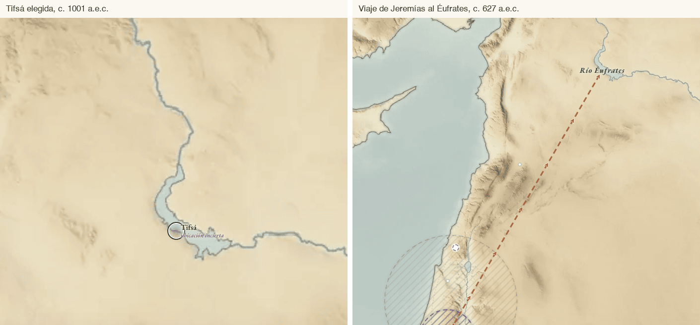
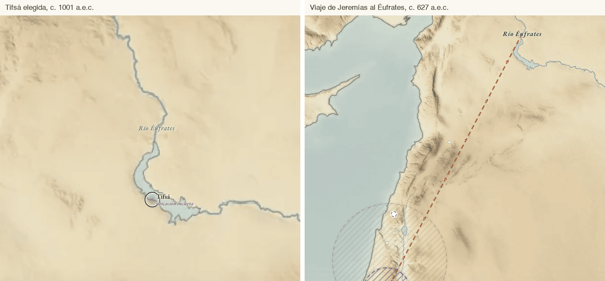
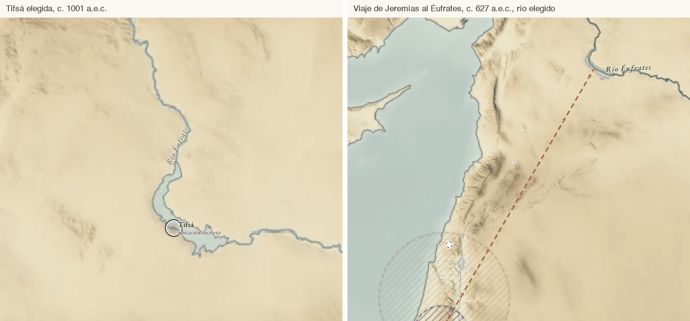
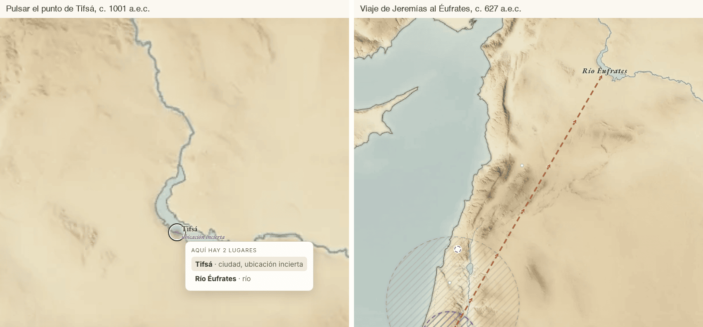
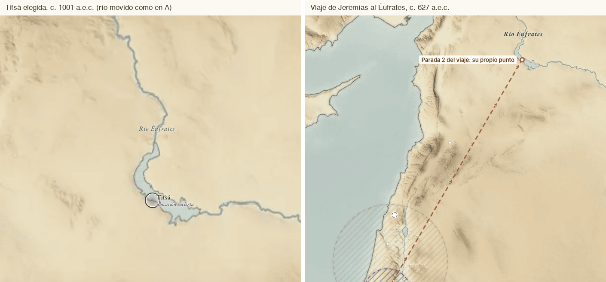
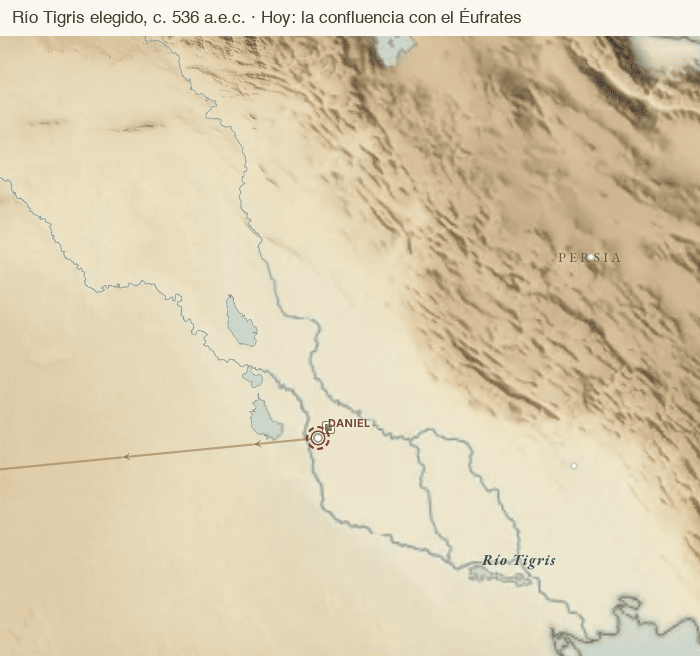
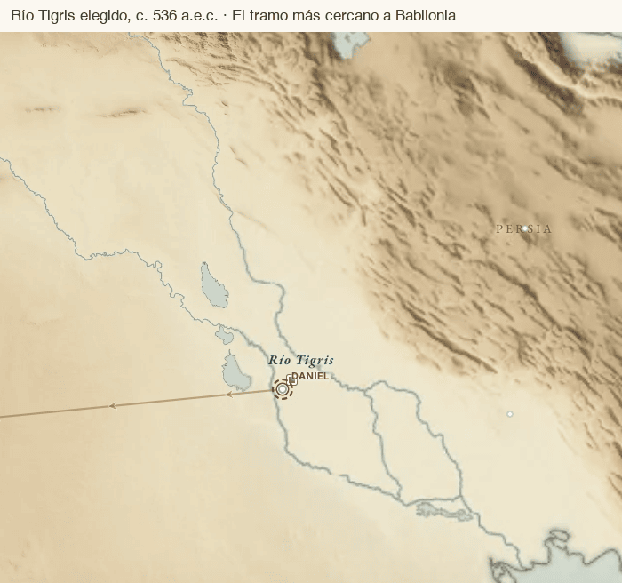
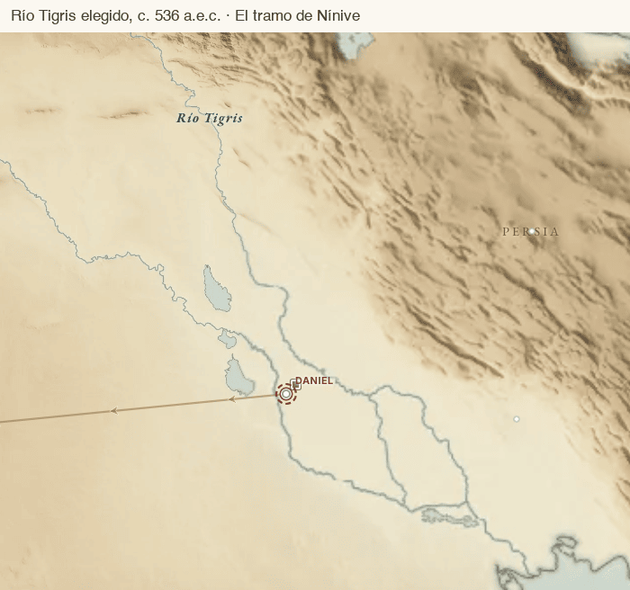

# Ríos y otros lugares largos: dónde va su punto

## Elegido

Elegimos A para el Éufrates, B para el Tigris y la regla 1. Así quedó:

- **Éufrates.** Su punto pasa a 36,4402 N; 38,2056 E, a mitad de los 122 km de cauce entre Carquemis y Tifsá, medidos sobre la línea de Natural Earth. Tifsá vuelve a tener su punto para ella sola. La línea de Jeremías acaba allí, a 586 km de Jerusalén.
- **Tigris.** Su punto pasa a 32,9742 N; 44,7280 E, el punto del cauce más cercano a Babilonia, a 56 km. Lo apoyan Daniel 10:4 y el capítulo 12 de «¡Prestemos atención a las profecías de Daniel!».
- **Regla 1.** [`validate.py`](../../scripts/validate.py) avisa con el código `shared_point` cuando un río, un mar o un valle queda a menos de 0,5 km de otro lugar que no es una región, provincia, país, reino, desierto, llanura o valle (los que el mapa rotula aparte) y su `coord_note` no lo nombra. Al entrar avisó en el Cisón, el Abaná, el valle del Líbano y el Cedrón. Sihor-Libnat pasó al río que propone Perspicacia, el Nahr ez-Zerqa, y el Cisón dejó de avisar. Los otros tres siguen avisando hasta que se decida qué hacer con ellos.
- **Cruces del Jordán.** Gedeón y David camino de Helam solo cruzan el río, así que el cruce pasa a la nota de la parada siguiente. La campaña de Gedeón mide ahora 198 km en vez de 291. El viaje a Helam sale de Jerusalén, la capital donde reina David.
- **Sin cambiar.** Los puntos del Jordán y del Arabá siguen donde estaban. Las otras 13 paradas en el Jordán están revisadas una a una, y la propuesta para los dos puntos queda pendiente de decisión.

Un río es un lugar con un solo punto, y un punto no puede representar 2.700 km de cauce. Desde que el Éufrates pasó al punto de Dibseh, su nombre comparte coordenada con Tifsá. El Tigris sigue en una confluencia que en tiempos bíblicos quizá no existía. Este documento plantea tres preguntas, cada una con opciones, maquetas, lo que cuesta cada opción y lo que recomendamos. No cambia nada de `data/` ni de `site/`.

## Qué pasa hoy

- **Un río no lleva punto en el mapa.** [`site/js/mapa.js`](../../site/js/mapa.js) escribe su nombre en cursiva, centrado en su coordenada (`claseLugar` lo trata como agua). El cauce ya lo pinta el relieve, que sale de Natural Earth.
- **Un viaje que para en un río** traza la línea hasta ese punto, a trazos, porque el río es `precision: zone`.
- **Un suceso cuyo primer lugar es un río** sitúa allí a sus personas. Los demás lugares del suceso solo se resaltan.
- **Al elegir un viaje, el encuadre deja fuera el río.** `lugaresEnFoco` descarta los lugares `zone` si queda otro. El viaje de Jeremías se abre sobre Jerusalén, y el final de la línea queda fuera de la pantalla.
- **El Éufrates y Tifsá comparten coordenada** (35,95 N; 38,16667 E). Lo medimos en un navegador: con Tifsá elegida, el reparto de rótulos le da el sitio a Tifsá y el nombre del río desaparece. Con el río elegido no se ve Tifsá, porque no tiene ningún hecho fechado. Si algún día lo tiene (1Re 4:24), los dos nombres competirán por el mismo sitio.

## Pregunta 1. El Éufrates encima de Tifsá

### Qué ficheros lo usan

| Fichero | Cómo lo usa | Qué dibuja hoy |
|---|---|---|
| [`journeys/jeremias-al-eufrates.yaml`](../../data/journeys/jeremias-al-eufrates.yaml) | Parada 2 (Jer 13:4-7) | La línea de Jerusalén a Dibseh, 537 km |
| [`events/jacob-huye-de-laban.yaml`](../../data/events/jacob-huye-de-laban.yaml) | Segundo lugar | Resalta el nombre del río en Dibseh. Sitúa a Jacob en Padán-Aram |
| [`events/david-vence-a-los-sirios-en-helam.yaml`](../../data/events/david-vence-a-los-sirios-en-helam.yaml) | Tercer lugar | Resalta el nombre del río en Dibseh. Sitúa a David y a Sobac en Helam |
| 13 ficheros de `data/coverage/` (Génesis, Éxodo, Números, Deuteronomio, Josué, 2 Samuel, 1 y 2 Reyes, Salmos, Isaías, Miqueas, Zacarías y Gálatas) | Entidad o mención de un tramo | Nada en el mapa |

Ninguna persona lo cita en una relación y ningún recorrido para en él. Otros siete viajes (Nekó, los dos de Abrahán, Balaam, Nehemías, Beerá y Seraya) lo nombran en su texto, sin parada.

### A. Mover el punto del río a mitad del tramo entre Carquemis y Tifsá

El punto pasa a 36,4402 N; 38,2056 E: sobre el cauce de hoy, a 47 km de Carquemis y a 55 de Tifsá. Es el tramo al sur de Carquemis que da Perspicacia «Éufrates» para el viaje de Jeremías. Moverlo unos pocos kilómetros también separaría los puntos, pero el punto nuevo no tendría una razón propia. Este sí la tiene.

| Uso | Dónde queda |
|---|---|
| Jeremías | La línea acaba en el punto nuevo, a 586 km de Jerusalén. Perspicacia habla de más de 500 |
| Jacob y Helam | El nombre resaltado, a mitad del tramo |
| Petor, «junto al Río» | A 31 km, con su punto y su nombre propios |

**Cuesta:** cambiar `lat`, `lon`, `coord_source: calculation` y `coord_note` en [`rio-eufrates.yaml`](../../data/places/rio-eufrates.yaml). No se toca código.

### B. El río sin punto: su nombre va a lo largo del cauce

El nombre deja de colgar de una coordenada y se escribe sobre el cauce, como en un mapa de papel. Al elegir el río, el cauce se resalta.

| Uso | Dónde queda |
|---|---|
| Jeremías | La línea acaba donde hoy, en Dibseh, sobre el cauce. Sin nombre allí |
| Jacob y Helam | Resaltan el cauce entero |

**Cuesta:** la línea del río, que es la regla 2 de la pregunta 3. Además, MapLibre no sabe esquivar las marcas HTML del sitio: sin trabajo propio, el nombre puede caer encima de Tifsá. En la maqueta lo colocamos a mano.

### C. Dejarlos juntos y que el clic los liste

Al pulsar un sitio donde coinciden varios lugares, sale una lista corta antes de abrir ficha.

| Uso | Dónde queda |
|---|---|
| Jeremías, Jacob y Helam | Como hoy |

**Cuesta:** en `mapa.js`, buscar las marcas a pocos píxeles del clic y pintar la lista, con teclado y con lector de pantalla, más un test en navegador. No arregla lo medido: con Tifsá elegida el nombre del río sigue sin verse.

### D. Un punto por parada

La parada lleva su propio punto en el río, con su fuente. Para Jeremías es el punto del cauce más cercano a Jerusalén al sur de Carquemis, como dice Perspicacia: 35,9708 N; 38,1798 E, a 540 km. Por sí sola no quita el apilado, porque el punto del río sigue donde esté. Por eso la maqueta lo mueve como en A.

| Uso | Dónde queda |
|---|---|
| Jeremías | En su punto propio, aunque el río se mueva |
| Jacob y Helam | Como en A. Un suceso no puede llevar un punto por lugar: `places` es una lista de ids |

**Cuesta:** la regla 3 de la pregunta 3.

### Qué recomendamos

**A.** Arregla lo medido con un cambio en un YAML y sin código. Cumple la regla de la casa: un punto con su razón escrita. B da el mapa más claro, pero es una decisión sobre todos los ríos y va en la pregunta 3.

## Pregunta 2. El punto del Tigris

**Dónde está.** En 31,0043 N; 47,4421 E, el punto de OpenBible donde hoy se juntan el Tigris y el Éufrates, cerca de Basora.

**Qué dicen las fuentes, con nuestras palabras:**

- Génesis 2:14 lo llama Hidequel, que la nota traduce Tigris, y dice que corre al este de Asiria. No señala ningún tramo.
- En Daniel 10:4, Daniel está a la orilla del Tigris en el tercer año de Ciro. El capítulo [«Un mensajero de Dios fortalece a Daniel»](https://www.jw.org/finder?wtlocale=S&docid=1101999031), párr. 9, concluye que seguía en la tierra de Babilonia, tal vez fuera de la capital.
- [Perspicacia «Hidequel»](https://www.jw.org/es/biblioteca/libros/Perspicacia-para-comprender-las-Escrituras/Hidequel/) sitúa a Nínive en su orilla oriental, frente a Mosul. Añade que se cree que antes los dos ríos llegaban al golfo por separado y que el cieno los unió después. Si es así, el punto de hoy marca una unión que entonces quizá no existía.

**Quién lo usa:** el suceso [`caida-de-ninive`](../../data/events/caida-de-ninive.yaml) como segundo lugar (solo lo resalta), y la cobertura de Génesis 2 y de Nahúm 1 y 2. Daniel aún no se ha leído. Cuando se lea, la visión de Daniel 10 será un suceso cuyo primer lugar es el Tigris, y situará a Daniel en el punto del río.

| Opción | Punto | Fuente | Daniel quedaría a | Choca con |
|---|---|---|---|---|
| **A. Dejarlo** | 31,0043 N; 47,4421 E | OpenBible `a38ebfd` | 333 km de Babilonia | nada |
| **B. El tramo más cercano a Babilonia** | 32,9742 N; 44,7280 E | Cálculo: el punto del cauce de Natural Earth más cercano a Babilonia, que está a 56 km. Lo apoya el capítulo de Daniel citado arriba | 56 km de Babilonia | nada; Cuta está a 26 km |
| **C. El tramo de Nínive** | 36,3564 N; 43,1384 E | Cálculo: el punto del cauce más cercano a Nínive. Lo apoya Perspicacia «Hidequel» | 440 km de Babilonia | Nínive y Asiria, que comparten punto, a 1,3 km |

A la escala de la maqueta, en B el nombre queda pegado al de Babilonia. Se separa al acercar el mapa.

### Qué recomendamos

**B.** El único texto que pone a alguien junto al Tigris es Daniel 10:4, y la publicación lo sitúa en Babilonia. A marca una unión que probablemente es posterior, y C repite el problema del Éufrates con Nínive. Lo que se pierde: al elegir la caída de Nínive, el nombre del río resaltado queda a 403 km de Nínive. **Cuesta:** cambiar el punto y su `coord_note` en [`rio-tigris.yaml`](../../data/places/rio-tigris.yaml) y añadir el capítulo de Daniel como fuente.

## Pregunta 3. La regla para ríos, mares y valles

### Cómo están hoy

Hay 20 ríos, 6 mares, 14 lagos y 29 valles. Los que tienen candidatos (Pisón, Guihón, Ulai, Ahavá, el río de Egipto y otros) ya siguen la regla de los lugares inciertos y no entran aquí. De los lagos solo cuenta el mar de Galilea: los demás son fuentes, pozos y estanques, lugares de un solo sitio. Esta tabla recoge los que tienen un punto y algún problema medido. Los que no salen (Nilo, Farpar, Sihor, torrentes de Egipto y de Caná, los cinco mares y la mayoría de los valles) tienen un punto representativo sin choques.

| Lugar | Punto | Lo que pasa |
|---|---|---|
| Río Éufrates | 35,95 N; 38,17 E | Mismo punto que Tifsá (pregunta 1) |
| Río Tigris | 31,00 N; 47,44 E | Confluencia moderna (pregunta 2) |
| Río Jordán | 31,76 N; 35,56 E, cerca de la desembocadura | 15 viajes paran en él y 12 sucesos sitúan allí a personas. Perspicacia «Jordán» cuenta al menos 60 vados. Frente a pasar por el punto del cauce más cercano, la línea da un rodeo de 93 km en la campaña de Gedeón, 67 en la de David contra Helam, 65 en el viaje de Naamán y 25 en la vuelta de David |
| Cisón y Sihor-Libnat | 32,82 N; 35,03 E los dos | Mismo punto. La nota de Sihor-Libnat lo dice; la del Cisón, no |
| Río Abaná | 33,51 N; 36,31 E | A 0,3 km de Damasco, de Siria y del desierto de Damasco |
| Río Jaboc | 32,12 N; 35,54 E | A 1,3 km de Adán |
| Arabá | 30,42 N; 35,15 E, al sur del mar Muerto | Dos viajes, el de Abner y el de Recab y Baaná, lo cruzan al norte del mar Muerto: rodeos de 285 y 235 km |
| Distrito del Jordán | 32,32 N; 35,57 E | Lot va de Betel a Sodoma por él: rodeo de 96 km |
| Valle de Escol | El de Hebrón | Mismo punto que Hebrón e Idumea. La nota lo explica |
| Valle del Líbano | 34,01 N; 36,15 E | Mismo punto que Bet-rehob, Rehob y Betah |
| Mar de Galilea | El centro del lago | Sin problema: los viajes que lo cruzan pasan por el centro |

### Tres reglas posibles

**1. Un punto con su razón escrita, y que `validate.py` avise.** Es la regla de hoy más una comprobación. Un río, un mar o un valle cuyo punto está a menos de 0,5 km del de otro lugar avisa, salvo que su `coord_note` nombre a ese lugar. Las regiones no cuentan, porque el mapa las rotula aparte. El esquema ya lo pide: «un lugar que comparte punto con otro lo explica en `coord_note`». Hoy avisarían cinco: Éufrates, Cisón, Abaná, Valle del Líbano y Valle del Cedrón, este a 0,4 km del estanque de Betzata. Se aplica además, a mano, una regla que ya existe: lo que solo se cruza va en la nota de la parada más cercana, no como parada. De las 15 paradas en el Jordán, al menos dos son cruces por su propio texto: David cruza hacia Helam y Gedeón cruza hacia Sucot (Jue 8:4).

- Esquema: nada.
- `validate.py`: unas 20 líneas y un caso en `scripts/test_validate.py`.
- `build.py` y el sitio: nada.
- Datos: los cinco avisos, el Tigris y las paradas que solo son cruces.

**2. El río como línea.** Cada río lleva su cauce de Natural Earth, de dominio público. Es el mismo que ya pinta el relieve. Simplificados a una centésima de grado, el Éufrates ocupa 255 puntos (4 KB), el Tigris 184, el Jordán 41 y el Nilo 273: unos 12 KB los cuatro.

- Esquema: un campo nuevo, por ejemplo `line` con su fichero en `data/geo/`, `line_source` y `line_note`. La nota dice que es el cauce de hoy: el Éufrates se ha desplazado al oeste, el lago Asad cubre Dibseh y la confluencia es moderna. Para candidatos ya existe `strip`, un segmento recto, que sería el caso más pequeño de esta idea.
- `validate.py`: el fichero existe y es una línea; queda a pocos kilómetros del punto del lugar; lleva fuente.
- `build.py`: copia la línea a `data.json` y a la base SQLite.
- Sitio: los ríos salen de las marcas de texto. Su nombre va a lo largo del cauce y el cauce se resalta al elegirlo; un clic en la línea abre la ficha. Una parada en un río toma el punto del cauce más cercano a la parada anterior, a trazos. El nombre tiene que esquivar las marcas HTML, cosa que MapLibre no hace solo. Lleva fila en la leyenda y test en navegador.
- Mares y lagos no lo necesitan: el relieve ya los dibuja y su punto está en medio del agua.

**3. Un punto por parada.** Una parada en un río, en un mar o en un valle puede llevar `lat`, `lon`, `coord_source`, `coord_url` y `coord_note`, como un candidato.

- Esquema: esos campos en la parada.
- `validate.py`: fuente y nota obligatorias, y el punto cerca del lugar.
- `build.py`: los pasa a `data.json` y a la tabla `paradas` de la base SQLite, con dos columnas más, y al registro.
- Sitio: `verticeRuta` usa el punto de la parada, la parada lleva marca propia y su ficha dice de dónde sale el punto.
- No llega a los sucesos, cuyos `places` son ids sin punto. Además, solo sirve donde una fuente dice en qué tramo: nadie dice dónde se bañó Naamán, así que su parada seguiría en el punto del río.

### Qué recomendamos

**La regla 1.** Caza los cinco apilados con una comprobación que puede fallar, y aplicar la regla de los cruces quita los rodeos peores del Jordán sin inventar ningún punto. La regla 2 es la mejora visible y la base de B en la pregunta 1. Merece su propia decisión cuando se quiera ver los ríos como líneas. La regla 3 no la recomendamos: cuesta en esquema, en compilación y en sitio, y casi siempre hay un lugar con nombre que hace el mismo papel.

## Cómo se hicieron las maquetas

Son capturas del sitio de `main` servido en local, en Chromium sin interfaz. Las coordenadas de A y del Tigris se cambiaron en una copia de `data/` y se compilaron con `build.py --data … --out site/_local/…`, que el sitio carga con `?datos=`. B, C y D se dibujaron encima del sitio con un guion: B con el cauce de Natural Earth, C con una lista de ejemplo y D con la parada movida en memoria. Para dejar ver el mapa, se ocultaron la leyenda, el mapa de situación y la tarjeta del suceso.
