# Los nombres del mapa en el móvil

## El problema

En el móvil (430 × 932) las paradas que quedan cerca de los márgenes laterales salen sin nombre, y la tarjeta del recorrido tapa 3 de las 11 paradas de «Las cartas de Pablo». Las dos cosas quedaron como límites conocidos al arreglar el encuadre de los recorridos.

## Cómo lo medimos

[`tests/site/contar-rotulos.mjs`](../../tests/site/contar-rotulos.mjs) abre el sitio en un navegador sin ventana, a 430 × 932 y a 1440 × 900, y cuenta cada parada que el mapa encuadra: en los cuatro recorridos guiados, al abrirlos y en cada parada siguiente, y en los 8 viajes de Pablo y los 16 de Jesús, elegidos como desde la búsqueda. Una parada acaba en uno de estos estados:

- **con nombre**: su nombre se dibuja y nada lo tapa;
- **punto tapado**: el punto mismo queda fuera del mapa, bajo una tarjeta, un botón o la hoja;
- **agrupada**: está dentro de una burbuja de lugares;
- **sin nombre**, con el primer motivo que se cumple: **borde** (el nombre saldría del mapa), **tapa** (caería bajo una tarjeta o un botón), **zoom** (un nombre menor que espera al zoom 6,3), **choque** (tocaría un nombre, un número o una burbuja ya dibujados) o **reparto** (el reparto fijo por zoom dio su sitio a otro nombre).

En un recorrido la misma parada cuenta una vez por cada paso en que se encuadra, así que «todas las paradas» suma más que el número de lugares.

## Lo que había

En `main` (3343b752), con nombre sobre el total:

| Caso | 430, al abrir | 430, todas las paradas | Motivos en 430 | 1440, todas las paradas |
|---|---|---|---|---|
| De Babilonia a Jerusalén | 1/2 | 4/13 | borde 5, tapa 3, choque 1 | 7/13 (borde 5) |
| Las cartas de Pablo | 2/11, 3 puntos tapados | 14/60, 17 puntos tapados | choque 15, tapa 4, reparto 3, borde 2 | 40/60 |
| La última semana | 0/4 | 6/44 | choque 19, borde 11, reparto 6 | 30/44 |
| Pedro | 1/13 | 4/57, 16 agrupadas | choque 18, borde 15 | 22/57 |
| Viajes de Pablo (8) | | 33/72 | choque 33, tapa 4 | 43/72 |
| Viajes de Jesús (16) | | 19/32 | tapa 7, choque 6 | 18/32 |

Dos cosas se repiten. Un nombre va siempre a la derecha de su punto, y si ahí se sale del mapa o cae bajo los botones de arriba a la derecha, se esconde: Babilonia, Betania, el monte de los Olivos o Capernaúm junto a los botones. Y en el móvil la tarjeta del recorrido mide 258 × 132 px sobre un mapa de unos 300 px de alto: tapa Tesalónica, Filipos y Roma en «Las cartas de Pablo», 17 veces a lo largo del recorrido.

## a. Nombres junto al borde: tres maneras

**A. El nombre al lado interior (la elegida).** Si a la derecha de su punto el nombre se sale del mapa o cae bajo una tarjeta o un botón, va a la izquierda, a la misma distancia. Solo si allí no toca un nombre, un número, una burbuja ni el punto de otro lugar; si tampoco cabe, se esconde como antes. El reparto por zoom (`repartir`) sigue contando el nombre a la derecha, así que el cambio de lado no aparta a ningún otro y no baila al mover el mapa: se decide siempre desde la derecha.

| Antes | Después |
|---|---|
| 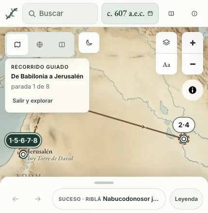 |  |
| 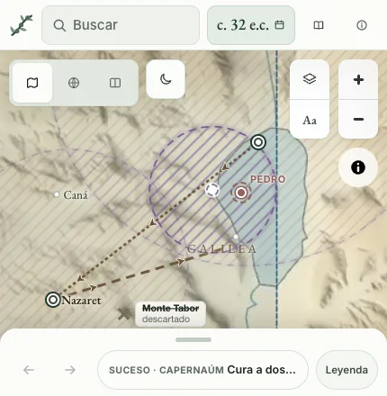 | 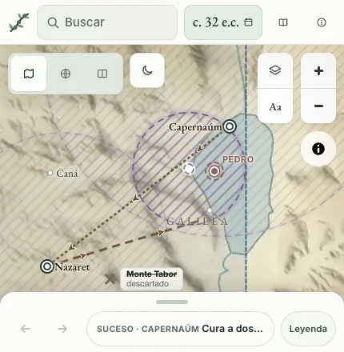 |

**B. Una raya corta hasta un hueco libre.** El nombre se va arriba, al primer hueco sin nada, unido al punto por una raya. Es la manera de los atlas impresos y salva nombres en sitios llenos, pero cada raya es una línea más sobre las rutas, que también son rayas, y buscar el hueco cuesta en cada fotograma. Maqueta, con las mismas decisiones que A:

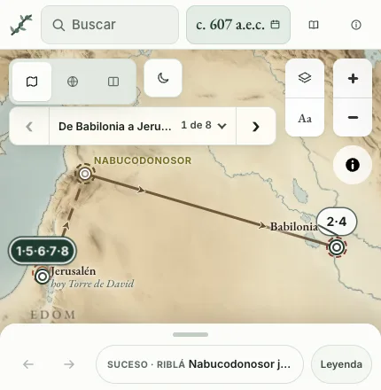

**C. Un margen mayor en el encuadre.** El encuadre del móvil deja 160 px a la derecha en lugar de 50, para que el nombre quepa. Babilonia sale con nombre al abrir, pero el mapa se aleja y lo que no es el borde empeora: en todas las paradas, Babilonia 8/13 (A: 12/13), la última semana 16/44 (A: 18/44) y Pedro 6/57 (A: 13/57). Además solo sirve al encuadrar: al mover el mapa con el dedo, el nombre vuelve a esconderse. Dejar que el nombre se corte en el borde lo descartamos sin maqueta: «Babil» se lee mal.

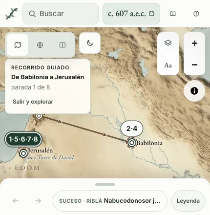

## b. La tarjeta del recorrido en una línea

En el móvil la tarjeta es una sola línea, bajo los modos del mapa y hasta sus botones de la derecha: una flecha atrás, el título del recorrido con «1 de 14» y una flecha adelante. Las flechas pasan de parada como los botones de la ficha; en la primera y en la última la flecha que no vale se apaga y lo dice («Es la primera parada»). Pulsar el título abre debajo la tarjeta entera, con «Salir y explorar», encima del mapa y sin moverlo; pulsarlo otra vez, Escape o cambiar de parada la pliegan. El foco se queda en el botón que se pulsó. Con el dedo, cada botón mide 44 px de alto. En el escritorio no cambia nada: la línea no se dibuja.

| Antes | Después | Abierta |
|---|---|---|
| 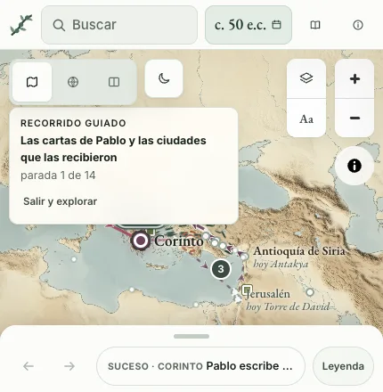 | 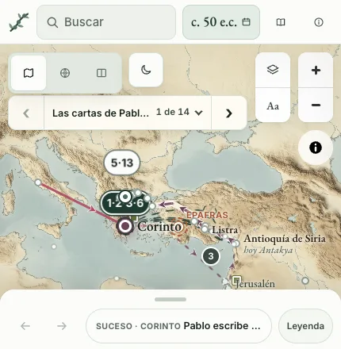 | 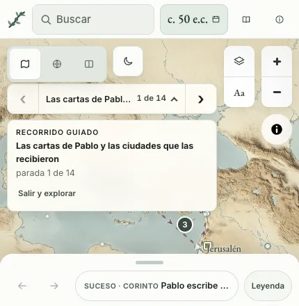 |

En modo reunión, con sus colores:

| Antes | Después |
|---|---|
| 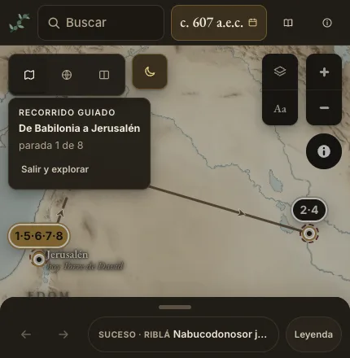 | 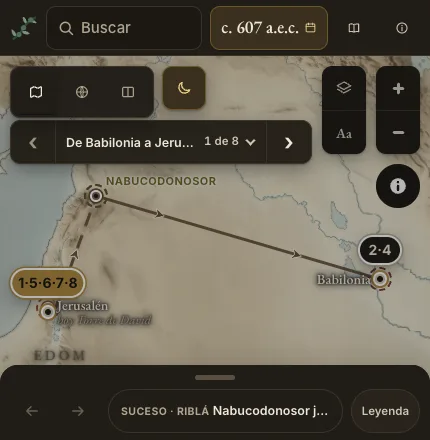 |

## c. El encuadre descuenta la tarjeta

No hizo falta código nuevo. El encuadre ya dejaba libre cada tarjeta por su lado o por encima o debajo (`loQueTapa` y `rellenoEncuadre` en `site/js/mapa.js`), igual que la hoja por abajo; lo que fallaba era el tamaño de la tarjeta, que no dejaba sitio. Con la tarjeta en una línea, el encuadre la deja libre por arriba y «Las cartas de Pablo» abre con sus 11 paradas a la vista. Probamos además una regla que obligaba a dejar libre por arriba toda tarjeta del móvil más ancha que medio mapa: la prueba del encuadre seguía en verde sin ella, así que no entra.

## El resultado

Con nombre sobre el total, antes y después:

| Caso | 430, todas las paradas | 430, al abrir | 1440, todas las paradas |
|---|---|---|---|
| De Babilonia a Jerusalén | 4/13 → 12/13 | 1/2 → 2/2 | 7/13 → 12/13 |
| Las cartas de Pablo | 14/60 → 34/60; puntos tapados 17 → 0 | 2/11 → 3/11; puntos tapados 3 → 0 | 40/60 → 41/60 |
| La última semana | 6/44 → 18/44 | 0/4 → 0/4 | 30/44 → 30/44 |
| Pedro | 4/57 → 13/57 | 1/13 → 1/13 | 22/57 → 26/57 |
| Viajes de Pablo (8) | 33/72 → 34/72 | | 43/72 → 43/72 |
| Viajes de Jesús (16) | 19/32 → 22/32 | | 18/32 → 18/32 |

En el escritorio solo cambian los nombres que antes se escondían en el borde: los viajes de Pablo y de Jesús y la última semana dan las mismas cifras.

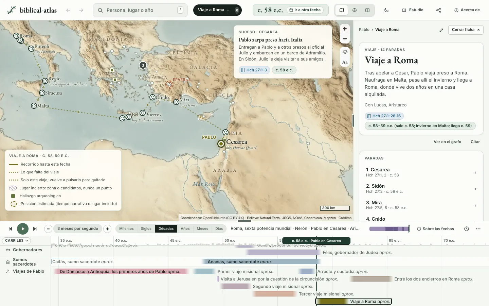

Los otros dos recorridos con menos nombres en el móvil, al abrirlos:

| | Antes | Después |
|---|---|---|
| Pedro | 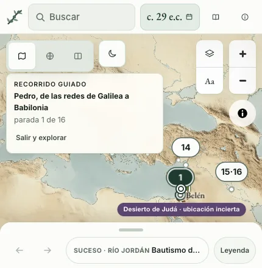 | 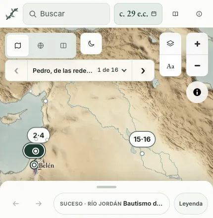 |
| La última semana | 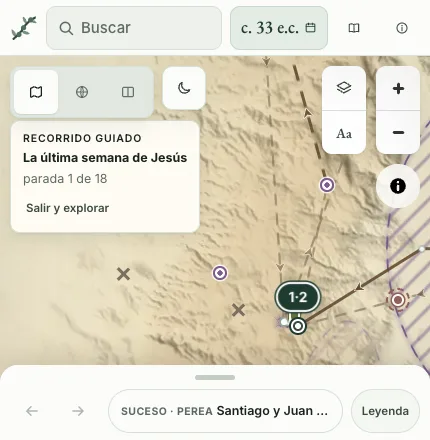 | 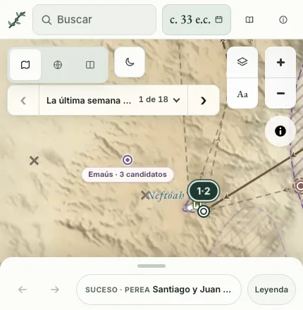 |

## Lo que queda

- **Los choques en el móvil.** Casi todo lo que sigue sin nombre en el móvil es por choque: a zoom 3 o 4, los nombres de un viaje entero se pisan (33 de las 72 paradas de los viajes de Pablo). Ni el lado interior ni el margen lo resuelven; haría falta otra regla, como nombrar solo la parada actual y sus vecinas.
- **La última semana abre lejos de Jerusalén.** Al abrir, el encuadre cuenta los tres candidatos de Emaús, al oeste, y Jerusalén queda en el borde con 0 de 4 nombres. Ya pasaba antes y no es de los nombres.
- **Antioquía de Siria a 1440.** En «Las cartas de Pablo» sigue sin nombre en el borde: a la izquierda taparía el punto de Seleucia, y esa regla manda.

## Las pruebas

[`tests/site/map-labels.test.mjs`](../../tests/site/map-labels.test.mjs): Babilonia, Jerusalén elegida y cuatro ciudades del segundo viaje llevadas al borde derecho, en el tema claro y en modo reunión, con las reglas de siempre comprobadas en cada caso; las mismas reglas a 1440; la tarjeta de una línea con sus flechas, el toque, Escape y el teclado; y las 11 paradas de «Las cartas de Pablo» libres en el móvil.
