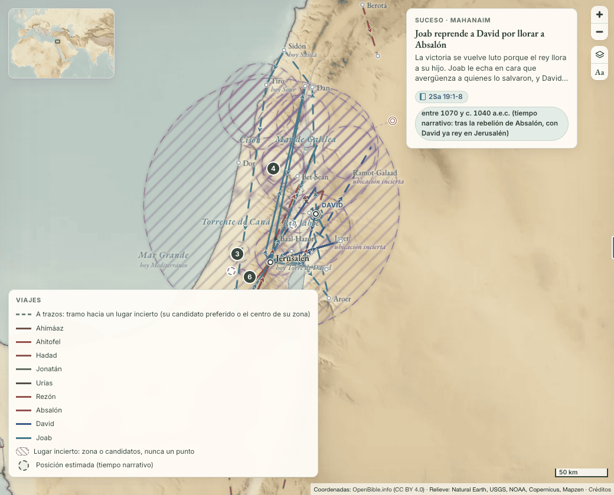
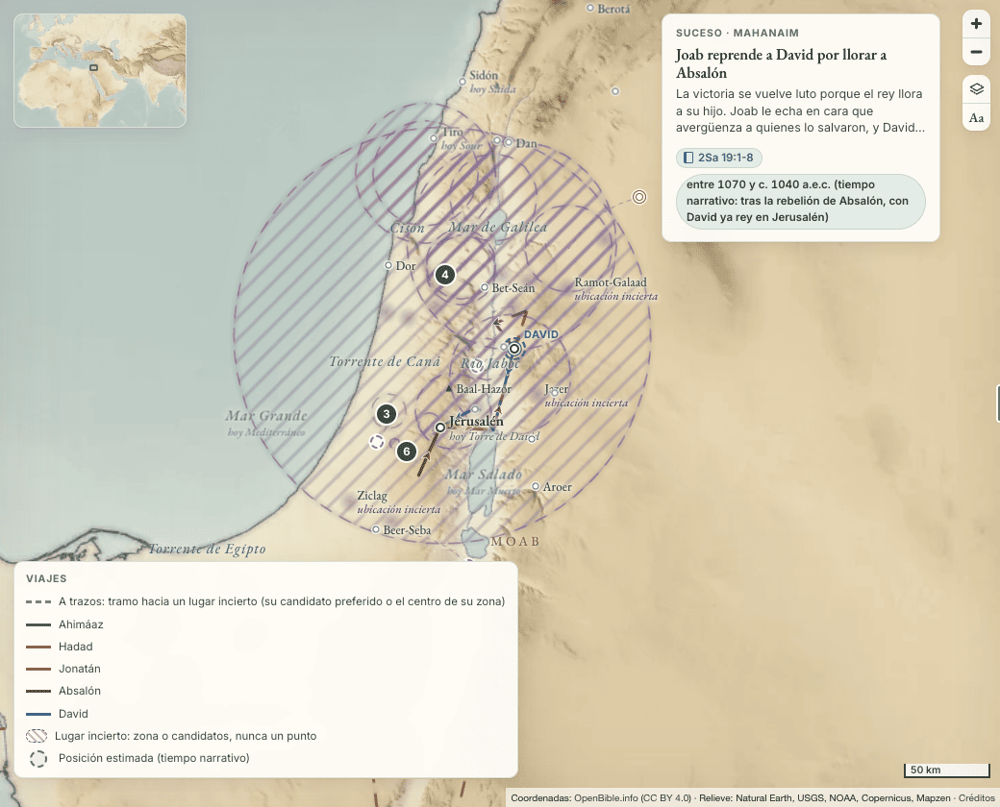

# Viajes: ocho decisiones del modelo

Quieres que toda la Biblia se recorra como Pablo. Ya hay 223 viajes de 125 personas, con 925 paradas. Al escribirlos quedaron ocho decisiones abiertas sobre qué es un viaje, qué parada cuenta, quién acompaña y cuánto tiempo se dibuja. En cada una aplicamos un valor por defecto para no parar. Aquí están con opciones por letras, un ejemplo de los datos de hoy para cada opción, lo que cuesta y lo que recomendamos.

Este documento no cambia `data/`, `site/` ni `scripts/`. Las cifras salen de los datos y el código de `main`; las del mapa, de un navegador real con esos mismos datos.

## 1. Grupos y objetos que viajan sin ficha de persona

**Hoy.** Fuera. El esquema exige `person` con ficha y el protocolo no crea fichas de personas sin nombre ([versiculos.md](../investigacion/versiculos.md), sección 4). Quedan fuera 15 recorridos: el Arca por Filistea, el levita de Jueces 19, los espías danitas, la migración de los danitas, los espías de Jericó, Judá y Simeón (Jue 1), la guerra contra Benjamín, los 600 benjaminitas, la expedición a Jabés-Galaad, los de Jabés que rescatan a Saúl, las tribus del este, el destierro de Israel en 740, los astrólogos, la reina de Sabá y los correos de Ezequías. La migración de los danitas ya va dentro de `jonatan-levita-de-belen-a-dan`, así que entrarían 14. Sus sucesos ya existen y sitúan cada lugar.

**A. Fuera, como hoy.** El Arca pasa por Ebenézer, Asdod, Gat, Ecrón, Bet-Semes y Quiryat-Jearim en nueve sucesos, y el mapa enseña cada uno en su ciudad, sin una línea que los una. No cuesta nada. Se pierde el camino y estos recorridos no salen entre los viajes.

**B. Un campo `group` opcional.** El cambio de esquema:

- `person` puede ser `null` si el viaje lleva `group`, un texto de 40 palabras como mucho («el arca del pacto», «los 600 benjaminitas»). Uno de los dos es obligatorio.
- `scripts/validate.py:1402` y `scripts/build.py:508` comprueban `person` solo si no es `null`, y dan error si no hay ni `person` ni `group`. `build.py` pasa `group` al sitio como `grupo`.
- En el sitio, hoy un viaje sin `persona` es de Pablo (`trayectorias.js:149-150`), así que el Arca saldría como un viaje de Pablo. Hay que darle a cada viaje de grupo su propia clave de dueño (`grupo:<id del viaje>`) y cambiar las 11 líneas que leen `v.persona || 'pablo'`: `trayectorias.js:150`, `mapa.js:101, 135, 535, 922, 1344, 1365`, `grafo.js:68, 299, 305` y `lectura.js:48`. Un grupo no lleva marcador de viajero; la leyenda y la ficha dicen el texto de `group` donde hoy va el nombre.
- Dos pruebas: un viaje con `group` en `scripts/test_validate.py` y en `tests/site/notes.test.mjs`, que recorre todos los viajes.

Un viaje completo con el campo nuevo:

```yaml
# biblical-atlas: un fichero por viaje. Esquema en docs/investigacion/README.md.
id: el-arca-en-filistea
name: El Arca, de Ebenézer a Quiryat-Jearim
person: null
group: el arca del pacto
reference: 1Sa 4:10, 11; 5:1–7:2
date:
  from: -1172
  to: -1116
  precision: range
  approx: true
  type: narrative
  chronology: tnm
  text: 'entre c. 1173 y 1117 a.e.c. (tiempo narrativo: antes de que Saúl fuera ungido rey)'
companions: []
summary: Los filisteos capturan el Arca y la llevan de ciudad en ciudad hasta que, castigados, la devuelven en un carro.
  Llega a Bet-Semes y acaba en casa de Abinadab, en Quiryat-Jearim.
reason: 1 Samuel 4 a 7 da el orden de las ciudades. Sin año propio; fecha de sus sucesos (estudio 3).
sources: [1-samuel-4, 1-samuel-5, 1-samuel-6, 1-samuel-7, it-arca-del-pacto, si-3]
checked_on: '2026-10-01'
status: verified
stops:
- order: 1
  place: ebenezer
  reference: 1Sa 4:10, 11; 5:1
  date: {from: -1172, to: -1116, precision: range, approx: true, type: narrative, chronology: tnm,
         text: 'entre c. 1173 y 1117 a.e.c. (tiempo narrativo: poco antes de morir Elí)'}
  note: La capturan en la batalla y se la llevan de allí.
  reason: 'Suceso ancla: los-filisteos-capturan-el-arca.'
  sources: [1-samuel-4, 1-samuel-5, it-ebenezer]
  checked_on: '2026-10-01'
  status: verified
- order: 2
  place: asdod
  reference: 1Sa 5:1-8
  date: {from: -1172, to: -1116, precision: range, approx: true, type: narrative, chronology: tnm,
         text: 'entre c. 1173 y 1117 a.e.c. (tiempo narrativo: antes de que Saúl fuera ungido rey)'}
  note: En el templo de Dagón; la ciudad sufre la plaga.
  reason: 'Sucesos ancla: dagon-cae-ante-el-arca-en-asdod y jehova-castiga-a-asdod-con-hemorroides.'
  sources: [1-samuel-5, it-asdod, it-dagon]
  checked_on: '2026-10-01'
  status: verified
- order: 3
  place: gat
  reference: 1Sa 5:8, 9
  date: {from: -1172, to: -1116, precision: range, approx: true, type: narrative, chronology: tnm,
         text: 'entre c. 1173 y 1117 a.e.c. (tiempo narrativo: antes de que Saúl fuera ungido rey)'}
  reason: 'Suceso ancla: jehova-castiga-a-gat-con-hemorroides.'
  sources: [1-samuel-5, it-gat]
  checked_on: '2026-10-01'
  status: verified
- order: 4
  place: ecron
  reference: 1Sa 5:10–6:12
  date: {from: -1172, to: -1116, precision: range, approx: true, type: narrative, chronology: tnm,
         text: 'entre c. 1173 y 1117 a.e.c. (tiempo narrativo: antes de que Saúl fuera ungido rey)'}
  note: Los de Ecrón piden que se la lleven; la cargan en un carro con dos vacas.
  reason: 'Sucesos ancla: ecron-pide-que-se-devuelva-el-arca y los-filisteos-deciden-devolver-el-arca.'
  sources: [1-samuel-5, 1-samuel-6, it-eqron]
  checked_on: '2026-10-01'
  status: verified
- order: 5
  place: bet-semes
  reference: 1Sa 6:12-20
  date: {from: -1172, to: -1116, precision: range, approx: true, type: narrative, chronology: tnm,
         text: 'entre c. 1173 y 1117 a.e.c. (tiempo narrativo: antes de que Saúl fuera ungido rey)'}
  reason: 'Sucesos ancla: las-vacas-llevan-el-arca-a-bet-semes y jehova-castiga-a-los-de-bet-semes-por-mirar-el-arca.'
  sources: [1-samuel-6, it-bet-semes]
  checked_on: '2026-10-01'
  status: verified
- order: 6
  place: quiryat-jearim
  reference: 1Sa 6:21–7:2
  date: {from: -1172, to: -1116, precision: range, approx: true, type: narrative, chronology: tnm,
         text: 'entre c. 1173 y 1117 a.e.c. (tiempo narrativo: tras la pérdida del Arca y antes de reinar Saúl)'}
  note: Llegada. Se queda en casa de Abinadab veinte años.
  reason: 'Suceso ancla: el-arca-queda-en-casa-de-abinadab.'
  sources: [1-samuel-6, 1-samuel-7, it-quiryat-jearim]
  checked_on: '2026-10-01'
  status: verified
```

Todos los lugares de los 14 recorridos tienen ya ficha salvo Bézeq (Jue 1:4, 5). Los viajes de grupo se escriben en un carril aparte, después del cambio de esquema.

**C. Una ficha de persona para cada grupo.** El sitio no cambia. Pero rompe la regla de no crear más fichas de personas sin nombre, y el Arca no es una persona: saldría al buscar personas, en el grafo de personas y con su carril en la línea de tiempo.

**Recomendamos B.** El Arca y el levita de Jueces 19 están entre los recorridos más conocidos de su época. B no inventa nada: las mismas paradas, los mismos sucesos y las mismas fuentes, y las fichas de persona siguen siendo de personas.

## 2. Paradas deducidas

**Hoy.** Se quedan como paradas con `status: pending` y la deducción escrita en `reason`, según las tres clases de [docs/investigacion/README.md](../investigacion/README.md) («Viajes»). Son 94 paradas en 67 viajes:

| Clase | Paradas | Viajes | Ejemplos |
|---|---|---|---|
| Salida o vuelta que deducimos nosotros: la capital, la casa o el último lugar donde el relato dejó a la persona | 27 | 25 | Jerusalén al salir Josías contra Nekó; Guibeá al volver Saúl a su casa (1Sa 24:22); Zorá, la casa de Sansón, dos veces |
| Lugar que jw.org da con «probablemente», «(?)», «es posible» o «parece» | 28 | 25 | Capernaúm en cuatro viajes de Jesús (tablas A7); Febe y Onésimo en Roma; Tito en Nicópolis; Jacob en Hebrón |
| Salida de un viaje que solo cuenta una carta: el lugar desde donde se escribe | 3 | 3 | Roma para Crescente, Demas y Tíquico (2Ti 4:10-12) |
| El texto nombra el lugar, pero no dice que la persona llegara o en qué orden | 18 | 12 | Sidón, Misrefot-Maim y Mizpé en Jos 11:8; Bet-Horón Alta y Baja; Dibón-Gad, Almón-Diblataim y Jazer; Rehob de los espías |
| El lugar sale en el texto y lo pendiente es la fecha o el viaje entero | 18 | 8 | Las cuatro de Abías (2Cr 13); las tres de Simeí; las de Beerá |

La última clase no cambia con ninguna opción. Las 94, una a una:

<details>
<summary>Las 94 paradas pendientes, por clase</summary>

**Salida o vuelta deducida (27).** `acab-baja-a-la-vina-de-nabot` (1 samaria); `amasias-contra-edom` (3 jerusalen); `ana-sube-con-samuel-a-silo` (3 ramataim-zofim); `campana-central-de-josue` (7 guilgal); `david-con-akis-en-afec` (1 ziclag); `david-vence-a-los-filisteos-en-refaim` (1 jerusalen); `destierro-de-beera` (1 ruben); `eliseo-va-a-damasco` (1 samaria); `epafras-a-roma` (1 colosas); `estefanas-fortunato-y-acaico-a-efeso` (1 corinto); `finehas-va-a-galaad` (3 silo); `huida-de-uriya-a-egipto` (2 jerusalen); `josias-sale-contra-neko` (1 jerusalen); `los-simeonitas-van-a-guedor` (1 simeon); `los-simeonitas-van-al-monte-seir` (1 simeon); `manases-llevado-a-babilonia` (1 jerusalen); `nebuzaradan-lleva-a-juda-al-destierro` (4 babilonia); `onesiforo-busca-a-pablo` (1 efeso); `pedro-baja-a-antioquia` (1 jerusalen); `salomon-va-a-ezion-gueber` (1 jerusalen); `sanson-en-timna` (2 zora, 5 zora); `saul-persigue-a-david-en-hakila` (3 guibea-de-benjamin); `saul-persigue-a-david-en-maon-y-en-guedi` (6 guibea-de-benjamin); `seraya-a-babilonia` (1 jerusalen); `visita-de-jetro` (1 madian, 3 madian).

**Lugar que da jw.org con reservas (28).** `campana-de-jefte` (4 aroer-de-gad); `david-persigue-a-los-amalequitas` (3 negueb); `david-vence-a-los-filisteos-en-refaim` (2 adulam); `de-los-tabernaculos-a-la-dedicacion` (2 judea, 4 judea); `elias-huye-al-horeb` (4 abel-mehola); `febe-a-roma` (2 roma); `gira-por-galilea-y-envio-de-los-doce` (1 capernaum); `guerra-de-abimelec` (1 aruma); `hacia-cesarea-de-filipo` (5 cesarea-de-filipo); `huida-de-onesimo` (2 roma); `jacob-a-egipto` (1 hebron); `jeremias-al-eufrates` (1 jerusalen); `judea-y-pascua-de-31` (2 judea); `ministerio-de-juan-el-bautista` (5 tiberiades); `por-fenicia-y-la-decapolis` (1 capernaum); `recab-y-baana-van-a-hebron` (1 mahanaim); `recorrido-de-samuel` (3 guilgal); `rehum-y-simsai-detienen-la-obra` (1 samaria); `retiro-a-betsaida` (1 capernaum); `tito-de-creta-a-dalmacia` (2 nicopolis); `tito-y-la-colecta-de-corinto` (1 efeso); `travesia-a-gadara` (4 capernaum); `ultimo-viaje-de-ocozias-de-juda` (3 samaria); `ultimos-anos-de-pablo` (2 creta, 5 nicopolis); `viajes-de-aquila-y-priscila` (5 roma, 6 efeso).

**Salida de una carta (3).** `crescente-a-galacia` (1 roma); `demas-se-va-a-tesalonica` (1 roma); `tiquico-enviado-a-efeso` (1 roma).

**Llegada u orden que el texto no dice (18).** `campana-del-norte-de-josue` (2 sidon, 3 misrefot-maim, 4 tierra-de-mizpa); `campana-del-sur-de-josue` (3 bet-horon-alta, 4 bet-horon-baja); `david-va-al-valle-de-ela` (3 jerusalen); `de-cades-a-las-llanuras-de-moab` (11 dibon, 12 almon-diblataim, 20 jazer); `jonatan-y-ahimaaz-avisan-a-david` (3 rio-jordan); `los-cautivos-de-juda-vuelven-a-jerico` (2 jerico, 3 samaria); `regreso-del-funcionario-etiope` (2 gaza); `sanson-en-gaza-y-sorec` (2 hebron); `tiquico-lleva-las-cartas-a-asia` (2 efeso); `viaje-de-los-doce-espias` (6 rehob); `viajes-de-felipe` (3 gaza); `visita-de-jetro` (2 desierto-de-sinai).

**Fecha o viaje pendiente (18).** `abrahan-de-ur-a-haran` (1 ur, 2 haran); `campana-de-abias-contra-jeroboan` (1 monte-zemaraim, 2 betel, 3 jesana, 4 efrain); `destierro-de-beera` (2 hala, 3 habor, 4 hara, 5 gozan); `huida-de-david` (15 gat, 16 ziclag); `huida-de-uriya-a-egipto` (1 egipto); `los-simeonitas-van-a-guedor` (2 guedor-de-simeon); `los-simeonitas-van-al-monte-seir` (2 seir); `simei-sale-a-gat` (1 jerusalen, 2 gat, 3 jerusalen).

</details>

Siete lugares van hoy solo en la nota, nunca como parada: el Arabá en `huida-de-sedequias`, Ofir en `salomon-va-a-ezion-gueber`, Etiopía en `regreso-del-funcionario-etiope`, Quiryat-Jearim en `huida-de-uriya-a-egipto`, el mar en `viaje-de-jonas`, el distrito del Jordán en `hiram-el-artesano-va-a-jerusalen` y Hebrón en `ahitofel-se-une-a-absalon`.

**A. Paradas pendientes, como hoy.** La línea del mapa pasa por Guibeá al volver Saúl igual que por En-Guedí, que el texto sí nombra. La ficha marca la parada «Pendiente de verificar». No cuesta nada.

**B. Todas a la nota.** Salen 76 paradas (todas menos las 18 de fecha) y cambian 63 viajes. 20 viajes se quedan con menos de dos lugares y dejan de ser viajes, entre ellos los de Crescente, Demas, Febe, Onésimo, Epafras, Onesíforo, Pedro a Antioquía, Eliseo a Damasco y Acab a la viña de Nabot. Sus ids desaparecen, y un id de viaje es una dirección del sitio.

**C. Solo quedan las que da jw.org.** Las 31 de jw.org y de las cartas siguen como paradas; las 45 nuestras pasan a la nota. Cambian 36 viajes y 13 dejan de serlo: Acab a la viña, Eliseo a Damasco, Pedro a Antioquía, Epafras, Estéfanas, Onesíforo, Seraya, Uriya, los dos de los simeonitas, los cautivos de Judá, el funcionario etíope y la visita de Jetró.

**D. Como A, pero el tramo se dibuja de puntos.** Los datos no cambian. El tramo que llega a una parada pendiente o sale de ella se dibuja de puntos, como ya se dibuja a trazos el tramo hacia un lugar incierto, y la leyenda lo explica. Cuesta una propiedad más en las rutas de `mapa.js`, un estilo de línea y una prueba del mapa.

**Recomendamos D.** No se pierde ningún viaje ni ninguna dirección, la deducción sigue escrita en su sitio y el mapa deja de dibujar una suposición con la misma línea que el texto.

## 3. Acompañantes

**Hoy.** El esquema dice que un acompañante va todo el viaje. El PR 86 lo aplicó en Génesis (Simeón sale de los dos viajes por grano; Raquel, Débora y Benjamín, de `jacob-de-siquem-a-hebron`), sacó a Juan Marcos de `primer-viaje` y a Áquila y Priscila de `segundo-viaje`, y `del-jordan-a-cana` ya no lleva acompañantes (los cuatro discípulos van en la nota de la parada 4). Pero cinco viajes siguen con gente que solo hace una parte:

- `segundo-viaje`: Silas, Timoteo y Lucas.
- `tercer-viaje`: los diez, de Timoteo a Gayo de Derbe.
- `ultimos-anos-de-pablo`: Tito, Timoteo y Trófimo.
- `gira-por-galilea-con-los-doce`: María Magdalena, Juana y Susana.
- `campana-contra-moab`: Jehosafat, que según su nota se une a la marcha.

En el sitio, los acompañantes hacen dos cosas: el modo lectura los pone como presentes en cada parada del viaje (`lectura.js:48`), y al elegir a uno el mapa enseña el viaje (`mapa.js:537`). No llevan marcador ni carril.

**A. Todo el viaje, sin excepciones.** Salen 20 nombres. `segundo-viaje` se queda sin nadie: Silas y Timoteo se quedan en Berea y Pablo llega solo a Atenas (Hch 17:14, 15), y Lucas va de Troas a Filipos, el «nosotros» de Hch 16:10-17. `tercer-viaje` también: los siete de Hch 20:4 se unen al final, Lucas desde Filipos (Hch 20:5, 6), y Erasto y Gayo de Macedonia solo salen en Éfeso (Hch 19:22, 29). `ultimos-anos-de-pablo` queda vacío, la gira pierde a las tres mujeres y la campaña contra Moab a Jehosafat. Cuesta 5 ficheros. Al elegir a Timoteo, el mapa ya no enseña el segundo viaje, y Lucas solo sale junto a Pablo en el viaje a Roma.

**B. Cualquiera que haga una parte.** Vuelven los 12 nombres que quitó el PR 86 (Juan Marcos, Áquila, Priscila, Simeón dos veces, Raquel, Débora, Benjamín y los cuatro discípulos de Caná). Cuesta 6 ficheros. El modo lectura pone a Lucas en Listra (Hch 16:1) y a Raquel en Mamre, adonde no llegó: murió en el camino de Efrata (Gé 35:19).

**C. Un tramo por acompañante.** Cada entrada es un id (todo el viaje) o `{person, from, to}` con los números de parada donde se une y donde se separa. Una persona puede salir dos veces. Así quedaría `segundo-viaje` según Hechos:

```yaml
companions:
  - {person: silas, from: 1, to: 14}      # Hch 15:40 a 17:14
  - {person: silas, from: 16, to: 16}     # Hch 18:5
  - {person: timoteo, from: 4, to: 14}    # Hch 16:1-3 a 17:14
  - {person: timoteo, from: 16, to: 16}
  - {person: lucas, from: 7, to: 10}      # el «nosotros» de Hch 16:10-17
  - {person: aquila, from: 16, to: 18}    # Hch 18:2, 18, 19
  - {person: priscila, from: 16, to: 18}
```

Con la misma forma vuelven Juan Marcos a `primer-viaje` (1 a 5, Hch 13:5, 13), Raquel (1 a 2), Débora (1 a 2) y Benjamín (3 a 5) a `jacob-de-siquem-a-hebron`, Simeón a los viajes por grano (1 a 2 en el primero, 2 a 3 en el segundo), los cuatro discípulos a `del-jordan-a-cana` (4 a 6), las tres mujeres a la gira (3), Jehosafat a la campaña contra Moab (desde la 2), Tito y Timoteo a los últimos años (2 y 3), y cada uno de los diez del tercer viaje con su versículo. Trófimo se queda en Mileto (2Ti 4:20), que no es parada: va a la nota. Cambian 10 viajes. El esquema cambia en `validate.py` (la forma larga, `from` ≤ `to` y paradas que existen) y `build.py`, y el sitio en `lectura.js:48` (solo en sus paradas) y `mapa.js:537` (leer el id de la forma larga), con una prueba.

**Recomendamos C.** Es la única en que el modo lectura y la selección dicen la verdad a la vez. A deja a Pablo sin Silas, Timoteo ni Lucas en los viajes que más se consultan; B los pone en ciudades donde no estaban.

## 4. Tramos largos

**Hoy.** El mapa dibuja el viaje de cualquiera que no sea Pablo durante toda su fecha y un año más (`viajeEnEpoca`, `mapa.js:497`). 54 de los 215 viajes que no son de Pablo abarcan 20 años o más: la expulsión de Agar va de 1913 a 1843 a.e.c.; 16 viajes desde 2 Samuel 10 comparten de 1070 a c. 1040; 7 de Jueces comparten de c. 1450 a c. 1173, 277 años. Medido en un navegador: en 1070 a.e.c. el mapa dibuja 20 viajes a la vez, en 1051 a.e.c. 17, y en cualquier año de c. 1450 a c. 1173 al menos 7.

**A. Como hoy.** No cuesta nada. Así se ve 1051 a.e.c.:



**B. Cada viaje solo mientras duran sus paradas.** La línea de tiempo ya coloca cada parada en la ventana de su suceso y reparte por el orden del relato los sucesos que comparten fecha (`sucesosDeParadas`, `trayectorias.js`). El mapa usaría esa misma ventana. Con los datos de hoy, en 1051 a.e.c. se dibujan 5 viajes en vez de 17; el máximo en un año cualquiera baja de 20 a 7 (en 32 e.c., con Jesús y los suyos), y los viajes de 20 años o más pasan de 54 a 12. Agar ocupa unos tres meses de 1913; Joab contra Ammón, unos meses de 1067. Cuesta cambiar `viajeEnEpoca` para que lea `BE.estancias` y una prueba del mapa. Los datos no cambian. Las ventanas son la estimación de la línea, así que un viaje puede caer en un año que el texto no fija; pero es el mismo año que la línea ya da a sus sucesos, y el mapa y la línea dicen lo mismo. El recorrido de Samuel se vería solo hacia 1117, aunque se repetía cada año (pregunta 8h).



**C. Acortar a mano.** Agar acaba en 1913 y la parada de Parán lleva su propio tramo; los viajes de David esperan a que el carril de sucesos dé fechas más finas. Cuesta un fichero ahora y decenas después, y solo arregla lo que se edita.

**Recomendamos B.** Arregla los 54 a la vez sin tocar un dato, y el mapa deja de enseñar una guerra de Joab veinte años después de que acabara.

## 5. Los sucesos mandan, salvo con Pablo

**Hoy.** Solo Pablo coloca sus sucesos dentro de sus paradas (`SUCESOS_EN_PARADAS`, `trayectorias.js:156`). Sus 95 paradas se fecharon una a una con Hechos. Para las otras 124 personas que viajan, el suceso se queda donde lo ponen su fecha y el orden del relato, y la parada lo sigue. Son 830 paradas que copian la fecha de su suceso.

**A. Confirmar.** Un viaje nuevo nunca mueve un suceso de su sitio. La última semana de Jesús sale día a día porque sus sucesos ya lo están. No cuesta nada.

**B. Volver a que cualquiera arrastre sus sucesos.** Cuando se probó con los viajes nuevos, fallaron 8 pruebas del sitio: Jesús quedaba después de la ascensión, y Matías y Pedro en Lida fuera de su sitio, y 1923 pares de sucesos quedaban fuera del orden del relato. Arreglarlo pide fechar a mano cada una de las 830 paradas.

**C. Una lista que crece.** Una persona entra en `SUCESOS_EN_PARADAS` cuando todas sus paradas tienen fecha propia, como las de Pablo. Cuesta una línea por persona y comprobar antes que sus sucesos no se mueven.

**Recomendamos A**, y C cuando alguien tenga todas sus paradas fechadas a mano.

## 6. Reyes invasores y viajes dobles

**6a. Un rey invasor que el texto trae en persona tiene su viaje.** Hoy son seis: Kedorlaomer (Gé 14), Sisaq, Hazael, Senaquerib, Nekó y Nabucodonosor en 617. Nabucodonosor en 609 se queda fuera porque el texto solo lo pone en Riblá.

- **A. Confirmar.** No cuesta nada.
- **B. Quitarlos y dejar que los sitúen sus sucesos.** Salen 6 ficheros y sus 6 direcciones.

**Recomendamos A.** El texto cuenta el camino del rey, y un rey que marcha contra Jerusalén es de lo que más se busca en el mapa.

**6b. Dos personas con ficha en el mismo trayecto.** Hoy hay dos casos con viajes separados: Acab y Jehosafat a Ramot-Galaad (comparten la salida y la batalla y acaban en sitios distintos: Acab, muerto, en Samaria y Jehosafat en Jerusalén), y Joaquín y Daniel en 617, más Nabucodonosor: tres viajes con las dos mismas paradas, de Jerusalén a Babilonia. En cambio, otros once grupos van en un solo viaje con acompañantes, como Recab y Baaná, Adramélec y Sarézer, Judas y Silas, Rehúm y Simsai, Kedorlaomer con sus tres aliados, y Jehoram con Jehosafat contra Moab.

- **A. Confirmar, con la regla escrita.** Dos viajes cuando el texto cuenta el trayecto de cada uno; un viaje con acompañantes cuando el texto los manda juntos. En 617 el mapa dibuja tres líneas encima una de otra, y la leyenda nombra a los tres.
- **B. Un viaje por trayecto.** Daniel y Nabucodonosor pasan a acompañantes de Joaquín; Jehosafat sigue aparte porque acaba en otro sitio. Salen 2 ficheros. Durante 617 a Daniel lo sitúan solo sus sucesos, aunque al elegirlo el mapa sigue enseñando el viaje.

**Recomendamos A.** Cada uno tiene su relato, su marcador y su color, y los once grupos con acompañantes ya cumplen la regla.

## 7. Cinco dudas de datos

Cada una, contrastada con el texto de la TNM y con Perspicacia. Lo que dicen va con nuestras palabras.

**7a. Medebá o Rabá** (`joab-contra-ammon-y-siria`, parada 2). En 1Cr 19:7 los sirios a sueldo acampan delante de Medebá; en 19:9 los ammonitas forman a la puerta de una ciudad que el versículo no nombra, y en 19:15 huyen a ella. Perspicacia «Medebá» dice que el ejército de David, con Joab al frente, venció a los sirios acampados ante Medebá. Perspicacia «Rabá» dice que la ciudad de los ammonitas era probablemente Rabá. Las dos están a 30 km.

- **A. Medebá, como hoy, con Rabá en la nota.**
- **B. Rabá, como decía el catálogo.**
- **C. Las dos: Medebá y después Rabá, pendiente.**

**Recomendamos A.** El viaje es de Joab y Joab luchó contra los sirios, en el sitio que el texto nombra. Rabá es el frente de Abisái y solo un «probablemente».

**7b. Jetró en el Sinaí o en Refidim** (`visita-de-jetro`, parada 2). Éx 18:5 pone el encuentro en el desierto donde acampaba Moisés, junto a la montaña de Dios; Éx 19:1, 2 cuenta después la salida de Refidim y la llegada al desierto de Sinaí. Perspicacia «Jetró» dice que fue a ver a Moisés a Horeb, y «Horeb» que ese nombre suele abarcar la región montañosa del Sinaí, que también se llama desierto de Sinaí. Perspicacia «Refidim» dice que el lugar del relato en el libro hace pensar que seguían en Refidim. Los dos puntos están a 13 km.

- **A. Desierto de Sinaí, como hoy, el lugar del suceso, con Refidim en la nota.**
- **B. Refidim.**

**Recomendamos A.** Es lo que dice el versículo y lo que dicen dos de los tres artículos; la línea se mueve 13 km.

**7c. Esaú a Seír** (`esau-a-seir`). Gé 32:3 ya pone a Esaú en Seír cuando Jacob vuelve, en 1761. Gé 36:6-8 cuenta el traslado con la familia y los bienes, y lo pone tras la muerte de Isaac. Perspicacia «Esaú» dice que se instaló en Seír mientras Jacob estaba fuera y que al parecer años después se fue allí para siempre; «Edom», párrafo 2, que cita nuestro suceso, fecha ese traslado definitivo tras la muerte de Isaac, en 1738.

- **A. Como hoy, y una nota en la parada 2 con Gé 32:3.**
- **B. Fechar el viaje antes de 1761.** Contradice a «Edom».
- **C. Dos viajes.** El primero no es un viaje narrado: el texto no cuenta desde dónde ni cuándo.

**Recomendamos A.** El viaje cuenta Gé 36:6-8 y su fecha es la de Perspicacia.

**7d. Jacob a Egipto desde Hebrón o desde Canaán** (`jacob-a-egipto`, parada 1). Gé 46:1 no nombra la salida. Gé 37:14 lo deja en el valle de Hebrón en 1750, y Gé 45:25 dice que los hijos vuelven a la tierra de Canaán, donde está su padre. Perspicacia «Jacob» dice que posiblemente se mudó a Hebrón antes de la venta de José. Nuestro lugar `canaan` es una zona con el centro en Galilea, a 140 km al norte de Hebrón.

- **A. Hebrón, pendiente, como hoy.**
- **B. Canaán, verificado.** La línea saldría de Galilea y bajaría a Beer-Seba.
- **C. Empezar en Beer-Seba y dejar la salida en la nota.**

**Recomendamos A.** Es el último lugar donde el relato lo deja y lo que propone Perspicacia, y el dibujo es fiel.

**7e. La fecha temprana del levita Jonatán** (`jonatan-levita-de-belen-a-dan`, 1467 a c. 1450). Jue 18:30 lo hace hijo de Guersom, hijo de Moisés. Perspicacia «Jueces», apartado «Orden del libro», dice que los capítulos 17 a 21 son un apéndice de una época muy anterior a Sansón y que es razonable que los danitas tomaran Lais antes de morir Josué (compárese Jos 19:47).

- **A. La fecha temprana, como hoy.** En la línea de tiempo sale antes de Gedeón, fuera del orden del libro.
- **B. Ponerlo después de Sansón, en el orden del libro.** Contradice a Perspicacia.

**Recomendamos A.**

## 8. Lugares y viajes dudosos

**8a. Monte Zemaraim** (2Cr 13:4). Perspicacia «Zemaraim» dice que es una cumbre de la región montañosa de Efraín, al parecer cerca de Betel, y que su ubicación exacta no se ha determinado. Hoy no tiene punto: una zona de candidato junto a Betel, como la ciudad `zemaraim`. OpenBible propone Ras et-Tahuneh.

- **A. La zona sin punto, como hoy.**
- **B. El punto de OpenBible, marcado incierto.**

**Recomendamos A.** jw.org dice que no se sabe, y nunca ponemos un punto falso.

**8b. Tahpanhés** (Jer 43:7). Perspicacia la sitúa en el ángulo nordeste del delta y cuenta que algunos geógrafos la identifican con Tell Defneh, a unos 50 km al sur-sudoeste de Port Said, por el nombre que le da la Septuaginta. Hoy tiene el punto de Tell Defenneh de OpenBible con precisión incierta.

- **A. El punto, como hoy.**
- **B. Sin punto, con Tell Defneh como candidato que jw.org solo refiere.** Cuesta un fichero de lugar. La línea llega al mismo sitio, a trazos.

**Recomendamos B.** Es lo que pide nuestro esquema: si jw.org no sitúa un lugar con seguridad, van candidatos o una zona. Y queda igual que Zemaraim.

**8c. Desierto de Tecoa** (2Cr 20:20). Perspicacia «Teqoa» dice que al este de la ciudad se extiende el desierto de Judá, que al parecer abarcaba el de Teqoa. Hoy es un segundo nombre de la ciudad `tecoa`, y la parada de `jehosafat-contra-ammon-y-moab` lo explica en su nota.

- **A. Nombre de la ciudad, como hoy.** Buscar «desierto de Tecoa» abre la ciudad.
- **B. Un lugar propio, `desierto-de-tecoa`,** con una zona al este de la ciudad que ninguna fuente mide.
- **C. La parada en `desierto-de-juda`,** que es una zona de todo el desierto.

**Recomendamos A.** La línea acaba a pocos kilómetros del sitio, y B dibujaría una extensión inventada.

**8d. `destierro-de-beera`.** 1Cr 5:6 dice que Tiglat-piléser se llevó al destierro a Beerá, jefe de los rubenitas. 1Cr 5:26 nombra Halá, Habor, Hará y el río Gozán como destino de las tribus del este en conjunto, no de Beerá. Sus cinco paradas están pendientes.

- **A. Como hoy.**
- **B. Quitarlo.** El suceso `tiglat-pileser-deporta-al-norte-de-israel` ya lo sitúa. Se pierde la dirección.
- **C. Si la pregunta 1 es B, pasa a viaje de grupo** («las tribus del este») con las mismas paradas, Beerá en la nota y el mismo id.

**Recomendamos C**, y B si la pregunta 1 no es B.

**8e. Áquila y Priscila: uno o dos.** `viajes-de-aquila-y-priscila` va de 49 a c. 65 con seis paradas. Las cuatro primeras las cuenta Hechos 18 (Roma, Corinto, Cencreas y Éfeso). Las dos últimas, Roma hacia 56 y Éfeso hacia 65, salen de los saludos de Ro 16:3 y 2Ti 4:19 y de lo que deduce Perspicacia «Áquila».

- **A. Un viaje, como hoy.** Hoy se dibuja de 49 a 66 sobre todo el mapa de Pablo.
- **B. Dos viajes:** lo que cuenta Hechos y lo que dejan ver las cartas, este con sus dos paradas pendientes.
- **C. Cortar en Éfeso** y pasar Roma y Éfeso a relaciones `vivio_en` con fecha en las fichas de Áquila y Priscila. El sitio ya sitúa a una persona por esas relaciones, así que seguirían en Roma en 56. El id no cambia.

**Recomendamos C.** Un saludo dice dónde vivían, no que viajaran, y la regla de viaje pide un desplazamiento narrado.

**8f. Nehemías vuelve a la corte** (Ne 13:6). El versículo dice que en el año 32 de Artajerjes volvió adonde estaba el rey, sin nombrar el lugar, y que después pidió permiso y regresó. Perspicacia «Nehemías» tampoco lo nombra. Ne 1:1 lo había puesto en el castillo de Susa.

- **A. Fuera, como hoy.** El suceso `nehemias-vuelve-a-la-corte-443` ya existe.
- **B. Un viaje Jerusalén, Susa (pendiente), Jerusalén.** Sería la primera llegada deducida: las clases de parada deducida solo admiten salidas y vueltas.

**Recomendamos A.**

**8g. Viajes sin suceso ancla.** Son seis, de libros que aún no se han leído versículo a versículo. Dos tienen año de Perspicacia y ya están verificados: Asá contra Zérah (967) y Seraya a Babilonia (614). Cuatro están pendientes con la fecha de un reinado: la campaña de Abías, los simeonitas a Guedor, los simeonitas a Seír y la huida de Uriya.

- **A. Esperar a que la lectura de Crónicas y Jeremías cree los sucesos, como hoy.**
- **B. Contar como verificada la fecha cuando el texto nombra el reinado:** Abías (2Cr 13:1, 2), Guedor (1Cr 4:41, en días de Ezequías) y Uriya (Jer 26:21-23, con Jehoiaquim). Seír sigue pendiente, porque 1Cr 4:42, 43 no nombra reinado. Cuesta tres ficheros.
- **C. Crear ahora los sucesos.** Adelanta trabajo de otro carril.

**Recomendamos B.** La fecha es la del versículo, y el suceso que venga después solo la repetirá. Las paradas deducidas de esos viajes siguen pendientes.

**8h. Viajes que se repiten cada año.** `elcana-sube-a-silo` (1Sa 1:3, 21; 2:19) y `recorrido-de-samuel` (1Sa 7:16) se escriben una vez, y la nota dice que se repiten.

- **A. Una vez con la nota, como hoy.**
- **B. Un campo `repeats: yearly`** que el mapa dibuja en todo su tramo con «cada año». Cuesta el campo, su comprobación y el mapa.

**Recomendamos A.** Con la pregunta 4 en B, el recorrido de Samuel se ve hacia 1117, y su ficha dice que se repetía. Si quieres verlo todos los años, B es el camino.

## Qué recomendamos, en una línea

| Pregunta | Hoy | Recomendamos |
|---|---|---|
| 1. Grupos y objetos | A | B, campo `group` |
| 2. Paradas deducidas | A | D, de puntos en el mapa |
| 3. Acompañantes | A a medias | C, tramo por acompañante |
| 4. Tramos largos | A | B, la ventana de las paradas |
| 5. Sucesos y paradas | A | A |
| 6a. Reyes invasores | A | A |
| 6b. Viajes dobles | A | A, con la regla escrita |
| 7a a 7e. Dudas de datos | A | A en las cinco, y la nota de Gé 32:3 en Esaú |
| 8a. Monte Zemaraim | A | A |
| 8b. Tahpanhés | A | B, sin punto |
| 8c. Desierto de Tecoa | A | A |
| 8d. Beerá | A | C (o B) |
| 8e. Áquila y Priscila | A | C |
| 8f. Nehemías a la corte | A | A |
| 8g. Viajes sin ancla | A | B |
| 8h. Viajes que se repiten | A | A |

Cada respuesta que no sea la de hoy es una rama aparte. Las de esquema (1, 3) y las del sitio (2, 4) van antes que los datos que dependen de ellas (8d, 8e).

## Las preguntas

**¿Qué letra en cada una?** Basta con la lista, por ejemplo «1B 2D 3C 4B 5A 6aA 6bA 7A 8: aA bB cA dC eC fA gB hA».
