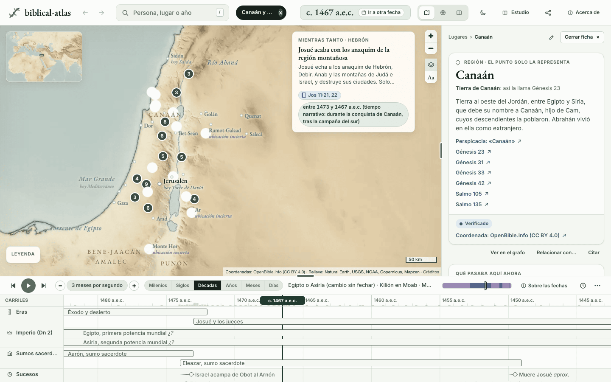
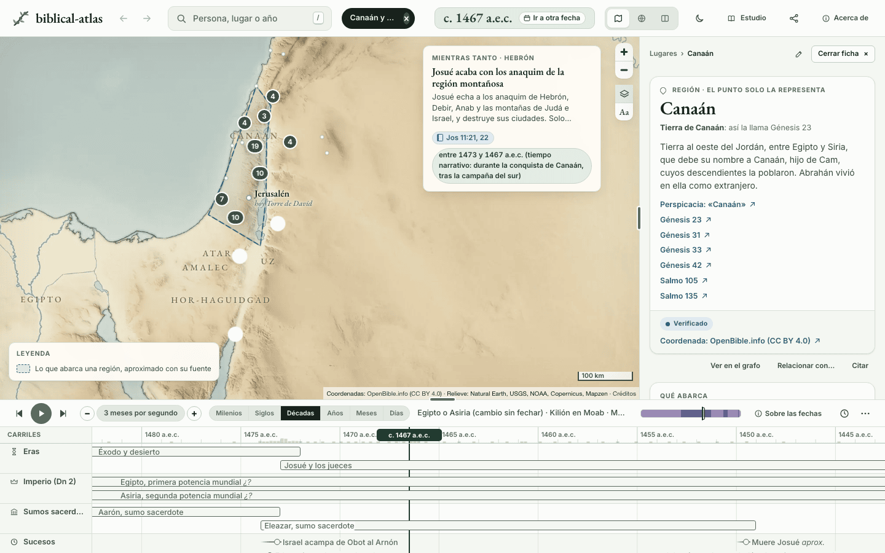
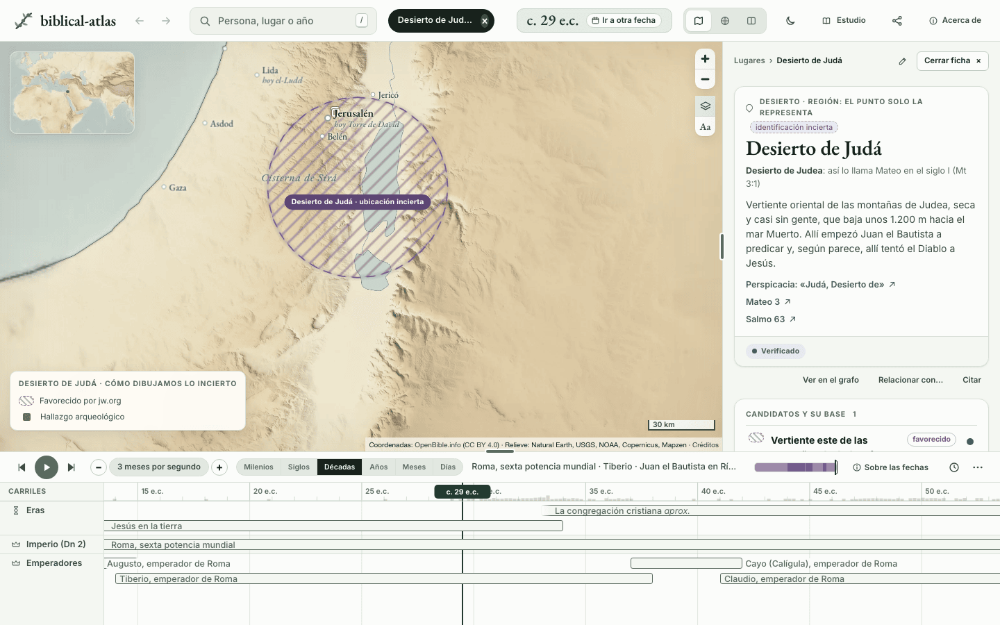
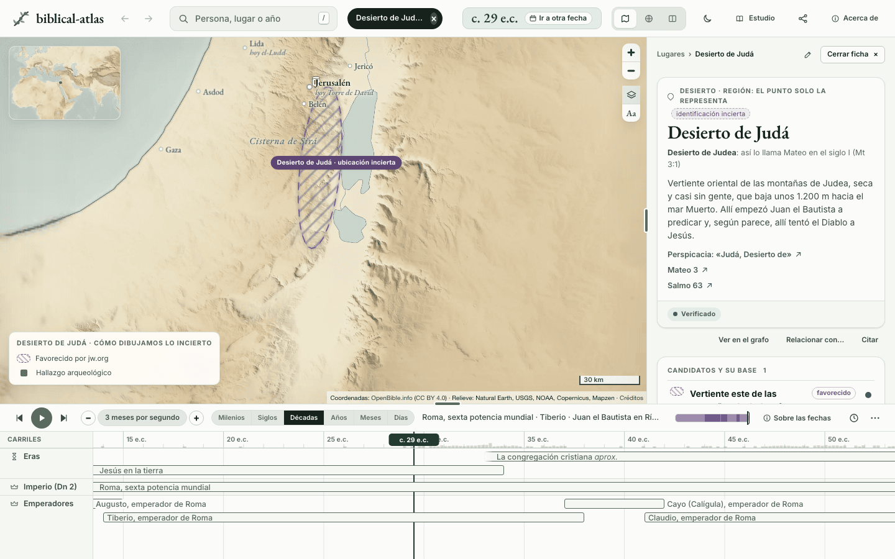
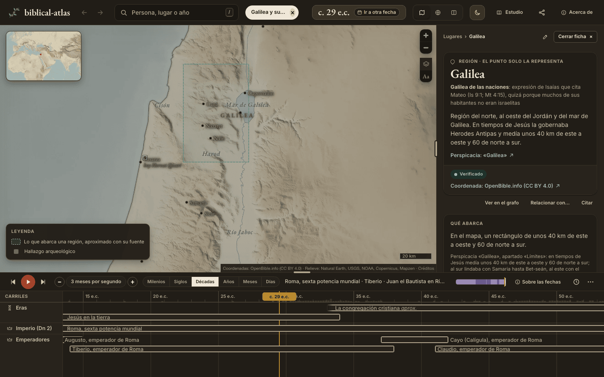

# Zonas con forma: elipses, cajas y polígonos

Hoy una zona es un círculo. Para empezar sirve, pero un valle largo, una llanura de la costa o un territorio con frontera escrita no son redondos, y el círculo dice más de lo que dice la fuente. Este documento mide qué hay, propone un vocabulario corto de formas, explica qué cambia en cada pieza y recoge la primera tanda de nueve zonas convertidas.

## Qué pasa hoy

Lo medimos sobre `main` con un guion que lee `data/places/`:

- **934 lugares.** 186 llevan `precision: zone`, 127 con un punto y 59 con candidatos. Otros 188 son inciertos con candidatos.
- **Un lugar con punto y `precision: zone` no dibuja zona.** El mapa escribe su nombre en el punto y nada más. Solo cuando es el destino de una carta, [`mapa.js`](../../site/js/mapa.js) le pone un círculo fijo de 70 km (región o provincia) o de 45 km (lo demás), sin fuente.
- **Un candidato de zona es un círculo de `radius_km`.** Hay 191, en 164 lugares, con radios de 0,5 a 900 km (mediana 22). En 154 la nota dice que el centro o el radio son nuestros. Además hay 158 candidatos de punto y 3 franjas.

Los 127 lugares con punto y zona, por tipo:

| Tipo | Lugares |
|---|---|
| Región | 55 |
| Valle | 15 |
| Río | 11 |
| País | 9 |
| Desierto | 8 |
| Provincia, llanura | 6 cada uno |
| Mar | 5 |
| Reino | 4 |
| Monte (cordillera), ciudad | 3 cada uno |
| Isla, lago | 1 cada uno |

Los 191 círculos de candidato, por tipo de lugar: 90 regiones, 70 ciudades, 14 montes, y 2 o 3 de cada uno de los demás tipos. Entre las regiones están los territorios de 11 tribus (Aser, Benjamín, Gad, Isacar, Manasés, Neftalí, Rubén, Simeón, Zabulón, Dan y Efraín), todos círculos.

Dos ejemplos de lo que cuesta el círculo:

- **El desierto de Judá** es un círculo de 40 km de radio, 5.027 km². Perspicacia lo describe como una franja de unos 80 km junto a la orilla oeste del mar Muerto, de 16 a 24 km de ancho: unos 1.600 km². El círculo cubre el mar y parte de Moab.
- **Canaán** es un nombre en un punto de Galilea, a 140 km de Hebrón. Nada en el mapa dice que la tierra llegaba hasta Gaza.



## Qué proponemos

### Un vocabulario cerrado de cuatro formas

| `type` | Lleva | Para qué |
|---|---|---|
| `circle` | `radius_km` | Lo que la fuente pone «alrededor de» un sitio. Es la forma por defecto: un candidato de zona ya es su círculo y no la repite. |
| `ellipse` | `radii_km: [a lo largo, de través]`, `bearing` | Lo alargado: un valle, una llanura de la costa, un desierto a lo largo de un mar. |
| `box` | `bounds: {south, west, north, east}` | Lo que la fuente mide en kilómetros de este a oeste y de norte a sur. |
| `polygon` | `vertices`, de 3 a 12 | Lo que tiene frontera escrita. Cada vértice es `[lat, lon]` o el id de un lugar con `precision: point`. |

`circle` y `ellipse` admiten `center` cuando la zona no está centrada en el punto que la representa (la llanura de Sarón, cuyo punto de OpenBible queda al norte). El esquema completo está en [`docs/investigacion/README.md`](../investigacion/README.md#campos-por-tipo).

### La forma es un hecho

Va en `shape`, en un lugar con punto y `precision: zone` o en un candidato de zona, y lleva lo de todo hecho: `sources`, `reason`, `checked_on`, `status`, y además `note`, que dice cómo sacamos el contorno de lo que describe la fuente.

```yaml
shape:
  type: ellipse
  center: {lat: 31.42, lon: 35.29}
  radii_km: [40, 10]
  bearing: 6
  note: 'Elipse nuestra: 80 km de largo desde el este del monte de los Olivos hacia el sur, paralela a la orilla oeste
    del mar Salado, y 20 km de ancho, la media de lo que da Perspicacia.'
  sources: [it-desierto-de-juda]
  reason: 'Perspicacia «Judá, Desierto de», párr. 1: arranca al este del monte de los Olivos, sigue la orilla oeste del
    mar Muerto unos 80 km y mide de 16 a 24 km de ancho.'
  checked_on: '2026-10-02'
  status: verified
```

### La forma nunca dice más que la fuente

- **El contorno es nuestro y aproximado.** Sale de lo que la fuente dice con palabras: un largo, un ancho, un rumbo, los lugares de su frontera. Nunca se calca de un mapa publicado.
- **Sin medida o sin frontera, no hay forma.** El Antilíbano corre unos 100 km, pero ninguna fuente da su ancho, así que sigue sin forma. Una zona que la fuente no describe se queda en su círculo.
- **Un lugar sin punto nunca es vértice.** Si la fuente dice que no se sabe dónde estaba, no se sabe. Gé 10:19 lleva Canaán hasta Guerar y Sodoma, que no tienen punto. El polígono no dibuja Sodoma: usa Gaza y el extremo sur del mar Salado, donde Nú 34:3 empieza la frontera sur de la tierra, y la nota lo dice.
- **El punto queda dentro.** La forma rodea el punto que representa al lugar o al candidato. Un polígono no se cruza consigo mismo.
- **Doce vértices como mucho.** Es una aproximación para leer el mapa, no una frontera.

## Qué cambia en cada pieza

- **[`validate.py`](../../scripts/validate.py)** comprueba el vocabulario, los campos de cada forma, que el punto cae dentro (con medio kilómetro de holgura), que un polígono no se cruza, que cada vértice con id es un lugar con `precision: point` (nunca el punto representativo de un río o una región), y las fuentes y la razón como en cualquier hecho. La cuenta del contorno vive en [`scripts/formas.py`](../../scripts/formas.py), la misma para `validate.py` y `build.py`.
- **[`build.py`](../../scripts/build.py)** añade a cada forma su contorno (`ring`, una lista cerrada de `[lon, lat]`) y su caja (`bbox`). El sitio los dibuja tal cual y no hace cuentas. La base SQLite gana una columna `forma` en `lugares` y en `candidatos`, y el registro una sección «Formas de las zonas».
- **El dibujo.** La forma de un lugar con punto se ve cuando ese lugar está elegido o lo resalta la selección (un suceso en Canaán, una persona que vivió en Galilea), con borde a trazos y relleno claro en el color `--tier1`, que cambia con el modo reunión. Un candidato con forma dibuja su contorno en lugar de su círculo, con el rayado de su estado de siempre. El destino de una carta con forma dibuja la forma en lugar del círculo fijo.
- **El encuadre.** Al elegir un lugar con forma, el mapa encuadra la forma entera. Canaán va de Sidón a Gaza y deja de quedarse en Galilea. El encuadre de la época sigue mirando puntos, así que la vista de inicio no cambia.
- **Los clics.** La capa de las formas no tiene clic y va debajo de todo. Una región grande no tapa las ciudades que tiene dentro, y se sigue pulsando el nombre de la región o el de la ciudad. Un candidato con forma conserva el clic de su zona.
- **La regla de los 0,5 km.** Es la regla 1 de [ríos](rios.md): un río, un mar o un valle cuyo punto está a menos de 0,5 km del de otro lugar avisa. Mira puntos, y una forma no mueve ningún punto, así que la regla no cambia. Un lugar dentro de la forma de otro no es un choque. Si algún día queremos avisar de dos formas que se solapan, será otra regla.
- **El lector MCP (`places_near`).** Lee `data.json` y no conoce `shape`, así que ignora la clave y nada se rompe. Sigue midiendo desde el punto. Con `ring` podrá responder después «¿en qué regiones cae Jerusalén?» (distancia 0 a las formas que contienen el origen) o medir hasta el borde. No entra en este cambio.
- **La ficha.** Un lugar con forma lleva la sección «Qué abarca»: qué forma es («una elipse de unos 80 × 20 km, alargada hacia el N», «un contorno de 11 vértices, por Sidón, Dan y Gaza»), su razón, su cuenta con la insignia «calculado», sus fuentes y el aviso de que no es una frontera trazada. Un candidato con forma lo dice en su fila.

## La primera tanda

Nueve zonas cuyas fuentes describen bien su extensión. Las demás siguen como estaban.

| Lugar | Forma | Lo que dice la fuente | Cómo sacamos el contorno |
|---|---|---|---|
| Desierto de Judá (candidato) | Elipse 80 × 20 km, al N | Perspicacia: unos 80 km junto al mar Muerto, de 16 a 24 de ancho | Desde el este del monte de los Olivos hacia el sur; ancho medio |
| Arabá | Polígono de 12 vértices | Perspicacia: del pie del Hermón al golfo de ʽAqaba, 435 km, de 800 m a 16 km de ancho | Franja de 16 km por Dan, el mar de Galilea, la boca del Jordán, el sur del mar Salado, su punto y Elat |
| Canaán | Polígono de 11 vértices | Perspicacia, Gé 10:19 y Nú 34:3, 6: al oeste del Jordán, de Sidón a Guerar junto a Gaza y hacia Sodoma, de sitio incierto; la costa al oeste | Sidón, Dan, el Jordán y el mar Salado hasta su extremo sur, una recta nuestra hasta Gaza y la costa, algo mar adentro para que entren sus ciudades |
| Galilea | Caja de 40 × 60 km | Perspicacia: en tiempos de Jesús, 40 km de este a oeste y 60 de norte a sur, con sus límites | Lado este en el Jordán, lado sur a la altura de Bet-seán |
| Llanura de Sarón | Elipse 60 × 17,5 km, al NNE | Perspicacia: 60 km del Crocodilon a Jope, de 16 a 19 de ancho | Junto a la costa; ancho medio |
| Filistea | Polígono de 5 vértices | Perspicacia: unos 80 km de costa de Jope a Gaza y 24 tierra adentro | Gaza, Asquelón y Jope, y una paralela a 24 km |
| Valle del Líbano | Elipse 100 × 13 km, al NNE | Perspicacia: cordilleras paralelas unos 100 km, de NNE a SSO, con un valle de 10 a 16 km | Su extremo sur al pie oeste del Hermón, donde Perspicacia pone Baal-gad, y el eje por el punto de la Becá; ancho medio |
| Benjamín (candidato) | Polígono de 6 vértices | Perspicacia y Jos 18:11-20: la frontera por Jericó, Betel, Bet-horón Baja, Quiryat-jearim y Jerusalén | Esos lugares y la boca del Jordán |
| Genesaret | Triángulo | Perspicacia: llanura casi triangular de unos 5 por 2,5 km en la orilla noroeste del lago | 5 km de orilla y un vértice 2,5 km tierra adentro |









## Lo que no convertimos, y por qué

- **Los ríos.** Un río es una línea, no un área. Es la regla 2 de [ríos](rios.md) y merece su propia decisión.
- **El Antilíbano, la Sefelá, el valle de Jezreel.** La fuente da el largo o los vecinos, pero no el ancho, y una forma tendría que inventarlo.
- **El distrito del Jordán.** Perspicacia lo describe como una cuenca ovalada hasta Zóar, pero su punto de OpenBible queda al norte de lo que nombra la fuente. Una elipse tendría que estirarse hasta el punto sin base.
- **El mar de Galilea.** Perspicacia da 21 por 12 km, pero el relieve ya dibuja el lago.
- **Los candidatos con radio nuestro y sin descripción** (154 de 191). Se quedan en su círculo hasta que una fuente diga más.
