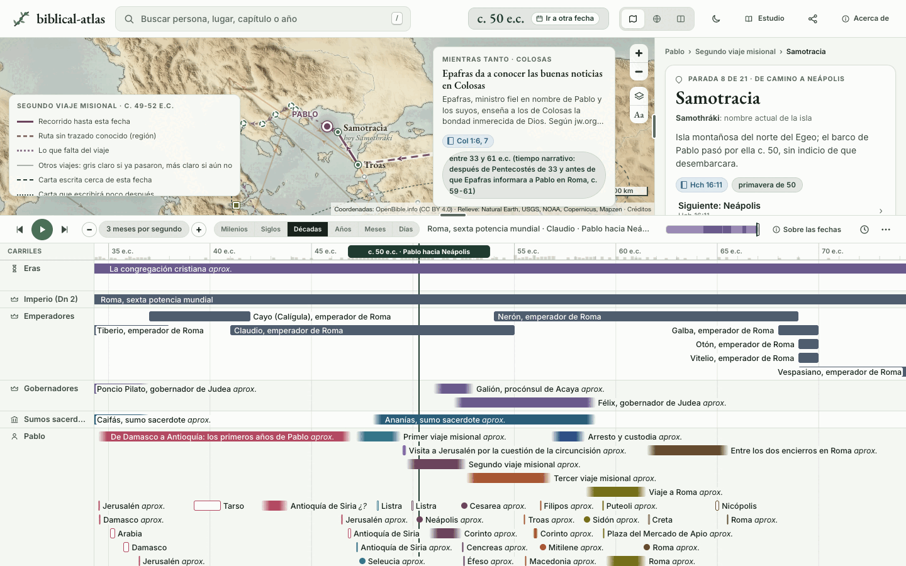
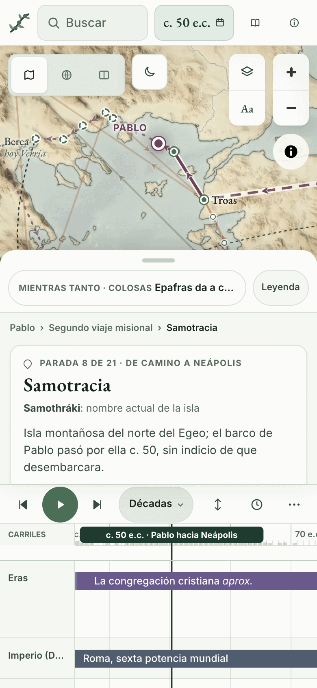
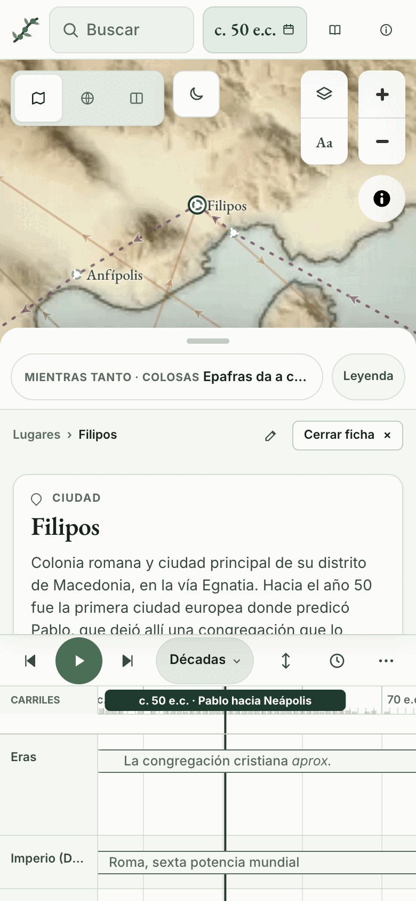
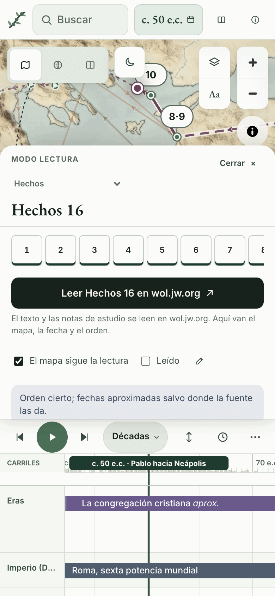
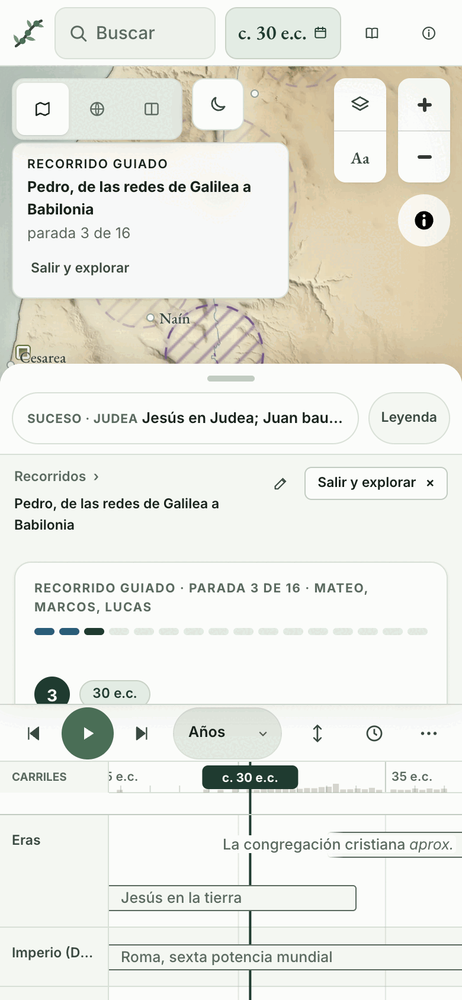

---
hide:
  - navigation
---

# biblical-atlas { .ba-visually-hidden }

  

  
  
  
  

---

**biblical-atlas** es un mapa y una línea de tiempo que se mueven con una sola fecha, para estudiar la Biblia en familia. Eliges un año y ves quién vivía, dónde estaba y qué pasaba alrededor, de Adán a Juan en Patmos. Cada dato lleva a su fuente en wol.jw.org: se enlaza, nunca se copia. La aplicación está en [biblical-atlas.geiser.cloud](https://biblical-atlas.geiser.cloud/); estas páginas explican cómo usarla, de dónde salen los datos y cómo ayudar. Empieza por [Primeros pasos](getting-started.md) y sigue con [Uso](usage.md).

-   :material-play-circle-outline: **[Primeros pasos](getting-started.md)**

    ---

    Abre la aplicación, entiende la portada y, si quieres, sírvela desde tu propio ordenador.

-   :material-map-search-outline: **[Uso](usage.md)**

    ---

    El mapa, la línea de tiempo, las fichas, la búsqueda, el grafo, el modo lectura y los recorridos guiados.

-   :material-source-branch: **[Cómo funciona](how-it-works.md)**

    ---

    Un YAML por entidad, una compilación y un sitio estático. Las reglas de las fuentes y lo que no hacemos.

-   :material-table-search: **[Registro de investigación](investigacion/registro/index.md)**

    ---

    Cada afirmación con su fichero, su fuente, el día en que se leyó y por qué la asociamos.

## La aplicación

<figure markdown>

<figcaption>En el móvil</figcaption>
</figure>
<figure markdown>

<figcaption>Una ficha</figcaption>
</figure>
<figure markdown>

<figcaption>Modo lectura</figcaption>
</figure>
<figure markdown>

<figcaption>Recorrido guiado</figcaption>
</figure>

Una fecha lo mueve todo: arrastra el cursor o pulsa reproducir y el mapa enseña dónde estaba cada uno. Un lugar, una persona o un suceso abren su ficha, con los pasajes para leer en wol.jw.org y los vídeos de jw.org que lo nombran. La búsqueda entiende nombres, capítulos («Hch 16») y años. Encima van las vistas de estudio: el [grafo de personas](usage.md#grafo-de-personas-y-conexión-entre-dos), el [modo lectura](usage.md#modo-lectura), los cuatro [recorridos guiados](usage.md#recorridos-guiados), el modo presentación para la tablet o el televisor y la página [El calendario de la Biblia](https://biblical-atlas.geiser.cloud/calendario.html).

## Qué cubre

- De Adán a Juan en Patmos: los reyes de Judá e Israel, Judá bajo los medos y los persas, Babilonia a lo largo de los siglos, la vida de Jesús en armonía con la tabla A7 de la TNM de estudio, todo Hechos y los viajes y las cartas de Pablo y de Pedro.
- Los lugares inciertos se dibujan como zonas o como candidatos, nunca como un punto seguro.
- Cada persona con sus nombres por época, sus relaciones con su verbo y su pasaje, y su posición en cada momento.
- Cuántas fichas hay de cada tipo, al día: la portada del [registro](investigacion/registro/index.md).

## Cómo se hace

- Los datos son un YAML por entidad en `data/`. `scripts/build.py` los compila en el `data.json` que lee la aplicación, en una base SQLite y en el [registro de investigación](investigacion/registro/index.md). Nada se edita a mano dos veces.
- La aplicación es un sitio estático: MapLibre GL para el mapa, mapas propios hechos con datos abiertos, sin servidor, sin cuentas y sin paso de compilación. Abre incluso desde `file://`.
- Cada hecho lleva su fuente, su razón, el día en que se leyó y su estado. Una vez al año se vuelve a mirar. Los detalles están en [Cómo funciona](how-it-works.md).

## Qué no hace

- No es un sitio de jw.org ni habla en su nombre. No explica ni interpreta la Biblia: cada ficha lleva al pasaje y a las publicaciones que lo sostienen.
- No copia textos, mapas, imágenes ni vídeos de jw.org. Solo enlaza.
- No entra nada de otras confesiones, ni una fecha sin fuente.

## Privacidad

- Sin anuncios, sin cuentas y sin analítica. Lo que recuerda (la última vista, los capítulos leídos, la letra grande) se guarda solo en tu navegador.
- La página pide fuera de su dominio dos cosas: la biblioteca del mapa (MapLibre GL, desde unpkg.com, con huella SRI) y las teselas del mapa actual (OpenFreeMap). A jw.org solo se va cuando pulsas un enlace.

## Ayuda

- Un dato mal: «Proponer una corrección» en la ficha abre una incidencia en GitHub con el fichero ya puesto. Solo pide qué está mal, qué debería decir y la página de wol.jw.org que lo sostiene.
- Un cambio tuyo: [Desarrollo](development.md) explica cómo compilar, validar y proponer un PR. Lo decidido está en [Decisiones](decisiones.md) y lo que queda, en la [Hoja de ruta](hoja-de-ruta.md).
- Un problema de seguridad: la [política de seguridad](https://github.com/GeiserX/biblical-atlas/blob/main/SECURITY.md), nunca una incidencia pública.

## Registro, por tipo

[Lugares](investigacion/registro/lugares.md) · [Personas](investigacion/registro/personas.md) · [Viajes y paradas](investigacion/registro/viajes.md) · [Cartas](investigacion/registro/cartas.md) · [Eventos](investigacion/registro/eventos.md) · [Periodos](investigacion/registro/periodos.md) · [Hallazgos](investigacion/registro/hallazgos.md) · [Recorridos](investigacion/registro/recorridos.md) · [Libros y calendario](investigacion/registro/libros.md) · [Cobertura de la Biblia](investigacion/registro/cobertura.md) · [Fuentes](investigacion/registro/fuentes.md)

## Licencia

[GPL-3.0-or-later](https://github.com/GeiserX/biblical-atlas/blob/main/LICENSE) para el código y los datos propios. Los mapas y los datos de terceros conservan cada uno su licencia, listada en [Acerca de](https://biblical-atlas.geiser.cloud/acerca.html#gracias).
