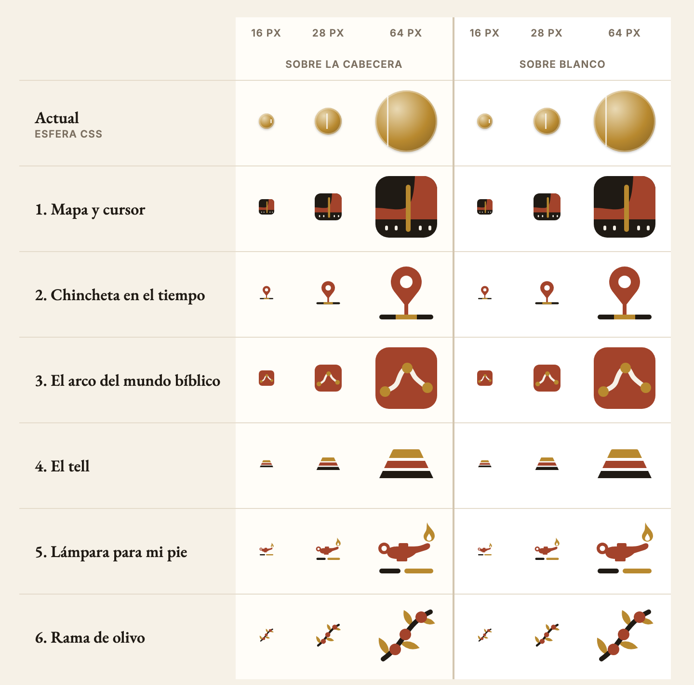
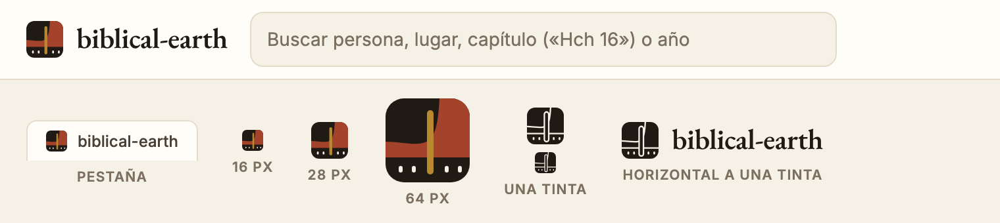
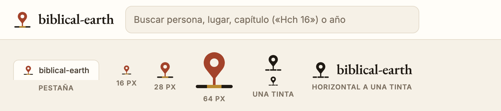
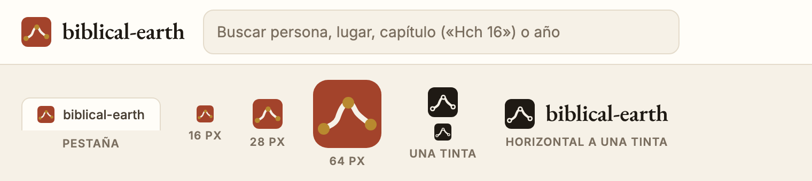
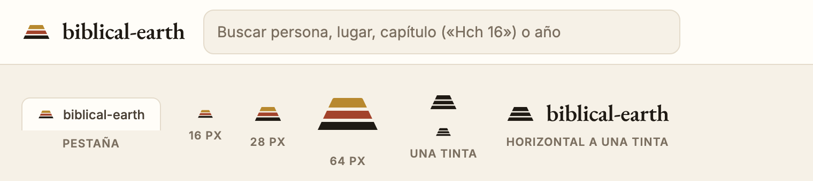
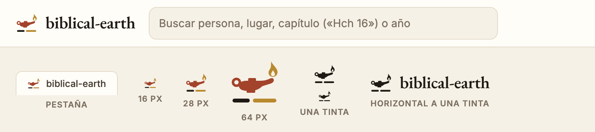
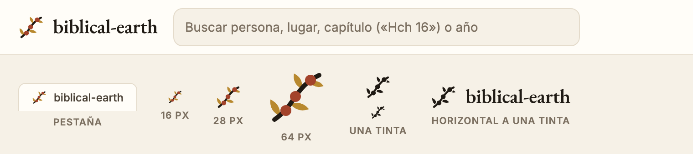

# Logo: seis propuestas

**Elegida: la 6, [rama de olivo](#6-rama-de-olivo).** Es el logo de la cabecera ([`site/logo.svg`](../../site/logo.svg)), el favicon ([`site/favicon.svg`](../../site/favicon.svg), una versión con dos hojas, dos aceitunas y el tallo más grueso para que se lea a 16 px), el icono de inicio en iPhone ([`site/apple-touch-icon.png`](../../site/apple-touch-icon.png)) y la marca del [banner del README](../images/banner.svg). Con el sistema en modo oscuro, el tallo del favicon pasa a claro para que no desaparezca en una barra de pestañas oscura. Las otras cinco se quedan aquí como registro.

La esfera dorada de 28 px hecha con CSS era el logo anterior. Estas son las seis marcas que se propusieron para sustituirla. Todas usan la paleta del sitio: terracota `#a3432b`, oro `#b8892f`, tinta `#1f1a14` y pergamino `#f6f1e7`, con dos colores como máximo más la tinta.

Cada propuesta tiene tres archivos SVG escritos a mano:

- `marca.svg`: la marca sola, en un cuadro de 64 × 64. Sirve de favicon a 16 px, de logo en la cabecera a 28 px y de imagen para compartir a 64 px.
- `horizontal.svg`: la marca con el nombre al lado, en las mismas proporciones que la cabecera: marca de 28 px, texto de 22 px y 10 px de separación.
- `monocromo.svg`: lo mismo a una sola tinta. Los huecos son transparentes, así que funciona sobre cualquier fondo.

El nombre está convertido en trazos de EB Garamond 600, la misma letra de la cabecera, así que no depende de ninguna fuente instalada. Dice «biblical-earth» porque el nombre del sitio aún no está decidido. Si al final es «Tierra Bíblica» u otro, cambia el texto y la marca sigue igual. Los candidatos están en las [preguntas abiertas](../ideas/README.md#preguntas-abiertas).

## Las seis de un vistazo

La primera fila es la esfera actual, para comparar. La columna de 16 px es la que importa para la pestaña del navegador.

## 1. Mapa y cursor

El sitio entero en un cuadro: arriba el mapa, con la costa del Mediterráneo oriental y la tierra en terracota, y abajo la línea del tiempo. El cursor dorado cruza las dos cosas, como en la aplicación, donde una sola fecha mueve el mapa y el panel.

**En el sitio.** La cabecera ganaría un cuadro oscuro de 28 px, el elemento más oscuro de toda la barra. Es la que mejor aguanta a 16 px en la pestaña, porque es un bloque lleno.

## 2. Chincheta en el tiempo

Una chincheta de mapa clavada en la línea del tiempo, que marca en oro el periodo activo. Dice en un solo signo «este lugar, en esta época».

**En el sitio.** Es la más fácil de entender, pero la chincheta es el icono de ubicación de cualquier aplicación de mapas y se puede confundir con un marcador del propio mapa. Si se elige, conviene que los marcadores del mapa no usen esta misma forma.

## 3. El arco del mundo bíblico

La ruta que va de Egipto, sube por la costa de Canaán, pasa por Harán y baja por el Éufrates hasta Ur, dibujada con sus proporciones reales. Las tres paradas son Egipto, Harán y Ur, el mismo camino de Abrahán al revés.

**En el sitio.** Igual que la 1, es un cuadro lleno, esta vez en terracota, así que el acento del sitio pasaría a la cabecera. A 16 px se ve el cuadro y una línea clara; el dibujo exacto de la ruta se aprecia a partir de 28 px.

## 4. El tell

Un tell es un montículo formado por ciudades construidas una encima de otra durante siglos: un solo lugar con muchas épocas apiladas. Las tres capas, en oro, terracota y tinta, son esas épocas.

**En el sitio.** Es la más sobria y la que menos pesa en la cabecera. El riesgo es que, sin explicación, se lea como una pirámide o un icono genérico de «capas». La idea pide saber qué es un tell.

## 5. Lámpara para mi pie

Una lámpara de aceite de barro con la llama encendida y, debajo, el camino que ilumina: en tinta lo ya andado y en oro lo que tiene delante. Viene de [Salmo 119:105](https://wol.jw.org/es/wol/b/r4/lp-s/nwtsty/19/119#v=19:119:105), donde la palabra de Dios alumbra cada paso y el camino entero.

**En el sitio.** Es la más cálida y la única que habla del texto y no del mapa. Es ancha y baja, así que a 16 px la lámpara queda pequeña; para el favicon convendría una versión sin el camino y con la lámpara más grande.

## 6. Rama de olivo

Una rama de olivo cuyo tallo es una ruta y cuyas aceitunas son las paradas, como las paradas de un viaje de Pablo. El olivo es uno de los árboles que más aparecen en la Biblia y en su tierra.

**En el sitio.** En la cabecera se ve bien y es la más orgánica de las seis. A 16 px es la más débil: la rama se reduce a un trazo con puntos, así que el favicon también necesitaría una versión simplificada.

## Lo que cambia en el sitio con cualquiera de ellas

- En [`site/index.html`](../../site/index.html), el `` pasa a ser la marca en SVG, y el favicon, que hoy está vacío con `<link rel="icon" href="data:,">`, apunta a `marca.svg`.
- En [`site/kit/components.css`](../../site/kit/components.css) sobran las dos reglas de `.be-logo__mark` que dibujan la esfera con degradados.
- El texto de la cabecera sigue siendo texto HTML; `horizontal.svg` es para el README, la imagen al compartir y los documentos.
- [`docs/images/banner.svg`](../images/banner.svg), el banner del README, se rehace con la marca elegida.

## Lo que se descartó

- Un rollo que se desenrolla en costa. Con dos rodillos recuerda al rollo de la Torá, que es un símbolo de una confesión concreta. Con uno solo, todo depende de la forma de la costa, un detalle demasiado fino para 16 px.
- Un globo con el meridiano como cursor. En las pruebas salía una cruz, una media luna o un melón, así que la idea pasó a la propuesta 1, donde el cursor cruza un mapa plano.
- Ninguna marca usa cruces, palomas, coronas, halos, la estrella de David, torres ni nada que recuerde al logo de jw.org o a sus portadas.
