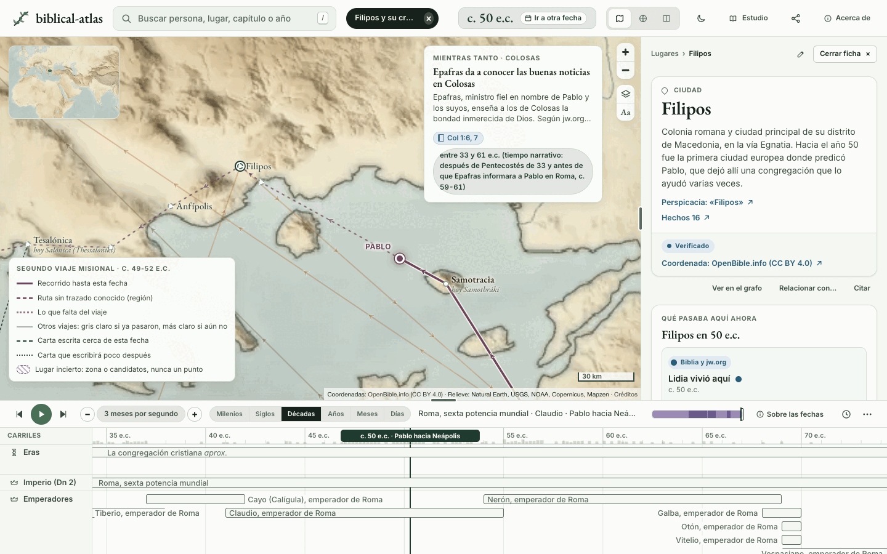
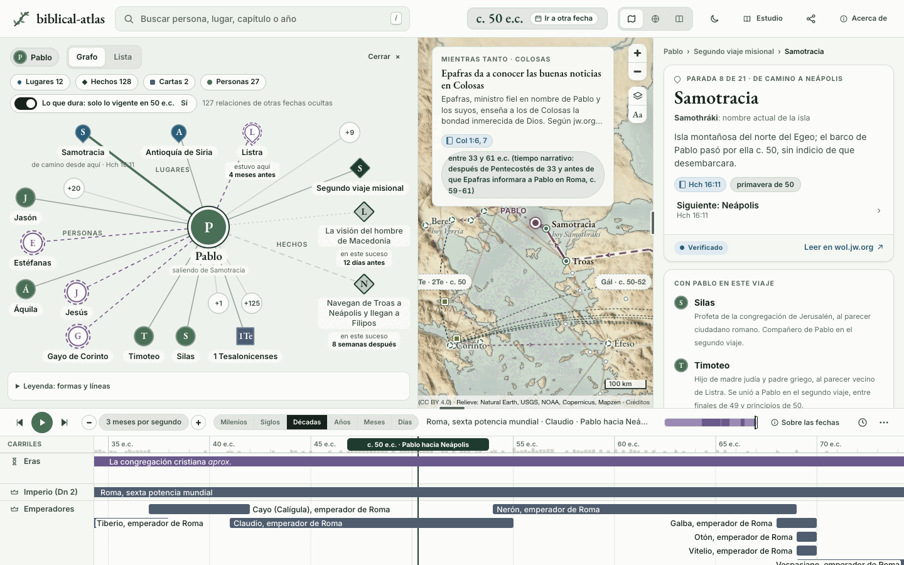

# Uso

Todo lo que hace la aplicación, vista a vista. La regla de la casa: **una fecha lo mueve todo**. La fecha de arriba manda; el mapa, la ficha y la línea de tiempo la siguen.

## La fecha

- Arrastra el cursor de la línea de tiempo, o pulsa reproducir (barra espaciadora). Con Mayúsculas y las flechas saltas a la parada o carta anterior o siguiente.
- Pulsa la fecha de arriba para ver qué quiere decir, los sucesos cercanos y los momentos clave, y para ir a otra sin escribir: era, año, mes hebreo y día.
- La rueda sobre la línea cambia la escala, de milenios a días. Al llegar a los meses y los días salen dos filas alineadas, nuestros meses y los meses hebreos. La página [El calendario de la Biblia](https://biblical-atlas.geiser.cloud/calendario.html) explica en qué se diferencian.
- Las fechas siguen la cronología de la Traducción del Nuevo Mundo. Si la historia secular da otra fecha y una publicación de jw.org la menciona, sale como nota y no mueve el cursor.

## El mapa

- **Antiguo, actual o cortina.** El antiguo es un relieve propio en cuatro extensiones (el mundo, el Mediterráneo, la tierra de Israel y Jerusalén con sus alrededores) que se funden al acercarte. El actual usa OpenFreeMap. La cortina enseña los dos a la vez.
- **Nombres por época.** El nombre que se ve depende de la fecha: en Hechos 23 se lee Antípatris; en Josué 12, Afec.
- **Lo incierto se ve incierto.** Un lugar que nadie sitúa con seguridad se dibuja como una zona o con sus candidatos, cada uno con su estado. Nunca un punto inventado.
- **Capas.** Viajes, cartas, lugares inciertos, hallazgos arqueológicos, pendientes de verificar y relieve se apagan y encienden en el menú de capas. La leyenda explica cada marca.
- **Mientras tanto.** Con una fecha puesta, el mapa dice qué pasaba en otros lugares en ese momento.

## La ficha

Un lugar, una persona, un suceso, una carta, un viaje, un periodo, un hallazgo o un capítulo abren su ficha.



- **Pasajes.** Cada cita lleva a su capítulo en wol.jw.org. Nada se copia.
- **Por qué lo decimos.** Qué pasaje o qué párrafo sostiene cada dato. La marca dice de qué fuente es: punto lleno, la Biblia o una publicación de jw.org; aro, otra fuente que jw.org ha usado, que acompaña y nunca corrige a la primera.
- **Pendiente de verificar.** Un dato que aún no hemos comprobado lo dice.
- **Vídeos.** Los vídeos públicos de jw.org que nombran ese lugar, esa persona o ese capítulo, con enlace a cada uno.
- **Proponer una corrección.** Abre una incidencia en GitHub con el fichero del dato ya puesto.

## La búsqueda

Pulsa `/` o toca la caja de arriba. Entiende un nombre («Filipos», «Loida»), un capítulo («Hch 16», «Gé 12») y un año («607 a.e.c.»). El mapa y la línea de tiempo van a ese momento y la cronología de la entidad queda resaltada. Escape borra la búsqueda y la selección.

## Grafo de personas y conexión entre dos

En «Estudio», en la barra de arriba. El grafo enseña quién viaja con quién, quién es pariente de quién y quién escribe a quién, siempre en la fecha del cursor. Cada arista lleva su verbo y el pasaje que la sostiene: una relación sin pasaje no se dibuja. Lo seleccionado pasa al centro; en el móvil el grafo sale en lista, o en círculo si lo pides.



La conexión entre dos encuentra hasta tres caminos entre dos personas, por ejemplo de Loida a Pablo, y los dibuja sobre el mapa.

## Modo lectura

Cualquier capítulo con datos se lee tramo a tramo: el mapa sigue el relato, cada persona y cada lugar que nombra el texto abren su ficha, y los vídeos que citan el capítulo van al final. Los capítulos leídos se recuerdan en tu navegador.

## Recorridos guiados

Cuatro: «De Babilonia a Jerusalén», «La última semana», «Pedro» y «Cartas y ciudades». Cada parada tiene su texto corto, sus pasajes y, cuando no sabemos algo, lo dice. Al final hay preguntas de repaso y una hoja para imprimir.

- **Modo presentación.** Pantalla completa, letra grande y avance con las flechas o con un mando, para una tablet o un televisor.
- **Modo reunión.** El botón de la luna: fondo oscuro y sin animaciones.
- **Letra grande.** En «Estudio»; se recuerda en tu navegador.

## Ahora mismo y sincronía

«Ahora mismo» resume qué pasa en la fecha del cursor. La sincronía responde quién había en un lugar durante un periodo: con el cursor en 520 a.e.c., Jerusalén da Zorobabel, Josué, Ageo y Zacarías.

## Compartir una vista

La dirección guarda la vista. «Copiar el enlace a esta vista» la copia; quien la abra ve lo mismo.

```text
https://biblical-atlas.geiser.cloud/#t=50.3000&v=40&sel=carta:1-tesalonicenses&mapa=antiguo
```

| Parámetro | Qué es |
|---|---|
| `t` | El año con decimales, en numeración astronómica (1 a.e.c. es 0). Cuatro decimales, para volver al mismo día. |
| `v` | Los años que abarca la línea de tiempo. |
| `sel` | Lo seleccionado: `lugar:<id>`, `persona:<id>`, `carta:<id>`, `viaje:<id>`, `evento:<id>`, `periodo:<id>`, `hallazgo:<id>`, `recorrido:<id>`, `libro:<slug>` o `pasaje:<libro>-<capítulo>` (`pasaje:hch-16`). |
| `mapa` | `antiguo`, `actual` o `cortina`. |

Los demás parámetros (capas apagadas, carriles fijados, el grafo, la lectura, la parada de un recorrido, la velocidad) solo aparecen cuando no valen lo de siempre. La lista entera está en [`site/README.md`](https://github.com/GeiserX/biblical-atlas/blob/main/site/README.md#dirección-de-la-página).

## Teclado

| Tecla | Qué hace |
|---|---|
| `/` | Ir a la búsqueda |
| Espacio | Reproducir o pausar |
| ← → | Mover el cursor un paso (depende de la escala de la línea) |
| Mayúsculas + ← → | Saltar a la parada o carta anterior o siguiente |
| Esc | Borrar la búsqueda y la selección |
| `T` | Ampliar o reducir la línea de tiempo |
| Alt + arrastrar sobre la línea | Regla entre dos fechas |

## En el móvil y con el dedo

La ficha es una hoja inferior sobre el mapa, con su asa arriba; las seis escalas de la línea van en un desplegable; el grafo y la conexión tapan el mapa entero. Cada control ofrece una diana de al menos 44 × 44 px. Se prueba a 390 × 844 y 430 × 932 (móvil) y a 768 × 1024 y 1024 × 768 (tablet).
