# Propuestas en verde

**Aplicado: la marca 2 y la paleta Salvia.** Son los verdes grises y suaves, los que menos pesan en la página, y ya están en el sitio. El logo, el favicon y el banner van en salvia, y la paleta está en [`site/kit/tokens.css`](../../site/kit/tokens.css). Qué cambió, los números finales y las capturas están en [Salvia, aplicada](aplicado/README.md). Lo que sigue es el registro de todas las propuestas tal como se presentaron.

Quien prueba el sitio en familia preguntó por qué la rama de olivo es roja y amarilla, porque le recordaba a la bandera belga o a la alemana, y pidió un sitio en tonos verdes. Aquí hay propuestas en verde para la marca, para el banner del README y para la página entera. Nada está decidido: se elige una marca, un banner y una paleta, o ninguna.

Todo lo de esta carpeta es una propuesta. No cambia nada en [`site/`](../../site) ni en [`docs/images/`](../images).

## La marca en seis verdes

Las seis son la [rama de olivo](../logo/README.md#6-rama-de-olivo) que ya usa el sitio, con la misma forma: cuatro hojas, un tallo que es una ruta y tres aceitunas que son sus paradas. Solo cambian los colores. Cada propuesta tiene los mismos tres archivos que la ronda del logo:

- `marca.svg`: la marca sola, en 64 × 64.
- `horizontal.svg`: la marca con el nombre en EB Garamond, convertido en trazos.
- `monocromo.svg`: marca y nombre a una sola tinta verde, con huecos transparentes entre hojas, tallo y aceitunas.

`vista.png` enseña la marca en la cabecera clara, en una cabecera oscura, en la pestaña del navegador y a 16, 28 y 64 px. Sobre fondo oscuro el tallo pasa a claro, igual que hoy en el banner del README, en las propuestas 1 a 4 se aclaran además las aceitunas o las hojas que se perderían, y la 6 pasa entera a un verde claro.

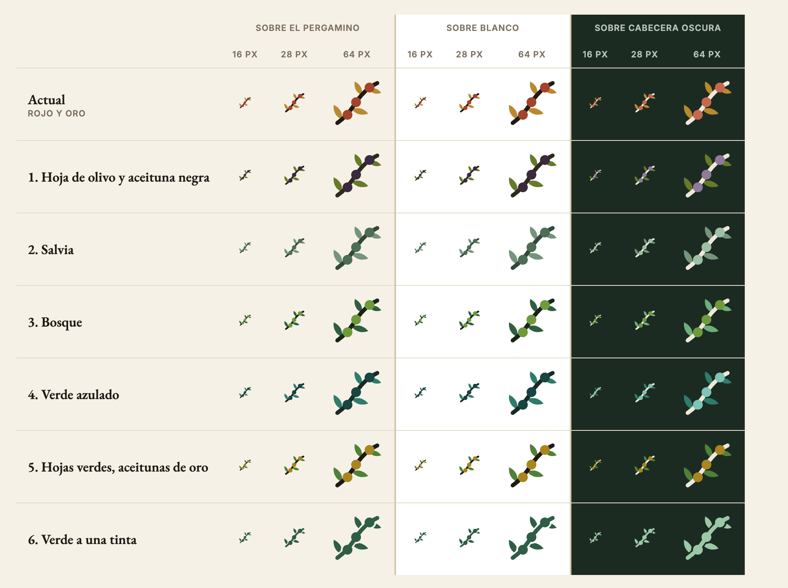

La primera fila es la marca actual, para comparar. La columna de 16 px es la que se ve en la pestaña.

### Contraste de cada parte

Es el contraste de cada color con el fondo, según la fórmula de WCAG. Para un dibujo que no es texto, WCAG pide 3:1. Hoy las hojas doradas se quedan en 2,8:1 sobre el pergamino, así que ese es el mínimo que nos pusimos. El pergamino es `#f6f1e7` y la cabecera oscura, `#1c2b22`.

| Marca | Hojas | Tallo | Aceitunas | Hojas, en oscuro | Tallo claro, en oscuro | Aceitunas, en oscuro |
|---|---|---|---|---|---|---|
| Actual | 2,8 | 15,3 | 5,5 | 4,7 | 12,1 | 3,9 |
| 1. Hoja de olivo y aceituna negra | 4,3 | 12,7 | 11,8 | 3,1 | 12,1 | 3,8 |
| 2. Salvia | 3,0 | 8,8 | 5,1 | 4,4 | 12,1 | 7,4 |
| 3. Bosque | 6,6 | 14,2 | 2,9 | 5,7 | 12,1 | 4,5 |
| 4. Verde azulado | 4,4 | 13,3 | 9,5 | 3,0 | 12,1 | 7,4 |
| 5. Hojas verdes, aceitunas de oro | 4,1 | 15,3 | 3,1 | 3,2 | 12,1 | 4,3 |
| 6. Verde a una tinta | 6,7 | 6,7 | 6,7 | 7,9 | 7,9 | 7,9 |

### 1. Hoja de olivo y aceituna negra

Hojas verde oliva `#667a2a` y aceitunas de un negro morado `#3a2a3e`, como las aceitunas maduras, sobre un tallo de madera oscura. Es la más fiel a un olivo de verdad. En fondo oscuro las aceitunas pasan a un malva claro para no desaparecer.

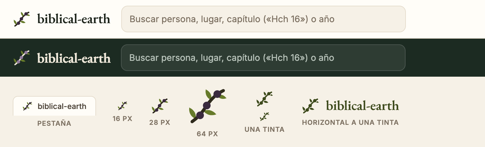

### 2. Salvia

Todo en verdes grisáceos: hojas salvia `#76937b`, aceitunas `#4e6d57` y tallo `#34473b`. Es la más suave y la que menos pesa en la cabecera, y por eso sus hojas son las más justas de contraste, 3,0:1.

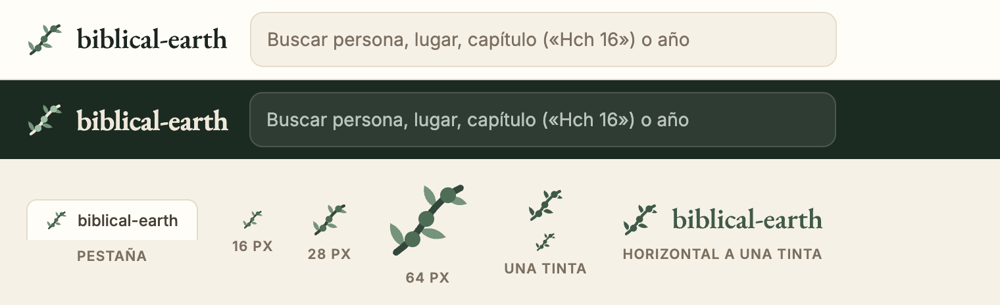

### 3. Bosque

Hojas verde bosque `#2f5f3e` y aceitunas verdes claras `#6e9a3c`, como aceitunas sin madurar. Es la más verde de las seis y la que mejor se ve a 16 px. En oscuro las hojas se aclaran a `#6fae7c`.

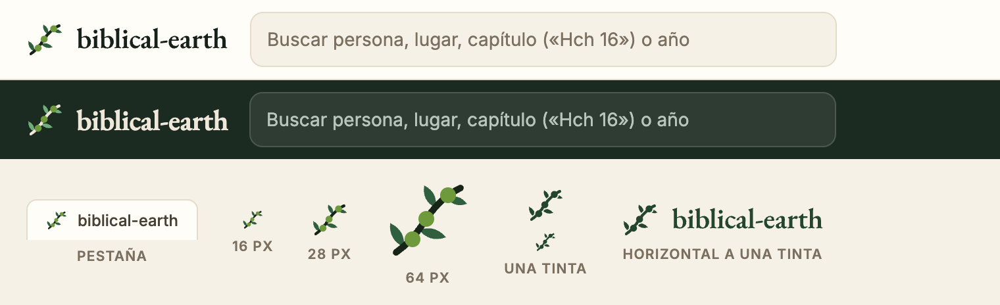

### 4. Verde azulado

Hojas `#2e7c6c`, entre verde y azul, con aceitunas `#174541` casi negras en el mismo tono. Es la más fresca y la única que tira hacia el mar del mapa.

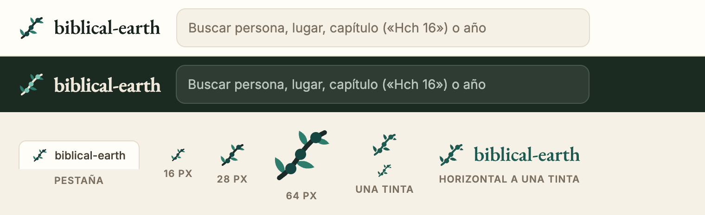

### 5. Hojas verdes, aceitunas de oro

Hojas verde hoja `#4f8138`, aceitunas de oro `#a9851f` y el tallo en la tinta de hoy. Quita el rojo pero guarda un toque cálido, así que es la que menos se aleja de la marca actual.

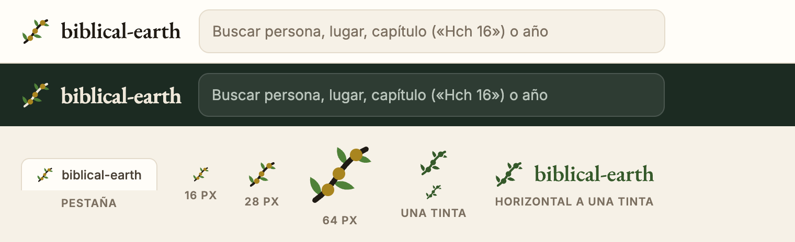

### 6. Verde a una tinta

Una sola tinta, `#2f5d46`, con un hueco fino que separa las hojas del tallo y de las aceitunas, igual que la versión monocroma de la marca actual. Es la más sobria y la que mejor se imprime o se borda, porque no depende de combinar colores.

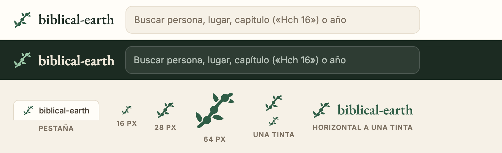

## El banner con las tres mejores marcas

Elegimos la 1, la 3 y la 4 porque son las tres familias de verde más distintas entre sí: oliva, bosque y verde azulado. Los tres banners tienen la composición y el tamaño del [banner actual](../images/banner.svg), 900 × 200, con la marca a la izquierda, el nombre en el centro y el lema «La Biblia en el mapa y en el tiempo». El nombre va en EB Garamond, la letra de la cabecera, y el lema en Inter, los dos convertidos en trazos para que GitHub los enseñe igual en cualquier equipo. `vista.png` es el banner al doble de resolución.

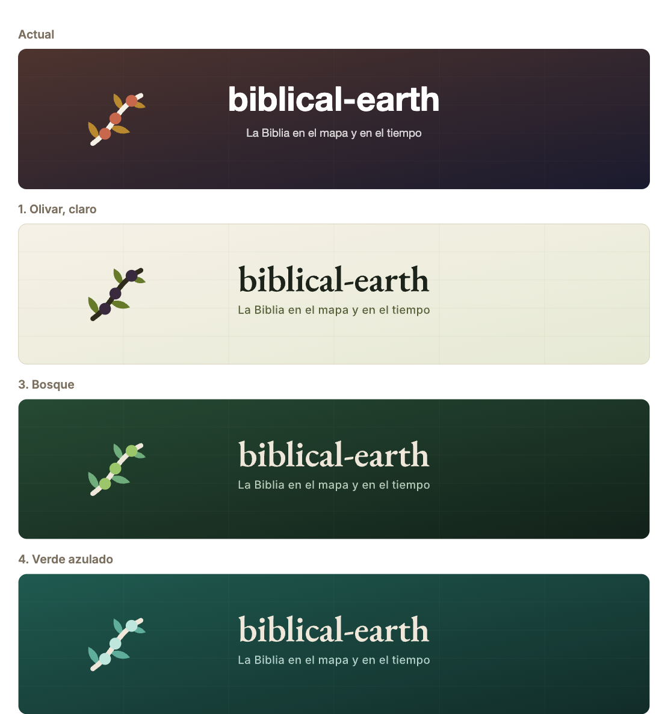

El contraste más bajo de cada parte, medido contra los dos extremos del degradado:

| Banner | Hojas | Tallo | Aceitunas | Nombre | Lema |
|---|---|---|---|---|---|
| 1. Olivar, claro | 3,9 | 11,7 | 10,8 | 13,1 | 5,4 |
| 3. Bosque | 3,8 | 8,2 | 5,1 | 8,2 | 5,9 |
| 4. Verde azulado | 3,0 | 6,5 | 5,9 | 6,5 | 5,0 |

### 1. Olivar, claro

El único banner claro: pergamino que se va aclarando hacia un verde oliva muy pálido, con la marca 1 tal cual y un borde fino para que no se funda con el blanco de GitHub. Es el que más se parece al propio sitio.

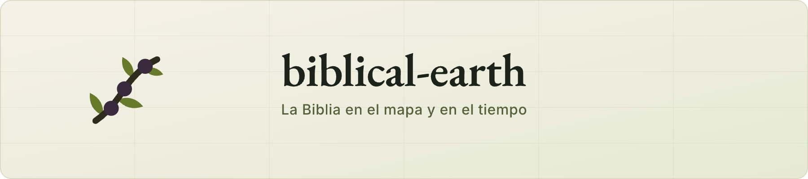

### 3. Bosque

Degradado de verde bosque a casi negro, con la marca 3 en su forma para fondo oscuro: tallo claro, hojas `#6fae7c` y aceitunas verdes algo más claras que en la marca. Es el más verde de los tres y el que mejor funciona en el modo oscuro de GitHub.

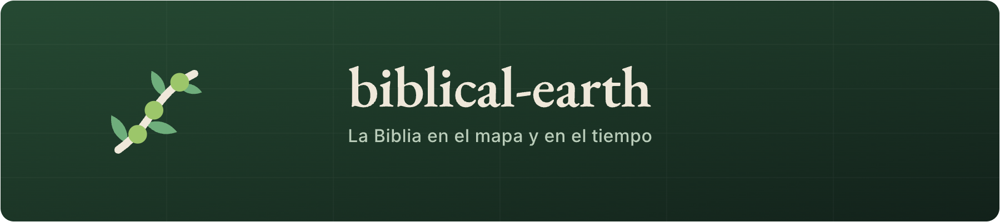

### 4. Verde azulado

Degradado de verde azulado a verde muy oscuro, con hojas `#5fae9b` y aceitunas verde agua. Es el más fresco y el más cercano al color del mar en el mapa.

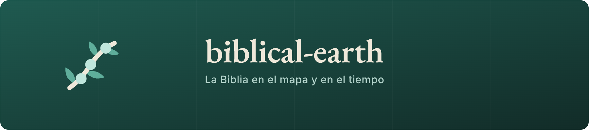

## La página en cuatro verdes

Cada paleta es un archivo CSS que se carga después de las hojas del sitio y solo cambia colores: [`1-olivar.css`](temas/1-olivar.css), [`2-salvia.css`](temas/2-salvia.css), [`3-bosque.css`](temas/3-bosque.css) y [`4-verde-agua.css`](temas/4-verde-agua.css). Cambian las variables de [`site/kit/tokens.css`](../../site/kit/tokens.css): papel, tinta, acento, cursor, fechas, «Verificado», enlaces, grafo e imperios. También cambian los colores que el sitio escribe a mano en algunas reglas, como el texto de las píldoras de fecha, las bandas doradas de la línea de tiempo o el halo de Pablo. Cada paleta lleva dentro su marca en verde para la cabecera.

Para probar una, se copia el archivo en `site/css/` y se añade esta línea en [`site/index.html`](../../site/index.html), después de `css/estudio.css`:

```html
<link rel="stylesheet" href="css/3-bosque.css">
```

Los colores de los viajes y de las cartas no están en el CSS sino en [`site/js/mapa.js`](../../site/js/mapa.js), en `PALETA` y `PALETA_ESCRITOR`. Cada tema los declara en `--viajes` y `--cartas`, y `mapa.js` necesita este cambio para leerlos. Sin tema, el sitio queda igual que hoy.

El cambio:

```js
const leerLista = (v, def) => { const s = getComputedStyle(document.documentElement).getPropertyValue(v).trim(); return s ? s.split(/\s*,\s*/) : def; };
const PALETA = leerLista('--viajes', ['#a3432b', '#8a6d1f', /* …los diez de hoy… */]);
const PALETA_ESCRITOR = leerLista('--cartas', ['#b8892f', '#2c5f8a', /* …los siete de hoy… */]);
```

Las capturas son del sitio de verdad, con los datos de [`data/`](../../data) y ese cambio aplicado en una copia: `portada.png` es el segundo viaje en el año 50 a 1440 × 900, `persona.png` es la ficha de Jesús en el año 31 y `movil.png` es el segundo viaje en un teléfono de 430 px de ancho. En las tres, la línea de tiempo está en Décadas. En el teléfono pulsamos «Déc», porque allí abre en Años. El mapa es WebGL y en estas capturas se ve entero.

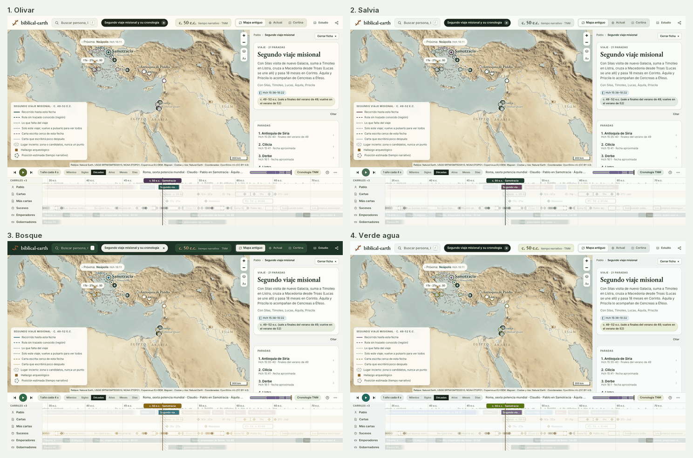

### Los números

Contraste según WCAG. El texto pide 4,5:1 para el nivel AA y los trazos, 3:1. ΔE es la diferencia de color CIEDE2000: a partir de 10 dos colores se distinguen sin esfuerzo uno al lado del otro. La última columna es el sitio de hoy.

| | Olivar | Salvia | Bosque | Verde agua | Hoy |
|---|---|---|---|---|---|
| Texto principal sobre el fondo | 14,6 | 14,4 | 15,0 | 14,9 | 15,3 |
| Texto terciario sobre el fondo | 5,1 | 5,0 | 5,5 | 5,4 | 4,4 |
| Texto terciario sobre los paneles | 5,6 | 5,6 | 6,0 | 5,9 | 4,8 |
| Enlaces sobre los paneles | 6,9 | 7,0 | 6,9 | 7,1 | 6,8 |
| Acento como texto sobre los paneles | 6,0 | 5,5 | 6,3 | 6,2 | 6,1 |
| Blanco sobre el acento, en los botones | 6,1 | 5,7 | 6,4 | 6,3 | 6,2 |
| Blanco sobre la bandera del cursor | 10,6 | 12,2 | 5,2 | 5,3 | 3,2 |
| Línea del cursor sobre el fondo | 9,4 | 10,7 | 4,6 | 4,7 | 2,8 |
| Fecha sobre su píldora | 7,8 | 10,1 | 6,4 | 7,7 | 7,9 |
| «Verificado» sobre su fondo | 5,9 | 5,9 | 5,8 | 5,9 | 6,2 |
| Blanco sobre la barra del viaje más claro | 5,2 | 5,2 | 5,2 | 5,2 | 4,9 |
| ΔE mínimo entre los ocho viajes de Pablo | 16,2 | 16,9 | 14,9 | 15,9 | 15,8 |
| ΔE mínimo entre los cuatro viajes principales | 26,4 | 27,4 | 21,6 | 19,6 | 15,8 |
| ΔE mínimo de un viaje al acento | 19,9 | 20,1 | 22,3 | 18,2 | 0 |
| ΔE mínimo de un viaje al cursor | 18,2 | 24,4 | 19,4 | 25,6 | 12,9 |
| ΔE entre el acento y el cursor | 46,3 | 17,6 | 29,0 | 23,3 | 30,0 |
| ΔE entre el acento y «Verificado» | 30,5 | 24,2 | 28,6 | 24,9 | 42,5 |
| ΔE mínimo entre imperios | 8,6 | 8,6 | 8,6 | 8,6 | 6,1 |

En Bosque la cabecera es oscura: su texto queda a 11,8:1, el texto secundario a 7,3:1, el texto de ayuda del buscador a 5,7:1 y la fecha dorada a 6,4:1.

Las cuatro pasan AA en todo el texto, y además arreglan dos fallos de hoy: el texto terciario, que hoy se queda en 4,4:1 sobre el fondo, y la bandera del cursor, cuyo texto blanco sobre oro se queda en 3,2:1. Los cuatro viajes principales son el primero, el segundo, el tercero y el viaje a Roma, y en todas las paletas se separan más que los de hoy. Los colores de los viajes los elegimos con una búsqueda que maximiza la diferencia mínima entre ellos, con dos condiciones: que el texto blanco se lea encima y que queden lejos del acento y del cursor. Jesús toma el color del primer viaje, así que ese hueco nunca es rojo.

El sitio sigue sin usar el color como única señal. Lo recorrido va en línea continua y lo que falta en puntos. Lo incierto va rayado, las cartas son rombos y «Verificado» lleva su texto. Nada de eso cambia.

### 1. Olivar

Fondo de papel con un punto de oliva, acento verde oliva `#56692b` y cursor de aceituna negra `#4e3656`, el mismo color que las aceitunas de la marca 1. Es la paleta en la que cursor y acento se separan más, con una ΔE de 46.

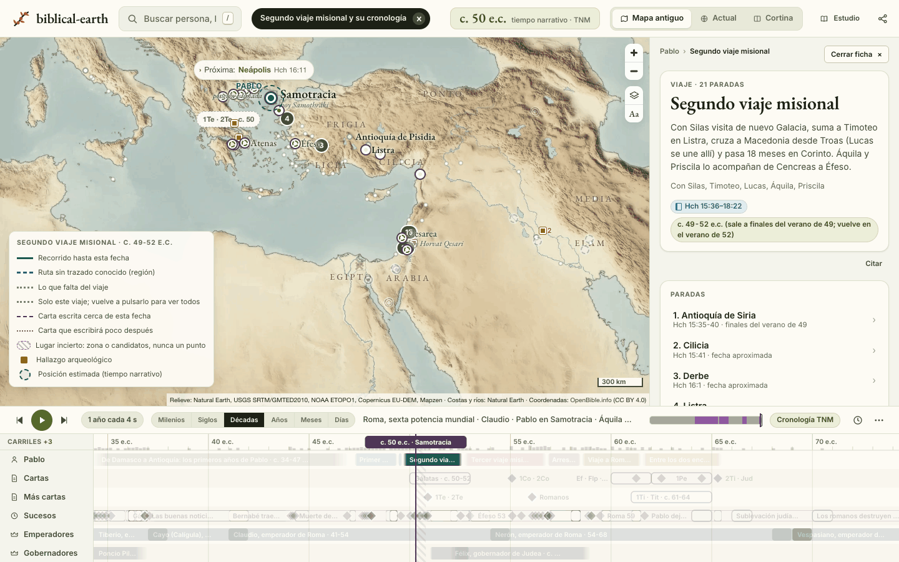

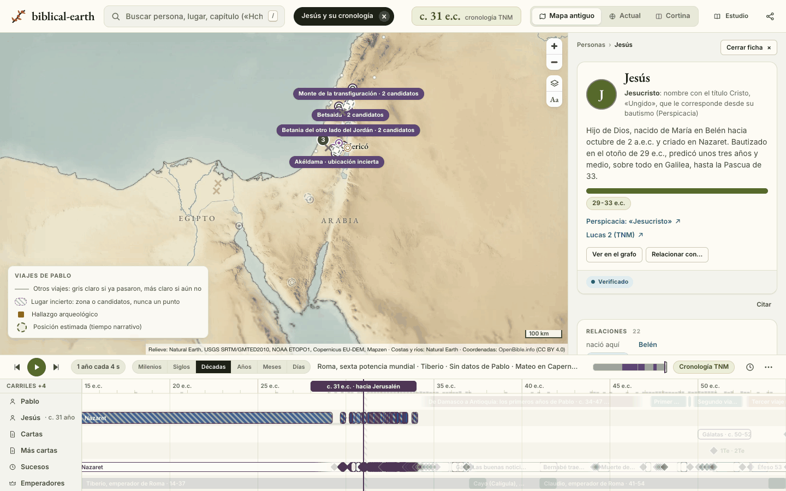

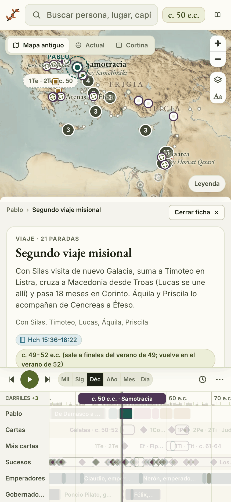

### 2. Salvia

Todo en verdes grises y fríos: fondo `#eef2ec`, acento salvia `#4a6f57` y cursor verde pino muy oscuro `#1f3b30`. Es la más tranquila. El cursor y el acento son los dos verdes, así que se distinguen por lo oscuro, no por el tono, y su ΔE de 17,6 es la más baja de las cuatro.

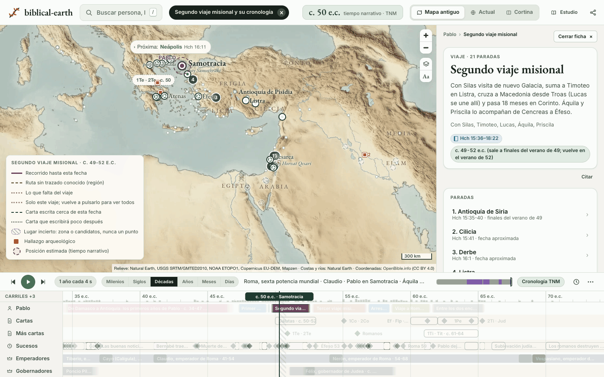

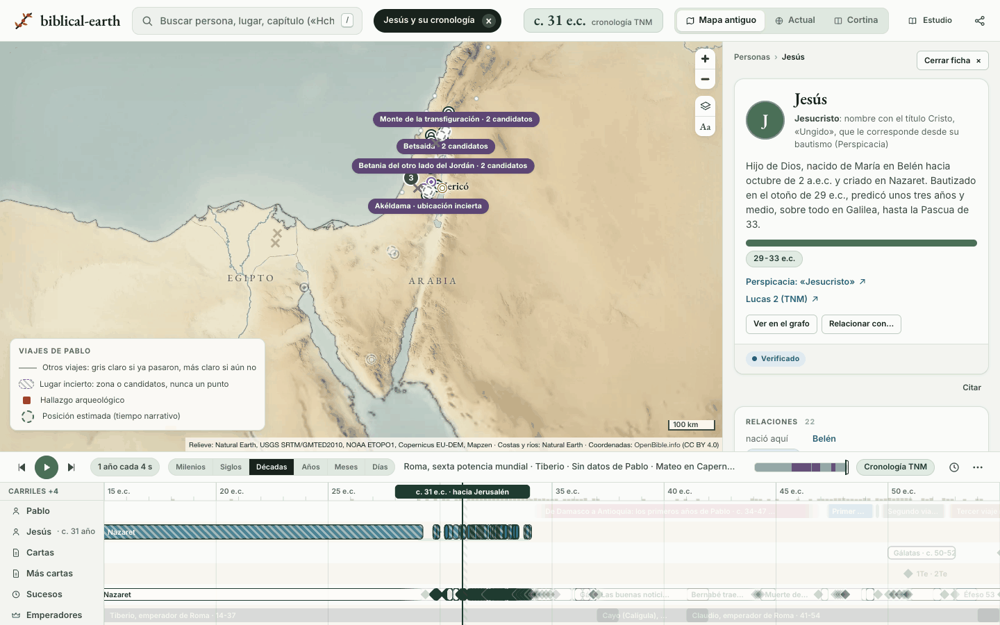

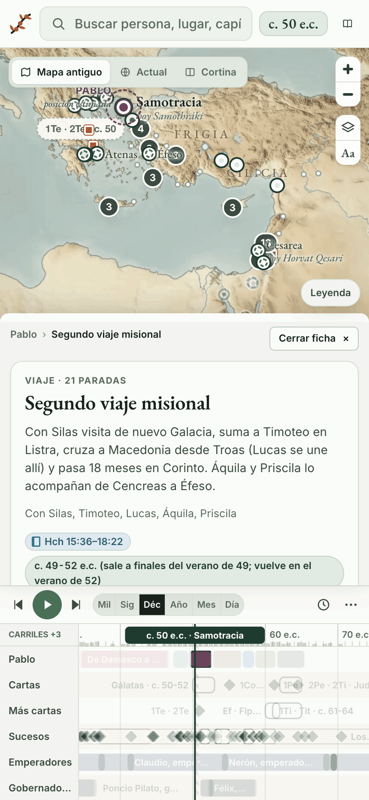

### 3. Bosque

La única con la cabecera oscura, verde bosque `#1c3325`, con la marca 3 en claro y la fecha en oro. Por dentro, el acento es verde bosque `#2d6a45` y el cursor sigue siendo dorado, `#8a6812`, algo más oscuro que hoy para que su texto blanco pase AA. Es la que más cambia el aspecto del sitio y la que guarda el oro como color del tiempo. Su punto débil es que la diferencia mínima entre viajes, 14,9, queda un poco por debajo de la de hoy.

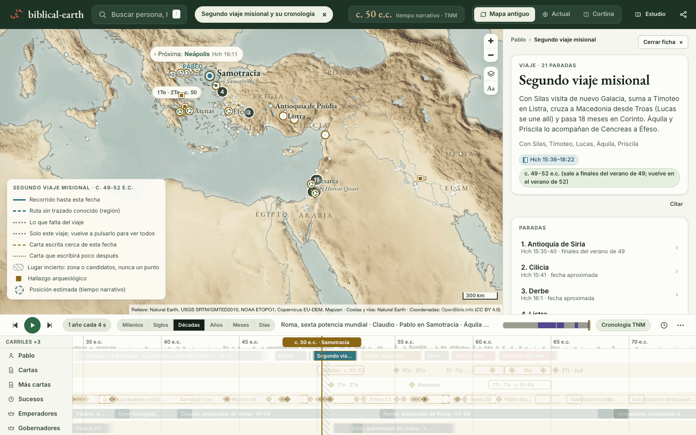

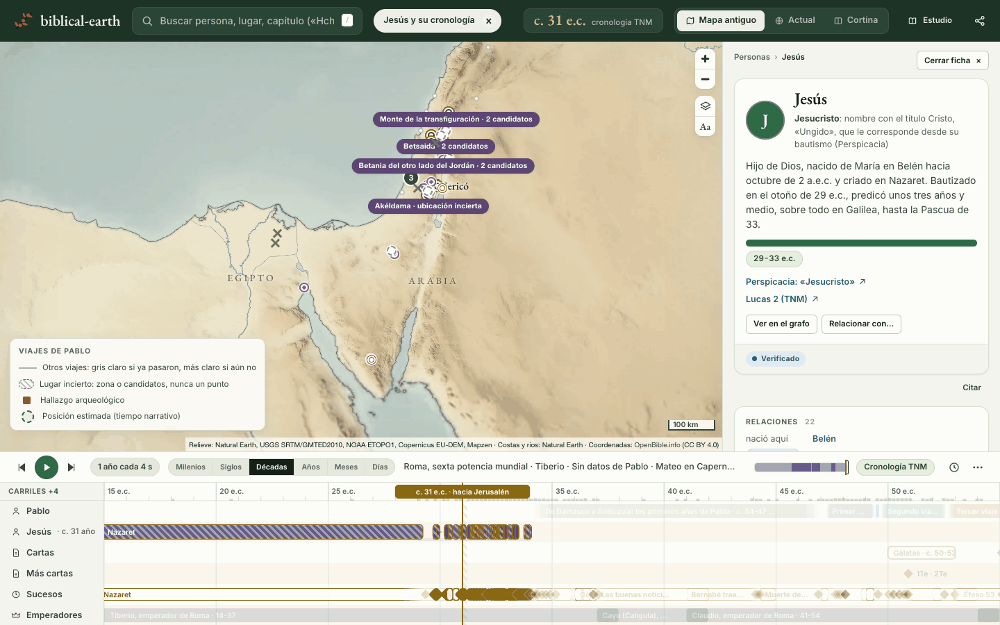

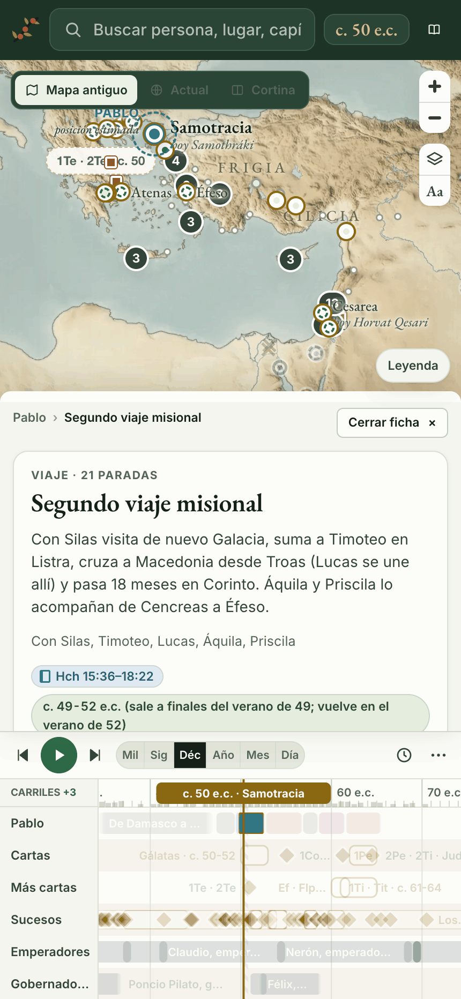

### 4. Verde agua

Fondo `#eef3f1` con un punto azul, acento verde azulado `#1d6b5e` y cursor verde lima oscuro `#56760f`. Acento y cursor son verdes de tono distinto, uno hacia el azul y otro hacia el amarillo. Es la más fresca y la que mejor casa con el mar del mapa.

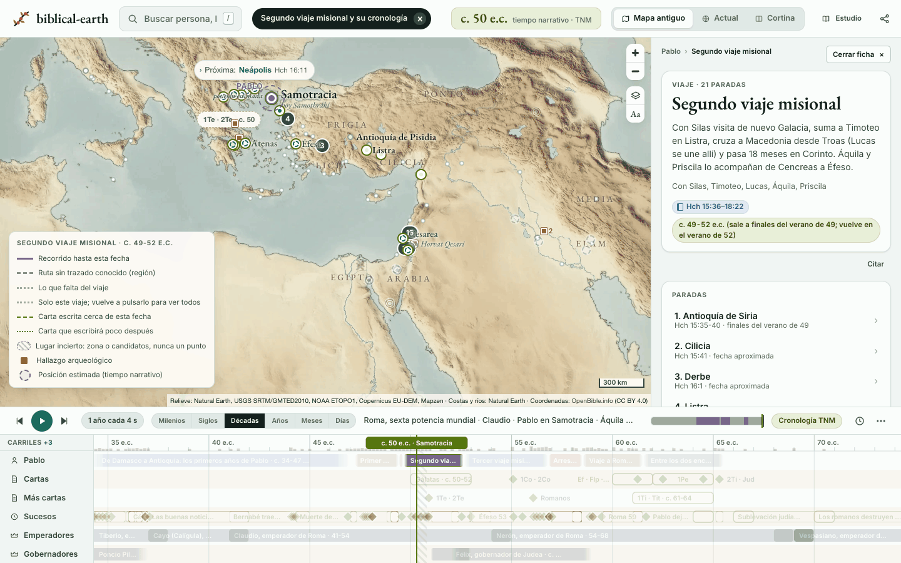

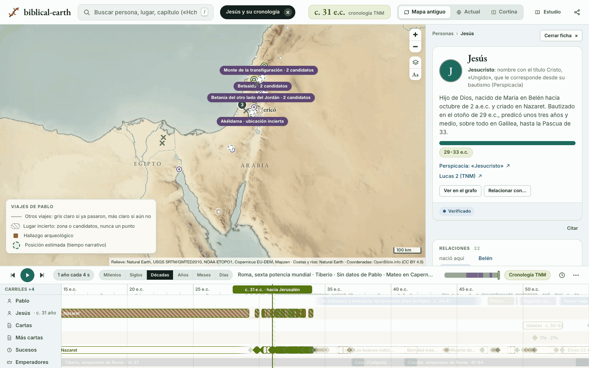

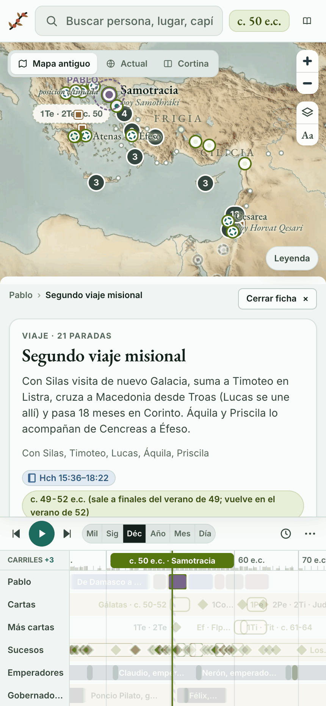

## Lo que se gana y lo que se pierde

- **El oro y la terracota tienen significado hoy.** La terracota es el sujeto activo, Pablo y la ruta en curso, y en la marca son las paradas. El oro es el tiempo: el cursor, la fecha activa, las cartas y los sucesos. En las cuatro paletas el acento verde hereda el papel de la terracota. El color del tiempo pasa a otro color que sigue siendo uno solo para cursor, cartas y sucesos: aceituna negra en Olivar, verde pino en Salvia, oro en Bosque y verde lima en Verde agua.
- **Con un fondo y un acento verdes, el acento ya no se separa por el tono.** Por eso los cuatro acentos son oscuros, de 5,5:1 a 6,3:1 sobre los paneles, y se reconocen por lo oscuro.
- **Los viajes no pueden ser verdes.** Todo el verde es del acento, así que los viajes siguen siendo de muchos colores: azules, morados, pardos y algún rosa o teja apagado. Con ocho colores lo bastante oscuros para llevar texto blanco no hay otra forma de mantenerlos tan distintos como hoy.
- **«Verificado» pasa de verde a azul.** Hoy es verde, y en una paleta verde se confundiría con el acento. En las cuatro va en azul y conserva su texto y su punto.
- **Roma deja de ser roja.** La calle de Emperadores era la franja rosa más grande de la línea de tiempo. Ahora es gris pizarra, y los siete imperios se distinguen mejor que hoy.
- **Lo que no cambia.** El relieve del mapa es una imagen y sigue de color arena. El modo reunión, `.be-reunion`, tiene su propia paleta oscura y no la tocamos. Los colores de los lugares inciertos y la trama de las cartas inciertas están escritos en `mapa.js` y siguen como hoy.
