# Salvia, aplicada

Elegimos la marca 2 y la paleta Salvia de las [propuestas en verde](../README.md), y ya están en el sitio.

- **La marca.** [`site/logo.svg`](../../../site/logo.svg), [`site/favicon.svg`](../../../site/favicon.svg), [`site/apple-touch-icon.png`](../../../site/apple-touch-icon.png) y el [banner del README](../../images/banner.svg) van en verde salvia, con la misma forma de antes. En una barra de pestañas oscura, el favicon aclara el tallo y las aceitunas.
- **La paleta.** Los colores están en [`site/kit/tokens.css`](../../../site/kit/tokens.css), sin archivo aparte. Las reglas que escribían a mano el oro o la terracota ahora usan variables.
- **Los viajes.** Sus colores y los de las cartas están en `--viajes` y `--cartas`, y [`site/js/mapa.js`](../../../site/js/mapa.js) los lee de ahí. Las cartas de Pablo llevan el color del tiempo, `--gold`, igual que el cursor.
- **Los lugares inciertos.** «Seguro» usaba el verde del antiguo «Verificado» y chocaba con el acento salvia, así que ahora sigue a `--tier1`. Los demás estados no chocan y siguen igual. Los hallazgos conservan su verde oliva.
- **El modo reunión.** Conserva su fondo y sus textos cálidos, porque fija los valores de antes. Cambian los colores de los viajes, que son un dato y son los mismos en los dos modos, y la marca.

## Los números

Contraste según WCAG, sobre el CSS final. AA pide 4,5:1 para el texto y 3:1 para los trazos.

| | Salvia | Antes |
|---|---|---|
| Texto principal sobre el fondo | 14,4 | 15,3 |
| Texto secundario sobre los paneles | 9,1 | 9,8 |
| Texto terciario sobre el fondo | 5,0 | 4,4 |
| Texto terciario sobre los paneles | 5,6 | 4,8 |
| Enlaces sobre los paneles | 7,0 | 6,8 |
| Acento como texto sobre los paneles | 5,5 | 6,1 |
| Blanco sobre el acento | 5,7 | 6,2 |
| Blanco sobre la bandera del cursor | 12,2 | 3,2 |
| Línea del cursor sobre el fondo | 10,7 | 2,8 |
| Fecha sobre su píldora | 10,1 | 7,9 |
| Píldora «Cronología TNM» | 10,1 | 6,3 |
| «Verificado» sobre su fondo | 5,9 | 6,2 |
| Blanco sobre la insignia de nivel 1 | 7,2 | 7,5 |
| Blanco sobre la barra del viaje más claro | 5,2 | 4,9 |

Diferencia de color CIEDE2000 entre los colores que tienen que distinguirse. A partir de 10 se distinguen sin esfuerzo uno al lado del otro.

| | Salvia | Antes |
|---|---|---|
| Par más cercano de los ocho viajes de Pablo | 16,9 | 15,8 |
| Par más cercano de los diez colores, con los dos libres | 12,0 | 8,9 |
| Par más cercano de los cuatro viajes principales | 27,4 | 15,8 |
| Viaje más cercano al acento | 20,1 | 0 |
| Viaje más cercano al cursor | 24,4 | 12,9 |
| Acento y cursor | 17,6 | 30,0 |
| Acento y «Verificado» | 24,2 | 42,5 |
| Par más cercano de los imperios | 8,6 | 6,1 |

El acento y el cursor son los dos verdes y se separan menos que antes. El cursor es mucho más oscuro, `#1f3b30` frente a `#4a6f57`, y además es una línea con su bandera, así que no depende del color.

## Comprobación

Doce capturas del sitio con los datos de [`data/`](../../../data): seis vistas a 1440 × 900 y las mismas en un teléfono de 430 × 932. Ninguna dio errores de consola, errores de página ni peticiones fallidas.

| Vista | Escritorio | Teléfono |
|---|---|---|
| Portada con el segundo viaje, año 50 | 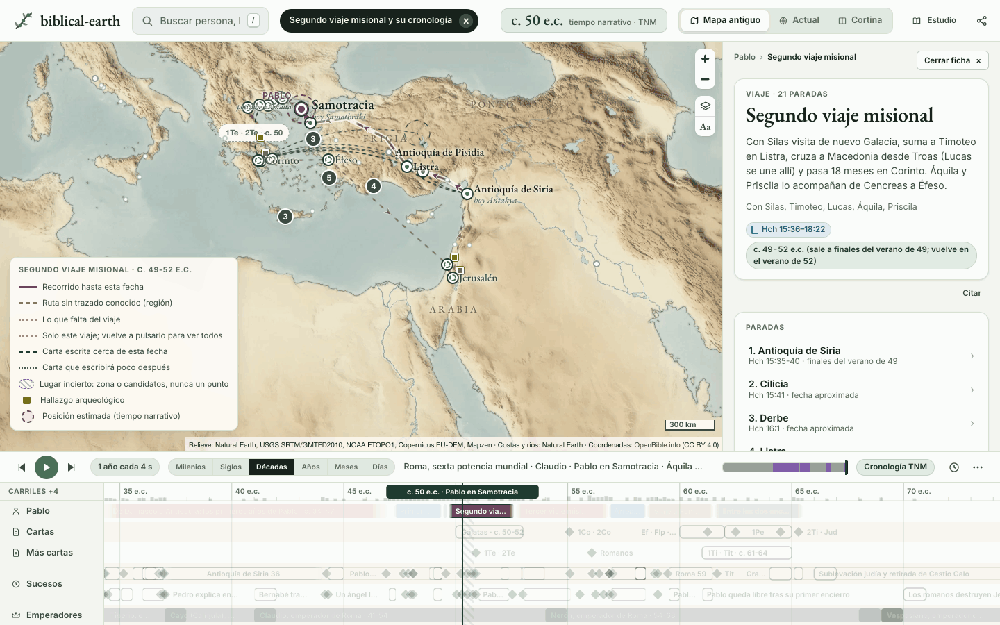 | 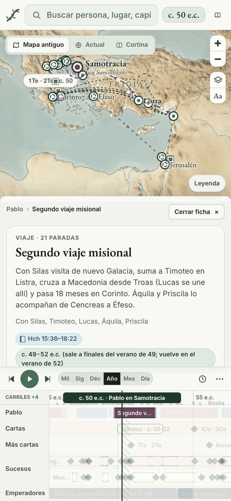 |
| Ficha de Jesús, año 31 | 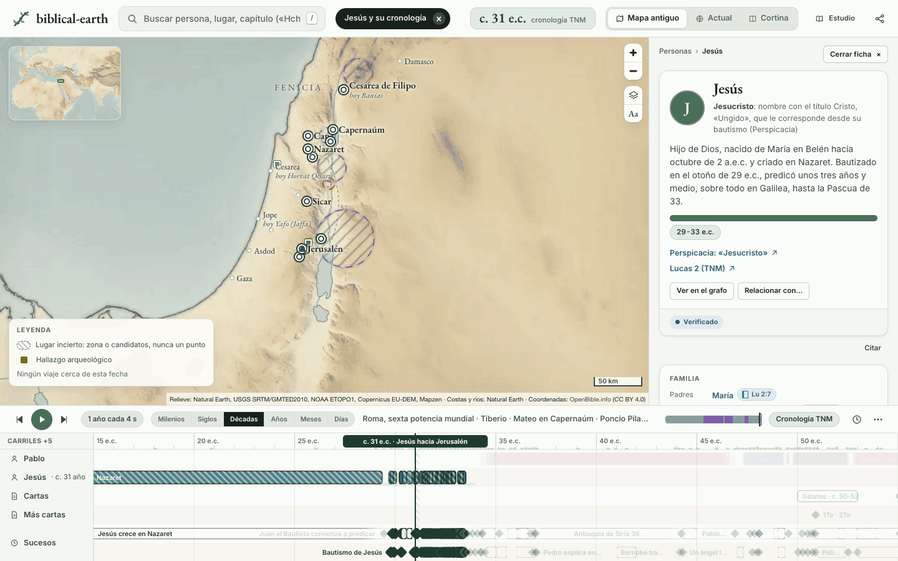 | 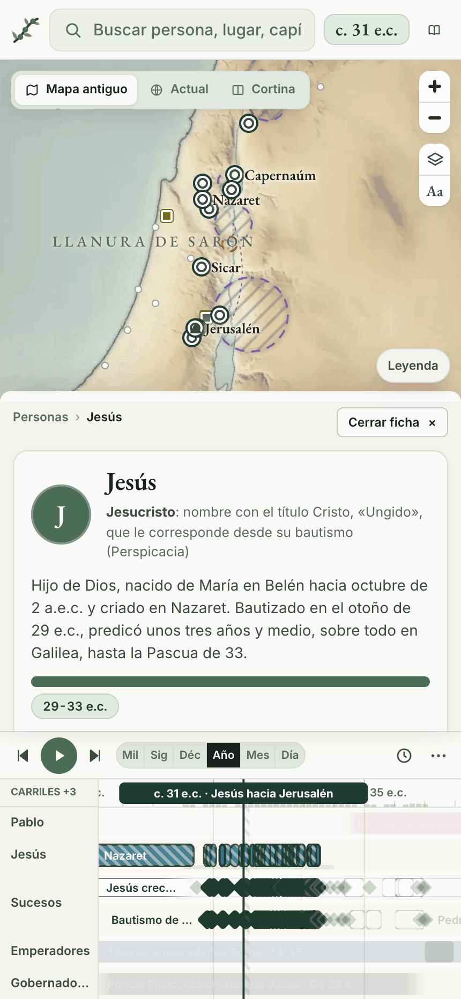 |
| Línea de tiempo ampliada, en Décadas | 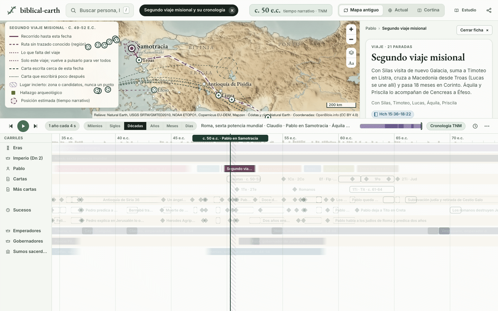 | 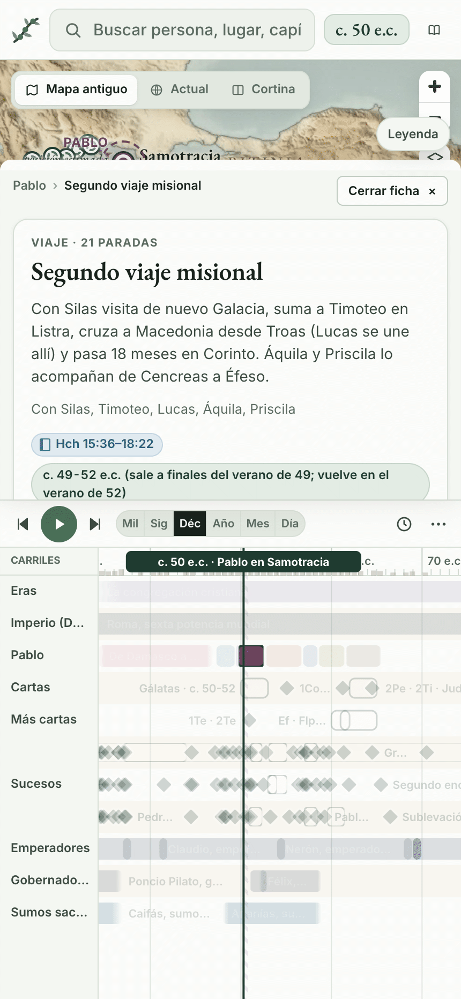 |
| Ficha de Jerusalén, año 33 | 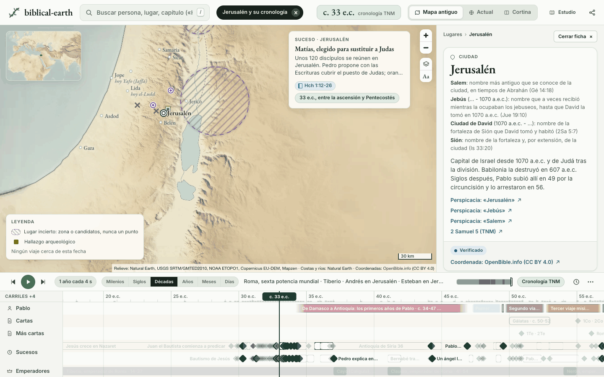 | 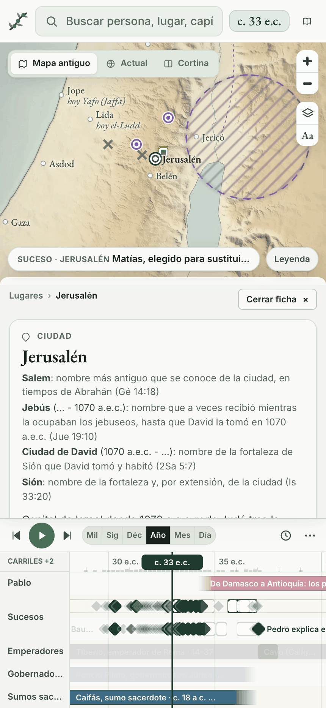 |
| Grafo de Pablo; en el teléfono se abre como lista | 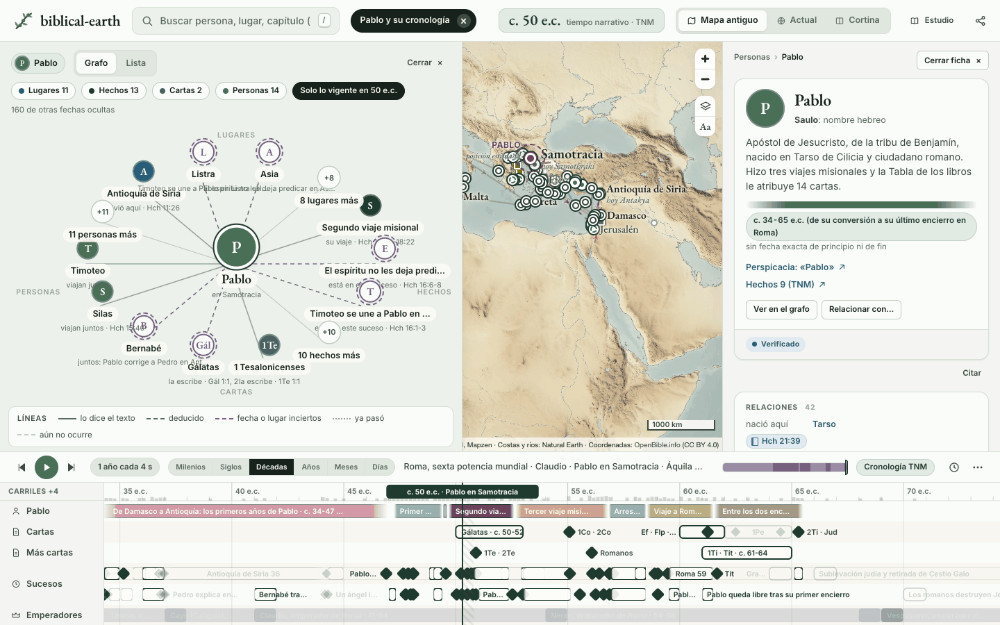 | 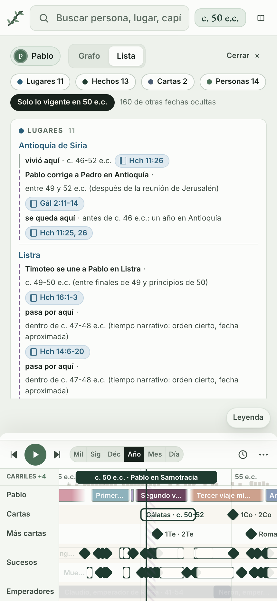 |
| Modo reunión | 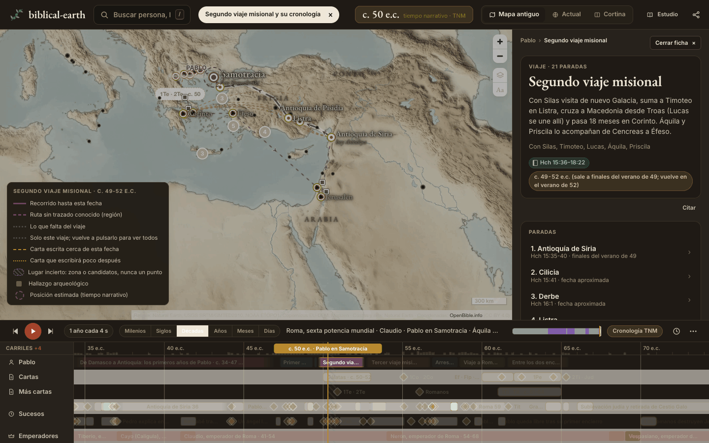 | 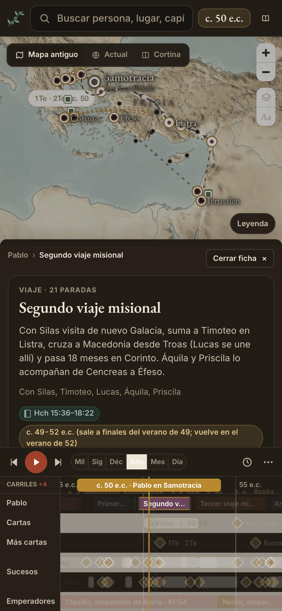 |
